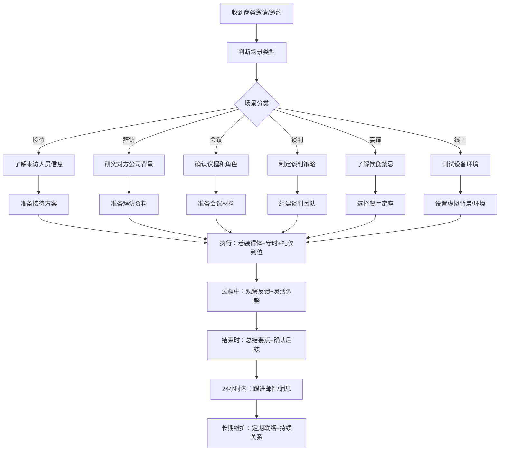

## 二、商务礼仪

商务礼仪是职业人士在商业活动中遵循的行为规范和交往准则。它不仅仅是"有礼貌"那么简单，而是通过得体的行为传递专业能力、建立信任关系、促成商业合作的系统性技能。哈佛商学院的研究表明，商务交往中第一印象的形成仅需7秒，而这7秒的印象会影响后续长达数月甚至数年的合作关系。掌握商务礼仪，本质上是掌握一种"无声的竞争力"。

### 2.1 商务接待礼仪

商务接待是企业对外展示形象的第一窗口。一次周到的接待能为合作奠定良好基础，而一次疏忽的接待可能直接导致合作流产。

#### 2.1.1 迎接客户

迎接客户不是简单地"去接人"，而是一次精心策划的形象展示。

**前期准备清单：**

| 准备事项 | 具体内容 | 完成时限 |
|---------|---------|---------|
| 客户背景调研 | 公司规模、行业地位、决策链条、历史合作情况 | 接到通知后立即 |
| 人员信息收集 | 来访人员姓名、职位、照片、饮食禁忌、特殊习惯 | 来访前3天 |
| 行程安排确认 | 交通方式、航班/车次、预计到达时间、住宿酒店 | 来访前2天 |
| 接待规格确定 | 接机/接站人员级别、车辆安排、欢迎规格 | 来访前2天 |
| 物资准备 | 欢迎牌、名片、公司资料袋、矿泉水、小礼品 | 来访前1天 |
| 内部协调 | 通知前台、保安、会议室、茶歇、相关人员 | 来访前1天 |

**迎接的核心原则——"对等接待"：**

接待人员的级别应与来访客户的级别对等或略高。这是一个被广泛忽略但极其重要的细节：

- 客户来的是总经理，你方至少应派出副总级别的人员迎接
- 客户来的是技术负责人，你方技术总监出面最为合适
- 如果级别不对等，对方会认为你不重视这次会面

**迎接现场的操作流程：**

1. **提前到达**：至少提前15分钟到达迎接地点，检查环境是否整洁
2. **主动识别**：提前获得客户照片，在人群中主动识别并上前
3. **自我介绍**：微笑、目光接触、握手（力度适中，持续2-3秒）、递名片
4. **引导安排**：帮助拿行李（注意不要抢夺客户的私人手提包），引导至车辆
5. **途中交流**：介绍沿途城市特色或公司附近环境，避免冷场但不急于谈业务
6. **到达公司**：提前通知前台准备迎接，电梯内主动按楼层，引路时走在客户左前方1米处

**常见错误：**

- ❌ 迎接时迟到，让客户在机场/车站等待
- ❌ 接待人员级别远低于客户级别
- ❌ 未准备欢迎牌或标识，客户找不到接待人员
- ❌ 车辆安排不当（座位拥挤、车辆不整洁）
- ❌ 接到客户后立刻进入业务话题，缺乏过渡

#### 2.1.2 商务拜访

商务拜访是主动出击的商务活动，需要更加周密的准备。

**拜访前的"三知"原则：**

- **知己**：清楚自己要谈什么、底线是什么、能提供什么价值
- **知彼**：了解对方公司近况、关键人物背景、可能的关切点
- **知时**：选择合适的拜访时间（避开对方忙季、周一上午、周五下午）

**预约的规范做法：**

预约是商务拜访的第一步，也是展示专业性的第一个环节：

- 提前1-2周通过正式渠道（邮件或电话）提出拜访请求
- 明确说明拜访目的、预计时长、参与人员
- 提供2-3个备选时间供对方选择
- 获得确认后，拜访前1天再次确认（短信或微信）

**到达现场的礼仪要点：**

- 提前5-10分钟到达为最佳。太早会让对方有压力，迟到则极为失礼
- 到达后在前台登记，安静等候，不要四处张望或大声打电话
- 进入会议室后，等待对方安排座位，不要随意落座
- 如需使用投影设备，提前15分钟到场调试

**会面中的关键动作——介绍与名片交换：**

介绍顺序遵循"尊者优先"原则：

- 先将己方人员介绍给对方（而非反过来）
- 先介绍职位低的，再介绍职位高的
- 介绍内容包括：姓名、职位、负责领域（一句话概括）

名片交换的规范：

- 双手递出名片，文字正面朝向对方
- 接到名片后认真阅读，适当评论（"原来是XX领域的专家"）
- 不要在名片上随意涂写
- 将名片放在桌面或名片夹中，不要塞进裤子后袋

**拜访后的跟进：**

拜访结束 → 当天内部总结 → 次日感谢邮件 → 3天内落实承诺事项 → 1周后再次联络

感谢邮件模板：

> 主题：感谢XX公司XX先生/女士的热情接待
>
> XX先生/女士，您好：
>
> 非常感谢您昨天抽出宝贵时间与我们会面。通过深入交流，我们对贵公司在XX领域的发展有了更清晰的了解，也对未来的合作充满期待。
>
> 根据昨天的讨论，我们将尽快提供以下材料：
> 1. [具体事项一]
> 2. [具体事项二]
>
> 如有任何问题，请随时联系我。期待下次见面。
>
> 此致
> [姓名] | [职位] | [公司] | [联系方式]

#### 2.1.3 商务宴请

商务宴请是中国商业文化中极为重要的社交场景。据统计，超过60%的中国商业合作是在餐桌上初步达成意向的。一场成功的商务宴请，需要在食物、氛围、话题三个维度同时做好。

**宴请前的准备：**

选择餐厅的"五看"标准：

| 维度 | 考虑因素 | 举例 |
|------|---------|------|
| 看规格 | 宴请级别决定餐厅档次 | 初次见面选中高档，日常合作选舒适型 |
| 看位置 | 距离客户酒店或公司近 | 避免让客户长途奔波 |
| 看环境 | 包间为主，安静便于交谈 | 避免嘈杂的大厅或需要排队的餐厅 |
| 看菜品 | 符合客人口味和饮食禁忌 | 提前了解是否有清真、素食、过敏需求 |
| 看服务 | 服务质量好，上菜节奏可控 | 避免服务差导致尴尬 |

**座次安排——商务宴请的核心礼仪：**

中式圆桌座次遵循"面门为尊、右为上"原则：

- **主位**：面对门口的位置，留给最尊贵的客人或最高级别的主人
- **主陪**：背对门口的位置，通常是宴请方的主要负责人
- **右侧为上**：主位右手边坐主陪，左手边坐副主陪
- **交叉就坐**：主客交叉安排，便于交流

**宴请中的话题管理：**

- 开场（前15分钟）：轻松话题为主——天气、交通、城市印象、近期热点
- 中场（上热菜后）：逐步引入商务话题——行业趋势、合作愿景、共同兴趣
- 后半段：深入具体合作细节、约定后续行动
- 离场前：确认要点、表达感谢、约定下次见面

**绝对不能触碰的话题雷区：**

- 政治敏感话题
- 宗教信仰相关话题
- 对方公司的负面新闻
- 过于私密的个人问题
- 竞争对手的八卦

**饮酒的分寸感：**

在中国商务宴请中，酒文化是绕不开的话题。关键原则是"以量力行、以礼待人"：

- 如果你不喝酒，提前告知主人或以茶代酒，态度诚恳即可
- 如果喝酒，控制在自己酒量的60%以内，保持清醒和得体
- 敬酒时杯沿低于对方杯沿，表示尊重
- 不要强行劝酒，尤其是对方已经表示不能喝的情况下
- 可以说"随意、随意"来化解劝酒压力

### 2.2 商务会议礼仪

商务会议是企业内部和外部沟通的主要形式。麦肯锡的研究显示，高管平均每周花在会议上的时间超过23小时，但其中近一半被认为是"低效或无效"的。掌握会议礼仪，不仅关乎个人形象，更关乎团队效率。

#### 2.2.1 会议准备

**会议通知的标准要素：**

一个完整的会议通知应包含以下信息：

会议主题：[简洁明了的主题]
会议时间：[日期 + 具体时间 + 预计时长]
会议地点：[会议室名称/线上会议链接]
参会人员：[列出所有参会者及角色]
会议议程：
  1. [议题一] - [发言人] - [时长]
  2. [议题二] - [发言人] - [时长]
  3. [讨论环节] - [时长]
准备事项：[需要参会者提前准备的材料]

**会议室的检查清单：**

- 投影设备测试：连接电脑，确认投影正常
- 网络测试：确认Wi-Fi信号稳定
- 白板/翻页纸：确认有笔，且笔能写
- 座位安排：预留主位给最重要的参会者
- 矿泉水/茶水：每人一瓶水，准备茶包或咖啡
- 纸笔：每人一套会议记录本和笔
- 空调温度：22-24°C为宜
- 通风：确保空气流通

#### 2.2.2 会议进行

**主持人职责：**

主持人是会议质量的把关人，需要同时做到三件事：

- **控时间**：每个议题严格控制时长，超时及时提醒
- **控话题**：引导讨论回到正题，避免跑题
- **控情绪**：当出现分歧时，引导理性讨论，避免争执升级

**发言人的礼仪规范：**

- 准备充分，数据和事实支撑观点
- 简明扼要，先说结论再展开论述
- 控制时间，一般单次发言不超过3分钟
- 使用"我们"而非"我"来表达团队观点
- 避免使用模糊语言（"可能""大概""差不多"）

**参会者的礼仪准则：**

- 手机静音或关闭，不要放在桌面上（避免分心）
- 认真倾听他人发言，做好笔记
- 不随意打断他人，等对方说完再发言
- 发言前先举手或用眼神征得主持人同意
- 不在会议中处理其他工作（查看邮件、回消息）
- 与会迟到应轻声入场，会后向主持人致歉

**线上会议的特殊礼仪：**

随着远程办公普及，线上会议已成为常态。线上会议需要额外注意以下事项：

- 提前5分钟进入会议室，测试音视频设备
- 选择安静、背景整洁的环境
- 发言时打开摄像头，不发言时可关闭
- 发言前先说"我是XX"，方便对方识别声音
- 使用"举手"功能而不是直接打断
- 不要边吃东西边开会
- 共享屏幕前关闭无关标签页和通知

#### 2.2.3 会议后续

**会议纪要的撰写规范：**

会议纪要不是逐字记录，而是结构化的行动指南：

会议纪要

会议主题：[主题]
会议时间：[时间]
参会人员：[名单]
缺席人员：[名单]

一、议题讨论摘要
  1. [议题一]：[关键讨论内容和结论]
  2. [议题二]：[关键讨论内容和结论]

二、决议事项
  1. [决议内容] - 负责人：[姓名] - 完成时限：[日期]
  2. [决议内容] - 负责人：[姓名] - 完成时限：[日期]

三、待跟进事项
  1. [事项] - 负责人：[姓名]

下次会议时间：[时间]

会议纪要应在会议结束后24小时内发送给所有参会者，并抄送相关领导。

### 2.3 商务谈判礼仪

商务谈判是利益博弈与关系维护的平衡艺术。谈判礼仪不是表面的客套，而是建立信任、促成合作的战略工具。

#### 2.3.1 谈判准备

**信息收集矩阵：**

在谈判前，需要从四个维度收集信息：

| 维度 | 收集内容 | 来源 |
|------|---------|------|
| 对方公司 | 经营状况、市场份额、战略方向、财务状况 | 企业官网、年报、行业报告 |
| 对方人员 | 谈判代表的背景、谈判风格、决策权限 | LinkedIn、行业人脉、公开报道 |
| 市场环境 | 行业趋势、竞争格局、替代方案 | 行业分析报告、市场数据 |
| 己方准备 | 目标设定、底线划定、BATNA（最佳替代方案） | 内部讨论、数据分析 |

**谈判团队的组成：**

一个完整的谈判团队通常包含以下角色：

- **主谈人**：负责主要发言和谈判推进
- **技术顾问**：负责回答专业问题
- **财务/法务**：负责评估条款的可行性和风险
- **记录员**：负责记录谈判要点和承诺
- **观察员**（可选）：观察对方团队的非语言信号

**座次安排：**

正式的商务谈判通常采用对坐方式：

- 双方主谈人面对面坐在桌子中间位置
- 其他成员按职位高低依次向两侧排列
- 翻译人员坐在主谈人旁边
- 如果是圆桌，遵循"面门为尊"原则

#### 2.3.2 谈判过程中的礼仪

**开场阶段：**

- 双方握手致意，交换名片
- 东道主先做开场白，欢迎对方到来
- 简要介绍己方团队成员
- 确认议程和时间安排

**谈判中的行为规范：**

- **保持冷静**：无论对方态度如何，始终保持专业和礼貌
- **积极倾听**：认真记录对方诉求，适时复述确认理解
- **清晰表达**：观点明确，数据说话，避免含糊其辞
- **肢体语言**：保持开放的姿态（不抱臂、不后仰），适度目光接触
- **记录要点**：随时记录关键信息和承诺
- **适时休息**：当讨论陷入僵局时，建议茶歇或休息

**处理分歧的礼仪技巧：**

分歧是谈判的常态，处理分歧的方式体现一个人的专业素养：

- ❌ 错误做法："你们这个方案完全不可行。"
- ✅ 正确做法："我理解贵方的考虑，同时我们也有这样的顾虑……我们可以一起探讨一个双方都能接受的方案。"

核心技巧：

- 使用"同时"替代"但是"——"您的建议很好，同时我们可以考虑……"
- 使用"我们"替代"你和我"——把双方放在同一阵营
- 使用"探讨"替代"争论"——降低对抗感
- 引用数据和事实，而非个人观点

**谈判中的禁忌：**

- 当面翻看手机或处理其他工作
- 用手指指向对方
- 打断对方发言
- 表现出不耐烦（看手表、叹气、敲桌子）
- 在对方团队面前讨论己方内部分歧
- 做出无法兑现的承诺
- 泄露己方底线信息

#### 2.3.3 谈判后续

**协议确认流程：**

达成口头共识 → 当场确认要点清单 → 24小时内书面确认 → 法务审核合同文本 → 双方签字盖章

**关键注意事项：**

- 口头承诺不具备法律效力，务必落实到书面文件
- 合同中应明确各方的权利、义务、违约责任
- 对谈判中"附带条件"的承诺要特别注意，确保写入合同
- 签约仪式应庄重正式，体现对合作的重视

### 2.4 商务名片礼仪

名片是商务交往中的"第二张脸"。在数字化时代，名片的实体交换虽然减少，但其背后蕴含的礼仪逻辑依然适用于微信交换、LinkedIn连接等场景。

#### 2.4.1 名片设计规范

**名片的基本信息要素：**

正面：

- 姓名（最大字号，中英文）
- 职位/头衔
- 公司名称及Logo
- 联系方式（手机、邮箱）
- 公司地址

背面（可选）：

- 公司简介（一句话）
- 主营业务
- 二维码（公司官网或个人LinkedIn）

**设计原则：**

- 字体不超过两种
- 颜色不超过三种
- 信息层次清晰，姓名最为突出
- 材质选择：300-350g铜版纸或特种纸
- 尺寸标准：国内90×54mm，国际89×51mm

#### 2.4.2 名片交换礼仪

**递出名片的规范：**

1. 将名片从名片夹中取出（不要从裤袋里掏）
2. 双手持名片的两个上角，文字正面朝向对方
3. 同时说："您好，这是我的名片，请多指教。"
4. 如果对方人数较多，按职位高低依次递出

**接收名片的规范：**

1. 双手接过名片
2. 认真阅读名片上的信息（约3-5秒）
3. 可以适当评论："原来您是XX大学的校友"或"XX部门，那我们应该有很多合作机会"
4. 将名片放在桌面的名片夹中或上衣口袋
5. 绝不能做的事：直接塞进口袋、在上面随意涂写、当面丢弃

**跨文化名片交换差异：**

| 文化圈 | 特殊注意事项 |
|--------|------------|
| 日本 | 必须双手递接，接到后认真阅读并轻声念出对方姓名，表示尊重 |
| 韩国 | 双手递接，接到后不要立刻收起，应放在桌上直至会议结束 |
| 中东 | 避免用左手递接（左手被视为不洁） |
| 欧美 | 相对随意，单手可接受，但正式场合仍建议双手 |
| 印度 | 右手递接，接到后认真阅读 |

### 2.5 商务着装礼仪

着装是商务场合中"无声的语言"。研究表明，人们在见面的前30秒内就会通过着装对你的专业能力、社会地位和可信度做出判断。

#### 2.5.1 着装的"TPO"原则

商务着装遵循TPO原则：

- **T（Time）时间**：季节、白天/晚上、工作日/周末
- **P（Place）地点**：办公室、客户公司、酒店、户外
- **O（Occasion）场合**：正式会议、商务宴请、团建活动

#### 2.5.2 男士商务着装

**正式商务场合（会议、签约、重要拜访）：**

- 深色西装（藏蓝、深灰为主，黑色适用于最正式场合）
- 白色或浅蓝色衬衫
- 与西装协调的领带（避免过于花哨的图案）
- 深色皮鞋（黑色或深棕色），系带款更正式
- 深色袜子（长度及小腿，避免坐下时露出皮肤）
- 皮带与皮鞋颜色一致
- 手表（简洁大方，避免过于运动或花哨的款式）

**半正式商务场合（日常办公、内部会议）：**

- 西裤搭配衬衫（不系领带）
- 针织衫搭配衬衫
- 休闲西装（Blazer）搭配卡其裤
- 皮鞋或乐福鞋

**着装禁忌：**

- ❌ 西装袖口过长，遮住手腕
- ❌ 衬衫外露于西装袖口过多
- ❌ 袜子颜色与裤子不协调（白色袜子配深色西裤是大忌）
- ❌ 皮带过松或过紧
- ❌ 口袋中塞满物品导致鼓起
- ❌ 西装扣子全部扣上（单排两粒扣只扣上面一粒，单排三粒扣只扣中间一粒）

#### 2.5.3 女士商务着装

**正式商务场合：**

- 职业套装（裙装或裤装均可）
- 裙装长度在膝盖上下5cm，不宜过短
- 内搭选择有领衬衫或简洁的上衣
- 包头鞋或低跟鞋（3-5cm），避免露趾
- 简洁的首饰（耳钉、项链、手表）
- 淡妆，避免浓烈的香水

**半正式商务场合：**

- 针织衫搭配半裙或西裤
- 衬衫搭配阔腿裤
- 连衣裙（简洁款式，非吊带或太紧身）
- 平底鞋或低跟鞋

**着装禁忌：**

- ❌ 过于暴露的服装（低胸、超短裙、露背装）
- ❌ 过于鲜艳的颜色（荧光色、大面积亮色）
- ❌ 过多的首饰或夸张的配饰
- ❌ 浓烈的香水
- ❌ 运动鞋或人字拖

### 2.6 商务礼品礼仪

商务礼品是维系商业关系的重要纽带。选对礼品能增进感情，选错礼品可能适得其反。

#### 2.6.1 礼品选择的"四维标准"

选择商务礼品时，需要从四个维度综合考量：

| 维度 | 具体要求 | 正面示例 | 反面示例 |
|------|---------|---------|---------|
| 价值适中 | 不过贵（有贿赂嫌疑）不过廉价（显得敷衍） | 300-800元的品质小物 | 超过2000元的奢侈品 |
| 实用性 | 对方日常能用到 | 高品质笔记本、保温杯 | 纯装饰摆件 |
| 文化安全 | 不触犯任何文化禁忌 | 茶叶、工艺品 | 钟表（谐音"送终"） |
| 品质感 | 精心包装，体现诚意 | 定制礼盒+手写卡片 | 廉价塑料袋包装 |

#### 2.6.2 送礼时机与方式

**最佳送礼时机：**

- **初次见面**：准备小礼品表示诚意（品牌钢笔、城市特色小食）
- **合作达成**：赠送有纪念意义的礼品（定制纪念品、合作里程碑相框）
- **节日问候**：春节、中秋等传统节日寄送礼品（提前1-2周送达）
- **商务拜访**：携带当地特产或公司特色礼品
- **个人里程碑**：对方升职、获奖时送上祝贺礼品

**送礼的方式：**

- 私下赠送，避免在公开场合让对方尴尬
- 附上简短的手写卡片（比打印的更有温度）
- 如对方公司有礼品接收政策（如外企通常限制200元以内），务必遵守
- 记录送出的礼品清单（对象、时间、内容、价值），避免重复

#### 2.6.3 各文化圈的送礼禁忌

| 文化圈 | 禁忌 | 原因 |
|--------|------|------|
| 中国 | 钟表、伞、梨、白色/黑色包装 | 谐音或颜色的不吉利联想 |
| 日本 | 4件套、白色花卉 | "4"谐音"死"，白花用于丧事 |
| 中东 | 酒类、猪皮制品、含有猪形象的物品 | 伊斯兰教禁忌 |
| 印度 | 牛皮制品 | 印度教中牛是神圣动物 |
| 欧美 | 过于昂贵的礼品 | 可能被视为贿赂或有附加条件 |
| 拉美 | 刀具、手帕 | 刀具象征断绝关系，手帕与悲伤有关 |

### 2.7 商务通讯礼仪

现代商务通讯已远不止电话和邮件，微信、钉钉、企业微信、视频会议等工具已成为主流。掌握不同场景下的通讯礼仪，是职业素养的重要体现。

#### 2.7.1 商务电话

**打电话前的准备：**

- 明确通话目的，列出要点（不超过3个）
- 确认对方是否方便接听（第一句话就问"您现在方便讲电话吗？"）
- 准备好需要查阅的资料
- 选择安静的环境通话

**通话中的规范：**

- 开场自报身份："您好，我是XX公司的XX"
- 语速适中，吐字清晰
- 每说2-3个要点后停顿，确认对方是否听清或有疑问
- 重要事项复述确认："我确认一下，您刚才说的是……"
- 控制通话时间，一般不超过10分钟
- 结束时总结要点并致谢

**接听电话的规范：**

- 3声内接听，超过3声接听后先致歉
- 接起后说"您好，XX公司/XX部门"
- 对方要找的人不在时，主动提供帮助："需要我转达吗？"或"他大约X点回来，需要我让他回电吗？"
- 不要在背景噪音大的环境接电话

#### 2.7.2 商务邮件

**邮件主题的撰写技巧：**

好的邮件主题应该让收件人在3秒内判断邮件的重要性和是否需要立即处理：

- ❌ "关于一些事情的沟通" ——模糊，可能被忽略
- ✅ "[需回复] Q3合作方案确认 — 请于6月30日前反馈" ——明确，有时限
- ✌ "[仅供知悉] 项目周报 — 第25周" ——信息性质清楚

**邮件正文的结构：**

称呼：尊敬的XX先生/女士（或团队成员）
      ——对不熟悉的人用全名，熟悉后可称呼英文名

第一段：目的（1-2句话说明写信原因）
      "关于XX项目，希望就以下事项与您确认："

中间段：内容（分点陈述，每点一个主题）
      1. [事项一]：具体描述
      2. [事项二]：具体描述
      3. [事项三]：具体描述

最后一段：行动呼吁（明确下一步动作）
      "如您同意上述方案，请回复确认。如有疑问，欢迎随时沟通。"

祝语：此致 / 祝商祺 / Best regards
签名：姓名 | 职位 | 公司 | 手机 | 邮箱

**邮件礼仪的细节：**

- 回复邮件不超过24小时，如需更长时间处理，先回复"已收到，预计X日前给您详细回复"
- "回复全部"前确认是否所有人都需要看到你的回复
- 附件务必检查是否已添加（这是邮件中最常见的失误）
- 大附件（>5MB）使用云盘链接而非直接添加
- 不使用过多的颜色、字体和表情符号
- 签名档保持简洁专业，不超过6行

#### 2.7.3 微信/企业微信礼仪

在中国商务环境中，微信已成为最主流的商务通讯工具，但许多人并不清楚微信沟通的专业规范。

**添加商务联系人：**

- 发送好友请求时附上验证信息："您好，我是XX公司XX，今天在XX会议上认识的"
- 添加成功后立即发送自我介绍
- 及时给对方备注姓名+公司+职位，方便日后查找

**微信沟通规范：**

- 工作消息在工作时间内发送（9:00-18:00），非紧急事项避免在深夜或周末发送
- 消息简洁明了，避免长段语音（对方可能不方便听）
- 语音消息不超过30秒，重要信息用文字确认
- 不要频繁发送"在吗？"，直接说明事情
- 群聊中不发无关信息，不在群里讨论敏感话题
- 收到消息及时回复，即使暂时无法处理也先回复"收到，稍后回复"
- 朋友圈是个人形象的延伸，适度分享专业内容

**回复的时效预期：**

| 消息类型 | 建议回复时效 | 说明 |
|---------|------------|------|
| 紧急业务 | 立即回复 | 涉及客户投诉、合作危机等 |
| 日常工作 | 2小时内 | 正常工作时间内 |
| 非紧急信息 | 24小时内 | 需要查阅资料或确认后回复 |
| 社交寒暄 | 当天回复 | 不需要长篇大论，简单回应即可 |

#### 2.7.4 视频会议礼仪

视频会议已成为后疫情时代的商务常态。它结合了电话会议和面对面会议的特点，有自己独特的礼仪要求。

**会前准备：**

- 提前5-10分钟进入会议室
- 测试摄像头、麦克风、网络连接
- 调整摄像头角度（平视，光线充足，背景整洁）
- 关闭无关应用程序和通知
- 准备好会议材料

**会中规范：**

- 不发言时将麦克风静音
- 发言前先说自己的名字（"我是XX，我想补充一点……"）
- 保持目光看向摄像头（而非屏幕），营造"眼神交流"的感觉
- 不要边开会边做其他事（对方看得到你的目光游移）
- 共享屏幕前关闭不必要的标签页和通知弹窗
- 使用"举手"功能排队发言

**特殊情况处理：**

- 网络卡顿：关闭摄像头，改用语音
- 突然有人进入你的房间：立即静音并关闭摄像头，处理完后再打开
- 需要中途离开：在聊天框中说明，不要默默退出

### 2.8 跨文化商务礼仪

在全球化的商业环境中，跨文化商务交往越来越频繁。了解不同文化的商务礼仪差异，能避免不必要的误解和冒犯。

#### 2.8.1 文化维度理论框架

荷兰学者霍夫斯泰德（Hofstede）的文化维度理论，是理解跨文化差异的经典框架：

| 文化维度 | 含义 | 高分文化特征 | 低分文化特征 |
|---------|------|------------|------------|
| 权力距离 | 对权力不平等的接受程度 | 等级分明（中国、日本） | 平等化（北欧、美国） |
| 个人/集体主义 | 个人利益vs群体利益 | 团队导向（东亚） | 个人导向（欧美） |
| 不确定性规避 | 对模糊和不确定的容忍度 | 规则导向（德国、日本） | 灵活开放（美国、英国） |
| 长期/短期导向 | 关注长期发展还是即时回报 | 注重关系和耐心（中国） | 注重效率和结果（美国） |

#### 2.8.2 主要商业文化的礼仪特点

**北美（美国、加拿大）：**

- 时间观念极强，准时是基本要求
- 商务沟通直接、高效，不喜欢拐弯抹角
- 握手有力，保持目光接触
- 名片交换随意，不需双手递接
- 商务宴请以午餐为主，时间控制在1小时内
- 小费文化：餐厅15-20%，酒店行李员$1-2/件

**西欧（德国、法国、英国）：**

- 德国人注重计划和规则，不要临时改变议程
- 法国人重视关系建立，首次见面通常不谈业务
- 英国人含蓄、间接，"interesting"可能意味着"不同意"
- 着装要求较高，尤其是法国和德国
- 守时在德国极为重要（迟到5分钟以上需要道歉）

**日本：**

- 鞠躬是最基本的礼节，角度表示尊重程度
- 名片交换极为重要，接到名片后要仔细阅读并妥善保管
- 商业决策缓慢，注重 consensus（共识）
- 避免直接说"不"，用"我们再考虑考虑"等委婉方式
- 商务宴请中先等主人开始用餐
- 送礼文化发达，但要避免送4件套

**中东：**

- 关系优先于效率，建立信任需要时间
- 男性之间握手问候，异性之间避免身体接触
- 谈判节奏缓慢，不要急于推动决策
- 避免谈论政治和宗教
- 商务宴请中左手不用于递接物品
- 斋月期间注意用餐时间安排

### 2.9 场景应对流程图

以下流程图展示了面对不同类型商务场景时的应对思路：

### 2.10 常见错误与纠正

| 常见错误 | 正确做法 | 影响程度 |
|---------|---------|---------|
| 迟到不道歉，若无其事 | 迟到后立即真诚道歉并简要说明原因 | 高——直接损害信任 |
| 会议中频繁看手机 | 手机静音放包里或桌面朝下 | 中——显得不尊重 |
| 邮件不检查附件 | 发送前逐项检查：主题、正文、附件、收件人 | 高——暴露粗心 |
| 商务宴请不问饮食禁忌 | 提前询问或准备多种选项 | 高——可能冒犯对方 |
| 名片乱放或在上面写字 | 妥善放在名片夹或桌面上 | 中——显得不专业 |
| 发长段语音而非文字 | 重要信息用文字，简短补充用语音 | 中——增加对方负担 |
| 谈判中情绪化表达 | 保持冷静，用数据和事实说话 | 高——破坏谈判氛围 |
| 送礼不考虑文化禁忌 | 提前了解对方文化中的送礼禁忌 | 高——可能严重冒犯 |

### 2.11 进阶：建立长期商务关系的礼仪策略

商务礼仪的终极目标不是"不出错"，而是通过持续的得体行为建立深度的商业信任关系。

**关系维护的"3-7-21"法则：**

- **3天**：初次见面后3天内保持联络（感谢邮件/微信）
- **7天**：7天内分享与对方相关的有价值信息（行业报告、文章推荐）
- **21天**：21天内寻找第二次互动机会（午餐邀请、行业活动共赴）

**信任建立的四个层次：**

1. **专业信任**：展示扎实的专业能力，言行一致
2. **人际信任**：展现真诚、尊重和同理心
3. **情感信任**：在对方需要时提供帮助（不附加条件）
4. **战略信任**：长期合作中展现出可靠性、一致性和可预测性

**维护关系的实用技巧：**

- 记住对方的重要日期（生日、公司周年、合作纪念日）
- 关注对方的社交媒体动态，适当互动
- 在行业活动中主动引荐有价值的人脉
- 分享对对方有帮助的行业洞察
- 遇到涉及对方利益的信息时，主动告知

商务礼仪不是一套死板的规则，而是一种建立信任、促进合作的行为艺术。当你把礼仪内化为习惯，它就不再是"表演"，而是你专业素养的自然流露。真正的商务高手，不是记得住每一条规则，而是在任何场合都能让对方感到被尊重、被重视、被理解。
