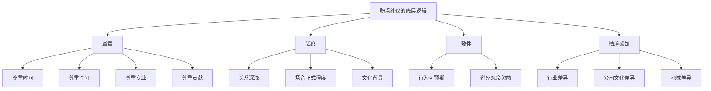
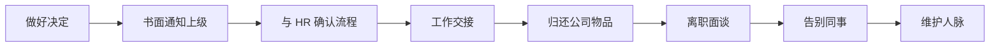
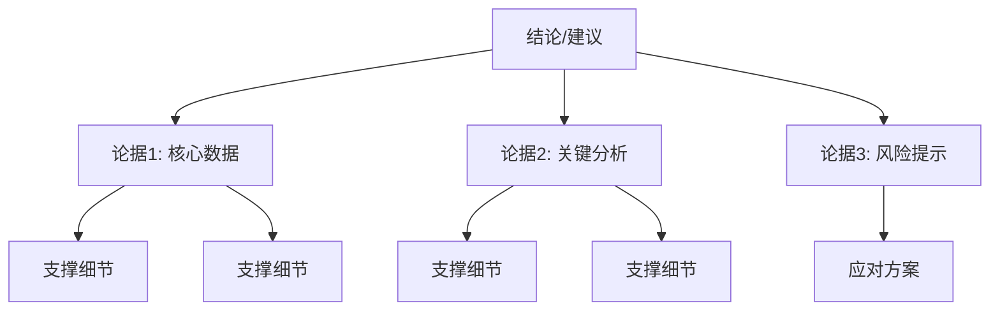
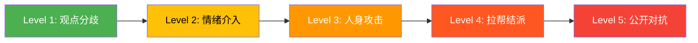

## 四、职场礼仪

职场礼仪不是一套"让人觉得你有礼貌"的表演技巧，而是一套降低协作摩擦、建立职业信任、提升工作效率的行为操作系统。研究表明，职场中 85% 的成功取决于人际交往能力，而非专业技能（卡耐基研究所数据）。而在人际交往中，礼仪是最直接、最可学习、最可量化的部分。

本章从职业生命周期的角度，系统覆盖从入职到离职、从日常办公到特殊场合、从线下到远程的全部职场礼仪场景。

### 4.1 职场礼仪的底层逻辑

在进入具体场景之前，先理解职场礼仪为什么有效、作用机制是什么。

#### 4.1.1 职场礼仪的三重价值

| 维度 | 作用 | 具体表现 |
|------|------|----------|
| **信任建立** | 降低他人的防御心理 | 守时→可靠；着装得体→专业；沟通清晰→高效 |
| **关系润滑** | 减少不必要的摩擦 | 尊重边界→避免冲突；主动沟通→消除误解 |
| **职业资本** | 积累长期信誉 | 一致的礼仪表现→口碑→机会 |

#### 4.1.2 职场礼仪的核心原则

职场礼仪遵循四个核心原则，理解这些原则后，即使遇到本章未覆盖的场景，你也能自行推导出正确的行为方式：

1. **尊重原则**：尊重他人的时间、空间、专业和贡献。所有礼仪规则的本质都是尊重的具体化表达。
2. **适度原则**：过度热情和过度冷淡同样失礼。根据关系深浅、场合正式程度调整行为分寸。
3. **一致性原则**：礼仪表现应该是稳定可预期的，而非忽冷忽热。稳定的行为模式才能建立信任。
4. **情境原则**：同一行为在不同文化、行业、公司中的含义不同。互联网公司的"随意"不等于金融公司的"随意"。



### 4.2 入职与离职礼仪

入职和离职是职场关系的起点和终点。起点决定了别人对你的第一印象，终点决定了别人对你的长期记忆。心理学中的"首因效应"和"近因效应"在这两个时刻发挥最大作用。

#### 4.2.1 入职礼仪

##### 入职前的准备（拿到 Offer 到正式入职）

| 时间节点 | 行动 | 细节 |
|----------|------|------|
| **收到 Offer 当天** | 确认入职信息 | 报到时间、地点、联系人、所需材料清单 |
| **入职前 3-5 天** | 了解公司背景 | 公司官网、业务方向、组织架构、核心产品、近期新闻 |
| **入职前 2-3 天** | 准备个人物品 | 证件原件及复印件、一寸照片、银行卡信息、笔记本和笔 |
| **入职前一天** | 确认着装 | 根据公司文化选择着装，宁可正式一点也不要过于随意 |
| **入职当天** | 提前 15-20 分钟到达 | 给自己留出熟悉环境的时间，同时表现出守时的职业素养 |

##### 入职第一天的关键动作

入职第一天的核心目标只有两个：**留下好的第一印象** 和 **建立有效的信息网络**。不要试图在第一天证明自己的能力，那会适得其反。

**上午：融入环境**

1. **到达后先找到对接人**（通常是 HR 或你的直属上级），简短问候，确认今天的安排。
2. **完成行政手续**时保持耐心和配合态度——这些流程可能繁琐，但你的态度会被 HR 记住。
3. **拿到工位后**，花 5 分钟整理桌面，把个人物品归位。一个整洁的工位无声地传递"我做好了准备"。
4. **主动与邻座同事打招呼**。用一个简短的自我介绍开场：

> "你好，我是 [名字]，今天刚入职 [部门]，负责 [工作内容]。以后请多多指教。"

5. **记住同事的名字**。这是建立关系最快的方式。如果一次没记住，诚恳地再问一次比假装记住要好得多。记住名字的技巧：听到名字后立即重复一遍（"张伟，好的"），在对话中有意识地使用名字，当天结束后用笔记记录。

**下午：主动学习**

6. **找直属上级进行入职沟通**，确认：
   - 近一周的工作安排和期望
   - 团队的沟通方式和工作节奏
   - 需要熟悉的内部系统和工具
   - 有不清楚的问题可以找谁请教
7. **午餐时主动加入同事**。不要独自用餐，这是建立非正式关系的黄金时间。午餐聊天保持轻松，多问少说，主要了解：
   - 团队的工作氛围
   - 公司的隐性规则（比如是否需要加班、午餐时间的习惯等）
   - 茶水间/打印区等公共设施的位置
8. **下班前向帮助过你的人道谢**，包括 HR、IT 支持、带你熟悉环境的同事。

##### 入职首周的行为清单

- [ ] 搞清楚公司的审批流程、请假制度、考勤规则
- [ ] 熟悉内部通讯工具（企业微信/钉钉/飞书/Slack）的基本操作
- [ ] 了解团队的工作汇报节奏（日报/周报/站会）
- [ ] 阅读团队的文档和知识库，至少了解项目全貌
- [ ] 主动向前辈请教 2-3 个具体问题（问题要具体，不要问"我该做什么"）
- [ ] 在 1-on-1 中与上级确认短期目标和考核标准

##### 入职常见误区

| 误区 | 问题 | 正确做法 |
|------|------|----------|
| 急于表现能力 | 第一天就对现有流程提意见，让人觉得"不知道天高地厚" | 先观察 2 周再提建议，提建议时用"我注意到……我在想是否可以……"的温和句式 |
| 过度谦卑 | 什么事都说"我不会"，给人留下能力不足的印象 | 把"我不会"换成"这个我之前没接触过，能给我 10 分钟学习一下吗" |
| 社交恐惧 | 全天不与人交流，只盯着电脑 | 设置小目标：每天主动和 2 个同事说一句话 |
| 信息过载 | 什么都记、什么都问 | 优先记住"谁能帮我解决问题"，具体操作以后再学 |
| 午餐独行 | 觉得不好意思加入别人 | 大方问一句"你们去吃饭吗？能带上我吗？"——99% 的人不会拒绝 |

#### 4.2.2 离职礼仪

离职是职业生涯中最考验人品的时刻。行业比你想象的小得多——你今天离开的同事，可能三年后变成你的面试官、合作伙伴或客户。

##### 离职的标准流程



**通知阶段**

- **先通知直属上级**，再通知 HR。这是基本的职场伦理。绝对不要让上级从别人口中得知你要离职。
- **提前通知**：试用期提前 3 天，正式员工提前 30 天（劳动合同法规定），高级岗位可能需要更长时间。
- **面谈时保持真诚但简洁**。不需要过度解释离职原因，也不需要撒谎。可以说"我接受了一个更符合我职业规划的机会"，这比"钱多"要体面得多。
- **不要在离职面谈中吐槽公司或同事**。离职面谈的内容可能被记录和传递。

**交接阶段**

离职交接的质量，直接决定了你离开后别人怎么评价你。一份清晰的交接文档是你留给前公司的最好礼物。

**交接文档模板：**

```markdown
## 工作交接文档

### 一、当前进行中的项目
| 项目名称 | 当前状态 | 下一步计划 | 截止日期 | 对接人 |
|----------|----------|------------|----------|--------|
| 项目A | 设计阶段 | 开发评审 | 2024-03-15 | 张三 |
| 项目B | 测试中 | Bug修复 | 2024-03-10 | 李四 |

### 二、文件和资料
| 文件/资料 | 存放位置 | 说明 |
|-----------|----------|------|
| 产品需求文档 | /共享盘/产品/ | 包含所有版本历史 |
| 客户沟通记录 | CRM系统 | 已标注重要信息 |

### 三、账号和权限
| 系统名称 | 账号信息 | 需要移交给 |
|----------|----------|------------|
| 生产环境 | 部门公共账号 | 王五 |
| 第三方服务 | 见密码管理器 | 赵六 |

### 四、待办事项
- [ ] XX功能的优化方案已出初稿，待评审
- [ ] XX客户的合同续约，已沟通但未签约

### 五、注意事项
- XX客户的对接人比较在意响应速度，建议当天回复
- XX系统的数据库需要每周手动备份
```

**告别阶段**

- **逐一道别**：与直接合作过的同事、上级、跨部门合作方逐一告别，表达感谢。
- **发送告别邮件**：简洁、真诚、积极。不借此机会发泄不满。

> 邮件模板：
>
> 主题：感谢与道别
>
> 各位同事，
>
> 今天是我在 [公司名] 的最后一天。感谢这段时间以来大家的帮助和支持，和你们共事是一段非常珍贵的经历。
>
> 祝公司和团队未来发展顺利。我的个人联系方式是 [手机号/微信号]，欢迎保持联系。
>
> 此致，
> [名字]

- **不在社交媒体上发布负面内容**。即使你觉得不公平，公开吐槽只会损害你自己的职业形象。

##### 离职后的维护

- 加入前同事的社交群（如果有），偶尔互动。
- 重要节日发送简短问候。
- 如果前同事需要帮助（在不违反竞业协议的前提下），力所能及地回应。
- 如果前公司邀请你回去（"回炉"），认真考虑——回炉员工往往有更高的成功率。

### 4.3 日常工作礼仪

日常工作的礼仪不像入职和离职那样有明确的时间节点，它是持续的、微小的行为积累。正是这些看似不起眼的日常细节，构建了你的职场口碑。

#### 4.3.1 时间管理礼仪

守时是职场最基本也最重要的礼仪。它传递的信号是："我尊重你的时间，你对我很重要。"反之，不守时传递的是："我的时间比你的时间更有价值。"

##### 时间管理的具体规则

**会议守时**

- 提前 2-3 分钟到达会议室或进入线上会议。
- 如果你是会议组织者，提前 5 分钟到场准备设备。
- 迟到时不要长篇大论地解释原因，简单说"抱歉，刚才 [原因]，我们开始吧"。
- 如果预计迟到超过 5 分钟，**必须提前通知**会议组织者。

**截止日期守时**

- 接受任务时诚实评估所需时间，不要为了表现积极而承诺不切实际的截止日期。
- 如果发现无法按时完成，**在截止日期之前**通知相关人员，而不是到了截止日期才说"还没做完"。
- 提前完成的工作可以提前提交，但不要提前太多（可能会让对方觉得你草率了事），提前半天到一天比较合适。

**沟通守时**

- 收到消息后尽量在 4 小时内回复，即使只是"收到，稍后详细回复"。
- 如果需要较长时间处理，在收到消息时就告知对方预期回复时间。
- 非工作时间的消息可以在下一个工作日回复，但如果可能影响紧急事项，应当回复。

#### 4.3.2 工作空间礼仪

你的工作空间是你的领地，但在开放办公环境中，它也是公共空间的一部分。

##### 工位管理规范

| 方面 | 标准 | 原因 |
|------|------|------|
| **桌面整洁** | 文件归档、物品归位、电线整理 | 杂乱的桌面传递"我无法管理好自己的工作"的信号 |
| **噪音控制** | 说话声音降低、键盘声注意（避免机械键盘青轴）、手机震动模式 | 开放办公中噪音是最主要的干扰源 |
| **气味管理** | 不在工位吃气味强烈的食物（螺蛳粉、榴莲、麻辣烫） | 气味是最容易引发同事反感的因素 |
| **温度控制** | 空调温度协商确定，不私自调整公共区域温度 | 温度偏好因人而异，独断会引发矛盾 |
| **公共设施** | 用完会议室清理白板、用完打印机取走文件、用完微波炉清理残渣 | "谁用谁清理"是公共空间的黄金法则 |

##### 开放办公中的"边界感"

开放办公最大的挑战是如何在"方便沟通"和"保持专注"之间取得平衡：

- **观察同事的"忙碌信号"**：戴耳机、身体前倾盯着屏幕、正在通话——这些都是"请勿打扰"的信号。需要交流时，先远远地看一眼对方的状态。
- **讨论时控制音量**：两人的讨论如果超过 3 分钟，应该转移到会议室或走廊。
- **尊重"午休边界"**：午餐后的 20-30 分钟是很多人的休息时间，非紧急事项不要在这个时段找人。

#### 4.3.3 团队协作礼仪

团队协作中，礼仪不是"客客气气"，而是"高效协作"的保障。

##### 协作中的核心礼仪行为

**信息透明**

- 主动分享对他人有帮助的信息，不要做信息囤积者。
- 在共享文档中使用规范的格式和命名，让别人能快速找到需要的信息。
- 项目进展发生重大变化时，及时通知所有相关方，不要等人来问。

**尊重专业边界**

- 不要越级指挥其他部门的人。
- 对不熟悉的领域发表意见时，加上"我在这个领域不太专业，但从我理解的角度来看……"的限定语。
- 如果你的建议被拒绝，不要反复施压——尊重对方的专业判断。

**会议中的行为规范**

- 发言前先在心里组织语言，做到"说之前想清楚"。
- 不打断别人的发言。如果需要补充，等对方说完再说"我想补充一点"。
- 用"对，而且……"替代"不对，但是……"。
- 如果会议中有人一直没说话，主持人应该主动邀请："XX，你对这个问题怎么看？"
- 做会议记录，会后发送给所有参会者。

**冲突处理**

冲突是团队协作中不可避免的。礼仪不在于避免冲突，而在于如何处理冲突：

- **就事论事**：讨论具体方案的优劣，而不是质疑对方的能力或动机。
- **控制情绪**：感到愤怒时，先说"我需要想一下"，暂停 5 分钟再继续。
- **寻找共识**：先找到双方都认同的点，再讨论分歧。
- **适时升级**：如果双方无法达成一致，及时引入上级或第三方仲裁，不要让矛盾发酵。

#### 4.3.4 邮件礼仪

邮件仍然是正式商务沟通的主要工具。一封格式规范、逻辑清晰的邮件，能大幅提升沟通效率。

##### 邮件撰写规范

**主题行**：用一句话概括邮件核心内容，方便收件人判断优先级和归档。

| 好的主题 | 差的主题 |
|----------|----------|
| 【审批】Q2市场部预算申请 - 需3月10日前回复 | 预算 |
| 【反馈】产品V2.3测试报告 - 3个严重Bug | 测试结果 |
| 【邀请】3月15日下午2点产品评审会 | 会议 |

**正文结构**：

称呼：[根据关系选择正式/非正式程度]

第一段：目的（一句话说明为什么写这封邮件）
第二段：详情（具体内容、背景信息）
第三段：行动项（需要对方做什么、什么时候完成）

落款：
[姓名]
[职位] | [部门]
[联系方式]

**邮件礼仪要点**：

- **To 和 CC 要分清**：To 是需要采取行动的人，CC 是需要知情的人。不要把所有人都放在 To 里。
- **回复 vs 全部回复**：如果回复只涉及发件人一个人，点"回复"而非"全部回复"。
- **附件提醒**：正文中提到附件时，在附件文件名上标注清晰的名称和版本号。发送前检查附件是否真的添加了。
- **邮件长度**：一封邮件只说一件事。如果需要讨论多个议题，分开发送或使用编号列表。
- **发送时间**：避免在深夜或周末发送工作邮件（设置定时发送），除非对方明确表示可以。

### 4.4 汇报与反馈礼仪

汇报和反馈是职场中最核心的沟通场景。你的汇报质量直接影响上级对你能力的判断，你的反馈方式直接影响团队的士气和效率。

#### 4.4.1 向上汇报

##### 汇报的金字塔原理

向上汇报遵循"金字塔原理"——结论先行，然后展开论据。上级最需要的不是过程，而是结果和判断。



**STAR汇报法**（适用于单项任务汇报）：

- **S（Situation）**：背景——用一句话说明情况
- **T（Task）**：任务——你要解决什么问题
- **A（Action）**：行动——你做了什么
- **R（Result）**：结果——取得了什么成果，下一步计划

**BGRA汇报法**（适用于常规工作汇报）：

- **B（Background）**：背景和当前状态
- **G（Gap）**：目标与现状的差距
- **R（Recommendation）**：建议方案
- **A（Ask）**：需要的支持和决策

##### 汇报中的禁忌

- **不带解决方案提问题**：永远带着至少一个解决方案去汇报问题，最好带上优劣分析。
- **报喜不报忧**：隐瞒问题只会让问题在最后时刻爆发，造成更大的损失。
- **过度细节**：上级不需要知道你执行过程中的每一个细节，只说关键节点。
- **被动等待被问**：主动定期汇报进展，不要等上级来问"那个事做得怎么样了"。

##### 不同场景的汇报策略

| 场景 | 策略 | 时间控制 |
|------|------|----------|
| **电梯汇报**（偶遇上级） | 用一句话说结论，如果对方感兴趣再展开 | 30秒 |
| **日常站会** | 昨天做了什么、今天计划做什么、有什么阻碍 | 1-2分钟 |
| **周报** | 本周成果 + 关键数据 + 下周计划 + 需要协调的事项 | 5分钟阅读量 |
| **项目汇报** | 完整的STAR/BGRA结构 + 数据支撑 + 风险预警 | 10-20分钟 |
| **危机汇报** | 先说影响范围和紧急程度，再说原因，最后说应对方案 | 根据紧急程度 |

#### 4.4.2 向下反馈

向下反馈是管理者的"核武器"——用得好可以激发潜力，用不好可以摧毁信心。

##### 正面反馈的框架

**SBI 模型**（Situation-Behavior-Impact）：

- **S（情境）**：在什么情境下
- **B（行为）**：你做了什么具体的行为
- **I（影响）**：这个行为产生了什么积极影响

> 示例：
> "上周三客户会议中（S），你主动准备了竞品对比分析（B），这让客户对我们的方案更有信心，当场就签了意向书（I）。做得非常好。"

**关键点**：正面反馈要具体、要及时、要公开。"做得不错"远不如 SBI 模型有力量。

##### 改进反馈的框架

**AID 模型**（Action-Impact-Desired behavior）：

- **A（行动）**：描述具体行为（不加评判）
- **I（影响）**：说明这个行为的影响
- **D（期望行为）**：明确你希望看到的改变

> 示例：
> "这周的周报里缺少了数据支撑部分（A），这导致我们在管理层会议上无法用数据说服他们批准预算（I）。下周的周报请加上关键数据和对比图表（D），如果需要数据分析的支持可以找 XX 帮忙。"

**反馈的黄金法则**：

- **私下批评，公开表扬**。公开批评会让人产生强烈的羞耻感和对抗心理。
- **对事不对人**。"这个方案不够好"和"你能力不行"是完全不同的两句话。
- **及时反馈**。行为发生后 24 小时内反馈效果最好，隔了两周再说已经失去了教育意义。
- **控制情绪**。带着愤怒给出的反馈，对方记住的是你的愤怒，而不是你的建议。
- **给出可行的改进方向**。只说"不好"不说"怎么改"等于白说。

#### 4.4.3 平级沟通

平级沟通的核心挑战是：你们没有上下级关系中的权力杠杆，合作完全建立在互惠和信任之上。

##### 平级沟通的原则

1. **主动沟通**：不要等别人来找你。主动分享进展、主动确认需求、主动提供帮助。
2. **直接但温和**：有问题直接说，但注意措辞。"我觉得这个方案可能有 X 风险"比"你这个方案不行"好得多。
3. **不越界**：不对其他部门的工作方式指手画脚，除非对方主动邀请你的意见。
4. **有来有往**：别人帮了你的忙，找机会回报。长期单向索取会耗尽关系资本。
5. **尊重专业**：在对方的专业领域内，多请教少指挥。

##### 跨部门协作的礼仪

跨部门协作是平级沟通中最有挑战性的场景。不同部门有不同的目标、节奏和语言体系。

- **了解对方的 KPI**：知道对方部门的核心目标，才能找到合作的共赢点。
- **用对方的语言沟通**：和产品说"用户体验"，和研发说"技术可行性"，和销售说"客户价值"。
- **提前约定协作规则**：需求的优先级、沟通的频率、决策的方式，在项目开始前就达成共识。
- **功劳共享**：项目成功时，主动在公开场合感谢其他部门的配合。

### 4.5 特殊场合职场礼仪

#### 4.5.1 商务出差

出差不只是"去另一个地方工作"，它考验的是你在脱离日常舒适区后的专业表现。

##### 出差前

| 准备事项 | 具体内容 |
|----------|----------|
| **资料准备** | 演示文稿、合同草案、名片、公司宣传资料——多带一份备份 |
| **设备检查** | 笔记本电脑、充电器、转接头、移动电源、投影转接头 |
| **行程确认** | 机票/火车票、酒店、接送安排、会议时间地点——再次确认 |
| **当地信息** | 天气预报（决定着装）、交通方式、当地习俗和禁忌 |
| **着装准备** | 根据场合准备 2-3 套衣服，至少一套正式商务装 |
| **费用确认** | 差旅标准、报销流程、预借备用金 |

##### 出差中

- **守时**：在外地守时更加重要——对方为你调整了日程，迟到是最严重的失礼。
- **代表公司形象**：在客户面前，你的一言一行代表的不是个人，而是公司。
- **做好记录**：每次会议后立即整理笔记，记录决策事项和待办事项。
- **及时汇报**：每天向上级简短汇报当天进展和次日安排。
- **尊重当地文化**：在不同地区出差时，注意当地的饮食禁忌、社交习惯和送礼习俗。

##### 出差后

- 24 小时内提交出差报告（含会议纪要、决策事项、跟进计划）。
- 及时提交报销单据。
- 向接待方发送感谢邮件。
- 跟进出差中达成的事项。

#### 4.5.2 公司活动

公司活动（年会、团建、聚餐）是建立非正式关系的重要场合，也是最容易"出丑"的场合。

##### 公司聚餐礼仪

- **座次**：不要抢先坐下座（离门口最远的位置通常是主位），等领导或组织者安排。
- **点菜**：如果是你组织，先问有无忌口，荤素搭配，适量点菜不铺张。
- **敬酒**：
  - 不要强迫别人喝酒，"以茶代酒"完全没问题。
  - 敬酒时酒杯低于对方（对上级或长辈）。
  - 敬酒词简洁真诚，不需要长篇大论。
  - 适度饮酒，保持清醒——酒后失态是职场社交中最常见的"黑历史"。
- **话题**：聊轻松话题（美食、旅行、运动），避免敏感话题（政治、宗教、薪资、八卦）。
- **买单**：如果是公司聚餐，不要抢单——这不是你表现的机会。如果是 AA 制，大方付钱不要算到角。

##### 团建活动礼仪

- 积极参与，不要全程玩手机。
- 不要因为活动"无聊"就表现出不耐烦。
- 注意团队合作，不要过度竞争——团建不是竞技场。
- 活动中照顾不太合群的同事，主动邀请他们参与。

#### 4.5.3 应对压力与冲突

职场冲突是不可避免的。你的应对方式决定了冲突是升级为矛盾，还是转化为建设性的讨论。

##### 冲突升级的五级模型



**在 Level 1-2 阶段介入最有效**。一旦升级到 Level 3 以上，修复关系的成本会急剧上升。

##### 冲突处理的步骤

1. **暂停**：感到情绪升温时，说"我需要思考一下，我们 10 分钟后再讨论"。这不是退缩，而是成熟。
2. **倾听**：真正听懂对方的核心诉求，而不是只在等对方说完然后反驳。
3. **复述**：用自己的话复述对方的观点（"你的意思是……对吗？"），确认理解无误。
4. **找共识**：先确认双方都同意的部分，再讨论分歧。
5. **方案共创**：一起寻找解决方案，而不是各自坚持自己的方案。
6. **如果僵局**：引入第三方（上级、HR、双方都信任的同事）协助调解。
7. **事后修复**：冲突解决后，主动找对方聊一聊，确认关系没有留下裂痕。

### 4.6 远程办公礼仪

远程办公已经成为很多公司的常态。远程环境中的礼仪比线下更加重要，因为你缺少了表情、肢体语言、偶遇等非正式沟通渠道，每一个正式沟通环节的质量都需要更高。

#### 4.6.1 视频会议礼仪

##### 会前准备

- **技术检查**：提前 5 分钟测试摄像头、麦克风、网络连接。准备一个备用方案（比如手机热点、手机登录）。
- **环境准备**：
  - 背景整洁或使用虚拟背景（但虚拟背景不要太花哨）。
  - 光线从前方照过来（不要背光——否则你就是一个黑影）。
  - 确保环境安静（告知家人/室友你即将开会）。
- **材料准备**：提前打开需要共享的文件、演示文稿。

##### 会中行为

| 行为 | 规范 |
|------|------|
| **着装** | 至少上半身正式着装——你永远不知道什么时候需要站起来 |
| **摄像头** | 开会时打开摄像头（除非网络不好或公司允许关闭），远程会议中"露面"是建立信任的基础 |
| **静音** | 不发言时静音，避免背景噪音干扰。发言前先解除静音——不要出现"你说什么？你静音了"的尴尬 |
| **目光** | 发言时看着摄像头（不是屏幕上的画面），模拟眼神接触 |
| **专注** | 不要处理其他事务——你心不在焉的样子在摄像头下非常明显（目光游移、打字声） |
| **发言** | 说话前停顿一秒，确认没有人在说（避免打断）。语速比线下稍慢，吐字清晰 |
| **屏幕共享** | 共享前关闭不相关的标签页和通知弹窗 |

##### 会后跟进

- 24 小时内发送会议纪要。
- 在纪要中标注决策事项、待办事项、负责人和截止日期。
- 如果有疑问，在会上就提出来——不要会后在群里反复追问。

#### 4.6.2 即时通讯礼仪

即时通讯工具（企业微信、钉钉、飞书、Slack）是远程办公的主动脉，但用不好就会变成噪音源。

##### 消息发送规范

**结构化沟通**：不要发一长段话，用结构化格式：

【背景】
产品V2.3的搜索功能有用户反馈加载慢

【问题】
搜索结果页平均加载时间从0.8s上升到3.2s

【建议】
1. 排查后端API是否有限制
2. 检查前端是否有新的大图片加载

【需要你做的】
帮忙看一下后端日志，确认是否有异常
预计需要多久可以反馈？

**消息礼仪要点**：

- **不要发"在吗？"** 直接说事情。"在吗？"不仅浪费时间，还会让对方焦虑——"找我什么事？是不是我做错了什么？"
- **一条消息说完整**：不要一句一句地发——连发 5 条 10 字以下的消息，对收件人是噪音轰炸。
- **区分消息和任务**：如果是需要对方行动的事项，用任务功能而不是消息——消息会被刷掉，任务不会。
- **非紧急事项不要在非工作时间发送**。如果必须发送，加一句"不急，明天回复就好"。
- **语音消息慎用**：语音消息需要对方找耳机、花时间听完才能回复。在工作场景中，文字消息效率更高。如果确实需要发语音，控制在 30 秒以内。

#### 4.6.3 远程协作礼仪

##### 建立远程协作的基本契约

远程协作最大的挑战是"看不见对方在做什么"。建立清晰的协作契约可以消除这种不确定性：

| 协作契约 | 内容 |
|----------|------|
| **工作时间** | 每天的在线时间段（如 9:00-18:00），以及午休时间 |
| **响应时间** | 普通消息 4 小时内回复，@我的消息 1 小时内回复，紧急事项电话 |
| **状态同步** | 开始/结束工作时更新状态，长时间离开时告知团队 |
| **文档规范** | 所有决策记录在文档中，不依赖口头传达 |
| **会议规范** | 有议程才开会，有纪要才散会 |

##### 远程办公中的"存在感"

远程办公容易产生"隐形人"效应——你做了很多工作，但别人看不到。主动建立"存在感"不是虚荣，而是职业发展的需要：

- **定期分享进展**：在团队频道中定期发布工作进展（不要等人来问）。
- **主动参与讨论**：在线上会议和群聊中积极发言，不要做沉默的旁观者。
- **视频开摄像头**：这是远程办公中建立个人连接的最直接方式。
- **组织非正式聊天**：偶尔发起"虚拟咖啡时间"，和同事聊聊工作以外的事情。
- **记录和分享成果**：把完成的工作成果写成简短的总结发给团队，让大家知道你在做什么。

### 4.7 不同职业阶段的职场礼仪侧重

职场礼仪不是一成不变的。随着你的职业发展，礼仪的侧重点也需要调整。

| 阶段 | 核心挑战 | 礼仪侧重 |
|------|----------|----------|
| **新人期（0-1年）** | 融入团队、建立信任 | 学习姿态、守时守信、主动沟通、记住名字 |
| **成长期（1-3年）** | 扩展影响力 | 跨部门协作、汇报能力、向上管理、会议发言 |
| **骨干期（3-5年）** | 承担更多责任 | 指导新人、冲突处理、项目管理、客户沟通 |
| **管理期（5年+）** | 领导力展现 | 反馈技巧、团队建设、危机处理、对外代表公司 |

### 4.8 职场礼仪的常见误区与纠正

#### 误区一："礼仪就是讨好别人"

**事实**：礼仪是建立健康职业关系的工具，不是讨好。讨好是委屈自己满足别人，礼仪是在尊重他人的前提下清晰地表达自己。"不好意思，这个需求我们目前的排期无法支持"是礼貌地拒绝，不需要为了"讨好"而承诺做不到的事情。

#### 误区二："能力强就不需要礼仪"

**事实**：能力决定了你的下限，礼仪（以及更广泛的人际关系能力）决定了你的上限。很多技术极强的人职业生涯受阻，不是因为能力不够，而是因为不懂得如何与人合作。

#### 误区三："越正式越好"

**事实**：礼仪的关键是适度。在崇尚扁平文化的公司里穿三件套西装，不仅不会加分，还会产生距离感。观察并适应所在环境的文化，是最好的礼仪。

#### 误区四："有矛盾就应该忍让"

**事实**：忍让不是礼仪，是回避。真正的礼仪是就事论事地表达不同意见，在尊重对方的前提下坚持自己的立场。一个永远说"好的没问题"的人，在职场中不会被尊重。

#### 误区五："远程办公不需要讲究"

**事实**：远程办公中，缺少了面对面的非正式交流，每一次正式沟通的权重都被放大了。你的一条消息、一封邮件、一次视频发言，都可能影响别人对你的整体判断。远程环境下的礼仪要求不是更低，而是更高。

### 4.9 职场礼仪自检清单

以下清单可用于定期自检你的职场礼仪水平。建议每月回顾一次：

**日常行为**
- [ ] 我是否在过去一个月内有迟到的记录？
- [ ] 我的消息是否都能在 4 小时内回复？
- [ ] 我的工位是否保持整洁？
- [ ] 我是否在公共空间注意了噪音和气味？

**沟通能力**
- [ ] 我的邮件是否主题清晰、结构完整？
- [ ] 我的汇报是否结论先行、有数据支撑？
- [ ] 我是否给过至少一次具体的正面反馈？
- [ ] 我在冲突中是否保持了冷静和理性？

**关系维护**
- [ ] 我是否主动和跨部门的同事有过交流？
- [ ] 我是否记得新同事的名字？
- [ ] 我是否在团队成就中分享了功劳？
- [ ] 我是否在非工作场合维护了职场关系？

**自我提升**
- [ ] 我是否观察过身边"礼仪做得好"的同事是怎么做的？
- [ ] 我是否收到过关于沟通方式的反馈，并做了调整？
- [ ] 我是否了解了公司文化和行业惯例的最新变化？

***
