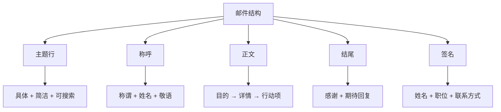
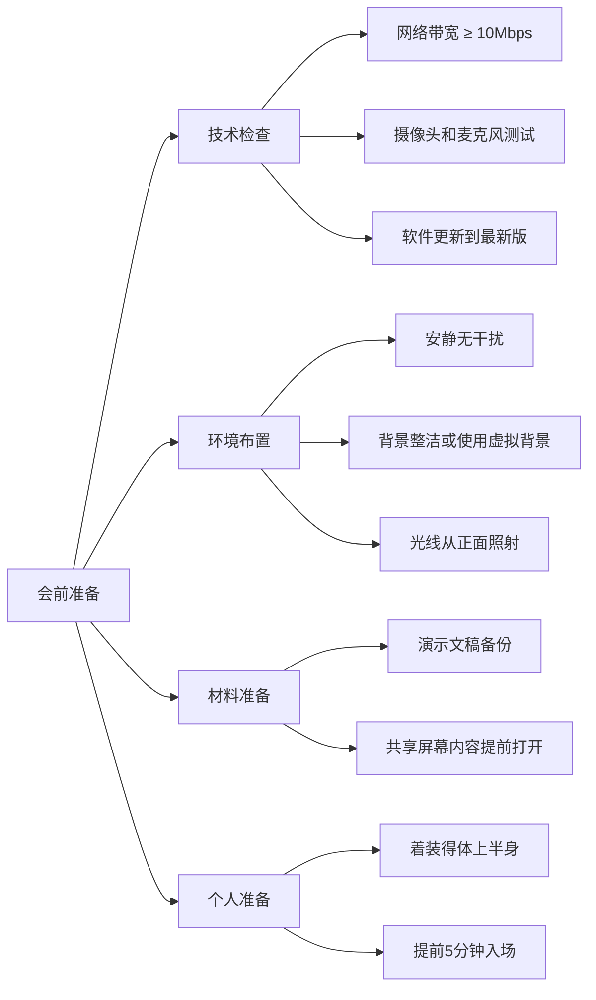

## 六、数字社交礼仪

数字社交礼仪是指人们在通过电子设备和互联网平台进行交流互动时应遵循的行为规范和准则。与面对面交流不同，数字沟通缺少语气、表情、肢体语言等非语言线索，信息的传递更容易产生误解。同时，数字消息具有可记录、可转发、可永久保存的特性，一条失当的消息可能造成远超线下失礼的后果。

掌握数字社交礼仪不仅关乎个人形象，更直接影响职业发展和人际关系质量。据领英（LinkedIn）2023年的一项调查，76%的招聘经理会查看候选人的社交媒体活动，43%的职场冲突源于线上沟通误解。本章将从即时通讯、电子邮件、社交媒体、线上会议、远程协作、在线服务互动以及人工智能时代的新兴礼仪七个维度，系统阐述数字社交的规范与实践。

### 6.1 即时通讯礼仪

即时通讯是当今最高频的沟通方式。微信月活跃用户超过13亿，平均每人每天发送超过40条消息。高频使用意味着高频犯错——即时通讯礼仪是数字社交中最容易被忽视、也最容易造成摩擦的领域。

#### 6.1.1 微信沟通礼仪

微信作为中国最主要的即时通讯工具，承载了社交、工作、生活服务等多重功能。由于其功能边界模糊，礼仪规范也最为复杂。

**消息回复的基本原则：**

| 场景 | 建议响应时间 | 最低礼貌标准 |
|------|-------------|-------------|
| 工作消息（工作时间内） | 30分钟内 | 2小时内必须回复，哪怕只说"收到，稍后处理" |
| 朋友闲聊 | 当天内 | 不超过24小时 |
| 紧急事务 | 立即 | 如无法处理，告知预计回复时间 |
| 群聊中的@消息 | 1小时内 | 当天内 |
| 深夜收到的非紧急消息 | 次日上午 | 不必立即回复，但次日要回应 |

**为什么"已读不回"比"晚回复"更伤人？** 当对方看到你在线（朋友圈有更新、微信运动有数据），却对消息视而不见，这种"选择性忽略"传递的信号是"你不重要"。如果确实忙，一条"现在不方便，晚点回你"远好过沉默。

**语音消息的使用规范：**

语音消息是一把双刃剑。对发送者来说方便快捷，对接收者来说却可能是灾难——在会议中、地铁上、图书馆里，一条60秒的语音消息根本无法收听。

使用语音消息的正确方式：
- 每条语音控制在15秒以内，超过30秒请改用文字
- 发送前先问对方是否方便听语音
- 不要用语音传递需要反复查阅的信息（地址、数字、时间等）
- 转换语音为文字的功能仅作为辅助，不要依赖它处理重要信息
- 在工作群中默认使用文字，语音仅限双方私聊且对方同意的情况

**微信群聊礼仪：**

群聊是一个半公共空间，很多人把它当作私聊对待，这是常见误区。

群聊中的"红线行为"：
- 未经群主同意拉人入群——等同于未经邀请就带陌生人参加聚会
- 在工作群频繁发红包——可能被视为影响工作秩序
- 群聊中与某人长时间两人对话——应在私聊中进行
- 转发未经核实的新闻、谣言到群里——损害个人信誉
- 凌晨在群里发消息（除非群成员都在同一时区且明确接受）
- 使用"@所有人"来引起关注——除非你是群主且有真正紧急的事

群聊中的"加分行为"：
- 新人入群时主动打招呼并简要自我介绍
- 有人提问时积极回应，不让消息"冷场"
- 分享有价值的信息时注明出处
- 退出不再相关的群时，私信群主礼貌说明

**朋友圈互动的微妙规则：**

朋友圈是一个精心策展的个人空间，互动方式直接影响关系亲疏。

- 点赞的潜规则：给同事、领导的朋友圈点赞是职场基本功，但不要翻到很早之前的内容去点赞，会显得刻意。对刚发的内容立即点赞是热情，对几小时前的内容点赞是关注，对几天前的内容点赞是在"考古"
- 评论的艺术：一句真诚的具体评论（"这张照片的构图很好"）胜过一百个"好看"。避免在别人晒娃/晒伴侣的朋友圈下开玩笑或说负面的话
- 转发他人的朋友圈内容：未经同意不要转发他人朋友圈的照片或文字到其他平台
- 分组可见的智慧：不同内容面向不同人群是正常的社交策略，但如果被发现"选择性可见"可能造成信任危机

**"在吗？"——数字社交中最令人头疼的开场白：**

"在吗？"之所以令人反感，是因为它制造了信息不对称——你知道要说什么，对方不知道，被迫在不知情的情况下做出回应承诺。正确做法是直接说明事由：

| 不推荐 | 推荐 |
|--------|------|
| "在吗？" | "你好，想请教一下关于XX的事情，方便时回复我~" |
| "在吗？有空吗？" | "有件事想和你商量，大概需要5分钟，你什么时候方便？" |
| "在吗？帮个忙" | "我在做XX项目，需要借你的XX经验，不知你这周是否方便聊聊？" |

#### 6.1.2 企业通讯工具礼仪（钉钉、飞书、企业微信）

企业通讯工具的核心特征是"工作属性明确"，这意味着沟通标准应高于私人聊天。

**消息发送规范：**
- 消息结构化：使用标题、分段、列表，避免一整段不分段的文字墙
- 一次性把信息说完，不要拆成十句话分十次发
- 涉及行动项的消息，明确标注：谁（Who）、做什么（What）、什么时候（When）
- 使用"紧急"标签时三思——狼来了效应会让你真正紧急时无人响应
- 已读回执功能：对方已读但未回复，不要反复追问，给对方处理时间

**群公告与文件共享：**
- 重要通知使用群公告而非普通消息——普通消息会被刷掉
- 共享文件时说明文件内容、版本号、修改了什么
- 使用在线文档协作时，修改前看一眼是否有其他人正在编辑
- 删除文件或关闭权限前提前通知相关人员

### 6.2 电子邮件礼仪

电子邮件是正式程度最高的数字沟通方式。一封得体的邮件能展现专业素养，一封失礼的邮件可能毁掉商业机会。据统计，商务人士平均每天收到121封邮件，每封邮件的平均阅读时间仅为11秒——这意味着你必须在极短时间内传递关键信息并留下好印象。

#### 6.2.1 邮件撰写的结构化方法

一封专业邮件由五个层次构成：

**主题行的黄金法则：**

主题行决定了邮件是否会被打开、是否会被搜索到、是否会被优先处理。

| 差的主题 | 好的主题 | 改进原因 |
|----------|----------|----------|
| "你好" | "关于Q3营销预算方案的审批申请" | 说明具体事项 |
| "帮忙" | "请协助：XX项目客户数据核对（截止6月30日）" | 含行动项和截止日期 |
| "会议" | "【会议通知】产品评审会 - 6月25日14:00 - 3号会议室" | 包含时间地点 |
| "Re: Re: Re: 项目" | "Re: XX项目进展 - 第三轮反馈（附修改版方案）" | 追加关键更新信息 |

**正文的"倒金字塔"结构：**

邮件正文应遵循新闻写作的"倒金字塔"原则——最重要的信息放在最前面。

1. **第一段：目的声明**——一句话说明这封邮件要干什么。例如："请审批附件中的Q3预算方案，总计125万元。"
2. **第二段：关键详情**——提供对方做决定或采取行动所需的信息。使用编号列表而非大段文字。
3. **第三段：行动项**——明确你希望对方做什么、什么时候做。例如："请您在本周五前回复审批意见，如有疑问可随时联系我。"

**称呼的分寸感：**

- 初次联系：使用全名+职位，如"尊敬的张明总经理"
- 有过往来但不熟：姓+职务，如"王经理您好"
- 熟悉的同事：可以直接称呼名字，但仍保持礼貌用语
- 外贸/国际邮件："Dear Mr. Smith"，避免"Dear Friend"（像垃圾邮件）
- 不确定对方性别时：使用全名，如"Dear Zhang Wei"

**签名档的标准配置：**

姓名 | 职位
公司名称
手机：138-XXXX-XXXX
邮箱：name@company.com
公司地址：XX省XX市XX路XX号

签名档不宜过长（控制在5-7行），不宜使用花哨的颜色和字体，不宜附带动图或大尺寸Logo。

#### 6.2.2 回复与转发的艺术

**回复礼仪：**

- 24小时是默认的回复窗口。超过24小时未回复，在回复时应先致歉："抱歉回复晚了"
- 复杂问题无法立即回复时，先发一封简短确认："邮件收到，正在核实相关数据，预计明天下午前给您详细回复"
- 回复时保留足够的原文上下文，让对方快速回忆起对话脉络，但也不要保留整个邮件链——只保留相关段落
- "回复全部"前三思：是否所有人都需要看到你的回复？常见的灾难场景是把本应私下发给某人的吐槽回复给了所有人

**抄送（CC）与密送（BCC）的使用规则：**

| 字段 | 用途 | 注意事项 |
|------|------|----------|
| 收件人（To） | 需要采取行动或回复的人 | 不要放太多人，否则"人人有责等于人人无责" |
| 抄送（CC） | 需要知情但不需要行动的人 | 领导通常放在CC而非To，表示"知会" |
| 密送（BCC） | 不希望其他收件人看到的人 | 用于群发通知邮件保护隐私，不用于"偷偷汇报" |

#### 6.2.3 常见邮件礼仪雷区

**雷区一：全大写字母。** 在网络文化中，全大写等于"大喊"。即使你是为了强调，也会给对方带来压迫感。需要强调时使用加粗或高亮。

**雷区二：过度使用"紧急"标记。** 如果每封邮件都标紧急，那么等于没有紧急。仅在真正需要对方立即处理时使用。

**雷区三：邮件当即时通讯用。** 一分钟连发五封邮件讨论同一件事，不如在一封邮件中整理好所有内容，或改用即时通讯工具。

**雷区四：情绪化回复。** 收到令人生气的邮件时，不要立即回复。先写一封草稿，保存到"已删除"文件夹（是的，先放那里），24小时后再决定是否发送。很多冲突都可以通过一个晚上的冷静期化解。

**雷区五：附件问题。** 发送大附件前确认对方邮箱容量限制；附件命名使用有意义的名称（"XX公司Q3预算方案_v2_20260624.xlsx"而非"新建文档.xlsx"）；在正文中提及附件内容，不要让对方猜测。

### 6.3 社交媒体礼仪

社交媒体是个人品牌的展示窗口。你发布的内容、互动的方式、表达的观点，共同构建了你在数字世界中的"人设"。问题在于，这个"人设"一旦形成就很难改变——互联网是有记忆的。

#### 6.3.1 朋友圈与微博

**发布频率与时间的科学：**

过度发布会让关注者产生"信息疲劳"，过少则会被遗忘。最佳发布频率因平台而异：

| 平台 | 建议频率 | 最佳发布时间 |
|------|----------|-------------|
| 微信朋友圈 | 每天1-3条 | 午休12:00-13:00、晚间20:00-22:00 |
| 微博 | 每天1-5条 | 上午9:00-11:00、晚间19:00-21:00 |
| 小红书 | 每周3-5条 | 周末和晚间流量更高 |
| 抖音 | 每周2-3条 | 中午12:00、傍晚18:00、晚间21:00 |

**内容发布的"三不原则"：**

1. **不传播未经核实的信息。** 转发前至少验证信源是否可靠。一条谣言被转发500次以上，发布者可能承担法律责任。简单的验证方法：搜索关键词看是否有权威媒体报道、查看原始出处是否为官方渠道。
2. **不泄露他人隐私。** 发布合照前征得每个人的同意；不在公开场合讨论他人的私人事务；截图聊天记录分享前必须隐去对方个人信息。
3. **不发布情绪化的极端内容。** 愤怒时发的内容在冷静后往往令人后悔。建议设置"冷静期"——写完内容后存为草稿，24小时后再决定是否发布。

**评论区的修养：**

评论区是社交媒体中最低成本、最高暴露的互动方式。一条评论可能被成千上万人看到。

- 表达不同观点时就事论事，不人身攻击
- 不在他人的悲伤内容下开玩笑或"比惨"
- 给创作者的反馈应具体有建设性："第三段的论证逻辑可以更严密"比"写得不好"有价值得多
- 遇到网络暴力不要以暴制暴，使用举报和屏蔽功能

#### 6.3.2 专业社交平台（LinkedIn/脉脉）

专业社交平台的核心功能是建立和维护职业关系网络，其礼仪标准与朋友圈截然不同。

**个人资料的专业度：**
- 头像使用职业照，不用风景照、卡通头像或自拍
- 标题（Headline）不只是职位名称，应体现你的核心价值主张："10年B2B营销经验 | 帮助SaaS企业实现从0到1的市场突破"
- 工作经历应包含具体成果而非只列职责："领导5人团队完成XX项目，年度营收增长35%"比"负责XX项目"有力得多

**连接请求的礼仪：**
- 发送连接请求时务必附带个性化说明，解释为什么要连接
- 不要在连接请求中直接推销产品或请求帮忙
- 接受连接后24小时内发送一条感谢消息
- 不要群发连接请求——质量比数量重要

**内容发布与互动：**
- 分享行业见解和专业经验，而非个人生活
- 转发他人内容时添加自己的观点和评论
- 参与行业讨论时展现专业深度，避免泛泛而谈
- 不要在专业平台上频繁发布求职信息——会让现有雇主和潜在合作方产生负面印象

#### 6.3.3 短视频平台（抖音、B站、快手）

短视频平台的社交礼仪有其独特性，因为互动更加公开且传播速度更快。

**作为创作者：**
- 尊重他人的知识产权——使用他人的音乐、视频片段、图片时确认版权状态
- 标注内容是否为虚构/演绎——避免误导观众
- 对评论区的管理负有责任——及时处理恶意评论和人身攻击
- 不利用未成年人获取流量

**作为观众/评论者：**
- 评论文明友善——屏幕后面是真人
- 不传播"人肉搜索"信息
- 看到抄袭内容可以举报，但不要参与网络暴力
- 尊重不同类型的创作者——不喜欢可以划走，不必留言攻击

### 6.4 线上会议礼仪

远程办公和线上会议已成为职场常态。Zoom在2023年的日均会议参与者超过3亿人次。然而，线上会议的效率问题一直是职场痛点——据微软调查，73%的员工认为会议效率低下，其中大量问题与基本礼仪缺失有关。

#### 6.4.1 会前准备清单

**技术细节的魔鬼：**

- 网络带宽不足时，优先关闭视频保留音频——卡顿的视频比没有视频更糟糕
- 使用耳机而非外放——避免回声和环境噪音
- 摄像头位置与眼睛平齐——仰拍显脸大，俯拍显疏离
- 光线从正面打来——背光会让脸变成剪影
- 虚拟背景选择简洁专业的——漂移的虚拟背景比杂乱的真实背景更分心

#### 6.4.2 会议进行中的规范

**静音——线上会议的第一美德：**

不发言时保持静音，这不是建议，是铁律。键盘声、咳嗽声、狗叫声、外卖门铃声……这些背景噪音对其他参会者是持续的干扰。很多人不自觉地忽略了这一点，因为他们在自己的环境中感觉"还好"——但麦克风捕捉到的声音比你想象的多得多。

**发言的艺术：**

- 发言前先打开麦克风，不要说了一大段才发现自己一直静音
- 发言时看着摄像头而非屏幕上的画面——这模拟了眼神接触
- 说自己的名字再发言，尤其是多人会议："我是李明，关于这个问题我认为……"
- 控制发言时间——线上会议中注意力衰减更快，每次发言建议不超过2分钟
- 不要打断别人——在线上环境中打断比面对面更混乱，因为音频延迟导致两个人的声音重叠时谁也听不清

**多任务处理的诱惑：**

线上会议中最大的礼仪陷阱是"人在心不在"——摄像头开着，但眼睛在看邮件、回消息、刷社交媒体。问题是，这比你想象的更容易被发现：空洞的眼神、不自然的停顿、答非所问。

正确做法：关闭无关的标签页和应用，将手机翻面放在视线之外。如果会议内容与你无关（被不必要地邀请了），不如会后向组织者反馈，而不是在会上开小差。

**聊天窗口的正确使用：**

- 用聊天窗口补充而非替代发言——适合分享链接、记录要点、提出不打断流程的问题
- 不要在聊天窗口进行私人对话——其他参会者可能看到
- 重要的聊天内容会后应整理成文字记录

#### 6.4.3 会后跟进的闭环

一场会议如果没有会后跟进，等于白开。会议的价值在会后才真正体现。

| 时间节点 | 行动 | 负责人 |
|----------|------|--------|
| 会后30分钟内 | 整理会议记录，标注行动项和负责人 | 会议记录人 |
| 会后2小时内 | 发送会议纪要给所有参会者 | 会议组织者 |
| 会后24小时内 | 确认各自的任务分工和截止日期 | 所有参会者 |
| 下次会议前 | 汇报行动项完成情况 | 各负责人 |

### 6.5 远程工作沟通礼仪

远程工作不是"在家办公"那么简单——它是一种全新的工作方式，需要全新的沟通规范。远程团队缺乏走廊偶遇、茶水间闲聊等非正式沟通渠道，因此正式沟通中的礼仪规范变得更加关键。

#### 6.5.1 时间边界的尊重

远程工作最大的礼仪问题之一是"永远在线"的预期。当你的家就是办公室时，工作和生活的边界变得模糊。

**建立时间边界的实践方法：**

- 在团队中明确公示自己的工作时间，例如在签名档注明"工作时间：9:00-18:00（北京时间）"
- 非工作时间收到的消息，次日工作时间再回复——除非标注为紧急
- 使用消息调度功能，在工作时间内发送非紧急消息
- 如果必须在非工作时间联系同事，在消息开头说明原因："抱歉打扰，因为明天一早的客户演示需要你的数据支持"
- 尊重不同时区的同事——如果你在UTC+8，同事在UTC-8，找一个双方都合理的时间安排会议

#### 6.5.2 沟通渠道的选择决策树

不同的信息类型适合不同的沟通渠道。选错渠道会导致信息丢失或沟通效率低下。

| 信息类型 | 推荐渠道 | 原因 |
|----------|----------|------|
| 紧急且重要的突发问题 | 电话/语音通话 | 最即时，必接 |
| 需要深度讨论的复杂问题 | 视频会议 | 可以看到表情、共享屏幕 |
| 简单确认或快速问答 | 即时通讯（钉钉/飞书） | 即时但不打断工作流 |
| 正式通知、审批、需要留痕的 | 电子邮件 | 有记录、可追溯 |
| 任务分配和进度追踪 | 项目管理工具（飞书/Jira） | 结构化、可追踪 |
| 知识沉淀和文档共享 | 云文档/知识库（Notion/语雀） | 可持续更新和检索 |
| 团队氛围建设和非正式交流 | 专门的"闲聊"频道 | 保持团队凝聚力 |

**一个关键原则：不要用即时通讯讨论需要长篇大论的问题。** 当你在即时通讯中打了超过200字时，停下来考虑是否应该转为语音通话或视频会议。长文本在即时通讯中容易被忽略、误读、或看到一半就失去耐心。

#### 6.5.3 异步沟通的礼仪

远程团队往往跨时区协作，异步沟通（不期待即时回复的沟通）成为常态。

异步沟通的"黄金法则"：
- 一条消息应包含完整上下文——不要假设对方记得三天前的讨论
- 使用结构化格式——标题、要点、行动项，而非大段叙述
- 明确标注需要对方做什么、截止时间是什么
- 如果需要对方的反馈，提供选项而非开放式问题："我倾向方案A，你觉得A还是B更合适？"比"你觉得怎么样？"更容易得到回复
- 记录所有重要决定——异步沟通的文档化比同步沟通更重要

### 6.6 在线购物与服务互动礼仪

数字时代的日常互动不仅限于工作和社交，还包括与服务提供者的大量线上交互。这些看似琐碎的互动，体现的是一个人的素养和教养。

#### 6.6.1 电商与客服沟通

客服人员是真实的人，不是AI（即便有时你觉得他们在机械回复）。他们每天面对大量咨询和投诉，承受着巨大的情绪劳动。

**与客服沟通的原则：**

- 礼貌称呼：一句"您好"、一声"谢谢"是基本素养
- 清晰描述问题：提供订单号、截图、问题发生的时间和具体表现——减少来回沟通的次数
- 区分"人"和"问题"：对服务不满可以投诉，但不要辱骂客服人员本人
- 给予合理评价：好评是对服务的认可，中评和差评应基于事实而非情绪。一条客观的差评比一条充满怒气的差评更有力量
- 理解客服权限：很多问题客服人员没有权限解决，反复要求"找你们领导"不如用正式投诉渠道

#### 6.6.2 外卖、快递与配送服务

配送员是数字消费链条中与我们有最直接身体接触的人，他们的工作强度大、收入不高、面临各种天气和交通风险。

**基本礼仪：**
- 取外卖/快递时说一声"谢谢"
- 如遇延迟，先看配送员是否在合理范围内——恶劣天气、高峰时段的延迟是正常的
- 有问题先联系配送员或平台客服，不在未沟通的情况下直接给差评
- 不要求配送员做超出其职责范围的事（如搬重物上楼、等待很长时间）
- 好的服务值得用好评和打赏来表达认可

#### 6.6.3 网约车与共享出行

- 准时到达上车点——司机的时间也是时间
- 保持车内整洁，不把垃圾留在车上
- 需要调整路线或目的地提前告知
- 不在车内外放音乐或视频——这是共享空间
- 下车时说"谢谢"并确认带好随身物品

### 6.7 人工智能时代的新兴社交礼仪

AI正在深刻改变人际沟通的方式和边界。从AI辅助写作到AI生成内容，从与AI助手的日常互动到AI参与的工作协作，一系列新的礼仪问题正在涌现。这些问题没有"标准答案"，但有些基本的伦理原则值得遵循。

#### 6.7.1 AI辅助创作的透明度

当你使用AI工具辅助写作、设计或创作时，是否需要披露？

**目前的共识趋向于分场景处理：**

| 场景 | 是否需要披露 | 原因 |
|------|-------------|------|
| 学术论文 | 必须 | 涉及学术诚信和原创性认定 |
| 新闻报道 | 必须 | 涉及信息真实性和公信力 |
| 工作中的邮件/报告 | 视情况 | 内部文档通常不必，对外文档建议说明 |
| 社交媒体内容 | 建议 | 增加信任感，避免被揭穿时的尴尬 |
| 个人创意作品 | 可选 | 取决于创作者意愿和发布平台规范 |
| 商业营销内容 | 建议 | 多个平台已要求标注AI生成内容 |

**核心原则：** 不要把AI生成的内容当作完全原创来呈现——这与抄袭的本质相同。在正式场合使用AI辅助时，一句"本文使用AI工具辅助生成和编辑"就够了，坦诚远比被揭穿好。

#### 6.7.2 与AI助手互动的礼仪

虽然AI没有情感，但与AI互动的方式反映并影响着你的沟通习惯。习惯了对AI颐指气使，很容易将这种模式带入人际沟通。

**建议的互动方式：**
- 使用清晰、具体的指令——这不仅让AI更好地理解你的需求，也训练了你的表达能力
- 对AI的输出保持批判性思维——AI会"一本正经地胡说八道"，核实重要信息
- 不要将敏感个人信息（身份证号、银行卡号、密码等）输入AI工具
- 尊重AI工具的使用条款——不用于违规内容生成

#### 6.7.3 深度伪造与信息真实

AI技术使得伪造图片、视频和音频变得容易，这对社交信任构成了新挑战。

**负责任的数字公民准则：**
- 不创建或传播深度伪造内容来伤害他人
- 对网上的"惊人"内容保持警惕——特别是带有强烈情绪煽动性的内容
- 在转发前验证来源——可以通过搜索引擎、事实核查网站来核实
- 如果发现自己被深度伪造，保留证据并报警

#### 6.7.4 数字健康与屏幕礼仪

数字社交礼仪不仅是如何对待他人，也包括如何管理自己的数字生活。

**屏幕使用的基本礼仪：**
- 面对面交谈时放下手机——这是当代最常见的失礼行为
- 聚餐时将手机翻面放在桌上——表达"你比手机重要"
- 不要对着手机笑而忽略身边的人
- 设定"无手机时间"——睡前一小时、家庭时间、重要社交场合

**数字排毒的建议：**
- 关闭非必要的通知推送——每一条推送都在打断你的注意力
- 每天设定固定的"离线时间"
- 定期清理不需要的App和关注列表
- 用"屏幕使用时间"功能监控自己的使用习惯

### 6.8 常见数字社交误区与纠正

| 误区 | 为什么是错的 | 正确做法 |
|------|-------------|----------|
| 秒回所有消息表示尊重 | 导致注意力碎片化，降低工作质量 | 批量处理消息，设定固定的查看时间 |
| 用表情包代替文字回复 | 可能被认为敷衍，尤其是工作沟通 | 表情包可以辅助表达，但不能替代实质性回复 |
| 在群聊中不说话只潜水 | 长期沉默会被遗忘，失去社交存在感 | 定期参与讨论，分享有价值的内容 |
| 朋友圈只发正能量 | 过度包装让人觉得不真实 | 适度展现真实自我，但注意场合和分寸 |
| 把所有沟通都搬到线上 | 重要的关系需要面对面维护 | 重要的人际关系定期线下见面 |
| 用"哈哈哈"回复所有有趣的内容 | 空洞无物，无法建立真正的连接 | 具体说明为什么觉得有趣或有共鸣 |
| 不分场合使用网络用语 | 在正式沟通中显得不专业 | 根据对方和场合调整语言风格 |
| 已读不回是正常行为 | 在中国文化语境中容易被解读为不尊重 | 确实没空时回一句"收到，稍后回复" |

### 6.9 进阶：数字社交礼仪的底层逻辑

#### 6.9.1 同理心在数字沟通中的特殊作用

面对面交流时，对方的表情和语气会自然触发我们的同理心。但在数字沟通中，我们面对的是屏幕上的文字，同理心的激活需要刻意为之。

**"三秒法则"：** 在发送任何可能引发负面情绪的消息前，停顿三秒，想象自己是接收者看到这条消息会作何感受。这三秒的停顿能阻止大量冲动的、后悔的沟通。

**"善意假设原则"：** 当你收到一条让你不舒服的文字消息时，先假设对方没有恶意。文字缺少语气信息，同样的文字用不同的语气说，含义可能完全不同。"你这么做不行"可能是批评，也可能是善意的提醒——在没有足够信息的情况下，选择善意的解读。

#### 6.9.2 数字身份管理的长期视角

你在网络上的一切行为都在构建你的"数字身份"。这个身份会跟随你很长时间——大学时的微博可能影响十年后的求职，一次冲动的网暴参与可能被永远记录。

**数字身份管理的三条原则：**

1. **一致性原则：** 线上线下保持一致的人格。网络上的"键盘侠"和现实中的"好好先生"终有一天会被发现
2. **长期主义原则：** 发布内容前问自己"五年后看到这条内容，我会不会后悔？"
3. **最小暴露原则：** 不必要的个人信息不要公开——生日、住址、电话、行程等都是安全隐患

#### 6.9.3 跨文化数字社交的注意事项

在全球化的今天，跨文化数字社交越来越常见。不同文化背景下的数字社交习惯差异显著：

- **回复速度：** 东亚文化中，即时回复被视为尊重；北欧文化中，快速回复可能被解读为"无事可做"
- **称呼方式：** 英语中直呼其名是常态，但在日语和韩语中使用敬称是基本礼貌
- **表情符号：** 同一个emoji在不同文化中含义不同——"👍"在中东部分地区有冒犯含义
- **工作消息：** 法国有"断联权"法律，下班后给法国同事发工作消息可能违法
- **语音vs文字：** 印度和中东更偏好语音消息，欧美更偏好文字

**跨文化数字社交的通用建议：** 当不确定时，选择更正式、更保守的沟通方式；直接询问对方偏好的沟通方式；尊重对方的时间和文化习惯。

***
