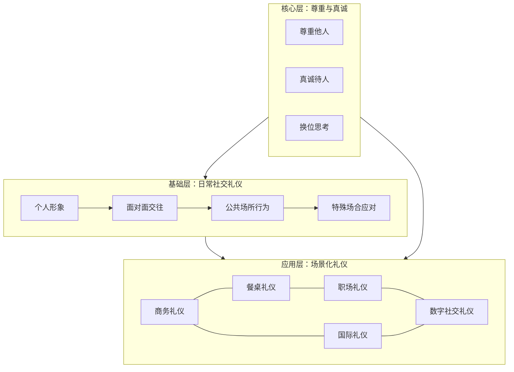

## 本章小结

本章围绕社交礼仪的六大实践领域——日常社交、商务活动、餐桌用餐、职场工作、国际交往和数字社交——展开了一套从入门到精通的完整方案体系。以下从知识回顾、能力整合、实践路线三个维度进行系统总结。

### 一、六大领域核心要点回顾

#### 1.1 日常社交礼仪：打好地基

日常社交礼仪是所有其他礼仪场景的基础。它涵盖个人形象管理（着装、仪容、体态）、面对面交往规范（问候、介绍、握手、名片交换）、公共场所行为准则（电梯、排队、公共交通）和特殊场合应对（婚礼、丧礼、探病）四大模块。核心要义是：**在每一次日常接触中降低人际摩擦成本，通过一致的得体行为建立可信赖的个人形象。**

关键知识点：
- 首因效应决定了前7秒的印象质量，而日常礼仪恰恰决定这7秒的内容
- 握手的力度、时长和目光接触构成一个完整的"信任信号包"
- 公共场所的礼仪本质是"空间共享意识"——你对公共空间的使用方式暴露了你的社会化程度
- 特殊场合（婚礼、丧礼、探病）有严格的行为脚本，违反脚本的代价远高于普通社交场合

#### 1.2 商务礼仪：建立专业信任

商务礼仪是职业人士在商业活动中的行为规范体系，核心功能是通过得体行为传递专业能力、建立信任关系、促成商业合作。它涵盖商务接待（迎接、引导、送别）、商务会议（座次、发言、记录）、商务谈判（开局、磋商、签约）和商务宴请（邀约、点菜、敬酒）四大场景。

关键知识点：
- "对等接待"原则：接待人员的级别应与来访者级别匹配，这是无声的尊重信号
- 会议座次遵循"居中为上、以右为尊、面门为上"三条铁律
- 商务谈判中的礼仪不是"装客气"，而是维持谈判氛围、避免情绪化决策的实用工具
- 商务宴请中"谁点菜、谁买单、谁敬酒"都有明确的权力结构含义

#### 1.3 餐桌礼仪：文化与教养的显影液

餐桌礼仪是社交礼仪中最具文化特异性的领域。中式餐桌礼仪强调座次尊卑、敬酒顺序、筷子禁忌；西式餐桌礼仪强调刀叉使用、餐巾摆放、用餐节奏。无论中西，餐桌礼仪的核心原则一致：**让同桌所有人都感到舒适自在。**

关键知识点：
- 中式座次：面门为尊、以右为上、主客交叉就座
- 西式座次：女主人主导、男女间隔、右进右出
- 敬酒的顺序、角度、措辞构成一套完整的权力语言系统
- 自助餐、下午茶、鸡尾酒会各有独立的行为脚本
- 筷子的八种禁忌（交叉、插饭、指人等）每一条都有文化根源

#### 1.4 职场礼仪：组织生态中的生存法则

职场礼仪覆盖从入职到离职的全生命周期——入职破冰、日常工作协作、上下级沟通、同事相处、会议发言、离职善后。它的特殊性在于：职场礼仪不仅要"得体"，还要适应特定组织的文化基因。

关键知识点：
- 入职第一天的前15分钟决定了你在团队中的初始定位
- 向上沟通（汇报）和向下沟通（布置任务）遵循完全不同的礼仪脚本
- 会议发言的"30秒规则"：前30秒必须亮出核心观点
- 离职礼仪的质量直接影响你在这个行业中的长期口碑
- 办公室的"隐性规则"（茶水间社交、午餐圈子、加班文化）比明文制度更能塑造人际关系

#### 1.5 国际礼仪：跨文化交际的安全指南

国际礼仪的核心不是"学会每个国家的规矩"，而是建立一套跨文化敏感度框架——识别文化差异的维度（权力距离、个人主义/集体主义、不确定性规避），理解对方行为背后的文化逻辑，避免用自己的文化标尺衡量他人的行为。

关键知识点：
- 霍夫斯泰德文化维度理论提供了理解跨文化差异的分析框架
- 欧美礼仪强调个人空间和直接沟通；东亚礼仪强调层级和含蓄
- 中东、东南亚、拉美各有独特的宗教和文化禁忌，触犯的代价可能是合作终止
- 国际商务中的"安全策略"：观察对方行为、遵循对等原则、出错时真诚道歉
- 送礼在不同文化中的含义截然不同——在日本当面拆礼物是失礼，在美国不当面拆是失礼

#### 1.6 数字社交礼仪：屏幕背后的文明底线

数字社交礼仪是21世纪新增的礼仪维度，涵盖即时通讯（微信、邮件）、社交媒体（朋友圈、微博、LinkedIn）、视频会议（Zoom、腾讯会议）和远程协作四大场景。它的核心挑战是：**在缺少肢体语言和语调信息的条件下，如何通过文字、表情符号和响应速度传递尊重和善意。**

关键知识点：
- 微信礼仪的"三不原则"：不发长语音、不在深夜发非紧急消息、不用"在吗？"开场
- 邮件礼仪的"主题行法则"：主题行必须让收件人在不打开邮件的情况下知道需要做什么
- 视频会议的"镜头礼仪"：摄像头角度、背景环境、静音习惯构成你的数字形象
- 社交媒体的"永久性原则"：你发布的每一条内容都可能被永久保存和截图传播
- 远程协作中的"异步沟通礼仪"：尊重时区差异，明确期望响应时间

### 二、六大领域的整合框架

这六个领域不是孤立的知识模块，而是一个有机整体。可以用以下模型理解它们之间的关系：

**底层逻辑：** 日常社交礼仪是所有场景的基础能力。如果你连基本的问候、介绍、握手都不过关，商务礼仪和职场礼仪就无从谈起。商务礼仪和餐桌礼仪在实际场景中高度重叠——商务宴请同时涉及两个领域。国际礼仪是商务礼仪和餐桌礼仪的跨文化延伸。数字社交礼仪则是所有线下礼仪在屏幕上的映射。

**六大领域的共同原则：**

| 原则 | 日常 | 商务 | 餐桌 | 职场 | 国际 | 数字 |
|------|------|------|------|------|------|------|
| 尊重他人 | ✅ | ✅ | ✅ | ✅ | ✅ | ✅ |
| 守时 | ✅ | ✅ | ✅ | ✅ | ✅ | ✅ |
| 换位思考 | ✅ | ✅ | ✅ | ✅ | ✅ | ✅ |
| 适度原则 | ✅ | ✅ | ✅ | ✅ | ✅ | ✅ |
| 文化敏感 | ○ | ✅ | ✅ | ○ | ✅ | ✅ |
| 权力意识 | ○ | ✅ | ✅ | ✅ | ✅ | ○ |

（✅ = 核心要求，○ = 有相关但非核心）

### 三、从知识到能力：实践路线图

知道礼仪规则和能在实际场景中自然运用之间，存在巨大的鸿沟。以下是一条经过验证的实践路线：

#### 3.1 第一阶段：意识觉醒（第1-2周）

目标：建立"礼仪雷达"，开始注意到自己和他人的社交行为模式。

具体做法：
- **行为观察日志**：每天记录3个你观察到的社交互动场景，分析其中的礼仪要素——谁先打招呼？握手时的眼神如何？座次是怎么安排的？记录不必评判对错，重在培养观察力。
- **自我录像**：用手机录一段3分钟的自我介绍视频，回放时关注自己的眼神、手势、语速、微笑频率。大多数人第一次回放都会惊讶——你以为的"自然"和镜头里的"自然"往往差距很大。
- **阅读回顾**：重新快速浏览本章六个子节的内容，用荧光笔标出你目前完全没有做到的条目。

#### 3.2 第二阶段：刻意练习（第3-8周）

目标：将3-5个高频场景的礼仪脚本内化为肌肉记忆。

具体做法：
- **选定高频场景**：根据你的日常生活和工作，选出3-5个你最常遇到的社交场景（例如：日常问候、微信沟通、会议发言、商务午餐、邮件撰写）。
- **脚本编写**：为每个场景写出详细的行为脚本——从进入场景的第一秒到离开的最后一秒，每一步该做什么、说什么、注意什么。
- **角色扮演**：找一位朋友或家人，模拟场景进行练习。录像回放，对比脚本和实际表现的差距。
- **渐进暴露**：从低风险场景开始练习（与熟人），逐步扩展到中风险场景（与同事），最后挑战高风险场景（与领导或客户）。

#### 3.3 第三阶段：场景融合（第9-16周）

目标：在复杂场景中灵活组合多个礼仪模块。

具体做法：
- **复合场景训练**：商务宴请 = 商务礼仪 + 餐桌礼仪 + 数字礼仪（餐前微信沟通、餐后邮件跟进）。刻意在这种复合场景中练习。
- **跨文化实战**：如果有机会接触外国同事或客户，主动承担接待任务，将国际礼仪知识投入实战。
- **复盘机制**：每次重要的社交互动后，花5分钟复盘——哪些做得好？哪些可以改进？下次遇到类似场景你会怎么做？

#### 3.4 第四阶段：内化与超越（第17周以后）

目标：礼仪从"刻意执行"变为"自然流露"，从"遵守规则"升华为"创造体验"。

具体做法：
- **从遵守到创造**：不再机械地执行礼仪脚本，而是根据具体场景和对方的反应灵活调整。此时你不再是"照本宣科"，而是在"临场创作"。
- **从自我到他人**：关注点从"我做得对不对"转移到"对方感受好不好"。真正的礼仪高手让周围的人感到舒适自在，而不是让别人注意到"这个人好有礼貌"。
- **持续迭代**：社交礼仪不是一劳永逸的技能。社会规范在变化（例如20年前不存在的微信礼仪今天已是必修课），你的社交圈在变化，你的身份角色在变化。保持学习的心态，定期更新自己的礼仪知识库。

### 四、常见误区与纠正

在学习和实践社交礼仪的过程中，几乎每个人都会掉入以下陷阱：

| 误区 | 表现 | 纠正方法 |
|------|------|----------|
| **形式主义** | 机械执行礼仪规则，不关注对方感受 | 将关注点从"我做得对不对"转向"对方舒不舒服" |
| **过度礼貌** | 频繁道歉、过分谦虚、不敢表达真实想法 | 礼仪是尊重，不是讨好。适度表达意见反而更受尊重 |
| **选择性应用** | 对上级礼貌、对下属随意 | 真正的礼仪素养体现在你如何对待"对你没用"的人 |
| **文化套用** | 用中国礼仪标准评判外国人的行为 | 建立文化相对主义视角，理解不同文化的行为逻辑 |
| **场景混淆** | 把朋友间的随意带到职场，或把商务的正式带到朋友聚会 | 每个场景都有独立的行为脚本，切换场景时主动调整模式 |
| **忽视数字礼仪** | 认为线上沟通无所谓，随便发 | 数字形象已成为个人品牌的核心组成部分 |
| **一次学完心态** | 试图一次性掌握所有礼仪知识 | 礼仪是终身学习的过程，分阶段、分场景逐步掌握 |

### 五、关键收获与行动清单

学完本章，你应当具备以下能力：

**基础能力（必须掌握）：**
- 能够在日常社交中做出得体的问候、介绍和告别
- 能够根据不同场合选择合适的着装和仪容
- 能够在公共场所遵守基本行为规范
- 能够撰写得体的微信消息和工作邮件

**进阶能力（应当掌握）：**
- 能够独立策划和执行一次商务接待
- 能够在中西式餐桌礼仪中游刃有余
- 能够在职场中建立良好的上下级和同事关系
- 能够在视频会议中展现专业的数字形象

**高阶能力（努力方向）：**
- 能够在跨文化场景中识别差异并灵活应对
- 能够从"遵守规则"升华为"创造舒适体验"
- 能够根据场景和对象灵活组合多个礼仪模块
- 能够指导他人提升礼仪素养

**立即可做的5件事：**
1. 录一段3分钟自我介绍视频，回放观察自己的肢体语言
2. 检查你最近10条微信消息，看看有没有"在吗？"或长语音
3. 回忆最近一次重要社交场合，写下3个可以改进的细节
4. 选定一个你最薄弱的礼仪领域，本周内阅读该子节两遍
5. 下一次社交互动前，花30秒预演你的行为脚本

### 六、核心理念重申

最后，回到社交礼仪的原点：

**礼仪的本质不是规矩，而是尊重。** 外在的形式服务于内在的修养。如果你只记住了本章的一句话，应该是这一句：**让每一个与你互动的人感到被尊重、被重视、被善待——这就是社交礼仪的全部。**

礼仪不是一成不变的教条，而是随着时代和文化不断发展的活的实践。20年前没有人讨论"微信礼仪"，10年前"视频会议礼仪"还不存在，5年前"AI辅助沟通的边界"还是科幻话题。保持学习的心态，在每一次社交互动中觉察、反思、改进——这才是真正的礼仪修养之道。

记住，社交礼仪的终极目标不是让你"看起来"有修养，而是让你"成为"一个让周围人感到舒适自在的人。从今天开始，从下一个社交互动开始。
