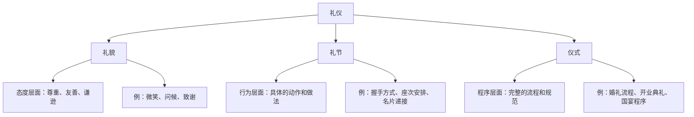
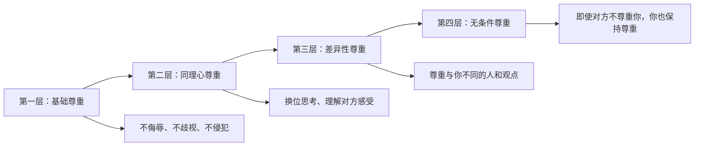
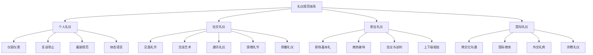

## 一、礼仪的本质与核心原则

礼仪是人类文明最古老的编码系统之一。从三万年前原始部落的问候仪式，到今天商务场合的握手寒暄，礼仪始终在调节人与人之间的关系。理解礼仪的本质和核心原则，不是为了背诵一套僵化的规则，而是为了掌握一种"让人与人之间的互动更顺畅"的底层逻辑。本章将从历史源流、哲学根基、核心原则、功能体系、常见误区等维度，构建对礼仪的完整认知框架。

### 1.1 礼仪的定义与内涵

#### 字源考据

"礼"字最早见于甲骨文，左边是"示"（祭祀的祭台），右边是"豊"（一种祭祀用的器皿）。礼的本义是"敬神的仪式"。《说文解字》释"礼"为"履也，所以事神致福也"——礼是践行，是用来侍奉神灵、祈求福祉的行为。

"仪"字从"人"从"义"，本义是"人的容貌举止"。《说文解字》释"仪"为"度也"——仪是标准、尺度。

两字合为"礼仪"，其内涵经历了三次扩展：

| 时期 | "礼"的范围 | 代表文献 |
|------|-----------|---------|
| 先秦（礼制时代） | 国家制度、等级秩序、祭祀规范 | 《周礼》《仪礼》《礼记》 |
| 汉唐（礼教时代） | 家庭伦理、社会规范、道德教化 | 《孝经》《女诫》《颜氏家训》 |
| 近现代（礼仪时代） | 社交规范、职业行为、国际交往 | 《礼仪概论》等现代教材 |

#### 现代定义

从社会学角度看，礼仪是"一套被特定社会群体共同认可的行为编码系统"。这个定义包含三个关键要素：

- **共同认可**：礼仪不是个人发明的，是群体共识的结果。你一个人鞠躬不构成礼仪，一个群体约定鞠躬表示敬意才构成礼仪。
- **行为编码**：礼仪将抽象的情感和态度（尊敬、感谢、歉意）编码为具体的行为动作（鞠躬、握手、致谢），使他人能够"解码"你的真实意图。
- **社会功能**：礼仪存在的根本目的不是约束人，而是降低社交成本。当所有人都知道"握手表示友好"时，就不需要每次都花时间解释自己的善意。

#### 礼仪与礼貌、礼节的区别

很多人将"礼仪""礼貌""礼节"混为一谈，但三者有明确的层次关系：

**礼貌**是态度——你内心是否尊重他人，外在是否表现出友善。一个微笑、一声"谢谢"，这是礼貌。

**礼节**是行为——在特定场景下应该怎么做。握手时用右手、递名片时文字朝向对方，这是礼节。

**仪式**是程序——一系列礼节按照特定顺序组合成完整的流程。婚礼从迎亲到敬酒的全过程，这是仪式。

**礼仪**是这三者的总称，涵盖从态度到行为到程序的完整体系。

### 1.2 礼仪的历史演变

#### 中国礼仪的发展脉络

中国是世界上最早建立系统礼仪制度的国家。理解中国礼仪的演变，有助于理解为什么今天我们仍然遵循某些看似"无意义"的规矩。

**周公制礼作乐（约公元前11世纪）**：周公旦制定了一套完整的国家礼仪制度，涵盖吉礼（祭祀）、凶礼（丧葬）、军礼（军事）、宾礼（外交）、嘉礼（婚冠）五大类，史称"五礼"。这是人类历史上最早的系统化礼仪体系。周礼的核心理念是"以礼治国"——通过规范每个人的行为来维护社会秩序。

**孔子复礼（公元前6-5世纪）**：春秋时期礼崩乐坏，孔子提出"克己复礼为仁"，将礼仪从外在规范提升为内在修养。孔子的贡献在于：礼不仅仅是遵守规矩，更是培养仁德的途径。这一思想深刻影响了此后两千多年的中国礼仪文化。

**宋代礼仪平民化（10-13世纪）**：朱熹编撰《家礼》，将原本只有贵族才能践行的礼仪简化为平民可以遵循的日常规范。从此，礼仪从精英阶层走向普通百姓。今天我们过年贴春联、清明扫墓、中秋赏月等习俗，很多都定型于宋代。

**近现代转型（20世纪至今）**：鸦片战争后，中国传统礼仪受到西方冲击。民国时期开始引入西方社交礼仪（如握手、先生/女士称呼）。新中国成立后，传统礼仪经历了"破四旧"的断裂期。改革开放以来，礼仪文化进入复兴与融合阶段——既保留了传统礼仪的精髓（如尊老敬贤），又吸收了国际通行的社交规范。

#### 西方礼仪的发展脉络

**古希腊-古罗马时期**：古希腊人重视"arete"（卓越），认为得体的举止是公民美德的体现。古罗马发展出更系统的行为规范，小普林尼的书信集记录了大量罗马贵族的社交礼仪。

**中世纪骑士礼仪（12-15世纪）**：骑士制度催生了一套以荣誉、忠诚、保护弱者为核心的贵族行为规范。"Chivalry"（骑士精神）至今仍是西方礼仪文化的重要源头。

**文艺复兴宫廷礼仪（15-17世纪）**：意大利卡斯蒂利奥内的《廷臣论》（1528年）是西方第一部系统的礼仪手册，定义了理想绅士的行为标准——优雅、博学、谈吐得体、举止从容。

**维多利亚时代礼仪规范化（19世纪）**：英国维多利亚女王时期，礼仪发展到极致。社交规则极其细致，从下午茶的冲泡方法到名片的书写格式都有严格规定。这一时期的礼仪规范通过英帝国的殖民扩张传播到全球。

**现代礼仪民主化（20世纪至今）**：20世纪礼仪的最大变化是"去等级化"。礼仪不再区分贵族与平民，而是成为所有人都可以学习和践行的社会技能。艾米莉·波斯特的《礼仪》（1922年）标志着现代礼仪教育的开端。

#### 东西方礼仪的差异与融合

| 维度 | 东方（以中国为代表） | 西方（以欧美为代表） |
|------|-------------------|-------------------|
| 核心理念 | 和谐（以和为贵） | 个体尊重（personal respect） |
| 等级观念 | 明确的长幼尊卑 | 相对平等 |
| 身体距离 | 较近（东亚例外） | 较远（个人空间大） |
| 直接程度 | 含蓄委婉 | 直接明确 |
| 时间观念 | 灵活（关系优先） | 严格（时间即效率） |
| 礼物文化 | 重视、当面不拆 | 简化、当面拆开感谢 |
| 眼神交流 | 适度（过多被视为挑衅） | 充分（回避被视为不自信） |

在全球化背景下，东西方礼仪正在融合。现代中国商务场合既保留了递名片时双手呈递的传统，又采用了国际通行的握手礼节。理解差异、尊重差异、灵活应变，是当代礼仪素养的重要组成部分。

### 1.3 礼仪的哲学根基

礼仪不是凭空产生的规则，它有深厚的哲学根基。理解这些根基，有助于把握礼仪的"为什么"，而不仅仅是"怎么做"。

#### 中国哲学视角

**儒家：礼即仁之用**

孔子的核心思想是"仁"——对他人的关爱和尊重。礼是仁的外在表现形式。《论语·八佾》中孔子说："人而不仁，如礼何？人而不仁，如乐何？"一个人如果没有仁心，遵守礼节又有什么意义呢？

这意味着：真正的礼仪修养，不在于你记住了多少条规则，而在于你是否培养了对他人的真诚关爱。当关爱成为内在品质时，得体的行为会自然流露。

荀子进一步发展了礼的功能论："礼者，养也"——礼是用来滋养人性的。人性本有欲望和冲动，礼的作用是引导这些欲望走向合理的表达，而不是压抑它们。

**道家：自然之礼**

老子对形式化的礼仪持批判态度："失道而后德，失德而后仁，失仁而后义，失义而后礼。夫礼者，忠信之薄而乱之首。"（《道德经》第三十八章）老子认为，过度强调外在的礼节，恰恰说明内在的真诚已经丧失。

道家的启示是：最高境界的礼仪是"无礼之礼"——不是刻意遵守规则，而是从内心自然流露的善意和尊重。这与儒家"从心所欲不逾矩"的理想是相通的。

**佛家：慈悲为礼**

佛家以慈悲为核心，认为一切众生平等。佛教礼仪（如合掌、问讯、供养）的本质是表达对一切生命的尊重和感恩。佛家的"六和敬"（身和同住、口和无诤、意和同悦、戒和同修、见和同解、利和同均）为群体生活中的礼仪提供了深刻的指导。

#### 西方哲学视角

**亚里士多德的美德论**

亚里士多德认为，美德是"两个极端之间的中道"。礼仪中的适度原则——既不过分热情也不过分冷淡，既不过分谦卑也不过分傲慢——正是亚里士多德"中道"思想的体现。得体的行为是一种需要通过反复实践才能掌握的美德。

**康德的尊重论**

康德提出"人是目的，不仅仅是手段"——每个人都应被当作具有内在价值的存在来对待，而不是被当作实现他人目的的工具。这一思想为礼仪中的"尊重原则"提供了最坚实的哲学基础：我们遵守礼仪，不是因为这样做有好处，而是因为每个人都有被尊重的权利。

**社会契约论视角**

霍布斯、洛克、卢梭等人的社会契约论认为，社会秩序建立在人们自愿让渡部分自由的基础上。礼仪可以被视为一种"微型社会契约"——你遵守不打断他人说话的规则，换来的回报是别人也不打断你说话。这种互惠性是礼仪得以维持的根本动力。

### 1.4 礼仪的四大核心原则

理解了礼仪的定义和哲学根基，我们来深入探讨礼仪的四大核心原则。这四个原则不是并列的，而是有层次关系的：尊重是基础，真诚是灵魂，适度是智慧，自律是保障。

#### 原则一：尊重——礼仪的基石

**为什么尊重是第一原则？**

社会心理学家马斯洛的需求层次理论指出，"尊重需求"是人类仅次于安全需求和归属需求的第三层基本需求。每个人都有被认可、被重视、被尊重的内在渴望。当这种需求得到满足时，人会感到自信和有价值；当这种需求被忽视时，人会感到自卑和愤怒。

礼仪的首要功能，就是满足人们的基本尊重需求。因此，所有礼仪规范的第一条原则都是"尊重"。

**尊重的四个层次**

尊重不是单一的行为，而是一个由浅入深的层次体系：

**第一层：基础尊重**——这是底线，包括不侮辱他人的人格、不歧视他人的身份、不侵犯他人的权利。这是文明社会的基本要求，也是法律的底线。

**第二层：同理心尊重**——能够站在对方的角度思考问题，理解对方的感受和需求。比如，当你看到同事加班到很晚时，不是说"你怎么还没走"（这可能让对方感到压力），而是说"辛苦了，注意休息"（这让对方感到被关心）。

**第三层：差异性尊重**——尊重与你不同的人——不同的文化、信仰、生活方式、价值观念。这比前两层更难，因为它要求你放下"我的方式才是正确的"这种预设。比如，尊重同事的素食选择，即使你认为吃肉很正常；尊重朋友的宗教信仰，即使你不认同。

**第四层：无条件尊重**——这是最高层次。即使对方对你不礼貌，你仍然保持对他的尊重。这不是软弱，而是强大的表现。正如甘地所说："以眼还眼，世界只会更盲目。"在实际社交中，这意味着当对方发脾气时，你不以牙还牙，而是冷静地回应。

**实操指南：如何在日常中体现尊重**

- **记住名字**：名字是一个人最重要的身份符号。记住并正确称呼他人的名字，是最简单也最有效的尊重表达。如果你容易忘记名字，可以在初次见面后立即在手机备忘录中记录对方的名字和特征。
- **认真倾听**：当别人说话时，放下手机、看着对方、适时点头。不打断、不急于反驳、不心不在焉。倾听是最被低估的尊重行为。
- **尊重时间**：准时赴约是尊重对方时间的基本表现。如果迟到，提前告知并真诚道歉。
- **尊重边界**：不问对方收入、不追问隐私、不强迫对方接受你的观点。每个人都有自己的边界，尊重边界就是尊重人。
- **尊重选择**：即使你认为对方的选择是错误的，只要不涉及原则问题，尊重他做自己决定的权利。

#### 原则二：真诚——礼仪的灵魂

**为什么真诚如此重要？**

人类拥有一种被称为"微表情识别"的本能能力。心理学家保罗·艾克曼的研究表明，人类可以在1/25秒内识别出一个假笑——即使对方的嘴角在上扬，眼睛周围的肌肉（眼轮匝肌）没有参与运动时，大脑会自动标记为"不真诚"。

这意味着：虚伪的礼仪比没有礼仪更糟糕。因为虚伪的礼貌不仅没有传递善意，反而传递了"我不在乎你，我只是在演戏"的信息。

孔子两千多年前就洞察了这一点："巧言令色，鲜矣仁。"（《论语·学而》）花言巧语、满脸堆笑的人，很少是真正有仁德的。

**真诚与礼仪形式的关系**

有人会问：既然礼仪要求真诚，那是不是不需要遵守形式了？不是的。真诚和形式不是对立的，而是互补的。

打个比方：语言是一种"形式"——你必须按照语法规则组织词汇，别人才能理解你的意思。但语言本身不是目的，表达思想才是目的。同样，礼仪是一种"行为语法"——它为你的善意提供了可被他人识别的表达方式。

一个内心充满善意但不懂礼仪形式的人，就像一个满腹经纶但不会说话的人——他的好意无法被他人正确接收。反之，一个精通礼仪形式但内心冷漠的人，就像一个口若悬河但言之无物的人——他的礼貌会被识破为虚伪。

**最理想的状态是：以真诚为内核，以礼仪为表达方式。**

**如何培养真诚的礼仪态度？**

- **从感恩开始**：真诚的礼仪源于对他人的感恩——感谢对方花时间与你交流，感谢对方分享知识，感谢对方的信任。当你内心真正感恩时，你的言行自然会变得真诚。
- **关注对方而非自己**：社交焦虑的一个主要原因是"过度自我关注"——总在想"我表现得怎么样？别人怎么看我？"当你把注意力从自己转向对方时，焦虑会减少，真诚会增加。
- **允许不完美**：真诚不要求完美。如果你说错了话，真诚地道歉比假装没发生好得多。如果你不知道答案，说"我不确定，让我查一下"比胡编乱造好得多。
- **练习"有意识的善意"**：每天给自己设定一个小目标——对一个人说一句真诚的赞美。不是敷衍的"你今天真好看"，而是具体的"你今天的演讲逻辑特别清晰，我学到了很多"。

#### 原则三：适度——礼仪的智慧

**为什么适度是最难的原则？**

尊重和真诚相对容易理解，但"适度"是一种需要长期修炼的判断力。它没有固定的公式，需要根据具体情境做出判断。

亚里士多德将"适度"称为"实践智慧"（phronesis）——一种在具体情境中做出正确判断的能力。这种能力不能通过背诵规则获得，只能通过实践和反思来培养。

**适度的五个维度**

| 维度 | 不足的表现 | 适度的表现 | 过度的表现 |
|------|----------|----------|----------|
| 热情度 | 冷漠、敷衍 | 真诚、温暖 | 过分热情、让人窒息 |
| 谦虚度 | 傲慢、自大 | 谦逊、自信 | 过分自贬、失去尊严 |
| 距离感 | 过于亲密、冒犯 | 亲疏得当、舒适 | 过于疏远、拒人千里 |
| 礼物价值 | 不送礼（失礼） | 恰到好处 | 过于贵重（让人有压力） |
| 关注度 | 不关心对方 | 适度关心 | 过度关注（侵犯隐私） |

**如何判断"适度"？**

判断适度有一个简单但有效的标准：**对方的舒适度**。你的行为是否让对方感到舒适？如果对方开始表现出不自在（身体后退、眼神回避、回答变短），说明你可能过度了；如果对方表现出期待更多的互动（主动提问、身体前倾），说明你可能不足。

**实操指南：掌握适度的技巧**

- **镜像法则**：适度模仿对方的行为节奏和热情程度。如果对方说话轻声细语，你也降低音量；如果对方热情开朗，你也可以适度放开。这不是虚伪，而是社交中的"频率对齐"。
- **试探-调整法**：在不确定适度标准时，先以中等程度的行为试探，然后根据对方的反应调整。比如，第一次见面不要一上来就拥抱，先握手，观察对方是否进一步亲近。
- **场景区分法**：不同场景有不同的适度标准。商务会议的适度标准不同于朋友聚会，正式晚宴的适度标准不同于家庭聚餐。在进入一个新的社交场景时，先观察在场其他人的行为标准，然后以此为参照。
- **文化校准法**：在跨文化交际中，适度的标准差异很大。日本人认为鞠躬30度是日常问候的适度角度，而在中国，微微点头就足够了。在不确定时，遵循当地文化的标准。

#### 原则四：自律——礼仪的保障

**为什么自律是必要的？**

礼仪的前三条原则——尊重、真诚、适度——都是在理想状态下应该做到的。但现实是：人有情绪波动、有疲惫时刻、有愤怒冲动。在这些时刻，如果没有自律，礼仪原则就会被抛到脑后。

心理学家沃尔特·米歇尔的"棉花糖实验"证明，自我控制能力是预测一个人未来成功的重要指标。在礼仪领域，自律意味着：即使在情绪低落时，仍然保持基本的礼貌；即使面对无礼的人，仍然不降低自己的标准。

**自律的三个层次**

- **外部约束型自律**：因为有他人在场而遵守礼仪。这是最低层次的自律，也是最不稳定的——一旦无人监督，行为就会走样。
- **习惯型自律**：通过长期练习，将礼仪行为内化为习惯。到了这个层次，得体的行为不需要刻意思考，自然而然就会发生。养成一个习惯平均需要66天（伦敦大学学院的研究数据），持续练习两个月，礼仪行为就能基本内化。
- **价值型自律**：将礼仪视为自我价值观的一部分。到了这个层次，遵守礼仪不是因为习惯，而是因为"这就是我"——一个尊重他人、真诚待人的人，不需要外部监督，因为这是他身份认同的一部分。

**如何培养礼仪自律？**

- **从小事开始**：不要试图一次性改变所有行为。选择一个具体的礼仪习惯（如"每天对三个人说谢谢"），坚持21天，然后增加新的习惯。
- **建立触发机制**：将礼仪行为与特定的触发条件绑定。比如，"每次进入办公室时主动问好""每次收到邮件后24小时内回复""每次用餐前等所有人就座"。
- **设置提醒**：在养成习惯的初期，设置手机提醒或便签提示。比如，在电脑显示器边框贴一个"微笑"的小纸条。
- **找一个礼仪伙伴**：找一个同样想提升礼仪修养的朋友，互相监督、互相反馈。社交承诺的力量远大于个人意志。
- **每日复盘**：每天睡前花两分钟回顾当天的社交互动：哪些做得好？哪些可以改进？这种反思习惯能显著加速礼仪修养的提升。

### 1.5 礼仪的功能体系

礼仪不仅仅是"让人感觉好"的工具，它在个人发展、社会运转、文化传承等方面发挥着系统性的功能。

#### 功能一：社会润滑——降低互动成本

社会学家格奥尔格·齐美尔指出，日常生活中的"仪式性互动"（如问候、致谢、道歉）构成了社会运转的微观基础。这些看似微不足道的礼节行为，实际上承担着重要的社会功能：

- **信号功能**：一声"你好"传递的信息是"我看到你了，我承认你的存在，我对你没有敌意"。这种信号大大降低了人际互动的不确定性。
- **缓冲功能**：当冲突发生时，礼仪提供了缓冲空间。"对不起，我可能理解错了你的意思"这句话给了双方一个台阶，避免了冲突的升级。
- **协调功能**：在多人互动中，礼仪提供了协调机制。"请您先说""这位是张总"这些礼节用语帮助确定了发言顺序和介绍顺序，避免了混乱。

#### 功能二：个人品牌——塑造社会形象

在职场和社会交往中，礼仪素养是个人品牌的核心组成部分。它影响着他人对你的第一印象和长期评价。

**第一印象的影响力**：心理学家所罗门·阿希的经典实验证明，第一印象一旦形成，就具有很强的稳定性和持续性。而第一印象的形成，55%来自非语言行为（仪态、表情、手势），38%来自声音（语调、语速），只有7%来自语言内容。这意味着，你"怎么做"远比你"说什么"重要。

**职场中的礼仪溢价**：根据人力资源管理协会（SHRM）的调查，78%的雇主表示，礼仪素养是影响晋升决策的重要因素。在同等能力条件下，礼仪素养更好的人获得晋升的概率高出约30%。

#### 功能三：心理锚定——增强内心秩序感

遵守礼仪规范对遵守者本人也有积极的心理效应：

- **减少社交焦虑**：当你知道在特定场合应该如何表现时，不确定性降低，焦虑感随之减少。礼仪为社交提供了一张"导航地图"。
- **增强自我效能感**：每一次得体的社交互动都是对自我能力的正面确认。这种累积的正面确认会增强你的自信心和自我效能感。
- **创造秩序感**：在一个充满不确定性的世界里，礼仪提供了一种可预测的行为框架。知道"明天的商务宴请应该穿什么、说什么、做什么"，会让人感到安心。

#### 功能四：文化基因——传承价值观

礼仪是文化的"活化石"。许多文化价值观不是通过文字传承的，而是通过一代代人的礼仪实践传承的。

- 中国人过年给长辈拜年，传承的是"孝"的价值观。
- 日本人鞠躬时弯腰的角度区分了尊敬的程度，传承的是"等级秩序"的价值观。
- 犹太人在安息日点蜡烛，传承的是"信仰"的价值观。

当一种礼仪消失时，它所承载的文化价值观往往也随之淡化。因此，了解和传承传统礼仪，不仅仅是学习行为规范，更是保护文化基因。

### 1.6 礼仪的规范体系概览

礼仪不是一盘散沙，而是一个有结构的规范体系。了解这个体系的全貌，有助于建立系统性的礼仪知识框架。

这个体系将在后续章节中逐一展开。每个分支都有其独特的原则和技巧，但都建立在本章所述的四大核心原则之上——尊重、真诚、适度、自律。

### 1.7 常见误区与纠正

学习礼仪最容易犯的错误不是"不知道规则"，而是"理解错了本质"。以下是六个最常见的礼仪误区：

**误区一：礼仪就是繁文缛节**

很多人一提到礼仪，就想到繁琐的规矩和仪式，觉得这是过时的、无用的。实际上，现代礼仪的核心是"让他人感到舒适"，而不是"遵守繁琐的规矩"。如果一条礼仪规则让所有人都感到不自在，那它就不是好礼仪——它是繁文缛节，可以也应该被淘汰。

**误区二：礼仪是虚伪的**

"我就是直性子，有什么说什么"——很多人把无礼当作真诚。但真正的真诚不等于口无遮拦。你可以真诚地表达不同意见，但表达方式应该是尊重的。"你这个方案有很多问题"和"你这个方案的整体思路很好，我有几个建议可以进一步完善"——两者可能表达的是同一个意思，但效果完全不同。

**误区三：礼仪只在正式场合需要**

有些人认为只有在商务会议、正式晚宴等场合才需要注意礼仪，日常生活中不需要。实际上，礼仪的核心价值恰恰体现在日常生活中。对家人的一声"谢谢"、对服务员的一个微笑、对陌生人的一次让路——这些日常礼仪才是真正的修养体现。

**误区四：好的礼仪就是一味迁就**

尊重不等于没有原则。好的礼仪是在尊重他人的前提下，清晰地表达自己的立场和边界。"谢谢你的邀请，但这次我无法参加"——这是有礼貌的拒绝，比勉强答应然后心生怨气好得多。

**误区五：礼仪标准全球统一**

很多人学习了一些"国际礼仪"规则后，就认为这些规则在全球通用。实际上，礼仪标准高度依赖文化背景。在某些文化中，看着对方的眼睛表示尊重；在另一些文化中，这被视为挑衅。在跨文化交际中，最重要的不是记住具体规则，而是保持开放心态和学习意愿。

**误区六：学礼仪就是学技巧**

有些人把礼仪当作一套可以速成的技巧——背诵几句客套话、学会几种握手方式。但真正的礼仪修养是内在品质的外在流露，无法速成。技巧可以学，修养需要时间。与其花时间记忆100条礼仪规则，不如花时间培养尊重、真诚、自律的内在品质。

### 1.8 进阶：礼仪的心理学与神经科学基础

对于希望深入理解礼仪"为什么有效"的读者，这一节提供更深层的科学视角。

#### 镜像神经元与社交共鸣

1996年，意大利帕尔马大学的贾科莫·里佐拉蒂教授发现了镜像神经元——当我们观察他人执行某个动作时，大脑中与执行该动作相同的区域会被激活。这意味着，当你看到别人微笑时，你的大脑会自动"模拟"微笑的动作，从而产生愉悦感。

这解释了为什么礼仪行为具有传染性：当你对别人微笑时，对方的镜像神经元会被激活，他们也会不自觉地微笑。当你对别人表现出尊重时，对方也会倾向于对你表现出尊重。礼仪不仅仅是一种行为规范，更是一种利用大脑机制的社交策略。

#### 催产素与信任建立

催产素被称为"信任荷尔蒙"。研究表明，友善的社交互动（如温暖的眼神交流、得体的身体接触）会促进催产素的分泌，从而增加信任感和亲近感。这意味着，恰当的礼仪行为不仅在心理层面建立信任，还在生理层面——通过调节荷尔蒙分泌——促进信任关系的形成。

#### 前额叶皮层与自我控制

自律原则的神经基础在于前额叶皮层——大脑中负责计划、判断和自我控制的区域。前额叶皮层在25岁左右才完全成熟，这解释了为什么年轻人在礼仪自律方面往往不如年长者。好消息是，前额叶皮层具有可塑性，通过持续的练习和自我控制训练，可以增强其功能。每天练习自律的礼仪行为，实际上是在"锻炼"你的前额叶皮层。

### 1.9 本章小结

本章从六个维度构建了对礼仪的完整认知框架：

- **定义维度**：礼仪是一套被群体共同认可的行为编码系统，涵盖礼貌（态度）、礼节（行为）、仪式（程序）三个层次。
- **历史维度**：中国礼仪从周公制礼到现代融合，经历了从国家制度到个人修养的演变；西方礼仪从骑士精神到现代民主化，经历了从等级特权到全民素养的转变。
- **哲学维度**：儒家强调"仁礼合一"，道家追求"自然之礼"，亚里士多德倡导"中道"，康德主张"人是目的"——东西方哲学殊途同归，都指向"真诚的尊重"。
- **原则维度**：尊重是基石、真诚是灵魂、适度是智慧、自律是保障——四者构成完整的礼仪修养体系。
- **功能维度**：礼仪是社会润滑剂、个人品牌、心理锚定和文化基因。
- **科学维度**：镜像神经元、催产素、前额叶皮层为礼仪的有效性提供了神经科学解释。

记住：礼仪不是一套需要死记硬背的规则，而是一种需要持续修炼的生活态度。当你把尊重、真诚、适度、自律内化为自己的品质时，得体的行为会自然流露——这才是礼仪的最高境界。

***

> **下一章预告**：理解了礼仪的本质与原则之后，下一章将进入具体的个人礼仪领域——仪容仪表与言谈举止，探讨如何通过外在形象和行为细节展现内在修养。
