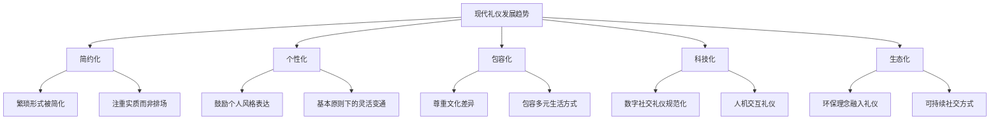

## 二、礼仪的起源与发展

要真正理解现代社交礼仪，不能只学"怎么做"，还要知道"为什么这样做"。礼仪不是某个天才拍脑袋发明的规则，而是人类数千年社会协作中自然演化出来的行为协议。了解它的起源与发展，能帮你在跨文化交流中做出更得体的判断——当你知道一条规矩的来龙去脉，就不会在该变通时死守教条，也不会在该尊重传统时轻率冒犯。

### 2.1 礼仪的起源：从生存本能到社会契约

#### 2.1.1 原始社会的礼仪萌芽

礼仪的产生远早于文字和国家的出现。人类学和考古学研究表明，早在旧石器时代晚期（约4万年前），智人群体中就已经出现了具有礼仪性质的行为模式。

**宗教祭祀：最早的"仪式行为"**

原始人类面对雷电、洪水、猛兽等无法理解的自然力量，产生了恐惧和敬畏。为了"安抚"这些力量，祭祀行为应运而生。考古证据显示：

- 距今约7万年的南非布隆博斯洞穴（Blombos Cave）中发现了赭石刻画的符号，被认为与某种仪式行为有关
- 距今约3万年的欧洲旧石器时代洞穴壁画中，有大量描绘舞蹈和狩猎仪式的场景
- 中国山顶洞人遗址（约1.8万年前）中发现了撒有赤铁矿粉的墓葬，说明当时已有丧葬仪式

这些祭祀活动中的跪拜、献祭、禁忌等行为，是礼仪最原始的形态。祭祀不仅满足了心理需求，更重要的是它要求参与者遵守统一的行为规范——什么时候跪、怎么献祭、谁有资格主持——这些规范就是礼仪的雏形。

**图腾崇拜：群体认同的行为标签**

人类学家涂尔干（Émile Durkheim）在《宗教生活的基本形式》中指出，图腾崇拜是人类最早的社会组织形式之一。不同部落以鹰、熊、蛇、狼等动物为图腾，围绕图腾形成了严格的行为规范：

- 同一图腾群体内禁止通婚（外婚制）
- 食用图腾动物有特殊禁忌和仪式
- 部落成员在图腾柱前行特定礼节
- 不同部落见面时需要展示各自的图腾标识以表明身份

图腾崇拜的核心功能是**群体识别**——在没有文字和国旗的时代，仪式行为就是你属于哪个群体的"身份证"。这种通过行为规范建立群体认同的逻辑，至今仍是社交礼仪的核心功能之一。

**血缘关系：辈分秩序的起源**

随着氏族社会的形成，基于血缘关系的等级秩序逐渐确立。英国人类学家拉德克利夫-布朗（A.R. Radcliffe-Brown）对安达曼群岛原住民的研究发现，即使在最原始的社会中，也存在明确的亲属称谓和相应的行为规范：

- 对长辈使用特定的问候方式
- 对平辈和晚辈有不同的行为距离
- 食物分配遵循特定的长幼顺序
- 特定亲属之间有回避禁忌（如翁媳回避）

这些基于血缘的行为规范，是后来一切等级礼仪的基础。当你理解"尊老"最初是生存策略（老人拥有经验和知识），就不会把它简单地看作"封建残余"。

**生存协作：分工催生规则**

在狩猎采集社会中，群体协作是生存的必要条件。人类学家对现存狩猎采集部落（如非洲的昆桑人、北极的因纽特人）的研究表明，原始协作中蕴含着丰富的礼仪萌芽：

- 狩猎前的祈祷和禁忌仪式（统一行动节奏）
- 猎物分配的固定规则（减少内部冲突）
- 信号系统（手势、声音、烟雾）的使用规范（确保沟通有效）
- 营地内的空间分配规则（长者、妇女、儿童各有位置）

这些规则看似简单，但解决了一个根本问题：**如何让一群有利己本能的个体愿意合作？** 答案是通过共同遵守的行为规范建立信任。这个逻辑，与今天商务礼仪中"守时、守信、尊重约定"的本质完全一致。

#### 2.1.2 农业革命与礼仪制度化

约1万年前的农业革命（Neolithic Revolution）彻底改变了人类的生活方式。定居、农业和私有制的出现，使社会结构急剧复杂化，也催生了制度化的礼仪体系。

**定居生活带来的新问题**

游牧采集群体中，人际关系相对简单——人少，流动性大，冲突可以靠"离开"解决。但定居农业社会面临全新的挑战：

| 问题 | 游牧采集社会 | 农业定居社会 |
|------|-------------|-------------|
| 人口规模 | 20-50人的小群体 | 数百至数千人的聚落 |
| 财产概念 | 几乎无私有财产 | 土地、房屋、牲畜等私有财产 |
| 社会分层 | 相对平等 | 出现首领、祭司、农民、工匠等分化 |
| 冲突解决 | 靠迁移回避 | 必须在固定空间内共存 |
| 知识传承 | 口耳相传即可 | 需要系统化的知识和规范传递 |

这些问题都需要更复杂的行为规范来解决。于是，礼仪从自发的、零散的行为习惯，逐渐演变为系统化的制度。

**早期文明的礼仪制度**

苏美尔文明（约公元前4500年）是人类最早的城市文明之一，也是最早将礼仪制度化的社会。苏美尔泥板文书记载了详细的社交规范：觐见国王时的跪拜礼节、神庙祭祀的程序、商业交易的仪式等。古埃及的礼仪制度更为完备，从法老的宫廷礼仪到平民的丧葬仪式，都有严格的规范。

中国的礼仪制度化始于夏商时期。殷墟出土的甲骨文中有大量关于祭祀仪式的卜辞，记录了祭祀的时间、地点、祭品、程序等详细信息。这些卜辞表明，商代已经有了相当系统化的礼仪规范。

#### 2.1.3 文字的出现与礼仪的记录传播

文字的发明（约公元前3200年）是礼仪发展史上的分水岭。在此之前，礼仪只能靠口耳相传和行为示范来传承；有了文字，礼仪规范可以被精确记录、系统整理和远距离传播。

**世界各文明的早期礼仪文献**

- **古埃及**：《亡灵书》（Book of the Dead，约公元前1550年）记录了死者在来世需要的咒语和仪式，实质上是丧葬礼仪的操作手册
- **古巴比伦**：《汉谟拉比法典》（约公元前1754年）不仅是法律文献，也包含了大量社交行为规范，如债务纠纷的处理程序、婚姻的缔结仪式等
- **古印度**：《梨俱吠陀》（约公元前1500年）和后来的《摩奴法典》详细规定了宗教仪式、种姓交往规范和日常生活准则
- **古中国**：甲骨文和金文中大量祭祀记录，以及后来的《周礼》《仪礼》《礼记》三部经典，构成了世界上最完整的礼仪文献体系
- **古希腊**：荷马史诗《伊利亚特》和《奥德赛》中描绘了大量社交场景，反映了古希腊的礼仪规范

文字的出现还产生了一个重要效果：**礼仪标准化**。当不同地区的人阅读同一份礼仪文献时，行为规范开始趋同。这与今天国际商务礼仪标准化的逻辑如出一辙。

### 2.2 中国传统礼仪的发展：从周公到现代

中国是世界上礼仪文化最发达的文明体之一。中国礼仪的发展经历了奠基、制度化、繁荣、僵化和重构五个阶段，每个阶段都有其独特的历史背景和文化特征。

#### 2.2.1 先秦时期：礼仪体系的奠基

**周公制礼作乐**

中国礼仪文化的第一个高峰出现在西周初期（约公元前1046年）。周公旦在辅佐成王期间，制定了一套系统的礼仪制度，史称"周公制礼作乐"。这套制度的核心是**五礼体系**：

| 礼仪类别 | 内容 | 功能 | 现代对应 |
|---------|------|------|---------|
| 吉礼 | 祭祀天地、祖先、社稷 | 敬天法祖，维系信仰 | 国庆典礼、祭祖扫墓 |
| 凶礼 | 丧葬、灾荒、疾病 | 表达哀悼，凝聚人心 | 葬礼、慰问、降半旗 |
| 军礼 | 出征、凯旋、阅兵 | 振奋士气，维护纪律 | 阅兵式、军事仪式 |
| 宾礼 | 朝聘、会盟、接待 | 维护邦交，展示国力 | 国宴、外交礼宾 |
| 嘉礼 | 婚嫁、冠礼、宴饮 | 庆贺喜事，增进关系 | 婚礼、成人礼、宴会 |

五礼体系奠定了中国礼仪文化的基本框架，其核心逻辑是：**通过规范化的仪式行为来维护社会秩序和人际关系**。这个逻辑贯穿了中国礼仪文化的整个发展历程。

**百家争鸣中的礼仪思想**

春秋战国时期（公元前770-221年），社会剧变促使思想家们重新审视礼仪的本质和功能。主要流派的观点形成了鲜明对比：

- **儒家**：孔子（公元前551-479年）是先秦礼仪思想的集大成者。他提出"克己复礼为仁"，认为礼仪是通向道德完善的必经之路。孔子的核心主张包括：
  - **仁礼统一**："人而不仁，如礼何？"——没有内心的仁爱，外在的礼仪只是空壳
  - **礼和为贵**："礼之用，和为贵"——礼仪的最终目的是实现人际和谐
  - **四勿原则**："非礼勿视，非礼勿听，非礼勿言，非礼勿动"——礼仪应渗透到日常行为的方方面面
  - **因时制宜**："礼，与其奢也，宁俭"——礼仪应注重实质而非排场

- **孟子**（公元前372-289年）继承并发展了孔子的思想，提出"辞让之心，礼之端也"，认为礼仪源于人类天生的道德情感（恻隐、羞恶、辞让、是非），是人性中善的自然流露。

- **荀子**（约公元前313-238年）则从社会功能的角度论述礼仪，认为"礼者，养也"——礼仪是调节人的欲望、分配社会资源的工具。荀子的"性恶论"认为人性本恶，礼仪是约束人性、维护秩序的必要手段。

- **道家**：老子和庄子对儒家礼仪持批判态度。老子认为"失道而后德，失德而后仁，失仁而后义，失义而后礼"，把礼仪视为道德堕落的产物。庄子更进一步，认为礼仪是对人性的束缚。

- **法家**：韩非子认为礼仪教化效率低下，主张以法律和赏罚来规范行为。

这三种态度——肯定（儒家）、否定（道家）、超越（法家）——构成了中国传统礼仪思想的基本格局，其张力延续至今。

#### 2.2.2 秦汉时期：礼仪的国家化

**秦的统一与标准化**

秦始皇统一六国后（公元前221年），不仅推行"书同文、车同轨"，也试图统一礼仪制度。秦朝以法家思想治国，对礼仪的态度是工具性的——礼仪服务于国家权力。

**汉代的儒学国教化**

汉代是中国礼仪制度化的关键时期。汉武帝（公元前141-87年在位）采纳董仲舒的建议，"罢黜百家，独尊儒术"，儒家礼仪正式成为国家正统。这一转变的影响包括：

- **三礼经典的确立**：《仪礼》《周礼》《礼记》被奉为礼仪权威文献，成为后世所有礼仪制度的理论基础
- **礼官制度**：朝廷设立太常寺等专门机构管理礼仪事务，礼官成为重要的官职
- **礼仪下沉**：礼仪从贵族阶层逐步扩展到普通百姓。汉代乡饮酒礼等基层礼仪活动，使儒家礼仪深入民间
- **婚礼六礼的确立**：纳采、问名、纳吉、纳征、请期、亲迎，这套婚礼程序从汉代确立后延续了两千多年

#### 2.2.3 唐宋时期：礼仪的繁荣与国际化

**唐代：开放包容的礼仪文化**

唐代（618-907年）是中国礼仪文化的繁荣期。唐代礼仪的特点是**开放性和国际化**：

- **多元融合**：唐代长安是当时世界上最大的国际都市，胡人、波斯人、日本人、新罗人云集于此。唐代礼仪吸收了大量外来文化元素，如佛教的合掌礼、胡人的跪拜礼等
- **法律化**：《唐律疏议》将大量礼仪规范上升为法律条文，违礼行为可能受到法律制裁
- **系统化**：《大唐开元礼》（732年）是中国古代最完备的礼仪法典，共150卷，涵盖吉凶宾军嘉五礼的全部内容
- **对外传播**：日本的遣唐使将唐代礼仪带回日本，直接影响了日本的宫廷礼仪和武士道精神。朝鲜和越南也大量借鉴唐代礼仪制度

**宋代：礼仪的平民化**

宋代（960-1279年）在唐代基础上进一步发展，最重要的变化是**礼仪的平民化**：

- **朱熹《家礼》**：南宋理学家朱熹（1130-1200年）编写的《家礼》，将复杂的国家礼仪简化为普通家庭可以执行的日常规范，涵盖冠礼、婚礼、丧礼、祭礼四大类。这部著作使礼仪真正走入了千家万户
- **理学影响**：宋代理学强调"存天理，灭人欲"，使礼仪规范更加严格。程颐提出"饿死事小，失节事大"，虽然极端，但反映了宋代对礼仪规范的高度重视
- **市民文化**：宋代城市经济繁荣，出现了大量描述市民社交生活的文献，如《东京梦华录》《梦粱录》，记录了当时丰富的社交礼仪实践

#### 2.2.4 明清时期：礼仪的规范化与僵化

明清时期（1368-1912年），礼仪制度进一步规范化，但也出现了明显的僵化趋势：

- **明代**：朱元璋编纂《大明集礼》，力图恢复周礼的传统。明代礼仪的特点是等级森严，不同身份的人在服饰、住宅、出行等方面都有严格规定
- **清代**：《大清通礼》是清代礼仪的集大成之作。清代礼仪融合了满汉文化，但在形式上更加繁琐
- **"三纲五常"的极端化**：君为臣纲、父为子纲、夫为妻纲的绝对化，使礼仪从促进和谐的工具变为压抑个性的枷锁
- **形式主义泛滥**：繁文缛节越来越多，礼仪的精神实质被淹没在形式之中

这一时期的礼仪，虽然在制度上更加完备，但在精神上逐渐偏离了孔子所倡导的"仁"的本质。正如清代思想家戴震所批评的："酷吏以法杀人，后儒以理杀人。"

#### 2.2.5 近现代：礼仪的变革与重构

**晚清民国：冲击与转型**

鸦片战争（1840年）后，中国传统礼仪面临前所未有的挑战：

- **外交礼仪冲突**：清廷坚持外国使臣见皇帝必须行跪拜礼，而西方国家坚持平等的鞠躬或握手礼。这种冲突背后是两种世界观的碰撞——中国的"天朝上国"观念与西方的主权平等观念
- **五四运动的批判**：1919年的五四运动对传统礼教进行了猛烈批判。鲁迅在《狂人日记》中把传统礼教比作"吃人"，代表了当时知识分子对僵化礼教的深刻反思
- **新生活运动**：1934年蒋介石发起的"新生活运动"试图融合中西礼仪，建立新的国民行为规范

**新中国：平等化重构**

1949年新中国成立后，传统等级礼仪被废除，建立了以平等为核心的新行为规范：

- 废除跪拜、作揖等旧式礼节，提倡握手、鞠躬
- 称呼上以"同志"代替"老爷""太太"等旧称
- 婚礼简化，废除彩礼等旧习
- 丧礼简化，提倡火葬

**改革开放以来：中西融合**

改革开放以来，中国礼仪文化进入新的发展阶段：

- 传统礼仪中合理的部分（如尊老爱幼、谦虚谨慎）得到继承
- 西方礼仪中优秀的元素（如女士优先、守时观念）被吸收
- 商务礼仪、国际礼仪的需求急剧增长
- 形成了具有中国特色的现代礼仪体系

### 2.3 西方礼仪的发展历程

#### 2.3.1 古希腊罗马时期：公民礼仪的起源

**古希腊：优雅与智慧的结合**

古希腊（公元前800-146年）是西方礼仪的发源地之一。与东方礼仪强调等级秩序不同，古希腊礼仪更注重**公民身份和理性精神**：

- **公民大会礼仪**：雅典民主制度下，公民在大会上发言有严格规范——不能侮辱他人、不能离题、不能重复他人观点。这是最早的"公共讨论礼仪"
- **款待礼仪（Xenia）**：古希腊人高度重视对客人的款待。主人需要提供食物、 bath、礼物，客人则需要表达感谢并遵守主人家的规矩。违背款待礼仪被视为对神灵的冒犯
- **体育竞技礼仪**：奥林匹克运动会（始于公元前776年）不仅有竞技规则，还有行为规范——运动员必须裸体参赛以示公平，裁判的判决不可质疑
- **柏拉图和亚里士多德的社交哲学**：柏拉图在《理想国》中讨论了不同社会阶层的行为规范；亚里士多德在《尼各马可伦理学》中提出"中道"（Golden Mean）思想——过度和不足都是恶德，美德在于适度

**古罗马：法律化的社交规范**

古罗马（公元前753年-476年）继承并发展了希腊的礼仪文化，其最大特点是**法律化**：

- **宴请文化**：罗马贵族的宴会（convivium）是社交的核心场合。宴会有严格的座次安排——主人坐在主位，最尊贵的客人坐在其右侧。用餐程序分为三道：前菜（gustatio）、主菜（primae mensae）、甜点（secundae mensae）
- **演说术（Rhetorica）**：罗马重视公共场合的言辞表达。西塞罗（Cicero）的《论演说家》是演说礼仪的经典之作，提出了演讲的五要素：发明（inventio）、安排（dispositio）、风格（elocutio）、记忆（memoria）、表达（pronuntiatio）
- **法律规范**：罗马法对社交行为有详细规定，如《十二铜表法》规定了邻里关系、财产权利、人身保护等方面的规范
- **接待外国使节的礼仪**：罗马发展出了复杂的外交礼宾制度，包括使节的接待规格、谈判程序、条约签署仪式等

#### 2.3.2 中世纪：骑士精神与宫廷礼仪

**骑士精神（Chivalry）的兴起**

中世纪（约500-1500年）的欧洲，骑士精神成为社交礼仪的重要基础。骑士精神并非一开始就是温文尔雅的——它最初是一套武士行为准则，后来逐渐演变为贵族社交规范：

| 骑士精神的核心价值 | 原始含义 | 演变后的社交含义 |
|------------------|---------|----------------|
| 忠诚（Loyalty） | 对领主的军事效忠 | 信守承诺、恪守约定 |
| 勇气（Courage） | 战场上的无畏 | 面对困难不退缩 |
| 慷慨（Generosity） | 赏赐下属战利品 | 乐于助人、大方得体 |
| 礼貌（Courtesy） | 宫廷中的行为规范 | 对他人尊重、举止优雅 |
| 荣誉（Honor） | 维护武士的尊严 | 注重个人信誉和社会评价 |

骑士精神中对女性的保护和尊重（"宫廷爱情"传统），直接影响了后来的"女士优先"原则。

**法国宫廷：礼仪的极致**

中世纪后期到近代早期，法国宫廷成为欧洲礼仪的中心。路易十四（1643-1715年在位）的凡尔赛宫是宫廷礼仪的巅峰：

- **起床仪式（Lever du Roi）**：国王起床是一场精心设计的仪式，由不同等级的贵族分别服侍不同的环节——最高等级的贵族才有资格递上国王的衬衫
- **用餐仪式**：宫廷宴会的程序极为繁琐，从座位安排到上菜顺序、从餐具使用到餐巾折叠，每一个细节都有严格规定
- **社交等级**：在凡尔赛宫中，能否与国王说话、说话时使用什么称谓、在舞会中的位置，都取决于贵族的等级

路易十四将宫廷礼仪政治化——通过控制礼仪细节来控制贵族，使贵族们忙于争抢礼仪特权而无暇挑战王权。这种"以礼仪控权"的策略，在中国历史上也屡见不鲜。

#### 2.3.3 文艺复兴时期：礼仪的人文化

文艺复兴时期（约14-17世纪），人文主义思想兴起，礼仪从宫廷走向更广泛的社会阶层。这一时期最重要的发展是**礼仪书籍的出现**：

**卡斯蒂廖内的《廷臣论》（1528年）**

意大利作家巴尔达萨雷·卡斯蒂廖内（Baldassare Castiglione）的《廷臣论》（Il Libro del Cortegiano）是文艺复兴时期最具影响力的礼仪著作。书中提出了一个核心概念——**sprezzatura（轻松的优雅）**：

> 真正的优雅在于表现出毫不费力的样子，仿佛一切优秀品质都是天生的，不需要刻意努力。

这个概念对西方礼仪美学影响深远。它告诉我们：好的礼仪不是让人觉得你受过训练，而是让人觉得你天生如此。

《廷臣论》还提出了理想绅士的标准：
- 精通骑术、剑术、游泳、舞蹈等技能
- 懂得绘画、音乐、诗歌等艺术
- 在社交中谦逊但不卑微，自信但不傲慢
- 善于根据场合调整自己的言行

**其他重要礼仪文献**

- 德拉·卡萨（Giovanni della Casa）的《礼范》（Galateo，1558年）——面向普通人的社交指南
- 埃拉斯谟（Erasmus）的《男孩的礼貌教育》（De civilitate morum puerilium，1530年）——面向儿童的礼仪教育

#### 2.3.4 维多利亚时期：礼仪的系统化与中产阶级化

19世纪维多利亚时代（1837-1901年）的英国，是西方礼仪系统化的黄金时期。工业革命催生了一个庞大的中产阶级，他们迫切需要一套行为规范来区别于"粗俗"的工人阶级，同时模仿"高雅"的贵族。

**维多利亚时代礼仪的特点**

- **详细的规则**：从着装到用餐、从拜访到通信，每一个社交场景都有明确的规则。例如，拜访时应先递名片，由仆人转交；如果主人不在家，应留下名片的一角折叠表示本人来访
- **复杂的餐具**：正式晚宴可能使用十几种不同的刀叉杯碟，每种都有特定用途
- **社交季（London Season）**：每年春季的社交季是上流社会展示礼仪的舞台，包括舞会、赛马、花园派对等
- **"绅士"概念**：维多利亚时代的"绅士"不仅是社会阶层标签，更是一套行为标准——守信、谦逊、克制、对弱者有保护意识

**重要礼仪文献**

- 比顿夫人（Mrs. Beeton）的《家务管理之书》（1861年）——不仅是烹饪指南，也包含大量社交礼仪规范
- 艾米丽·波斯特（Emily Post）后来在美国延续了这一传统，她的《礼仪》（1922年）至今仍在更新

#### 2.3.5 20世纪至今：礼仪的民主化与全球化

20世纪以来，礼仪经历了深刻的变革：

**两次世界大战的影响**

- 一战摧毁了欧洲的贵族社会基础，宫廷礼仪失去了载体
- 二战后，美国成为西方文化的主导力量，美式礼仪（更随意、更实用）逐渐取代英式礼仪成为主流

**民权运动的影响**

- 种族平等运动改变了跨种族交往的礼仪规范
- 女性解放运动挑战了"女士优先"的传统——部分女性认为这是"保护性歧视"
- 多元文化主义要求对不同文化的礼仪保持敏感和尊重

**数字时代的挑战**

- 电子邮件、短信、社交媒体创造了全新的礼仪场景
- "秒回"是否礼貌？"已读不回"是否失礼？这些问题没有传统答案
- 视频会议中的礼仪（是否开摄像头、虚拟背景是否合适等）在新冠疫情期间被广泛讨论

### 2.4 其他文明的礼仪传统

#### 2.4.1 印度礼仪传统

印度是世界上最古老的连续文明之一，其礼仪传统深受印度教、佛教和伊斯兰教的影响，形成了极其丰富的礼仪体系。

**种姓制度与礼仪**

传统的瓦尔纳（Varna）种姓制度规定了不同种姓之间的交往礼仪。虽然1950年印度宪法废除了种姓歧视，但种姓对社交行为的影响至今仍在：

- 不同种姓之间有传统的饮食禁忌（高种姓不与低种姓共食）
- 婚姻中种姓匹配仍是重要考虑因素
- 在农村地区，种姓对日常社交行为的影响更为明显

**宗教仪式**

印度教的宗教仪式（Samskara）贯穿人的一生，共16种主要仪式：

- 出生仪式（Jatakarma）：父亲在新生儿耳边低语祈祷
- 命名仪式（Namakarana）：出生后第11-12天举行
- 入学仪式（Upanayana）：男孩在8-12岁间举行，标志正式开始学习
- 婚礼（Vivaha）：印度最隆重的仪式，持续数天
- 丧礼（Antyeshti）：火葬为主，仪式复杂

**日常礼仪**

- **合十礼（Namaste）**：双手合十于胸前，微微鞠躬。"Namaste"的字面意思是"我向你内在的神性致敬"，这是一种深层次的尊重表达
- **触足礼（Pranama）**：年轻人触摸长辈的脚以示尊敬
- **饮食规范**：许多印度人遵循素食传统，用餐时用右手（左手被视为不洁）

#### 2.4.2 伊斯兰礼仪传统

伊斯兰文明的礼仪体系以《古兰经》和圣训（Hadith）为权威来源，覆盖了生活的方方面面。

**核心礼仪规范**

- **问候**："As-salamu alaykum"（愿平安降临于你）是穆斯林的标准问候，回应为"Wa alaykum as-salam"（也愿平安降临于你）
- **饮食**：清真（Halal）饮食规范禁止猪肉、血液、酒精，动物屠宰需遵循特定仪式
- **礼拜**：每日五次礼拜（Salat）是穆斯林的基本义务，礼拜前需净身（Wudu）
- **右手原则**：吃饭、握手、递物都用右手，左手用于个人卫生
- **个人卫生**：先知穆罕默德强调清洁是信仰的一半，穆斯林有详细的卫生规范

**社交规范**

- 异性之间的交往有明确的界限（不同教派和地区的严格程度不同）
- 拜访他人时应先敲门或按门铃，等待主人允许后才进入
- 做客时应尊重主人的饮食习惯
- 谈话时应避免背后议论他人（Ghibah，被视为严重的罪行）

#### 2.4.3 日本礼仪传统

日本礼仪是世界上最细致、最系统化的礼仪体系之一，深受中国儒家文化和本土神道文化的影响。

**鞠躬（お辞儀，Ojigi）**

鞠躬是日本最核心的礼仪行为，其角度和时长表达不同程度的尊重：

| 鞠躬角度 | 名称 | 适用场合 |
|---------|------|---------|
| 15度 | 会釈（Eshaku） | 日常见面、同事之间 |
| 30度 | 敬礼（Keirei） | 商务场合、初次见面 |
| 45度 | 最敬礼（Saikeirei） | 正式场合、对重要人物 |

**等级意识（上下関係）**

日本社会中的等级关系在社交中有极其严格的体现：

- **前辈后辈（先輩後輩）**：同一学校或公司中，早进入的人为前辈，后进入的人为后辈。后辈对前辈要使用敬语，在前辈面前行为要更加谦逊
- **上下级关系**：公司中对上司使用敬语是基本要求，下班后的饮酒聚会中也需要注意等级
- **内外关系（ウチソト）**：对"自己人"（ウチ）和"外人"（ソト）使用不同的语言和行为方式

**茶道（茶の湯）**

茶道是日本礼仪文化的精髓，由千利休（1522-1591年）集大成。茶道的精神概括为四个字："和、敬、清、寂"：

- **和（Harmony）**：人与人、人与自然的和谐
- **敬（Respect）**：对一切事物的尊重
- **清（Purity）**：身心的清净
- **寂（Tranquility）**：内心的宁静

茶道不仅是喝茶，更是一种通过仪式化行为来修炼内心的方式。每一个动作——擦拭茶具、搅拌抹茶、递送茶碗——都有精确的规范，而这些规范的目的不是限制自由，而是通过外在的秩序来培养内在的专注和平静。

#### 2.4.4 非洲礼仪传统

非洲大陆拥有极其多样的礼仪传统，以下是一些共性特征：

- **长老尊重**：几乎所有非洲文化都高度重视对长老的尊重。在许多社区中，年轻人在长老面前不能交叉双腿、不能直视长辈的眼睛
- **问候的重要性**：非洲许多文化中，见面时的问候是一个冗长的过程——不仅要问对方好，还要问对方的家人、健康、工作等。匆忙跳过问候被视为极大的失礼
- **右手原则**：与伊斯兰文化类似，许多非洲文化中右手用于社交，左手用于个人卫生
- **口头传统**：由于许多非洲文化长期没有书面文字，礼仪规范通过口头故事、谚语和仪式来传承

#### 2.4.5 拉丁美洲礼仪传统

拉丁美洲的礼仪融合了原住民文化、西班牙/葡萄牙殖民文化和非洲文化：

- **热情的身体接触**：拉美人之间的社交距离比欧美人更近，拥抱（abrazo）、亲吻面颊是常见的问候方式
- **时间观念**：拉丁美洲的"弹性时间"（la hora latina）文化——社交场合迟到15-30分钟是可以接受的
- **家庭优先**：家庭在拉丁美洲文化中占据核心地位，社交活动常常以家庭为单位
- **尊重长者**：与亚洲文化类似，对长者的尊重是拉丁美洲礼仪的核心

### 2.5 现代礼仪的融合与创新

#### 2.5.1 全球化对礼仪的双重影响

全球化使得不同文化的礼仪以前所未有的速度接触、碰撞和融合。这种影响是双向的：

**趋同化趋势**

- 国际商务场合普遍采用握手、交换名片、守时等规范
- 国际组织（如联合国、奥运会）建立了标准化的礼仪程序
- 英语成为国际礼仪交流的通用语言

**差异化意识增强**

- 人们对文化差异的意识和敏感度显著提高
- "文化智商"（Cultural Intelligence, CQ）成为国际商务的重要能力
- 企业越来越重视跨文化礼仪培训

**冲突与调和**

不同文化礼仪的碰撞有时会产生误解甚至冲突。经典案例包括：

- 日本的"是"（はい）不一定是同意，可能只是表示"我在听"——西方人常常误解
- 中东地区竖起大拇指在某些语境下是侮辱性手势
- 巴西人交谈时的身体接触让北欧人感到不适
- 中国人在餐桌上给客人夹菜是热情好客，但西方人可能觉得不卫生

处理这些差异的关键不是记住每个国家的规则清单，而是培养**文化同理心**——能够站在对方的文化立场上理解其行为的含义。

#### 2.5.2 数字时代的新型礼仪

互联网和移动通信技术创造了全新的社交场景，也催生了全新的礼仪问题：

**电子邮件礼仪**

- 主题行要明确具体，不要空着或写"你好"
- 回复邮件的合理时间窗口：工作邮件24小时内，紧急邮件4小时内
- "全部回复"功能要谨慎使用
- 邮件中的语气容易被误读，正式场合避免使用讽刺和幽默

**即时通讯礼仪**

- 工作群中的消息要简洁、有实质内容
- 语音消息的长度不宜超过1分钟
- "在吗？"不是好的开场白——直接说事更高效
- 非紧急消息不要在深夜或节假日发送

**社交媒体礼仪**

- 不要在公开平台上讨论他人的隐私
- 转发他人内容时应注明出处
- 避免在社交媒体上进行激烈的公开争论
- 注意信息的真实性，不传播未经证实的内容

**视频会议礼仪**

- 准时进入会议室，提前测试设备
- 非发言时关闭麦克风
- 注意背景环境的整洁
- 保持目光接触——看摄像头而非屏幕

**AI时代的新兴礼仪问题**

随着AI工具（如ChatGPT等）的普及，新的礼仪问题正在浮现：

- 使用AI生成的邮件或文案是否应该告知对方？
- 在AI辅助下完成的工作如何界定个人贡献？
- 与AI助手交互时的礼貌用语是否必要？

这些问题目前尚无公认的答案，但随着AI的普及，相关的社会规范将逐渐形成。

#### 2.5.3 礼仪发展的未来趋势

展望未来，礼仪发展呈现以下趋势：

- **简约化**：繁琐的形式将进一步简化，更加注重实质。婚礼从繁琐的仪式变为个性化的庆祝，商务礼仪从等级森严的程序变为高效务实的交流
- **个性化**：在遵守基本原则的前提下，鼓励个人风格的表达。"适合你的就是最好的"正在取代"必须这样做"
- **包容化**：对不同文化、不同生活方式的尊重将成为礼仪的核心。性别平等、文化多元、残障友好等理念正在融入礼仪规范
- **科技化**：数字社交礼仪将占据越来越重要的地位，人机交互礼仪也将成为新的研究领域
- **生态化**：环保和可持续发展理念将融入礼仪规范——电子请柬替代纸质请柬、绿色葬礼替代传统葬礼、低碳出行成为社交共识

### 2.6 从历史看礼仪的本质：为什么礼仪不会消失

纵观礼仪数千年的发展史，可以提炼出几个核心认知：

**第一，礼仪的本质是降低社交成本。** 人类社会的运转需要大量的人际协作，而协作需要信任。礼仪通过提供一套双方都理解的行为预期，降低了交往中的不确定性和摩擦成本。当你知道对方会怎么做（因为你们遵守同一套礼仪），你就不需要每次都从零开始试探和博弈。

**第二，礼仪的形式会变，但功能不变。** 从原始部落的图腾仪式到现代商务的握手交换名片，形式天差地别，但功能始终是：标识身份、表达尊重、建立信任、减少冲突。理解这一点，你就不会在面对陌生的礼仪规范时手足无措——只需要问自己：在这个场景中，怎样的行为能表达尊重、建立信任？

**第三，礼仪的僵化是它的最大敌人。** 中国明清时期、欧洲维多利亚时期，都是礼仪形式极度发达但精神实质逐渐丧失的时期。当礼仪变成"必须遵守的繁文缛节"而非"发自内心的尊重表达"时，它就走向了反面。这也是为什么每次礼仪的大发展都伴随着一次对旧礼仪的反思和革新。

**第四，跨文化礼仪能力将成为21世纪的核心素养。** 在全球化和数字化的双重推动下，每个人都可能与不同文化背景的人交往。理解礼仪的多样性，不是为了记住100个国家的1000条规则，而是为了培养一种能力——**在陌生的社交场景中，快速识别对方的行为逻辑，并调整自己的行为以建立良好的关系**。

这就是了解礼仪发展史的现实意义：不是为了炫耀知识，而是为了在复杂多变的社交世界中，拥有更强的理解力和适应力。
