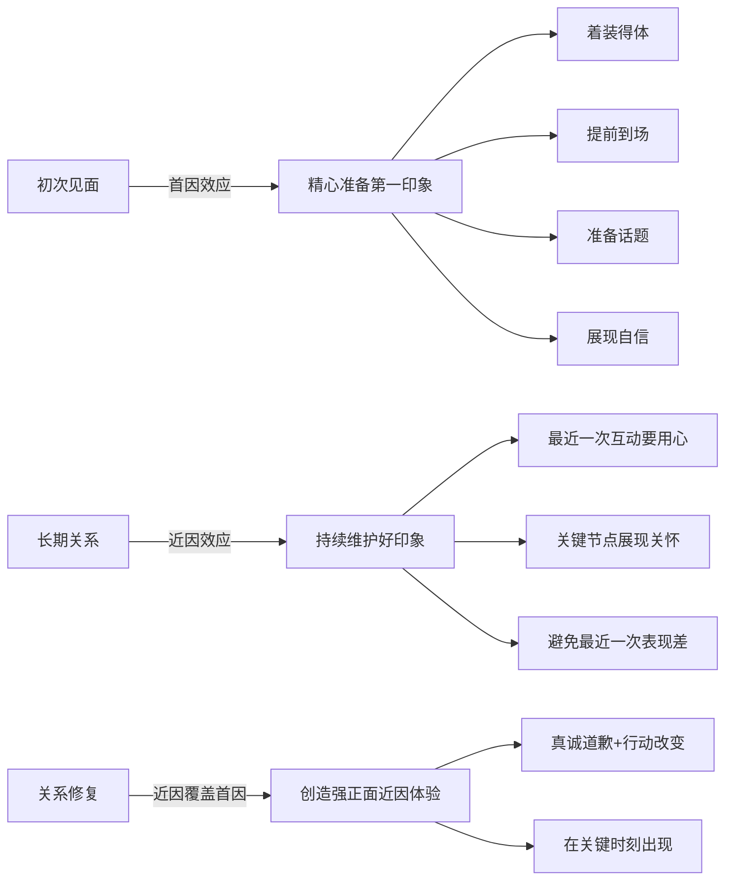
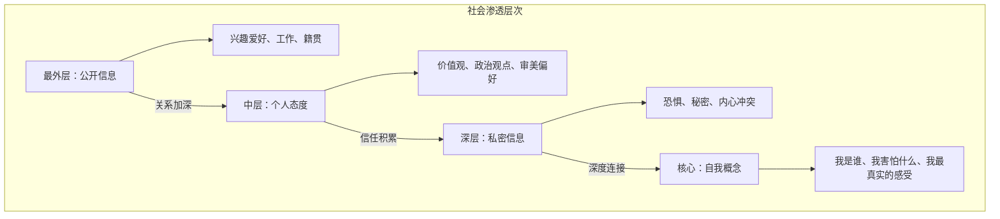
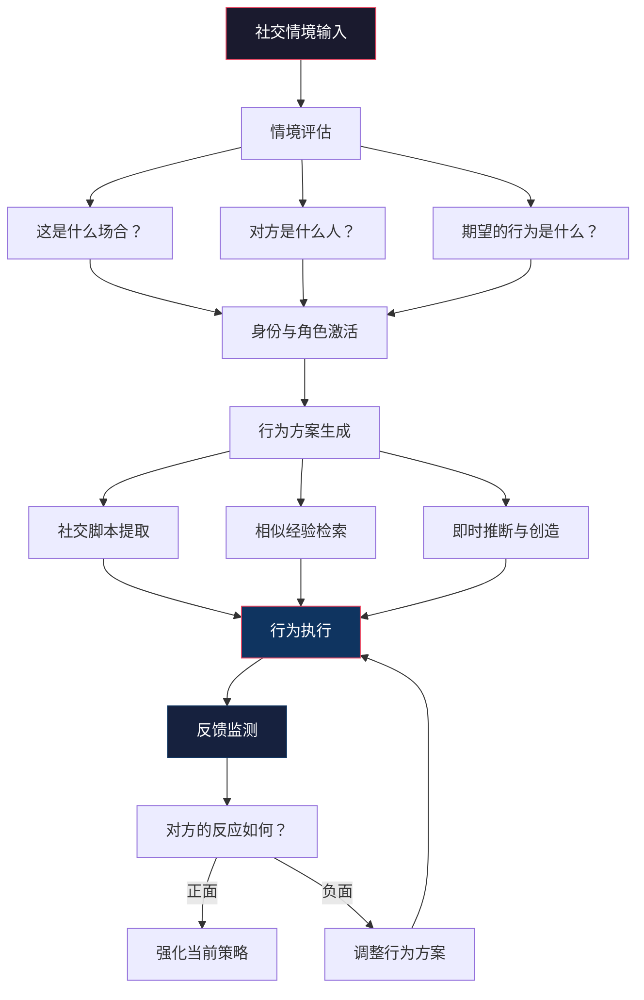

## 三、社交心理学基础

社交礼仪不是一套外在的表演技巧，而是对人类社交心理规律的深度理解和自然应用。为什么同样的举动在不同场合效果截然不同？为什么有些人天生"会说话"而另一些人怎么努力都显得生硬？答案藏在社交心理学中。

本章系统梳理与社交礼仪密切相关的心理学理论——从个体如何管理印象、如何建立吸引，到群体如何影响行为、认知如何产生偏差——帮助你不仅"知道怎么做"，更"理解为什么这样做"，从而在任何场景中灵活应变、游刃有余。

```mermaid
graph TD
    A[社交心理学基础] --> B[印象管理理论]
    A --> C[社会交换与互惠机制]
    A --> D[人际吸引与关系建立]
    A --> E[情绪与共情机制]
    A --> F[认知偏差与社交判断]
    A --> G[深层心理需求与动机]
    A --> H[群体心理与社会认同]

    B --> B1[戈夫曼戏剧理论]
    B --> B2[首因效应/近因效应]
    B --> B3[晕轮效应]

    C --> C1[互惠原则]
    C --> C2[面子理论]
    C --> C3[社会认同理论]

    D --> D1[相似性/互补性/接近性]
    D --> D2[自我表露]
    D --> D3[依附理论]

    E --> E1[情绪感染]
    E --> E2[社交焦虑]
    E --> E3[共情能力]

    F --> F1[确认偏差]
    F --> F2[归因偏差]
    F --> F3[投射效应]

    G --> G1[马斯洛需求层次]
    G --> G2[自我决定理论]
    G --> G3[归属需求]

    H --> H1[从众心理]
    H --> H2[群体极化]
    H --> H3[社会助长/抑制]

    style A fill:#1a1a2e,stroke:#e94560,color:#fff
    style B fill:#16213e,stroke:#0f3460,color:#fff
    style C fill:#16213e,stroke:#0f3460,color:#fff
    style D fill:#16213e,stroke:#0f3460,color:#fff
    style E fill:#16213e,stroke:#0f3460,color:#fff
    style F fill:#16213e,stroke:#0f3460,color:#fff
    style G fill:#16213e,stroke:#0f3460,color:#fff
    style H fill:#16213e,stroke:#0f3460,color:#fff
```

---

### 3.1 印象管理理论

#### 3.1.1 戈夫曼的戏剧理论

社会学家欧文·戈夫曼（Erving Goffman）在1959年出版的《日常生活中的自我呈现》中提出了戏剧理论（Dramaturgical Theory），将社会交往类比为戏剧表演。这一理论是理解社交礼仪最核心的心理学框架之一。

**核心概念：**

| 概念 | 定义 | 礼仪中的体现 |
|------|------|-------------|
| **前台**（Front Stage） | 在他人面前展示的公开形象，遵循社会期望的行为规范 | 商务会议、正式晚宴、初次见面 |
| **后台**（Back Stage） | 私下放松、卸下面具的空间 | 家中独处、亲密朋友间的相处 |
| **印象管理**（Impression Management） | 有意识地控制他人对自己的印象 | 着装选择、言辞斟酌、表情管理 |
| **剧班**（Team） | 合作维持某种特定情境定义的一群人 | 家庭成员在外人面前、同事在客户面前 |
| **舞台设置**（Setting） | 表演所需的物理环境和道具 | 餐厅布置、办公空间、着装风格 |
| **外表**（Appearance） | 表演者呈现的外在特征 | 服装、发型、配饰、妆容 |

**深层原理：**

戈夫曼指出，人们在社交中面临的根本问题是"定义情境"（Definition of the Situation）。当你走进一个房间，你和在场的其他人都在快速判断：这是什么场合？我们应该如何互动？彼此的角色是什么？礼仪就是对这些情境定义的标准化回应。

当情境定义被破坏时——比如有人在葬礼上大笑、在会议室里打游戏——就会产生"尴尬"（Embarrassment）。尴尬是一种社会信号，表明当前的互动秩序被打破。得体的礼仪行为可以：

1. **预防尴尬**：通过遵守规范避免破坏情境定义
2. **修复秩序**：当尴尬发生时，通过道歉、自嘲等方式重建互动秩序
3. **传递信号**：通过得体行为表明自己理解并尊重当前情境的规则

**实践应用——前台管理清单：**

- 着装：根据情境定义选择合适的"戏服"——商务正装是董事会的戏服，休闲装是朋友聚会的戏服
- 语言：正式场合用敬语和完整句式，轻松场合用口语化表达
- 身体语言：站姿、坐姿、手势都需要符合情境期待
- 情绪表达：在前台控制负面情绪的展示，将积极情绪放大

**关键提醒：** 印象管理不等于虚伪。戈夫曼强调，所有的社会互动都包含表演成分——这本身就是社会运作的基本机制。得体的印象管理是一种社交能力，就像演员的表演能力一样，是可以通过学习和练习来提升的。

#### 3.1.2 首因效应与近因效应

**首因效应（Primacy Effect）**

由心理学家所罗门·阿希（Solomon Asch）在1946年的经典实验中证实。首因效应指人们在初次接触时形成的印象会深刻且持久地影响后续判断。

具体数据和机制：

- **7秒法则**：心理学研究表明，人们在初次见面的7秒内就会形成对他人的第一印象。普林斯顿大学的Janine Willis和Alexander Todorov在2006年的研究中发现，人们在仅100毫秒的暴露时间内就能对可信度做出判断，而且延长暴露时间并不会显著改变这个判断
- **8-10次正面接触**：改变第一印象平均需要8-10次正面接触，这意味着第一次搞砸了，后面要花8-10倍的努力来弥补
- **信息加权**：最先接收到的信息权重最大。如果一个人第一次见面迟到20分钟，后续每次准时到达都很难完全消除"不守时"的印象
- **信息整合模式**：人们倾向于把后续信息整合进已有的印象框架中，而非重新评估

第一印象的构成要素及其权重（基于多项社会心理学研究的综合数据）：

| 要素 | 权重占比 | 关键信号 |
|------|---------|---------|
| 外表与着装 | 55% | 整洁度、合身度、场合适配度 |
| 肢体语言 | 38% | 眼神接触、微笑、姿态、握手力度 |
| 言语内容 | 7% | 开场白的质量、声音的清晰度和语调 |

**近因效应（Recency Effect）**

近因效应指最近的接触对印象的影响。在长期关系中，近因效应的重要性可能超过首因效应。其机制在于：

- 短期记忆中的信息更容易被提取
- 人们对远期记忆存在遗忘，近期记忆更加鲜活
- 在判断他人时，最近一次的互动体验往往主导评价

**首因-近因效应的综合运用策略：**

#### 3.1.3 晕轮效应

晕轮效应（Halo Effect）由心理学家爱德华·桑代克（Edward Thorndike）于1920年首次提出。它指人们倾向于根据某一方面的特征来推断其他方面——一个人在某个维度上的积极评价会"扩散"到其他维度。

**具体表现：**

- 外表整洁的人被认为更有能力（"颜值即正义"的心理机制）
- 说话有条理的人被认为逻辑思维强
- 守时的人被认为更值得信赖
- 某一项特长突出的人被认为全面发展

**反面——恶魔效应（Horn Effect）：**

与晕轮效应相对，恶魔效应指某一方面的负面特征会影响对整体的判断：

- 一次迟到可能被贴上"不靠谱"的标签
- 衣着邋遢可能被认为能力不足
- 一次失言可能被认为"没教养"

**在社交礼仪中的应用：**

1. **建立正面晕轮**：在初次见面时展示一项突出优势（得体的着装、清晰的表达、真诚的微笑），让这一优势的光环辐射到其他方面
2. **避免负面晕轮**：特别注意那些容易产生"恶魔效应"的行为——迟到、不整洁、不礼貌的服务员态度（对服务员的态度是判断人品的重要信号）
3. **警惕自身偏差**：意识到自己也会被晕轮效应影响，在评价他人时注意区分"光环"和"实质"

#### 3.1.4 自我监控理论

心理学家马克·斯奈德（Mark Snyder）于1974年提出的自我监控理论（Self-Monitoring Theory），补充了戈夫曼的框架。该理论将人分为两种类型：

| 类型 | 特征 | 社交表现 | 礼仪影响 |
|------|------|---------|---------|
| **高自我监控者** | 敏锐感知社交线索，灵活调整行为 | 在不同场合表现差异大，适应性强 | 礼仪表现好但可能显得"八面玲珑" |
| **低自我监控者** | 行为主要由内在态度和价值观驱动 | 表现一致性高，不太随场合改变 | 礼仪表现稳定但可能缺乏灵活性 |

**关键启示：** 社交礼仪的修炼方向不是简单地变成高自我监控者，而是培养"情境智慧"——知道在什么场合需要调整多少，既保持真诚又不失灵活。完全不顾场合只做自己是社交障碍，完全迎合场合失去自我是社交表演，最理想的状态是"有意识的自然"。

---

### 3.2 社会交换与互惠机制

#### 3.2.1 互惠原则

社会交换理论（Social Exchange Theory）由乔治·霍曼斯（George Homans）和彼得·布劳（Peter Blau）等人在20世纪60年代系统发展。该理论认为，人际关系本质上是一种交换关系——人们像做交易一样评估社交互动中的"收益"和"成本"。

**互惠原则（Reciprocity Principle）是社会交换的核心驱动力：**

- **强制性互惠**：人类学家马塞尔·莫斯（Marcel Mauss）在《论礼物》中指出，互惠不是一种选择，而是一种社会义务。收到礼物不回礼、受到帮助不回报，在任何文化中都被视为严重的社交失礼
- **不对等互惠**：交换不需要完全等价，但需要在大致相当的范围内。回礼明显太轻被视为轻视对方，明显太重则让人产生压力
- **延迟互惠**：回报不必立即发生，可以是"人情账户"的形式——今天我帮你的忙，你欠我一个人情，未来某个时刻兑现

**互惠在礼仪中的具体体现：**

| 互惠场景 | 具体行为 | 心理机制 |
|---------|---------|---------|
| 收到邀请 | 及时回复，尽可能出席 | 出席本身就是对邀请者的"回报" |
| 受到款待 | 在适当的时间回请，规格大致相当 | 维持关系中的交换平衡 |
| 收到礼物 | 表达感谢，适时回赠 | 礼物是关系的"物质载体" |
| 受到帮助 | 真诚感谢，寻找机会回报 | 人情是社会关系的"货币" |
| 收到赞美 | 接受并表达感谢，适度回赞 | 社交中隐性的"情感交换" |
| 获得信息分享 | 主动分享自己知道的相关信息 | 知识交换建立互信 |

**互惠的高级策略——主动给予：**

最有效的社交策略不是等待别人先给，而是主动给予。罗伯特·西奥迪尼（Robert Cialdini）在《影响力》中记录了一个经典实验：实验者在等待区主动给陌生人一杯可乐，之后请求购买彩票，购买率比直接请求高出一倍。

在社交中，主动给予包括：
- 主动分享有用的信息和资源
- 主动为他人介绍人脉
- 主动提供力所能及的帮助
- 主动给予真诚的赞美和认可

**注意边界：** 互惠不等于讨好。过度的给予会让人产生压力和疑虑："他为什么对我这么好？"健康的互惠是自然的、渐进的，建立在真实关系基础上的。

#### 3.2.2 面子理论

面子（Face）是理解社交行为，尤其是东亚文化社交行为的关键概念。社会学家欧文·戈夫曼首先将"面子"引入学术讨论，而后由斯特拉·廷图米（Stella Ting-Toomey）发展为面子协商理论（Face-Negotiation Theory）。

**面子的三个维度：**

| 维度 | 定义 | 典型场景 |
|------|------|---------|
| **正面面子**（Positive Face） | 希望被他人认可、喜欢和尊重的需求 | 渴望被赞美、被需要、被接纳 |
| **负面面子**（Negative Face） | 希望自主行动、不被他人干涉的需求 | 不想被命令、被强迫、被侵犯隐私 |
| **面子威胁**（Face Threat） | 对他人面子的损害行为 | 公开批评、当众拒绝、无视他人意见 |

**面子功夫（Facework）的两种策略：**

1. **维护性面子功夫**：通过得体的礼仪行为预防面子损失
   - 对他人的意见表示尊重，即使不同意
   - 在公开场合给予他人表现的机会
   - 避免在他人面前直接拒绝或批评
   - 用委婉语替代直接否定（"这个想法很有意思，不过也许我们可以考虑..."）

2. **修复性面子功夫**：在面子已经受损后的补救措施
   - 真诚道歉，承认自己的失误
   - 给对方台阶下（"可能是我表达得不够清楚"）
   - 通过后续行为重建面子（用行动证明改变）

**中国文化中的面子运作机制：**

在中国文化语境中，面子有其独特的运作逻辑：

- **面子的公共性**：面子是在公共场合"挣"和"丢"的，私下给面子和公开给面子的效果完全不同
- **面子的可传递性**：如果你在公共场合贬低了A的朋友B，A也丢了面子，因为你们的关系本身是A社会网络的一部分
- **给面子的艺术**：主动让对方在重要人物面前"有面子"是最高级的社交礼仪。具体做法包括：在重要场合提及对方的成就、在决策中征询对方意见、在他人面前表达对对方的尊重
- **面子与里子**：高级社交能力体现在既给对方面子（满足公开形象需求），又给对方面子（满足内在尊重需求）

#### 3.2.3 社会认同理论

社会认同理论（Social Identity Theory）由亨利·泰弗尔（Henri Tajfel）和约翰·特纳（John Turner）在1979年提出，解释了群体归属如何影响个体行为。

**核心机制：**

人们通过三个步骤建立社会认同：
1. **社会分类**（Social Categorization）：将自己和他人归入不同群体——"我们"vs."他们"
2. **社会认同**（Social Identification）：认同某个群体并采纳该群体的行为规范
3. **社会比较**（Social Comparison）：通过与其他群体的比较获得积极的自我评价

**对社交礼仪的深层影响：**

- **群体规范内化**：当你认同一个群体（如某个公司、某个圈子）时，你会自然地采纳该群体的礼仪规范——这不是被迫遵守，而是"这就是我们做事的方式"
- **跨群体礼仪冲突**：不同群体的礼仪规范可能冲突。学术圈的直接反馈风格在商业场合可能显得粗鲁，这就需要"群体间翻译"能力
- **礼仪作为群体身份标志**：你遵守什么礼仪，就在向外界宣告你属于什么群体。法式餐桌礼仪vs.日式餐桌礼仪不是技术差异，而是身份声明
- **入群仪式**：很多群体通过特定的礼仪（暗号、着装要求、行为规范）来测试新人是否"属于"这里

---

### 3.3 人际吸引与关系建立

#### 3.3.1 人际吸引的核心原则

**相似性原则（Similarity-Attraction Paradigm）**

由唐·伯恩（Donn Byrne）在1971年的大量实验中证实：态度、价值观和背景的相似性是预测人际吸引最强的因素之一。

相似性的层次结构（由浅入深）：

| 层次 | 类型 | 示例 | 吸引力影响 |
|------|------|------|-----------|
| 表层 | 人口统计相似 | 年龄、籍贯、学校 | 初始话题破冰 |
| 中层 | 态度价值观相似 | 政治观点、生活态度 | 关系深化的基础 |
| 深层 | 人格特质相似 | 内外向、情绪稳定性 | 长期关系的黏合剂 |
| 最深层 | 核心信念相似 | 人生意义、道德底线 | 灵魂伴侣般的认同 |

**社交中的相似性策略：**

1. **镜像法**（Mirroring）：适度模仿对方的肢体语言、语速和语调。神经科学研究表明，模仿会激活对方大脑中的镜像神经元，产生"这个人和我很像"的感觉。注意：模仿要自然，过度明显的模仿会让人感到被嘲笑
2. **寻找共同点**：在对话中主动寻找共同经历、共同兴趣或共同认识的人——"原来你也是XX大学的！"这类发现会立即拉近距离
3. **价值观共鸣**：比表层共同点更有力的是价值观共鸣。"我也觉得诚信比效率更重要"比"我们都喜欢咖啡"建立的连接更深

**互补性原则（Complementarity Principle）**

罗伯特·温奇（Robert Winch）在1958年提出，互补性在某些条件下也能产生强吸引力。其适用条件：

- 支配型与顺从型的互补（"领导-执行"配对）
- 照顾者与被照顾者的互补
- 风险偏好者的互补（一个谨慎一个冒险，综合决策更优）
- 技能专长的互补（"你擅长技术，我擅长沟通"）

**关键区别：** 相似性主要吸引态度和价值观层面的接近，互补性主要在角色和功能层面起作用。两个价值观完全不同但技能互补的人可以是好搭档，但很难成为好朋友。

#### 3.3.2 接近性原则

物理接近性（Proximity Effect）是人际关系形成的最基础条件之一。利昂·费斯廷格（Leon Festinger）在1950年对MIT学生宿舍的经典研究证明：住得越近的学生，成为朋友的概率越高。

**接近性的现代演变：**

- **物理接近**：同一办公室、同一社区、同一健身房
- **功能接近**：经常在同一个微信群、同一个论坛互动
- **虚拟接近**：社交媒体上的频繁互动创造的"心理接近感"

**社交礼仪的接近性策略：**

- 主动出现在目标社交圈的物理空间中（参加活动、加入社群）
- 创造频繁但低压力的接触机会（点头之交→熟悉→朋友）
- 在虚拟空间保持活跃（高质量的社交媒体互动、有价值的群内分享）

#### 3.3.3 自我表露理论

自我表露（Self-disclosure）是指个体向他人透露个人信息的过程。社会心理学家阿尔特曼和泰勒（Altman & Taylor）在1973年提出的"社会渗透理论"（Social Penetration Theory）将自我表露描述为关系发展的核心机制。

**社会渗透的洋葱模型：**

**自我表露的节奏法则——"乒乓球原则"：**

自我表露应该像打乒乓球一样有来有回，而不是单方面的倾诉。具体规则：

1. **由浅入深**：初次见面分享兴趣爱好和工作背景，不要一上来就聊人生困惑
2. **对等递进**：对方说多少，你说多少。如果对方只分享了工作内容，你就不要突然说起童年创伤
3. **观察反馈**：如果对方对你的表露表现出不适（转移话题、身体后倾、减少眼神接触），说明你表露过度了
4. **渐进式信任**：每次增加一点深度，观察对方的反应，如果对方也相应加深表露，关系就可以继续推进

**自我表露的"甜区"和"雷区"：**

| 阶段 | 适合表露的内容 | 不适合表露的内容 |
|------|--------------|----------------|
| 初识（1-2次接触） | 工作、兴趣、近期活动 | 收入、感情状况、家庭矛盾 |
| 熟悉（多次接触后） | 个人观点、职业困惑、爱好深入 | 严重健康问题、深层恐惧 |
| 朋友（信任建立后） | 人生目标、感情想法、价值观 | 仍在创伤中的经历 |
| 密友（深度信任） | 几乎所有话题 | 仅限个人隐私边界 |

#### 3.3.4 依附理论与社交风格

依附理论（Attachment Theory）最初由约翰·鲍尔比（John Bowlby）用于解释婴儿与照料者的关系，后被扩展到成人社交领域。了解自己的依附类型有助于理解自己在社交中的行为模式。

**四种依附类型及其社交特征：**

| 依附类型 | 核心特征 | 社交表现 | 礼仪建议 |
|---------|---------|---------|---------|
| **安全型** | 信任他人，舒适于亲密 | 自然得体，不刻意讨好也不回避 | 保持现状，是社交的"健康标准" |
| **焦虑型** | 渴望亲密但害怕被抛弃 | 过度热情、频繁联系、容易感到被忽视 | 学会给关系留空间，避免过度表露 |
| **回避型** | 重视独立，对亲密感到不适 | 保持距离、不太主动、回避深入交流 | 练习主动发起互动，适当增加表露深度 |
| **混乱型** | 既渴望又恐惧亲密 | 行为矛盾，时而热情时而疏离 | 寻求专业帮助，在此基础上练习社交 |

**应用价值：** 了解依附类型不是给自己贴标签，而是识别自己在社交中的"自动反应模式"。焦虑型的人可以提醒自己"不需要一直确认对方是否喜欢我"，回避型的人可以提醒自己"主动联系不是软弱的表现"。

---

### 3.4 情绪与共情机制

#### 3.4.1 情绪感染

情绪感染（Emotional Contagion）是指个体自动模仿他人的面部表情、语调和姿势，从而体验到相似情绪的过程。伊莱恩·哈特菲尔德（Elaine Hatfield）在1993年的系统研究中证实了这一现象。

**情绪感染的运作机制：**

1. **无意识模仿**：当你和一个微笑的人交谈时，你的面部肌肉会不自觉地模仿微笑——这个过程在毫秒级别发生，你通常意识不到
2. **面部反馈**：根据"面部反馈假说"（Facial Feedback Hypothesis），面部表情的改变反过来会影响你的情绪体验。做出微笑的表情本身就会让你感觉更积极
3. **自动化过程**：情绪感染主要通过镜像神经元系统自动完成，不需要有意识的决策

**在社交礼仪中的应用：**

- **正面传染**：进入社交场合时带着积极的情绪和真诚的微笑，这种情绪会传染给在场的每一个人——你是"情绪的发射源"
- **控制负面传染**：如果你处于负面情绪中（疲惫、焦虑、愤怒），要么调整好情绪再进入社交场合，要么在无法避免时主动说明状态（"今天有点疲惫，如果我反应慢了请见谅"）
- **领导力中的情绪感染**：在团队社交中，领导者的负面情绪传染力是普通成员的5-7倍（因为注意力的聚焦效应），所以管理者尤其需要管理自己的情绪状态
- **深层感染与浅层感染**：浅层感染只是模仿表情（"假笑"），深层感染是真正感受到对方的情绪。社交高手的区别在于——他们不是表演积极，而是通过内在调节真正传递积极能量

#### 3.4.2 社交焦虑的心理机制

社交焦虑（Social Anxiety）不仅是"害羞"，而是一种有明确心理机制的认知-情绪模式。理解这一机制是克服社交焦虑的第一步。

**社交焦虑的认知三联征（Clark & Wells模型）：**

1. **灾难化预期**："如果我说错话，大家会觉得我是个白痴"
2. **自我聚焦注意**：在社交中过度关注自己的表现（"我刚才的表情是不是很奇怪？"），而忽略了外部环境的真实信号
3. **安全行为**：为了减少焦虑而采取的回避行为（少说话、避免眼神接触、不主动发起对话），但这些行为反而强化了焦虑

**社交焦虑与礼仪的双向关系：**

| 关系方向 | 具体表现 |
|---------|---------|
| 焦虑→失礼 | 紧张导致说话太快、忘记礼节、回避互动 |
| 焦虑→过度礼貌 | 过度道歉、不敢表达意见、过度迎合 |
| 礼仪知识→减焦虑 | 知道"应该怎么做"减少了不确定性带来的焦虑 |
| 礼仪练习→增自信 | 反复练习形成自动化的社交行为模式 |

**基于心理学的社交焦虑应对策略：**

1. **认知重构**：将"如果我说错话大家会嘲笑我"替换为"即使说错话，大多数人也不会太在意，每个人都有说错话的时候"
2. **注意力外移**：把注意力从自我监控转移到对外部的关注——"对方在说什么？""这个环境里有什么有趣的东西？"
3. **行为实验**：故意做一些"可能出错"的事（如主动搭话、发表不同意见），观察实际后果是否和预期一样灾难性。大多数时候，结果远比想象中好
4. **渐进暴露**：从小的社交挑战开始（和收银员多聊两句），逐步增加难度（在小组讨论中发言），建立正向经验积累
5. **接纳而非对抗**：适度的焦虑是正常的——研究表明，中等焦虑水平实际上有助于提高社交表现（耶克斯-多德森定律）。不要试图消除焦虑，学会"带着焦虑行动"

#### 3.4.3 共情能力

共情（Empathy）是指理解和分享他人情感的能力。神经科学研究表明，共情涉及大脑中两个不同的系统：

- **情感共情**（Affective Empathy）：自动"感染"他人的情绪，像镜子一样反映对方的感受
- **认知共情**（Cognitive Empathy）：有意识地理解他人的想法和感受，但不一定产生相同的情绪

**社交礼仪中的共情三层应用：**

| 层次 | 共情类型 | 具体能力 | 实操方法 |
|------|---------|---------|---------|
| 基础层 | 情感共情 | 感知他人的情绪状态 | 观察面部表情、语调变化、肢体语言 |
| 进阶层 | 认知共情 | 理解他人的立场和需求 | 换位思考、假设检验、主动询问 |
| 高级层 | 共情性行动 | 根据理解做出得体回应 | 调整自己的行为以满足他人的情感需求 |

**共情的四步实践法——"SEEK"模型：**

1. **S - Sensing（感知）**：注意对方的情绪信号——微表情、语调变化、沉默的含义。当朋友说"我没事"时，语调低沉可能意味着并不"没事"
2. **E - Empathizing（共情）**：在内心模拟对方的感受——"如果我处在他的位置，我会有什么感受？"这不是猜测，而是真正的想象代入
3. **E - Evaluating（评估）**：判断对方最需要的是什么——是倾听？是建议？是陪伴？还是空间？很多人在社交中的失误不是缺乏共情，而是给了错误类型的回应（对方需要倾听，你却急着给建议）
4. **K - Kind Action（善意行动）**：基于评估结果采取行动。有时一句"我能理解你的感受"比任何建议都有力

**共情的常见误区：**

- **过度共情**：完全"吸收"对方的负面情绪，导致自己情绪崩溃。这不是共情，而是"情绪失控"。健康的共情是理解但不被吞噬
- **共情≠同意**：理解对方的感受不等于认同对方的观点。"我理解你很生气"不等于"你生气是对的"
- **共情≠建议**：大多数情况下，人们需要的不是建议，而是被理解。在给出建议之前，先问："你想让我听你说，还是想让我帮你想办法？"
- **共情≠解决**：不是所有问题都需要解决，有时候对方只是需要有人"看见"自己的感受

#### 3.4.4 情绪调节能力

情绪调节（Emotion Regulation）是社交礼仪的底层能力。詹姆斯·格罗斯（James Gross）的情绪调节过程模型提供了系统框架：

**五种情绪调节策略（按干预时机排列）：**

1. **情境选择**：选择进入或回避特定社交场合。如果你知道自己在聚会上会焦虑，可以先从人数较少的聚会开始
2. **情境修正**：改变社交场合的某些方面。比如选择你熟悉的餐厅举办聚会，或提前到场适应环境
3. **注意力部署**：选择关注什么。在社交中把注意力放在对话内容而非自我表现上
4. **认知重评**：改变对情境的解读。把"大家会评判我"改为"大家都在忙着关注自己"
5. **反应调节**：在情绪已经产生后进行调控。深呼吸、放慢语速、暂停几秒再回应

**最关键的是第四种——认知重评。** 研究表明，认知重评是最有效且副作用最小的情绪调节策略，因为它在情绪产生之前就改变了方向，而反应调节（如压抑情绪）会导致更大的心理压力和更差的社交表现。

---

### 3.5 认知偏差与社交判断

人类的大脑并非客观的信息处理器——它充满了认知捷径和系统性偏差。了解这些偏差，既是社交礼仪的基础（理解为什么人们会有某些反应），也是自我提升的起点（意识到自己的判断可能被扭曲）。

#### 3.5.1 确认偏差

确认偏差（Confirmation Bias）是指人们倾向于寻找、解释和记忆支持自己已有信念的信息。

**在社交中的表现：**

- **第一印象固化**：你对某人的第一印象一旦形成，大脑会自动过滤掉与之矛盾的信息。如果你第一印象认为某人"不友好"，你就会更注意他的冷漠行为而忽略他的友善举动
- **选择性注意**：在社交场合中，人们更关注证实自己预期的信息。如果你认为某个同事不喜欢你，你会特别留意他对你的冷淡，忽略他对你的正常互动
- **关系中的确认偏差**：在亲密关系中，确认偏差会导致"自我实现的预言"——你认为对方会离开，于是表现出焦虑和控制行为，结果真的推动了对方离开

**应对策略：**

1. **"相反证据"练习**：当你对某人形成判断后，主动问自己："有什么证据表明我的判断可能是错的？"
2. **重新评估**：每隔一段时间重新评估你对重要他人的判断，允许新的信息改变你的看法
3. **第三方视角**：想象一个中立的第三方会如何评价这个人和你的互动

#### 3.5.2 归因偏差

归因理论（Attribution Theory）研究人们如何解释行为的原因。归因偏差是指在这个过程中出现的系统性错误。

**基本归因错误（Fundamental Attribution Error）：**

由李·罗斯（Lee Ross）在1977年提出：人们倾向于将他人的行为归因于性格因素，而低估情境因素的影响。

| 场景 | 你的判断（性格归因） | 可能的真实原因（情境归因） |
|------|-------------------|------------------------|
| 对方迟到 | "这个人不守时、不尊重人" | 可能交通堵塞、临时有事 |
| 对方回应冷淡 | "这个人不友好" | 可能身体不适、正在处理紧急事务 |
| 对方说话直接 | "这个人没礼貌" | 可能是文化差异、职业习惯 |
| 对方拒绝邀请 | "这个人不喜欢我" | 可能已有安排、有社交焦虑 |

**自利偏差（Self-Serving Bias）：**

- 成功时倾向于归因于自己的能力："我谈成了这个项目，因为我的沟通能力强"
- 失败时倾向于归因于外部因素："没谈成是因为对方不专业"

**"行动者-观察者效应"：** 同样的行为，自己的行为倾向于用情境解释（"我是因为太忙才忘了回复"），他人的行为倾向于用性格解释（"他忘了回复是因为不在意"）。

**社交中的归因校正方法：**

1. **"三个理由"练习**：当某人的行为让你不舒服时，强迫自己想出至少三种可能的情境解释，而非只想到性格解释
2. **角色互换**：如果同样的行为是自己做的，自己会用什么理由解释？把同样的理解延伸到他人
3. **直接沟通**：与其猜测对方的意图，不如直接温和地询问。"我注意到你今天似乎有些沉默，一切都好吗？"远比在内心编造故事来得有效

#### 3.5.3 投射效应

投射效应（Projection Bias）是指人们倾向于将自己的想法、感受和偏好投射到他人身上，认为他人也会和自己有相同的反应。

**具体表现：**

- **观点投射**：认为别人和自己想的一样——"我觉得这个玩笑很好笑，所以别人也会觉得好笑"
- **情感投射**：认为别人的情绪状态和自己一样——"我很焦虑，所以对方一定也很紧张"
- **需求投射**：认为别人需要自己想要的东西——"我喜欢被人关注，所以对方一定也希望我多关注他"

**对社交礼仪的影响：**

投射效应是很多"好心办坏事"的原因。你以为对方需要建议（因为你自己遇到问题时喜欢寻求建议），但对方可能只是想被倾听。你以为对方喜欢热闹（因为你自己喜欢），但对方可能更享受安静的陪伴。

**应对方法：** 在做出社交决策之前，用一句"我真的知道对方想要什么吗？"提醒自己，然后通过观察和询问来确认，而不是依赖投射。

#### 3.5.4 虚假共识效应与独特性偏差

| 偏差 | 定义 | 社交影响 |
|------|------|---------|
| **虚假共识效应** | 高估他人与自己观点一致的程度 | 认为自己的社交风格是"正常"的，不理解为什么别人会有不同反应 |
| **独特性偏差** | 低估他人经历与自己经历的相似程度 | 过于强调自己的独特性，无法与他人建立共鸣 |

这两个看似矛盾的偏差实际上在不同场景下同时起作用：
- 在观点和判断上，我们倾向于虚假共识（"大家都这么想"）
- 在经历和情感上，我们倾向于独特性偏差（"没有人能理解我的感受"）

#### 3.5.5 光环效应的反面——刻板印象

刻板印象（Stereotype）是晕轮效应的群体版本。人们倾向于将某个群体的特征投射到该群体中的每一个体身上。

**在社交礼仪中的表现：**

- "他是程序员，所以肯定不善社交"
- "她是学艺术的，所以肯定很有个性"
- "他来自那个地区，所以肯定..."

**危害：** 刻板印象会导致两个问题——要么过度简化对他人的认知（忽略了个体差异），要么导致自证预言（对方感受到了你的预期，不自觉地做出了符合预期的行为）。

**应对：** 在社交中采取"个性化关注"策略——把注意力放在眼前这个具体的人身上，而不是他代表的群体上。问"你是做什么工作的？"比假设"你是做什么工作的"更有礼貌，也更有信息量。

---

### 3.6 深层心理需求与社交动机

理解社交行为的深层驱动力，可以让你从"遵守规则"进化到"理解规则背后的逻辑"，从而在新场景中自主推导出得体的行为方式。

#### 3.6.1 马斯洛需求层次在社交中的体现

亚伯拉罕·马斯洛（Abraham Maslow）的需求层次理论为理解社交动机提供了系统框架：

| 需求层次 | 社交中的体现 | 礼仪策略 |
|---------|-------------|---------|
| **生理需求** | 社交场合中的基本舒适感——温度、食物、座位 | 作为主人要确保客人的基本舒适；作为客人要尊重主人的安排 |
| **安全需求** | 社交中的可预测性和安全感——知道该期待什么 | 遵守约定的时间和规则，减少他人的不确定性 |
| **归属与爱** | 被群体接纳、被他人喜欢的需求 | 表达接纳和尊重，创造归属感 |
| **尊重需求** | 被认可、被重视的需求 | 真诚的赞美、征询意见、记住对方的名字和偏好 |
| **自我实现** | 展示最好自我的需求 | 给他人展示才能和价值的机会 |

**关键洞察：** 在社交中，大多数人的主导需求是第三层——归属感。他们最深层的恐惧不是被讨厌，而是被忽视。最好的社交礼仪就是让对方感觉到"被看见"。

#### 3.6.2 自我决定理论

爱德华·德西（Edward Deci）和理查德·瑞安（Richard Ryan）提出的自我决定理论（Self-Determination Theory）指出，人类有三种基本心理需求：

1. **自主性（Autonomy）**：感到自己的行为是自主选择的，而非被迫的
2. **胜任感（Competence）**：感到自己有能力应对社交场景
3. **归属感（Relatedness）**：感到与他人有真实的连接

**对社交礼仪的启示：**

- **尊重自主性**：邀请而非命令，建议而非要求，给对方选择权。"如果你方便的话，我们可以..."比"你应该..."好得多
- **建立胜任感**：在社交中帮助他人感到自己有能力。比如在讨论中认真倾听对方的观点并给予有质量的回应，而不是等对方说完就转换话题
- **创造归属感**：使用"我们"而非"你和我"的表达方式；在群体中确保每个人都有参与感

#### 3.6.3 归属需求与社交排斥

归属需求（Need to Belong）由鲍迈斯特和利里（Baumeister & Leary）在1995年系统论证。他们指出，归属需求是人类最基本、最持久的动机之一。

**社交排斥的心理影响：**

研究表明，社交排斥激活的大脑区域与物理疼痛相同（Eisenberger等，2003）。这意味着：

- 被忽视比被批评更让人痛苦
- 在社交中不被回应（如消息"已读不回"）会产生真实的痛苦感
- 被排挤在群体之外是人类最深层的恐惧之一

**社交礼仪中的反排斥策略：**

1. **主动打招呼**：在群体场合中，主动和新来的人打招呼——这一简单行为消除了"被排斥"的恐惧
2. **记住名字**：记住对方的名字并在后续交流中使用——这是"你存在于我的世界"的最直接信号
3. **眼神接触**：在对话中保持适当的眼神接触，让对方感到"被看见"
4. **包容性语言**：在群体讨论中使用"我们"和"大家"，避免用"你"将某个人隔离出来
5. **信息回应**：及时回应信息，即使暂时无法详细回复，也先告知"收到，稍后回复"

---

### 3.7 群体心理与社交规范

社交不是一对一的互动，很多时候发生在群体环境中。理解群体心理学可以帮你在多人社交场景中更加从容。

#### 3.7.1 从众心理

从众（Conformity）是指个体改变自己的行为或观点以符合群体规范的现象。所罗门·阿希（Solomon Asch）在1951年的经典实验证明，即使答案明显错误，约75%的人至少会从众一次。

**从众的两种机制：**

| 机制 | 定义 | 驱动力 | 社交表现 |
|------|------|--------|---------|
| **信息性从众** | 认为他人的判断更准确 | 不确定性——"他们可能知道我不知道的事情" | 在不熟悉的场合模仿他人的行为 |
| **规范性从众** | 想要被群体接纳 | 社会压力——"我不想显得格格不入" | 即使内心不认同也遵守群体规范 |

**在社交礼仪中的应用：**

- 进入新的社交圈时，先观察群体的行为规范（信息性从众），再适当调整自己的行为以融入
- 当群体的规范与你的价值观冲突时，不必强制自己从众——礼貌地表达不同意见比勉强从众更有自尊
- 作为群体中的"老成员"，你的行为对新人有规范性影响力——做正面榜样

#### 3.7.2 社会助长与社会抑制

诺曼·特里普利特（Norman Triplett）在1898年发现，他人在场会提高简单任务的绩效（社会助长），但会降低复杂任务的绩效（社会抑制）。

**对社交场景的启示：**

- 熟悉的社交行为（如基本礼节、常见话题）在人多时表现更好——这是社会助长
- 不熟悉的社交行为（如正式演讲、即兴发言）在人多时表现更差——这是社会抑制
- **应对策略**：在公开场合做复杂社交行为之前（如重要演讲），先在私密环境充分练习，将其转化为"简单任务"

#### 3.7.3 群体极化

群体极化（Group Polarization）指群体讨论会使成员的观点比讨论前更极端。在社交中，这意味着：

- 在一群人都不喜欢某个人的讨论中，讨论后每个人都会更不喜欢那个人
- 在一群人都觉得某个行为不当的讨论中，讨论后每个人的反应都会更强烈
- **应对策略**：在群体讨论他人行为时保持独立判断，避免被群体情绪裹挟

#### 3.7.4 社会惰化

社会惰化（Social Loafing）指个体在群体中的努力程度低于单独工作时。在社交场合中：

- 大型聚会中，个人的责任感降低，可能会做出单独不会做的失礼行为
- 群体中的"隐身感"会导致人们对自己的行为放松标准
- **应对策略**：即使在大型聚会中，也要保持对自己行为的个体责任感。记住——别人一直在观察你，"隐身"只是一种错觉

---

### 3.8 社交心理学的综合应用

#### 3.8.1 社交决策的心理模型

在任何社交互动中，我们的大脑都在进行快速的心理运算。理解这个过程可以帮你有意识地优化每个环节：

**社交脚本（Social Scripts）：** 人们在社交中依赖预设的"脚本"来指导行为——比如"在餐厅的脚本"包括入座、点餐、用餐、结账等步骤。熟悉不同场景的社交脚本可以减少焦虑、提高效率。

#### 3.8.2 常见社交心理陷阱及应对

| 心理陷阱 | 表现 | 根源 | 应对方法 |
|---------|------|------|---------|
| **聚光灯效应** | 认为自己的一举一动都被别人密切关注 | 自我中心偏差 | 记住：别人没有你想象的那么关注你 |
| **透明度错觉** | 认为自己的情绪和想法对他人是透明的 | 情绪的主观放大 | 你内心的紧张没有你以为的那么明显 |
| **基本归因错误** | 将他人的不良行为归因于人品 | 低估情境因素 | 强制寻找至少两个情境解释 |
| **自利偏差** | 成功归自己、失败怪他人 | 自我保护机制 | 有意识地客观分析原因 |
| **锚定效应** | 过度依赖第一次获得的信息做判断 | 认知捷径 | 主动收集更多信息后再判断 |
| **可得性启发** | 用容易想到的例子代表整体 | 记忆的不对称性 | 用统计数据而非个别案例来判断 |
| **虚假独特性** | 认为自己的经历是独特的 | 自我中心视角 | 意识到大多数人有类似经历 |
| **后见之明偏差** | "我早就知道会这样" | 记忆重构 | 记录下当时的预测，事后对照 |

#### 3.8.3 社交心理学的修炼路径

将社交心理学知识转化为实际能力需要持续的练习和反思。以下是基于心理学研究的系统修炼路径：

**第一阶段：觉察（1-2个月）**

目标：建立对自己社交行为和心理过程的觉察能力

练习：
- 每次重要社交互动后，花3分钟回顾：我做了什么？对方的反应是什么？我当时的内心感受是什么？
- 开始识别自己的认知偏差模式——你最容易犯哪种归因错误？你有投射倾向吗？
- 观察他人社交行为中的心理学现象——谁在做印象管理？谁在使用互惠策略？

**第二阶段：理解（2-3个月）**

目标：深入理解每个心理学原理的运作机制和适用条件

练习：
- 每周深入学习一个心理学概念，然后在社交中主动观察这个概念的表现
- 阅读经典社会心理学实验的原始论文（阿希从众实验、米尔格拉姆服从实验等），理解实验的细节和局限
- 和朋友讨论社交心理学话题，用具体案例解释抽象概念

**第三阶段：应用（3-6个月）**

目标：在真实社交场景中有意识地运用心理学知识

练习：
- 在新社交场合中使用"首因效应策略"——精心准备第一次见面的每个细节
- 练习"SEEK共情四步法"——在对话中有意识地执行每个步骤
- 在群体社交中使用"从众觉察"——注意自己是否在无意识地从众，并做有意识的选择

**第四阶段：内化（6个月以上）**

目标：将心理学知识从"有意识运用"转化为"直觉能力"

标志：
- 不需要刻意思考就知道在什么场合做什么
- 能快速准确地读取他人的情绪和需求
- 在社交中既能做自己又能适应环境
- 遇到新的社交场景可以自主推导出得体的行为方式

#### 3.8.4 推荐阅读

| 书籍 | 作者 | 核心主题 | 推荐理由 |
|------|------|---------|---------|
| 《日常生活中的自我呈现》 | 欧文·戈夫曼 | 印象管理与戏剧理论 | 社交心理学的奠基之作 |
| 《影响力》 | 罗伯特·西奥迪尼 | 说服与互惠的心理机制 | 实操性强，案例丰富 |
| 《思考，快与慢》 | 丹尼尔·卡尼曼 | 认知偏差与决策心理 | 理解人类判断的系统性缺陷 |
| 《社会性动物》 | 埃利奥特·阿伦森 | 社会心理学全景 | 教科书级别的系统梳理 |
| 《亲密关系》 | 罗兰·米勒 | 人际关系的心理学 | 深入理解关系建立的心理机制 |
| 《非暴力沟通》 | 马歇尔·卢森堡 | 共情沟通的方法论 | 将共情转化为可操作的沟通技巧 |
| 《情感勒索》 | 苏珊·福沃德 | 社交中的心理边界 | 学会在社交中保护自己的心理边界 |
| 《被讨厌的勇气》 | 岸见一郎/古贺史健 | 课题分离与社交自由 | 克服社交焦虑的哲学框架 |

---

### 3.9 误区与纠正

#### 误区一："社交能力是天生的"

**事实：** 社交能力是一项可以系统训练的技能。虽然气质类型（如内外向）部分由基因决定，但社交技能主要通过学习和练习获得。神经可塑性研究表明，即使是成年人也可以通过持续练习改变社交相关的神经回路。

**纠正方法：** 把社交能力看作肌肉——需要系统训练，会疲劳，但会随着练习变强。从低压力场景开始练习，逐步增加挑战。

#### 误区二："社交就是让别人喜欢我"

**事实：** 社交的目标不是被所有人喜欢，而是建立真实的、互利的关系。如果为了被喜欢而过度迎合，反而会失去真实的自我，吸引到的也不是真正欣赏你的人。

**纠正方法：** 把社交目标从"被喜欢"转变为"被理解"和"建立连接"。真正的社交高手不是人见人爱的讨好者，而是让人感到舒适和被尊重的人。

#### 误区三："懂心理学就能操控别人"

**事实：** 社交心理学知识的正确用途是理解人性、增进沟通、减少误解，而非操控他人。任何试图操控他人的行为，长期来看都会被识破并遭到反噬——因为人类对操控行为有天生的敏感性。

**纠正方法：** 用心理学知识来提升自己的社交意识和共情能力，而非用来计算和操控。

#### 误区四："社交中的好表现=表演"

**事实：** 好的社交表现不是伪装，而是"有意识的真诚"。就像一个好演员不是在假装情绪而是在表达情绪一样，好的社交者不是在假装友好而是在有意识地表达真实的友好。

**纠正方法：** 不要把社交礼仪和真诚对立起来。得体的社交行为本身就是真诚的一种表达——它传递的信息是"我尊重你，我重视这次交流"。

#### 误区五："我在社交中应该完全做自己"

**事实：** "做自己"是好建议，但需要正确理解。你不是一个单一的人——你在不同场景中有不同的面向，这些都是"真实的你"。在正式场合表现得更严肃不是"不做自己"，而是展示了你严肃的一面。

**纠正方法：** 把"做自己"理解为"在每个场景中展示最适合的自己"，而不是"在所有场景中展示完全相同的自己"。

---

### 3.10 小结

社交心理学为社交礼仪提供了底层的操作系统。掌握了这些心理学原理，你就不再是机械地执行礼仪规则，而是能够理解规则背后的人性逻辑，在任何新场景中自主推导出得体的行为方式。

本章核心要点回顾：

| 理论领域 | 核心原理 | 礼仪应用 |
|---------|---------|---------|
| 印象管理 | 人们通过策略性行为控制他人对自己的印象 | 利用首因效应、晕轮效应建立正面第一印象 |
| 社会交换 | 人际关系是基于互惠的交换系统 | 主动给予、及时回报、维护面子 |
| 人际吸引 | 相似性、接近性和自我表露是关系建立的基础 | 寻找共同点、创造接触、适度表露 |
| 情绪与共情 | 情绪感染自动发生，共情能力可以训练 | 管理自身情绪、理解他人需求 |
| 认知偏差 | 人类判断存在系统性偏差 | 识别自身偏差、保持开放心态 |
| 深层需求 | 归属感和被尊重是社交的核心动机 | 让他人"被看见"、创造归属感 |
| 群体心理 | 群体环境改变个体行为 | 保持独立判断、承担个体责任 |

记住：最好的社交礼仪不是"表演得体"，而是"在理解人性的基础上自然地善待他人"。
