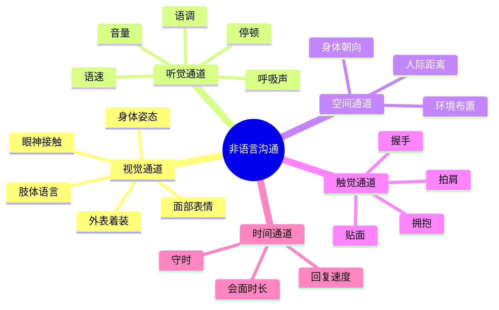
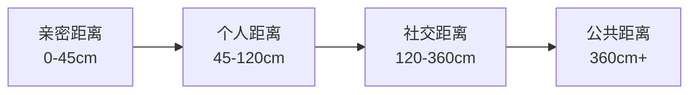

## 四、非语言沟通

非语言沟通（Nonverbal Communication）是人类最原始、最本能的信息传递方式。在语言诞生之前数百万年，我们的祖先已经通过面部表情、身体姿态和声音变化来传递情感、意图和社交信号。时至今日，非语言沟通仍然是社交互动中最具影响力的维度——它不仅传达信息，更塑造关系、建立信任、定义权力格局。

理解非语言沟通，不是为了"表演"或"操控"，而是为了更准确地理解他人、更真实地表达自己、更有效地建立有意义的人际连接。

### 4.1 非语言沟通概述

#### 4.1.1 定义与本质

非语言沟通（Nonverbal Communication）是指通过语言文字之外的一切方式传递和解读信息的过程。它涵盖面部表情、眼神接触、肢体动作、身体姿态、空间距离、触觉行为、声音特征、外表着装、时间行为等多个维度。

需要注意的是，非语言沟通并非"不用语言说话"那么简单。它的核心特征包括：

- **连续性**：语言沟通有明确的起止点，但非语言信号始终在传递——即使你沉默不动，你的姿态、表情和存在本身也在"说话"
- **多通道性**：语言信息通过单一通道（文字或语音）传递，但非语言信号同时通过视觉、听觉、触觉、嗅觉等多个通道传递
- **模糊性**：非语言信号通常不如语言信息精确，同一个动作在不同语境下可能有截然不同的含义
- **情绪性**：非语言通道是情绪表达的主要途径，语言可以掩盖情绪，但身体很难完全说谎

#### 4.1.2 梅拉比安法则：7-38-55规则

心理学家阿尔伯特·梅拉比安（Albert Mehrabian）在1967年的经典研究中发现，在涉及情感和态度的面对面沟通中：

| 信息维度 | 占比 | 说明 |
|---------|------|------|
| 语言内容（Words） | 7% | 你说了什么词 |
| 声音特征（Vocal） | 38% | 语调、语速、音量、停顿 |
| 视觉信息（Visual） | 55% | 表情、眼神、姿态、手势 |

**重要澄清**：这个比例经常被误读。梅拉比安本人强调，7-38-55规则仅适用于以下三个条件同时满足的情况：(1) 信息传递的是情感或态度；(2) 语言和非语言信号不一致；(3) 接收者需要判断说话者的真实态度。在信息性沟通中（如传递事实、数据），语言内容的重要性远超7%。

但这一研究揭示的深层道理依然成立：**当语言和非语言信号冲突时，人们倾向于相信非语言信号**。一个说"我很高兴见到你"却面无表情、身体后倾的人，不会让人觉得高兴。

#### 4.1.3 非语言沟通的七大功能

根据非语言沟通学者马克·纳普（Mark Knapp）的研究，非语言信号在社交中承担以下功能：

**功能一：补充（Complementing）**
非语言信号补充和丰富语言信息。比如在说"这个项目我很满意"的同时露出微笑、竖起大拇指，非语言信号强化了语言的正面含义。

**功能二：替代（Substituting）**
在某些场景下完全替代语言。点头表示同意，摇头表示否定，挥手表示告别——这些都不需要一个字就能传递明确信息。

**功能三：强调（Accenting）**
强调语言中的重点。说话时用力拍桌子强调决心，用手指点强调要点，这些都是非语言的"加粗"和"下划线"。

**功能四：调节（Regulating）**
调控对话的节奏和流向。在对话中，我们通过眼神接触表示"该你说了"，通过停顿和清嗓子表示"我还有话要说"，通过身体前倾表示"我想继续这个话题"。

**功能五：矛盾（Contradicting）**
与语言信息产生矛盾。嘴上说"我没事"却红了眼眶，说"我不生气"却握紧拳头——当矛盾出现时，接收者通常选择相信非语言信号。

**功能六：欺骗（Deceiving）**
有意识地通过非语言信号制造虚假印象。虽然这涉及道德层面，但理解欺骗性非语言信号的特征，有助于保护自己不被误导。

**功能七：身份表达（Identity Revealing）**
非语言信号大量泄露个人信息——社会地位、职业身份、文化背景、情绪状态、自信程度。许多时候，一个人还没开口，他的站姿、穿着和气场已经在传递这些信息。

#### 4.1.9 非语言沟通的九大形式

接下来逐一深入解析每一种非语言形式。

### 4.2 面部表情

面部是非语言信息最密集的区域。人脸上有超过40块肌肉，可以产生上万种不同的表情组合。进化赋予了我们对面部表情的超强识别能力——婴儿在出生几小时后就能识别和模仿面部表情。

#### 4.2.1 埃克曼的六种基本表情

心理学家保罗·埃克曼（Paul Ekman）经过对全球超过20个国家和地区（包括与世隔绝的巴布亚新几内亚高地部落）的跨文化研究，确认人类有六种基本表情是跨文化通用的，它们由先天的神经回路驱动，而非后天学习的结果：

| 表情 | 面部肌肉特征 | 核心功能 | 识别要点 |
|------|------------|---------|---------|
| **快乐** | 颧大肌收缩（嘴角上扬）+ 眼轮匝肌收缩（眼角鱼尾纹） | 分享积极体验，促进社会连接 | 关键看眼角——真正快乐时眼睛会"笑" |
| **悲伤** | 眉内侧上扬 + 嘴角下垂 + 下眼睑上提 | 引发同情和保护行为 | 眉毛内侧的上扬是最难伪装的表情特征 |
| **愤怒** | 眉下压 + 嘴唇紧闭或张开露齿 + 鼻翼扩张 | 威慑对手，宣示边界 | 嘴唇线条变得扁平且紧绷是典型信号 |
| **恐惧** | 眉上扬且聚拢 + 上眼睑提升 + 嘴巴张开 | 启动"战或逃"反应 | 与惊讶的关键区别：恐惧时眉毛是聚拢的 |
| **厌恶** | 鼻翼上提 + 上唇上扬 + 面颊上推 | 排斥有害物质或行为 | 鼻子两侧的皱纹（鼻唇沟加深）是典型特征 |
| **惊讶** | 眉上扬 + 眼睛睁大 + 下颌下落 | 对意外信息的快速评估 | 持续时间最短的正面表情——超过1秒通常是假装的 |

2014年，埃克曼在后续研究中将基本表情扩展到了包括**蔑视**（单侧嘴角上提）在内的七种，部分学者还主张加入**尴尬**、**羞耻**和**自豪**等。

#### 4.2.2 微表情与宏表情

**宏表情（Macro-Expressions）** 是我们日常交流中常见的、持续0.5秒到4秒的完整面部表情。它们通常是有意识展示的，也可能是在无意识中自然流露的。

**微表情（Micro-Expressions）** 则是一种特殊的面部表情——它持续时间极短（1/25秒到1/5秒），通常在人们试图隐藏或压抑真实情绪时不自觉地泄露出来。微表情无法用意志力完全控制，因此在测谎和心理评估领域受到高度关注。

微表情的核心特征：
- **极短持续时间**：仅1/25到1/5秒，远快于正常表情
- **无意识泄露**：出现在人们试图隐藏情绪的瞬间
- **与宏表情使用相同肌肉**：只是出现时间极短
- **跨文化通用**：与基本表情一样具有文化一致性

**如何练习识别微表情**：

1. **放慢视频**：用0.25倍速播放访谈或演讲视频，逐帧观察面部变化
2. **注意转折点**：当一个人从一个话题转到另一个话题时，面部会在新表情"覆盖"之前泄露旧情绪
3. **关注嘴部和眼部分离**：当嘴在笑但眼睛没有笑时，可能存在压抑的情绪
4. **练习识别七种基本表情**：先能在正常速度下识别宏表情，再逐步过渡到微表情

#### 4.2.3 微笑的科学

微笑是人类最强大的社交工具，但并非所有微笑都一样：

**杜乡微笑（Duchenne Smile）**——真诚的微笑：
- 同时激活颧大肌（嘴角上扬）和眼轮匝肌（眼角出现鱼尾纹）
- 眼角会形成"Crows Feet"（鱼尾纹）
- 下眼睑会轻微上提，眼睛看起来变小
- 两侧面部大致对称
- 持续时间2-4秒

**社交微笑（Social Smile）**——礼节性的微笑：
- 仅激活颧大肌，嘴角上扬但眼睛不动
- 没有眼角皱纹
- 可能出现明显的不对称
- 持续时间可能过短或过长

**微笑的神经机制**：杜乡微笑由边缘系统（负责情绪的大脑区域）驱动，几乎无法完全有意识地控制——这也是为什么它被视为真诚的标志。社交微笑由大脑运动皮层驱动，可以随意启动和停止。

**微笑在社交中的实际效果**：
- **释放内啡肽和血清素**：即使是刻意的微笑也能通过面部反馈机制（Facial Feedback Hypothesis）改善自身情绪状态。2019年密歇根州立大学的fMRI研究证实了这一点
- **传染效应**：瑞典隆德大学的研究表明，看到微笑时，人们很难不回以微笑——即使是有意识地压制，面部肌肉也会产生微弱的微笑反应
- **可信度提升**：加州大学伯克利分校的Haas商学院研究发现，在商务场景中微笑的人被评价为能力更强（前提是场合得体——在悲伤场景中微笑反而会降低可信度）
- **第一印象的核心组成部分**：普林斯顿大学的研究表明，人们在见面的100毫秒内就会形成第一印象，而微笑是影响这一瞬间判断的最强视觉信号之一

#### 4.2.4 表情管理的实操技巧

表情管理不是"戴面具"，而是确保你的面部信号与你的真实意图一致，避免因无意识的负面表情给社交互动带来障碍。

**日常维护的"中性友好脸"**：
- 面部肌肉放松但不松弛
- 嘴角微微上扬（不需要笑，但避免嘴角下垂）
- 眉毛自然舒展（避免皱眉）
- 目光温和而专注

**职场中的表情策略**：
- **倾听时**：适度点头 + 嘴角微扬 + 眉毛微抬（表示"我在认真听，请继续"）
- **思考时**：眉头微皱 + 嘴唇微抿（表示"我在认真思考这个问题"）——注意这是"思考皱眉"而非"不满皱眉"
- **表达不同意见时**：保持面部中性 + 微微侧头（表示"我在从不同角度看这个问题"）
- **被批评时**：保持表情平稳 + 适度点头（避免皱眉、翻白眼、咬嘴唇等防御性表情）

**需要避免的致命表情**：
- **翻白眼**：在所有文化中都被视为极度不尊重的信号
- **单侧嘴角上提（冷笑）**：传递蔑视——这是唯一一个跨文化通用的蔑视表情
- **频繁皱眉**：会被解读为不耐烦、不赞同或不友善
- **表情空白/扑克脸**：在非对抗性社交中，持续的无表情会让人感到不安和不信任

### 4.3 眼神接触

眼睛是非语言沟通中最复杂、信息量最丰富的单一器官。从神经科学角度看，人类大脑有专门的区域（颞上沟，Superior Temporal Sulcus）用于处理眼睛的方向、注视和意图信息。

#### 4.3.1 眼神接触的心理机制

眼神接触在人类社交中触发一系列深刻的心理反应：

**亲密性与侵入性**：眼神接触本质上是一种亲密行为，它打破人与人之间的心理屏障。这就是为什么与陌生人长时间对视会让人感到不适——它传达了一种过早的亲密信号。

**权力博弈**：在社交互动中，首先移开视线的人通常被感知为处于较低的权力位置。这就是为什么"不回避目光"被视为自信和权威的标志。但注意——在平等的友好社交中，过度"目不转睛"会被解读为攻击性或控制欲。

**注意力信号**：眼神接触是人类发出"我在注意你"的最直接方式。婴儿在几个月大时就学会了用眼神引导成人的注意力（共同注意力，Joint Attention），这是人类社交认知的基石能力。

#### 4.3.2 眼神接触的文化差异

眼神接触的文化含义差异巨大，错误的眼神行为可能导致严重的社交误解：

| 文化区域 | 眼神接触规范 | 违反后果 |
|---------|------------|---------|
| **北美/西欧** | 交谈时保持60-70%的时间有眼神接触，被视为自信和真诚 | 回避目光可能被误解为不诚实或缺乏自信 |
| **东亚（中日韩）** | 眼神接触时间较短，尤其是对长辈和上级，适度回避表示尊重 | 过多直视可能被视为不敬或挑衅 |
| **中东** | 同性之间眼神接触强烈且持久，异性之间应避免 | 异性间过多对视可能被视为不恰当 |
| **南亚** | 对长辈和权威人物避免直接眼神接触 | 下级直视上级可能被视为不服从 |
| **拉丁美洲** | 眼神接触较频繁且热情，表示亲近 | 回避目光可能被视为冷淡或不友善 |
| **非洲部分地区** | 对年长者避免直接眼神接触是基本礼节 | 年轻人直视长辈被视为严重失礼 |
| **澳大利亚原住民** | 在某些社区中，直接眼神接触可能被视为侵犯 | 需要根据具体社区规范调整 |

**在中国社交中的眼神礼仪**：
- 与平辈朋友交流：适度眼神接触，自然即可
- 与上级或长辈交流：眼神接触要适度，避免长时间直视，可在对方面部三角区（眉心到鼻尖）轮转目光
- 与陌生人初次接触：简短友好的眼神接触即可，避免长时间注视
- 公共场合（如地铁）：避免与陌生人眼神接触，这是城市社交的基本默契

#### 4.3.3 眼神接触的实用技巧

**"P三角"注视法**：
在社交对话中，将目光在对方面部的"P三角"区域自然移动：
- 左眼 → 右眼 → 嘴部 → 回到左眼
- 每个点停留约1-2秒
- 形成自然的目光移动，而非死盯着一个点

**不同场景的眼神策略**：

| 场景 | 策略 | 具体做法 |
|------|------|---------|
| 日常社交 | 温和自然 | 60-70%时间有目光接触，配合微笑和点头 |
| 正式商务 | 稳定自信 | 保持更长时间的目光接触（70%），但不要凝视 |
| 公众演讲 | 扫视全场 | 将观众区分为几个区域，每个区域停留3-5秒 |
| 倾听他人 | 持续关注 | 说话者期望倾听者有更多的目光接触（比自己说话时更多） |
| 跨文化交流 | 保守谨慎 | 观察对方的模式，跟随而非主导 |
| 冲突或谈判 | 冷静坚定 | 稳定但不具侵略性的目光接触 |

**眼神接触的常见错误**：
- **死盯不放**：持续超过10秒不移开视线，在任何文化中都会让人不适
- **完全回避**：整场对话不看对方眼睛，传递出不自信、不真诚或不感兴趣的信号
- **四处游移**：目光频繁飘向别处，暗示你在寻找更重要的人或想离开
- **上下打量**：从头到脚扫视对方，传递评判和不尊重的信号

### 4.4 肢体语言

肢体语言是非语言沟通中最丰富、最多变的维度。从手指的微小动作到整个身体的姿态，每一个动作都在传递信息。

#### 4.4.1 开放性肢体语言

开放性肢体语言传递友好、自信、接纳的信号，在社交中建立积极的第一印象和持续的互动氛围：

**核心特征与具体表现**：

| 动作 | 传递的信号 | 使用场景 |
|------|----------|---------|
| 身体微微前倾 | "我对你/这个话题感兴趣" | 倾听重要谈话时 |
| 手臂自然放松 | 开放、不设防 | 日常社交 |
| 手掌向上/可见 | 诚实、坦率 | 解释或说服时 |
| 适度点头 | 理解、认同、鼓励继续 | 倾听时 |
| 双脚朝向对方 | 对谈话对象的注意力指向 | 站立交谈时 |
| 头部微倾 | 好奇、感兴趣 | 听到令人感兴趣的内容时 |
| 双手自然摆放 | 放松、舒适 | 所有社交场景 |

**"镜像效应"（Mirroring）**：
人们在感到亲近和共鸣时，会不自觉地模仿对方的姿态和动作——这就是镜像效应。你可以有意识地温和模仿对方的姿态来建立连接感（注意是"温和"而非"亦步亦趋"的机械复制）。

镜像效应的神经基础是大脑中的"镜像神经元"（Mirror Neurons），这种神经元在我们观察他人动作时会自动激活，仿佛我们自己在执行那个动作。它是人类共情能力的神经基础之一。

#### 4.4.2 封闭性肢体语言

封闭性肢体语言通常传递防御、不感兴趣、不舒适或不信任的信号：

**常见封闭性姿态及含义**：

| 动作 | 可能的信号 | 上下文修正 |
|------|----------|-----------|
| 手臂交叉胸前 | 防御、不认同 | 在寒冷环境中可能是保暖——需结合上下文判断 |
| 身体后仰 | 拉开距离、不投入 | 在沙发上后仰可能只是放松 |
| 身体转向一侧 | 想离开、不专注 | 可能只是在找更舒服的坐姿 |
| 避免眼神接触 | 不自信、隐瞒、不感兴趣 | 可能是文化习惯（见4.3.2节） |
| 双手插兜 | 隐藏手部动作、紧张 | 可能只是习惯性动作 |
| 收拢肩膀 | 缩小身体、防御 | 可能是冷或身体不适 |
| 脚踝交叉 | 抑制情绪、紧张 | 女性坐姿中的常见习惯性动作 |

**重要提醒**：不要单一信号下结论。肢体语言的解读必须结合**语境**、**基线行为**和**信号集群**三个维度。一个交叉双臂的人可能只是觉得冷，一个不看你眼睛的人可能只是文化习惯。只有当多个信号同时出现、并且偏离了对方的"正常基线"时，才能做出较为可靠的判断。

#### 4.4.3 权力姿态与"高能量姿势"

哈佛商学院社会心理学家艾米·卡迪（Amy Cuddy）的研究提出了"高能量姿势"（Power Posing）的概念：

**高能量姿势**：
- 占据更大空间（双臂张开、双腿分开）
- 身体挺直，肩膀后拉
- 手放在髋部或支撑在桌上
- 下巴微抬

**低能量姿势**：
- 缩小身体（蜷缩、交叉手臂）
- 弯腰驼背
- 低头
- 占据较少空间

卡迪的原始研究（2010年）声称，摆出高能量姿势2分钟可以提高睾酮水平、降低皮质醇水平，从而提升自信和抗压能力。但后续的大规模重复实验（2017年，Registered Replication Report）未能重现激素层面的效果。

**修正后的实用建议**：
- 高能量姿势对激素的直接影响可能不如原始研究声称的那样显著
- 但"行为影响心理"的机制依然有效——当你采用开放、自信的姿态时，你确实会*感觉*更自信
- 在重要场合（面试、演讲、谈判前），花2分钟调整姿态仍然是有价值的准备动作
- 在社交中，保持适度的开放姿态，但不要夸张到占据过多空间——那会被解读为傲慢或侵犯

#### 4.4.4 手部语言

手部是肢体语言中最具表达力的部位。研究表明，有效的沟通者在说话时手部动作明显多于不善沟通的人。

**有影响力的手部动作**：

- **手指并拢、手掌向上**：被研究证实为最有说服力的手势。传递开放、邀请的信号
- **手指并拢、手掌向下**：传递确定性和权威感。适合表达确定的观点
- **"计数"手势**（用手指列举要点）：帮助听众理解和记住要点
- **双手展开**（与肩同宽）：表示"让我解释"
- **指尖对指尖（教堂尖塔状）**：传递自信和专业知识感。高管和专业人士常用

**应该避免的手部动作**：

- **手指指人**：在所有文化中都被视为不礼貌，具有攻击性
- **频繁触摸面部**：传递紧张、不确定的信号，也可能暗示在隐藏什么
- **双手紧握/绞手指**：表示焦虑和紧张
- **玩弄物品**（笔、手机、戒指）：分散注意力，传递不安
- **双手插口袋说话**：传递漠不关心或不尊重的信号

### 4.5 空间距离学

空间距离学（Proxemics）研究人们如何在社交互动中使用和感知空间距离。这一领域由人类学家爱德华·霍尔（Edward T. Hall）在1966年的经典著作《隐藏的维度》（The Hidden Dimension）中系统阐述。

#### 4.5.1 霍尔的四个人际距离圈

霍尔提出了四个由近及远的人际距离区域，每个区域对应特定的关系类型和社交功能：

| 距离区域 | 范围 | 适用关系 | 感官特征 | 典型场景 |
|---------|------|---------|---------|---------|
| **亲密距离** | 0-45cm | 恋人、家人、极亲密朋友 | 能感知对方体温、气味、呼吸声 | 拥抱、亲吻、悄悄话 |
| **个人距离** | 45-120cm | 朋友、熟人 | 能看清对方的面部细节和表情 | 日常交谈、朋友聚会 |
| **社交距离** | 120-360cm | 同事、业务关系、社交场合 | 需要提高音量才能正常交流 | 会议、商务谈判、正式社交 |
| **公共距离** | 360cm以上 | 公共演讲、大型活动 | 视觉细节模糊，需要大声说话 | 演讲、课堂、舞台表演 |

#### 4.5.2 空间距离的文化差异

空间距离的文化差异是跨文化交际中最容易踩雷的领域之一：

**近距离文化**（社交距离通常<60cm）：
- 阿拉伯国家、拉丁美洲（巴西、阿根廷等）、南欧（意大利、西班牙等）
- 特点：交谈时经常感觉"太近"，有较多身体接触
- 适应建议：如果对方靠近，不要后退——后退会被视为拒绝

**中距离文化**（社交距离约60-90cm）：
- 中国、日本、韩国、东南亚
- 特点：保持适度距离，较少不必要的身体接触
- 适应建议：注意不要过于热情地靠近

**远距离文化**（社交距离通常>90cm）：
- 北欧（芬兰、瑞典等）、北美、澳大利亚
- 特点：重视个人空间，未经许可靠近可能被视为侵犯
- 适应建议：保持一臂以上的距离，除非对方主动靠近

**中国社交中的空间礼仪**：
- 朋友之间：约45-75cm，可以有适度的身体接触（拍肩等）
- 商务场合：约120cm，保持正式感
- 公共场合：尽可能保持最大距离（如电梯中的默契）
- 与不熟悉的人：维持在120cm以上，避免不必要的靠近

#### 4.5.3 空间距离的高级应用

**领地行为**：人们会在社交环境中通过物品来"标记"自己的领地——在会议室里把笔记本放在旁边的座位上，在咖啡馆用包占座。理解这一点有助于理解那些看似琐碎的行为背后的社交含义。

**座位选择心理学**：
- **角对角**（L型）：最适合非正式交谈，减少对立感
- **面对面**：适合正式谈判，但可能增加对抗感
- **并排**：适合合作性工作，减少直接对视的紧张感
- **对角线**：距离最远，适合保持距离的场景

**如何优雅地处理空间侵犯**：
- 如果有人靠得太近且你感到不适，可以通过以下方式自然地调整距离：
  1. 身体微微后倾而不转身
  2. 手中拿一个物品（杯子、文件）作为自然的"缓冲区"
  3. 转换到需要更多空间的姿态（如侧身）
  4. 如果持续不适，可以直接但礼貌地说："不好意思，我习惯稍微多一点空间"

### 4.6 触觉行为

触觉是人类最原始的感官，也是非语言沟通中最亲密的通道。研究表明，一次恰当的触觉可以在极短时间内显著改变对方对你的感知。

#### 4.6.1 社交触觉的类型与规范

| 触觉类型 | 适用关系 | 场合 | 注意事项 |
|---------|---------|------|---------|
| **握手** | 商务/正式场合 | 初次见面、达成协议 | 力度适中（2-3秒），过强或过弱都不利 |
| **轻拍上臂** | 朋友/同事 | 表达鼓励、祝贺 | 时间<1秒，力度轻柔 |
| **拍肩** | 上级→下级/长辈→晚辈 | 鼓励、安慰 | 避免上下级关系不明确时使用 |
| **拥抱** | 亲密朋友/家人 | 问候、安慰、庆祝 | 中国社交中注意对象和场合 |
| **贴面礼** | 亲密朋友 | 法国、意大利等文化中的问候 | 中国社交中通常不适用 |
| **挽手臂** | 亲密朋友/恋人 | 走路时 | 需确认对方接受程度 |

#### 4.6.2 握手的科学

握手是全球最普遍的社交触觉行为，它在短短几秒内传递大量信息：

**理想握手的标准**：
- **力度**：中等力度，与对方匹配（不是比谁力气大）
- **时间**：2-3秒，上下摇动2-3次
- **湿度**：手掌干燥（紧张时手心出汗会影响第一印象——可以在重要场合前用纸巾擦手）
- **全掌接触**：避免"死鱼手"（只伸出手指）或"钳子手"（只用指尖）
- **眼神配合**：握手时直视对方眼睛并微笑

**握手传递的隐含信号**：
- **掌心向下**：试图在关系中占据主导地位
- **掌心向上**：表示顺从或配合
- **双手握手**（覆手式）：传递热情和真诚，但仅适用于已经有一定关系基础的人
- **快速松开**：暗示不想继续交流

#### 4.6.3 触觉的文化敏感性

触觉行为的文化差异非常显著，不当的触觉行为可能造成严重的社交失误：

- **高触觉文化**：拉丁美洲、南欧、中东（同性之间）——频繁的身体接触是表达亲近的方式
- **低触觉文化**：东亚、北欧——身体接触较少，过多接触可能被视为侵犯
- **特殊禁忌**：在伊斯兰文化中，异性之间不应有身体接触（除非是家人）；在印度文化中，左手被认为是不洁的，应使用右手进行触觉接触
- **中国社交规范**：同性朋友之间的身体接触相对自然（如挽手臂、拍肩），但异性之间在正式场合应以握手为主

### 4.7 声音特征

声音特征（Paralanguage）是指语言内容之外的所有听觉信息，包括语调、语速、音量、停顿、音质等。梅拉比安的研究指出，声音特征占沟通信息量的38%——远超语言内容本身。

#### 4.7.1 语调（Intonation）

语调是声音特征中最具情感传递力的元素：

- **升调**（句子末尾音调上扬）：表示疑问、不确定、邀请回应
- **降调**（句子末尾音调下降）：表示确定、权威、陈述完毕
- **平调**（音调变化不大）：可能表示无聊、冷静或不投入
- **夸张的升降调**：可能表示讽刺、不真诚或过度表演

**语调的社交陷阱**：
- **"升调陈述句"现象**：将本应是陈述句的话说成疑问调（如"我是做设计的？"），在英语文化中被称为"Uptalk"，研究表明会降低说话者的可信度和权威感。在中文中同样存在这个问题
- **单调语调**：在演讲和社交中，持续的单调语调会让听众失去兴趣——语音的"旋律感"是保持注意力的关键
- **语调与身份**：研究表明，人们会通过语调来判断说话者的社会地位、教育水平和情绪状态

#### 4.7.2 语速（Speech Rate）

语速直接影响信息的接收效果和对说话者的感知：

| 语速 | 感知印象 | 适用场景 | 潜在问题 |
|------|---------|---------|---------|
| 过快（>200字/分钟） | 紧张、不耐烦、不自信 | 快节奏的信息传递 | 听众难以跟上，理解率下降 |
| 适中（130-170字/分钟） | 自信、专业、值得信赖 | 大多数社交和商务场景 | 无 |
| 偏慢（<120字/分钟） | 沉稳、权威、深思熟虑 | 强调重要观点时 | 可能让听众失去耐心 |

**语速调节的实操建议**：
- 讲重要内容时放慢语速——这是非语言的"加粗"
- 讲背景信息时适当加快——避免听众在细节中失去耐心
- 在关键观点之前或之后适当停顿——给听众消化的时间
- 根据听众的反馈实时调整——如果对方频繁点头，说明语速合适；如果对方皱眉或眼神游移，可能需要放慢

#### 4.7.3 音量（Volume）

音量的控制在社交中常被低估，但它直接影响听众的舒适度和对说话者的评价：

- **环境匹配原则**：音量应与环境噪音水平匹配——在安静的咖啡馆用正常音量，在嘈杂的餐厅适当提高
- **动态变化**：在一席谈话中适当变化音量——讲重要观点时略微提高音量，讲私密或感人内容时降低音量
- **低声的力量**：降低音量有时比提高音量更有力——它迫使听者集中注意力，传递信任感和亲密感
- **高声的风险**：在不恰当的场合大声说话是社交中常见的失礼行为——在中国文化中，公共场合的大声说话尤其容易引起负面评价

#### 4.7.4 停顿（Pausing）

停顿是被严重低估的沟通工具。很多人害怕沉默，总觉得停顿会显得不自信或不流畅，但事实恰恰相反——有效的停顿是自信和掌控力的标志。

**停顿的三种类型及功能**：

| 停顿类型 | 时长 | 功能 | 示例 |
|---------|------|------|------|
| **语法停顿** | 0.3-0.5秒 | 标记句子结构，帮助听众理解 | 句号、逗号处的自然停顿 |
| **强调停顿** | 1-2秒 | 突出重要信息 | "这个方案有一个关键问题……（停顿）……成本超出了预算30%" |
| **戏剧性停顿** | 3-5秒 | 制造悬念、吸引注意力 | 演讲中在揭示关键信息前的刻意沉默 |

**停顿的社交应用**：
- **回答问题前短暂停顿**：传递"我在认真思考你的问题"的信号，比立刻回答更显深思熟虑
- **对方说完后短暂停顿**：确保对方已经说完，避免打断
- **强调关键信息前后**：让关键信息在对方记忆中"着陆"
- **控制话题节奏**：通过停顿暗示你希望转换话题

### 4.8 外表着装

外表着装是一种"无声的自我介绍"——在你开口之前，你的穿着已经在告诉对方你的社会角色、审美品味、对场合的重视程度和自我认知水平。

#### 4.8.1 着装的非语言信号

**身份信号**：制服、西装、休闲装——不同的穿着直接标记你的职业和社会角色。

**能力信号**：得体的着装与能力感知之间存在强相关。心理学中的"晕轮效应"（Halo Effect）意味着，人们倾向于将外表上的吸引力泛化为其他方面的优秀。

**尊重信号**：穿着是否得体反映了你对场合和对方的重视程度。参加正式活动穿着随意，传递的是"我不重视这个场合"的信号。

**归属信号**：穿着风格帮助你融入特定的社交群体——你穿得像哪一类人，就更容易被那一类人接纳。

#### 4.8.2 着装的社交规则

**"TPO"原则**：Time（时间）、Place（场合）、Occasion（目的）——着装应与这三个维度匹配。

| 场合 | 着装要求 | 常见错误 |
|------|---------|---------|
| 商务会议 | 正式商务装 | 过于随意或过于花哨 |
| 创意行业聚会 | 商务休闲或有品味的个性着装 | 过于保守 |
| 朋友聚会 | 舒适自然 | 过度正式显得格格不入 |
| 正式晚宴 | 正装 | 穿着太随意 |
| 初次约会 | 整洁得体、略高于日常 | 过度正式（像面试）或过于随意 |

**基本整洁要求**（在所有场合都适用）：
- 衣物干净、平整、无破损
- 鞋子干净（很多人忽略这一点，但鞋子是非语言信号的重要载体）
- 个人卫生良好（口气、体味、头发整洁）
- 配饰适度（不发出过多的声响或过于闪耀）

### 4.9 时间行为

时间行为（Chronemics）研究人们如何感知、使用和评价时间，以及时间行为传递的社交信号。

#### 4.9.1 守时的社交含义

- **准时到达**：传递"我尊重你的时间"和"我是一个可靠的人"
- **提前5-10分钟**：传递重视和积极态度（但过早到达可能给对方压力）
- **迟到5-15分钟**：在某些文化中可接受（如巴西、印度），在中国商务场合中开始失礼
- **迟到30分钟以上**：在大多数文化中都传递不尊重或不靠谱的信号

**迟到的补救方法**：
1. **提前通知**：一旦意识到会迟到，立即告知对方并说明预计迟到的时间
2. **真诚道歉**：到达后简短道歉，不要过度解释原因
3. **补偿行为**：主动提出承担额外的责任（如"今天的咖啡我来请"）

#### 4.9.2 回复速度的隐含信号

在数字时代，回复消息的速度成为一种新的非语言信号：

- **秒回**：可能传递重视和热情，但也可能暗示你没有自己的事情在做
- **几分钟到几小时内回复**：通常被视为正常且专业的回复速度
- **超过24小时不回复**：传递"你不重要"或"我不想交流"的信号
- **已读不回**：在中文社交中被称为"意念回复"——通常被理解为拒绝或不感兴趣的信号

**建议**：在重要的人际关系中，即使无法立即回复，也应该先简短回应（如"收到，稍后详细回复"），以示尊重。

### 4.10 数字时代的非语言沟通

数字通信（微信、邮件、视频会议）虽然去除了大部分面对面的非语言信号，但创造了全新的非语言表达方式。

#### 4.10.1 文字消息中的非语言元素

- **表情符号（Emoji）**：弥补了文字缺少情感维度的问题，但使用应与关系和场合匹配
- **标点符号**：句号在年轻人的即时通讯中可能传递冷淡感；感叹号传递热情
- **回复长度和速度**：长消息暗示投入，短消息可能暗示漠不关心
- **语音消息 vs 文字**：语音消息传递更多非语言信息（语气、情绪），但对听者的时间要求更高
- **打字中的"正在输入..."**：这个提示本身成为一种非语言信号——长时间的"正在输入"可能暗示对方在斟酌措辞

#### 4.10.2 视频会议中的非语言沟通

视频会议已经成为现代社交和工作的重要形式，它保留了部分但非全部面对面的非语言信号：

**视频会议中的关键非语言要素**：
- **摄像头角度**：摄像头应与眼睛平齐或略高。从下往上拍摄会让人看起来不专业
- **灯光**：光源应在面部前方，避免背光（脸部变成黑色剪影）
- **背景**：简洁、整洁的背景传递专业感
- **眼神接触**：看摄像头而非屏幕上的画面——这在视频会议中是一个违反直觉但重要的技巧
- **身体可见性**：确保上半身在画面中可见，不要只露出一张脸
- **注意力管理**：频繁看其他屏幕或打字的声音会传递"我没有在认真参与"的信号

### 4.11 非语言沟通的综合运用

#### 4.11.1 信号集群原则

**核心原则**：不要基于单一非语言信号做判断。非语言信号的可靠解读需要观察"信号集群"——当多个信号同时指向同一方向时，判断的可靠性才足够高。

例如：
- 交叉双臂（可能的封闭信号）+ 面带微笑 + 身体前倾 + 眼神接触 = 大概率只是习惯性姿态，并非真正的封闭
- 交叉双臂 + 避免眼神接触 + 身体后仰 + 短促回应 = 高度可能表示不感兴趣或不舒适

#### 4.11.2 基线行为原则

每个人都有自己的"非语言基线"——他们在放松、自然状态下的行为模式。解读非语言信号时，最有价值的不是绝对判断（"他在摸鼻子所以他在说谎"），而是与基线的偏离（"他平时说话很自然，但谈到这个问题时开始频繁摸鼻子，这值得留意"）。

**如何建立对他人的基线认知**：
1. 在低压力的环境中观察对方的自然行为
2. 注意对方的典型姿态、说话模式和表情习惯
3. 当你观察到偏离基线的行为时，将其作为"值得进一步观察"的信号，而非"下结论"的依据

#### 4.11.3 非语言沟通的一致性原则

**一致性**是非语言沟通最重要的原则。当你的语言信息和非语言信息一致时，你的沟通效果最大化。当它们不一致时，对方会倾向于相信非语言信号，并对你产生不信任感。

保持一致性的检查清单：
- 你的表情是否与你表达的情感匹配？
- 你的语气是否与你想传递的态度一致？
- 你的身体姿态是否与你的语言内容协调？
- 你的着装是否与场合的正式程度匹配？
- 你的回应速度是否与你声称的重视程度一致？

### 4.12 常见误区与纠正

**误区一："读心术"陷阱**
将非语言信号等同于"读心术"——认为一个动作必然对应一个意思。纠正：非语言信号是概率性的、语境依赖的，需要结合基线、信号集群和具体场景综合判断。

**误区二：忽略文化差异**
用自己的文化框架去解读来自不同文化背景的人的非语言信号。纠正：在跨文化社交中，先了解对方文化的非语言规范，再做判断。

**误区三：忽略个体差异**
有些人天生不喜欢眼神接触（如内向者或自闭谱系人士），有些人天生表情丰富。纠正：关注与个体基线的偏离，而非与"平均标准"的比较。

**误区四：过度管理自己的非语言行为**
过于关注自己的每一个动作和表情，导致行为僵硬、不自然。纠正：将注意力放在对方身上而非自己身上——当你真正关注对方时，你的非语言行为自然会变得合适。

**误区五：忽视整体环境**
在嘈杂的餐厅里提高音量不是不礼貌，在寒冷的户外交叉手臂不是在防御。纠正：始终将非语言信号放在具体环境和语境中解读。

### 4.13 进阶：非语言沟通能力的系统训练

#### 4.13.1 自我觉察训练

提升非语言沟通能力的第一步是提升自我觉察——了解你自己的非语言习惯：

1. **录像回看**：录制自己的日常对话或演讲视频，观察自己的面部表情、手势、姿态和声音特征
2. **朋友反馈**：请信任的朋友描述他们对你非语言习惯的感知
3. **镜子练习**：在镜子前练习不同的表情和姿态，建立对肌肉运动的控制感
4. **身体扫描**：在社交互动中有意识地扫描自己的身体——肩膀是否紧绷？手臂是否交叉？下巴是否紧收？

#### 4.13.2 观察力训练

提升观察他人非语言信号的能力：

1. **"人看人"练习**：在咖啡馆、公园等公共场所，安静地观察人们的互动，尝试从他们的非语言行为中推断关系和情绪
2. **静音看电视**：关掉声音看访谈或真人秀节目，尝试仅通过非语言信号理解对话内容和情感
3. **"30秒扫描"练习**：每次进入一个新的人际互动场景，用前30秒快速扫描对方的非语言信号——姿态、表情、眼神、声音——建立初始判断
4. **日记记录**：每天记录一个你观察到的有趣的非语言行为，并写下你的解读

#### 4.13.3 实践应用框架

在实际社交中运用非语言沟通知识的简化框架：

**进入社交场景前**：
- 调整自己的姿态和表情（"中性友好脸"）
- 确保着装与场合匹配
- 清理可能干扰信号传递的因素（手机静音、手上物品放好）

**社交互动中**：
- 先观察，建立对对方的基线认知
- 注意信号集群而非单一信号
- 保持自己的语言和非语言信号一致
- 适度使用镜像效应建立连接

**社交互动后**：
- 回顾对方的非语言信号，补充你对互动的理解
- 记录任何值得注意的观察
- 反思自己的非语言表现，识别改进空间

***

非语言沟通是一个庞大的知识体系，本章涵盖了其中最核心、最实用的部分。掌握这些知识不会让你成为"读心大师"，但会让你成为一个更敏锐、更有表达力、更能理解他人的社交者。记住：非语言沟通的终极目标不是技巧的堆砌，而是真诚的连接。
