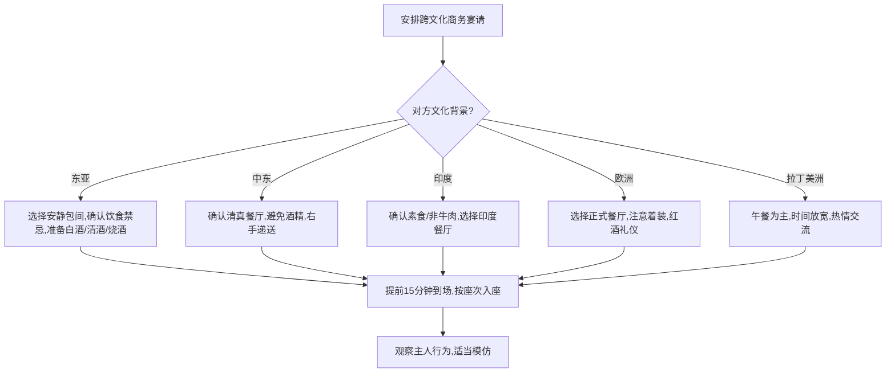

## 五、跨文化礼仪

在全球化深度交织的今天，跨文化交际已不再是外交官和跨国企业高管的专属领域。一次视频会议、一封海外邮件、一场国际展会，都可能因为文化差异而产生误解甚至冲突。跨文化礼仪的核心目标不是让你成为每种文化的专家，而是建立一套"文化敏感度"——在不确定的环境中快速识别差异、调整行为、避免冒犯，同时保持自身的真诚与尊严。

### 5.1 跨文化交际的理论基础

理解文化差异不能靠直觉和零散经验，需要系统化的分析框架。以下四个经典理论构成了跨文化礼仪的认知基石。

#### 5.1.1 霍夫斯泰德的文化维度理论

荷兰社会心理学家吉尔特·霍夫斯泰德（Geert Hofstede）基于对IBM全球70多个国家11.6万名员工的大规模调研，提出了文化维度理论。该理论最初包含四个维度，后扩展为六个，为理解跨文化礼仪差异提供了量化分析框架。

| 维度 | 含义 | 高分文化特征 | 低分文化特征 | 礼仪影响 |
|------|------|-------------|-------------|---------|
| **权力距离**（PDI） | 社会对权力不平等分配的接受程度 | 中国（80）、马来西亚（104）：等级分明，下属对上级用敬语 | 瑞典（31）、丹麦（18）：扁平化，直呼其名 | 称谓、座次、汇报方式的根本差异 |
| **个人主义vs集体主义**（IDV） | 个人利益与群体利益的优先级 | 美国（91）、澳大利亚（90）：强调个人成就 | 哥伦比亚（13）、印尼（14）：强调群体归属 | 面子文化、团队决策、冲突处理方式 |
| **男性化vs女性化**（MAS） | 社会对竞争与合作的偏好 | 日本（95）、匈牙利（88）：竞争导向，重视赢家 | 瑞典（5）、挪威（8）：合作导向，重视共识 | 谈判风格、成就展示、性别角色期待 |
| **不确定性回避**（UAI） | 对模糊和未知的容忍程度 | 希腊（112）、葡萄牙（104）：制定详细规则 | 新加坡（8）、牙买加（13）：灵活应变 | 合同详细程度、流程规范性、创新接受度 |
| **长期导向vs短期导向**（LTO） | 对未来回报与即时满足的偏好 | 中国（87）、日本（88）：耐心积累，重视关系 | 美国（26）、尼日利亚（16）：快速见效 | 商务关系建立速度、投资回报预期 |
| **放纵vs克制**（IVR） | 对享受和自由表达的态度 | 拉美国家（如墨西哥97）：热情外向 | 东亚国家（如中国24）：含蓄内敛 | 社交场合活跃度、情感表达尺度 |

**实操应用**：与新文化背景的人打交道前，先查阅Hofstede Insights官网（hofstede-insights.com）的国家对比工具，输入双方国家，快速获得六维雷达图，据此预判可能出现的礼仪摩擦点。

#### 5.1.2 爱德华·霍尔的高低语境理论

人类学家爱德华·霍尔（Edward T. Hall）在《超越文化》一书中提出了高语境文化与低语境文化的经典划分。这一理论直接影响着跨文化沟通中的礼仪策略选择。

**高语境文化**（中国、日本、韩国、阿拉伯国家、拉丁美洲）的特征：
- 信息的含义大部分嵌入在物理环境或个人关系中，而非明确编码在语言文字里
- 沟通依赖非语言线索：语气、停顿、眼神、肢体语言、沉默本身都是信息
- "听话听音"是基本功——字面意思往往不是真实意图
- 关系先于交易，信任建立需要时间和多次互动
- 代表性表达："这事儿我们再研究研究"（委婉拒绝）、"原则上同意"（有保留）

**低语境文化**（美国、德国、北欧、荷兰、澳大利亚）的特征：
- 信息主要通过语言文字明确传递，不依赖隐含信息
- 沟通追求清晰、直接、无歧义——"说的就是想的"
- 书面文件和正式协议是信任的基础
- 任务先于关系，效率优先
- 代表性表达："No, I disagree"（直接否定）、"Let me be clear..."（强调明确性）

**关键启示**：

高语境 → 低语境（如中国人与德国人合作）
   风险：中方含蓄表达被忽略，德方直接表达被视为粗鲁
   对策：中方练习"把话说透"，德方学习"留有余地"

低语境 → 高语境（如美国人与日本人谈判）
   风险：美方过于直接导致日方"丢面子"，日方沉默被误读为同意
   对策：美方降低直接否定的频率，日方在关键点明确表态

#### 5.1.3 冯·特姆彭纳斯的文化层次模型

荷兰管理学者冯·特姆彭纳斯（Fons Trompenaars）提出了七个文化维度，其中三个对礼仪实操影响最直接：

- **普遍主义vs特殊主义**：规则优先还是关系优先？普遍主义者（美国、瑞士）认为规则适用于所有人；特殊主义者（中国、俄罗斯）认为关系亲密的人可以通融。实操差异：面对朋友违规，普遍主义者会坚持原则，特殊主义者会帮忙变通。
- **中性vs情感**：情感表达的尺度。中性文化（日本、芬兰）在公开场合克制情感；情感文化（意大利、巴西）鼓励外露。实操差异：中性文化中过度热情可能被视为不专业；情感文化中过度冷淡可能被视为敌意。
- **具体vs扩散**：公私边界。具体文化（美国、荷兰）严格区分工作和私人生活；扩散文化（中国、日本）工作关系渗透到私人领域。实操差异：美国人下班后不谈工作是常态；中国人在饭局上谈生意是常规操作。

#### 5.1.4 GLOBE项目：文化与领导力的全球研究

GLOBE（Global Leadership and Organizational Behavior Effectiveness）项目在霍夫斯泰德基础上扩展为九个维度，并区分了"现状"（as is）和"期望"（should be），对跨文化商务礼仪有重要补充价值。例如，中国在"权力距离现状"上得分高，但在"期望"上并不特别推崇等级制度——这意味着中国职场中的等级礼仪更多是社会惯性，而非内心认同。了解这一区别，有助于在跨文化互动中找到更灵活的礼仪平衡点。

### 5.2 各文化圈层的礼仪实操指南

理论框架需要落地为具体行为指南。以下按文化圈层梳理关键礼仪要点。

#### 5.2.1 东亚文化圈（中国、日本、韩国、越南）

**共同特征**：儒家文化影响深远，重视等级、面子、关系和含蓄表达。

**日本**——礼仪之国的极致规范：

- **鞠躬**：15度（日常问候）、30度（正式场合）、45度（最高敬意）。鞠躬时目光下垂，双手贴于体侧或身前交叠。对方地位越高，鞠躬角度越大、时间越长。
- **名片交换（名刺交換）**：双手递出，文字朝向对方；接名片后双手接过，认真阅读，放在面前桌面上，切勿在上面写字或折叠。散会时按座位顺序整齐收好。
- **称呼**：一定加"さん"（san）后缀，除非对方明确邀请用名字直呼。对地位高的人用"様"（sama）。
- **送礼**：偶数金额不吉利（与丧事关联），避免4和9的组合。礼物不当面拆开。回礼价值约为收到礼物的50%-70%。
- **餐桌礼仪**：筷子不能竖插在饭上（祭祀象征），不能用筷子传递食物（火葬象征），喝汤不用勺直接端碗喝是得体的。

**韩国**——年龄决定一切：

- **年龄确认**：初次见面，韩国人经常直接问年龄，这不是冒犯，而是为了确定称谓和说话方式（韩语敬语体系与年龄直接挂钩）。
- **双手递接**：递东西给年长者或上级时用双手，或右手递出左手轻托右前臂。
- **饮酒礼仪**：长辈倒酒时双手端杯；喝酒时侧身，不面向长辈饮酒。拒绝长辈的敬酒需要技巧性婉拒。
- **餐桌**：长辈先动筷，晚辈才能开始吃。筷子和勺子不能同时握在一只手里。

**日本、韩国、中国礼仪对比速查表**：

| 礼仪场景 | 日本 | 韩国 | 中国 |
|---------|------|------|------|
| 初次问候 | 鞠躬+名片交换 | 鞠躬+名片交换 | 握手（逐渐接受名片） |
| 称呼方式 | 姓+さん | 姓+님/职位 | 姓+职务/先生/女士 |
| 送礼禁忌 | 避免4/9/偶数 | 避免红色包装 | 避免钟/伞/梨/鞋 |
| 商务宴请 | 居酒屋/料亭 | 烤肉/韩定食 | 餐厅包间/饭局 |
| 饮酒文化 | 居酒屋social | 烧酒+烤肉 | 白酒/红酒+敬酒 |

#### 5.2.2 中东与阿拉伯文化圈

**核心特征**：伊斯兰文化主导，重视宗教信仰、家族荣誉和热情好客。

- **握手与身体接触**：同性之间握手较长且温暖，可能伴随贴面礼。异性之间避免身体接触（尤其在保守地区），等对方主动伸手。
- **左手禁忌**：左手在伊斯兰文化中被视为不洁。递名片、握手、吃饭、递东西一律用右手。
- **鞋履**：进入清真寺和私人住宅必须脱鞋。
- **咖啡礼仪**：阿拉伯咖啡（Qahwa）是待客的象征。主人会连续续杯，接受至少一杯是礼貌。轻摇杯子表示"够了"。
- **斋月注意**：斋月期间，穆斯林白天禁食禁水。在他们面前吃喝被视为严重失礼。如果在穆斯林国家出差，应在私人空间进食。
- **时间观念**：阿拉伯文化对时间的态度比较灵活，"Inshallah"（如真主所愿）表示的可能是"我会努力"，也可能是委婉的拒绝。商务会议迟到15-30分钟是常态，但作为客人应准时到达。
- **名片**：最好一面英文一面阿拉伯文，用右手递出。

#### 5.2.3 欧洲文化圈

欧洲并非铁板一块，北欧、西欧、南欧、东欧差异巨大。

**北欧（瑞典、挪威、芬兰、丹麦）**：
- 极度重视守时，迟到1分钟即为失礼
- 低权力距离：直呼其名，CEO和实习生可能在同一张桌子吃饭
- 个人空间大（约1.2米社交距离），避免过度热情的身体接触
- 沉默是舒适的，不需要用闲聊填充每个停顿
- "Lagom"（瑞典语，恰到好处）是社交金律——不炫耀、不夸张

**西欧（英国、法国、德国、荷兰）**：
- **英国**：礼貌是社交货币。"Sorry"和"Please"使用频率极高。间接表达是艺术——"That's quite interesting"可能意味着"我不同意但不想直说"。排队文化极其严肃，插队是严重的社交禁忌。
- **法国**：称呼使用"Madame/Monsieur"直到对方邀请用名字。商务午餐可能持续2小时，这是建立信任的过程，不是浪费时间。谈论食物和文化是安全话题，避免直接谈论收入和政治。
- **德国**：守时是基本道德。"Du"（你）和"Sie"（您）的区分非常严格，对方提出用"Du"是关系升级的信号。直接沟通不是无礼，是尊重——绕弯子被视为不诚实。
- **荷兰**：直接程度在欧洲首屈一指。"荷兰式直白"不是针对你，是文化习惯。"Doe normaal"（正常点就好）是荷兰社交哲学。

**南欧（意大利、西班牙、希腊、葡萄牙）**：
- 时间弹性较大，社交场合迟到15-30分钟可接受
- 身体语言丰富，手势是沟通的重要组成部分
- 社交距离较近，贴面礼普遍
- 餐饮是社交核心，拒绝主人的食物可能被视为失礼
- 关系优先于规则——先做朋友，再谈生意

**东欧（俄罗斯、波兰、捷克等）**：
- 俄罗斯：称呼用名+父称（如Ivan Petrovich）。商务场合正式，私人场合热情。送花必须是奇数（偶数用于葬礼）。送礼不当面拆开。
- 强调个人信任，关系建立需要时间和耐心
- 直接的眼神接触表示诚实和自信

#### 5.2.4 南亚文化圈（印度、巴基斯坦、孟加拉、斯里兰卡）

- **合十礼（Namaste）**：双手合十于胸前，微微鞠躬。在印度，这是最通用的问候方式，避免了异性身体接触的问题。
- **头和脚的神圣性**：头被视为神圣的部位，不要摸别人的头（包括小孩）。脚被视为不洁，不要用脚指人或指向任何物品。
- **右手规则**：与中东类似，用右手递东西和吃饭。左手仅用于个人清洁。
- **种姓敏感**：虽然印度法律废除了种姓制度，但在实际社交中仍有影响。避免主动询问种姓背景。
- **摇头的意思**：印度式摇头（左右摆动）通常表示"好的""我理解了""我同意了"，而不是"不"。第一次接触容易误读。
- **饮食禁忌**：印度教徒不吃牛肉，穆斯林不吃猪肉，耆那教徒是严格的素食者。安排商务用餐前务必确认对方饮食偏好。

#### 5.2.5 拉丁美洲文化圈

- **热情的问候**：贴面礼普遍，男性之间也可能拥抱（abrazo）。拒绝身体接触会被视为冷淡和不友好。
- **时间弹性**：拉丁美洲对时间的态度比欧洲灵活得多。商务会议可能迟到30分钟，社交聚会迟到1小时不罕见。但作为外国客人，仍然建议准时。
- **个人关系优先**：生意是在信任基础上做的。不要急于进入正题，先花时间闲聊家庭、兴趣、体育。在巴西谈足球，在阿根廷谈探戈。
- **餐桌礼仪**：午餐是主餐，可能持续1-2小时。在墨西哥，用手吃taco是正常的。在阿根廷，拒绝mate（马黛茶）是失礼的。
- **称呼**：使用"Don/Doña"+名字表示尊敬，正式场合用"Señor/Señora"+姓氏。

#### 5.2.6 北美文化圈（美国、加拿大）

- **握手**：坚定有力的握手，伴随直接的眼神接触。软弱的握手被视为缺乏自信。
- **守时**：商务场合严格守时，社交场合可接受5-10分钟的弹性。
- **小费文化**：美国餐厅小费标准为15%-20%，加拿大类似。不给小费或给太少是非常严重的失礼。
- **个人空间**：约0.9-1.2米社交距离。避免未经许可的身体接触（尤其在职场）。
- **政治正确**：种族、性别、宗教、性取向等话题需要格外谨慎。使用包容性语言是基本素养。
- **"How are you?"**：这是问候语，不是真正的询问。标准回答是"Good, thanks!"然后继续对话。不要详细描述你的健康状况。
- **加拿大特殊性**：加拿大人强调多元文化主义，与美国人相比更含蓄、更礼貌。"Sorry"的使用频率堪比英国人。

#### 5.2.7 非洲文化圈

非洲54个国家，文化多样性极大，以下仅为泛化要点：
- **问候的重要性**：在非洲大部分地区，匆忙进入正题被视为粗鲁。问候可能持续数分钟，涉及对方的健康、家庭、工作。
- **右手规则**：与中东和南亚类似，递东西和吃饭用右手。
- **时间观念**：许多非洲文化对时间的态度是灵活的（"非洲时间"不是贬义词，是文化特征）。重要的是尊重节奏，表现出耐心。
- **长辈和权威**：对年长者和权威人物保持尊敬是普遍的。先与最年长或最高职位的人打招呼。
- **部落和民族敏感性**：非洲有数千个民族群体。避免笼统地把非洲视为一个整体，了解具体国家和民族的文化特点。

### 5.3 跨文化场景的礼仪实操

#### 5.3.1 跨文化商务宴请

商务宴请是跨文化冲突的高发场景。以下是一个通用的决策框架：

**座次安排的跨文化差异**：

| 文化 | 主位定义 | 入座规则 |
|------|---------|---------|
| 中国 | 面对门口的位置 | 主宾坐主位右侧，主人坐主宾对面 |
| 日本 | 离入口最远的位置（上座） | 最尊贵的客人坐上座，主人坐下座 |
| 西方 | 主人坐在桌子一端 | 主宾坐在主人右侧 |
| 中东 | 离门最远的位置 | 贵宾坐主位，其他人按资历排列 |

#### 5.3.2 跨文化送礼指南

送礼是跨文化中最容易踩雷的环节之一。以下是高风险禁忌清单：

| 文化 | 禁忌物品 | 原因 |
|------|---------|------|
| 中国 | 钟（送终）、伞（散）、梨（离）、鞋（邪）、绿帽子 | 谐音不吉利 |
| 日本 | 白色花（丧事）、4件/9件组合 | 与死亡和苦难关联 |
| 韩国 | 红色墨水写名字 | 红色用于记录死者姓名 |
| 中东 | 酒精（穆斯林）、猪皮制品 | 伊斯兰教禁忌 |
| 印度 | 牛皮制品（印度教）、酒精（部分教派） | 宗教禁忌 |
| 俄罗斯 | 偶数花束（丧事）、黄色花（分手） | 传统习俗 |
| 拉美 | 刀具（断绝关系）、手帕（悲伤） | 象征意义 |
| 德国 | 提前庆祝生日 | 认为会带来厄运 |

**安全的通用礼物**：高品质的本国特色工艺品、精美食品礼盒、书籍、高品质文具。

#### 5.3.3 跨文化谈判礼仪

谈判风格的文化差异直接影响商务谈判的策略和节奏：

| 维度 | 美式风格 | 日式风格 | 中式风格 | 中东风格 |
|------|---------|---------|---------|---------|
| 决策速度 | 快，单次可定 | 慢，需要内部共识 | 中等，视层级而定 | 慢，关系优先 |
| 沟通方式 | 直接明确 | 含蓄暗示 | 含蓄+直接混合 | 间接委婉 |
| 合同观念 | 合同至上 | 合同是关系的起点 | 合同可协商 | 合同是意向书 |
| 让步策略 | 快速让步换快速成交 | 缓慢让步试探诚意 | 以退为进 | 灵活变通 |
| 关系建立 | 谈判中建立 | 谈判前建立 | 谈判前+中建立 | 长期建立 |

**跨文化谈判的五步调适法**：

1. **研究阶段**：在谈判前充分了解对方文化维度（Hofstede六维）、商务礼仪规范、禁忌话题
2. **试探阶段**：首次会面不急于进入正题，花30%-40%的时间建立关系（尤其在东亚和中东文化中）
3. **同步阶段**：观察对方的沟通节奏和风格，逐步调整自己的表达方式——如果对方含蓄，你也适当含蓄；如果对方直接，你也可以更直接
4. **验证阶段**：在关键分歧点上，用不同方式确认对方的真实意图——直接问一次，间接确认一次，书面确认一次
5. **收尾阶段**：确认双方对协议条款的理解一致，必要时制作双语版本，避免翻译歧义

### 5.4 数字时代的跨文化礼仪

#### 5.4.1 视频会议礼仪

远程办公让跨文化视频会议成为日常，但文化差异在线上环境中被放大：

- **摄像头开关**：美国和欧洲团队通常默认开摄像头；日本团队可能更倾向于关摄像头（避免"被盯着"的不适感）。建议提前沟通团队偏好。
- **发言顺序**：在高权力距离文化中（如中国、日本），下属通常等上级发言后再开口。如果主持人不主动邀请，可能导致沉默。解决方案：主持人明确点名或使用轮流发言机制。
- **时差管理**：安排会议时主动承担不便利的时段，体现对对方的尊重。轮换不同时段，不总让同一方承担早起或熬夜。
- **屏幕共享**：确保关键文档有英文版本（如果团队使用英语），避免纯中文PPT让国际同事无法阅读。

#### 5.4.2 跨文化邮件礼仪

- **称呼**：对德国人和法国人使用正式称呼（Dear Mr. Schmidt / Cher Monsieur），直到对方主动降级；对美国人可以更快进入名字直呼（Hi John）。
- **回复速度**：德国和北欧文化期望快速回复（24小时内）；东亚文化可能有更长的缓冲期，但48小时是安全上限。
- **直接程度**：写给美国、德国同事的邮件要开门见山；写给日本、中国同事的邮件可以先寒暄几句再进入正题。
- **抄送规则**：抄送上级在某些文化中是汇报机制（正常），在另一些文化中可能是施压手段（慎用）。

#### 5.4.3 社交媒体的跨文化边界

- **LinkedIn**：在北美是标准商务社交工具，连接请求附一句话说明即可。在日本，未经介绍直接连接可能被视为冒昧。
- **WhatsApp/WeChat/LINE**：不同地区偏好不同的即时通讯工具。南美偏好WhatsApp，中国偏好微信，日本偏好LINE，韩国偏好KakaoTalk。用对方习惯的工具是尊重的表现。
- **朋友圈/动态**：不同文化对社交媒体上的自我展示接受度不同。中东文化中，公开分享家庭照片（尤其女性照片）可能需要谨慎。

### 5.5 跨文化礼仪冲突的预防与修复

#### 5.5.1 常见冲突类型

跨文化礼仪冲突可以分为五个层级，从低到高代表严重程度递增：

1. **认知差异**（轻微）：不理解对方的行为——"他为什么迟到30分钟？"
2. **行为不适**（中等）：对方的行为让自己感到不舒服——"他一直靠得太近"
3. **价值观碰撞**（较重）：行为挑战了自己的核心信念——"他居然当众批评下属"
4. **尊严冒犯**（严重）：行为被理解为故意侮辱——"他当面拒绝了我的礼物"
5. **关系破裂**（极严重）：冲突导致信任瓦解——"他绕过我直接找了我的老板"

#### 5.5.2 预防策略

- **ABC模型**：Awareness（意识到差异的存在）→ Behavior（学习对方文化的具体行为规范）→ Curiosity（保持好奇心而非评判心态）
- **观察镜法**：在跨文化互动中，把自己当作一个观察者——不急于评价对方的行为"对不对"，而是先理解"为什么"
- **安全网原则**：在不确定时，选择更正式、更礼貌、更保守的行为方式。宁可过度礼貌，也不要冒险冒犯
- **本地向导**：在进入新文化环境前，找一个熟悉当地文化的信任伙伴（同事、朋友、文化顾问）作为你的"文化翻译"

#### 5.5.3 冲突修复四步法

当你已经犯了跨文化礼仪错误时：

1. **即时反应**：如果意识到冒犯，立即诚恳表示歉意，不要试图解释或合理化自己的行为。"I apologize if I've offended you"比"I didn't mean to, in my culture..."有效得多。
2. **事后沟通**：在适当的时机（最好是私下），向对方解释自己来自不同的文化背景，承认自己对对方文化的了解不足，并表达学习的意愿。
3. **行动证明**：道歉之后最重要的是改变行为。在后续互动中展示你已经学到了教训——这比任何言语都有说服力。
4. **关系修复**：通过额外的善意行为修复受损的关系——邀请对方共进午餐、赠送一份用心的礼物、在工作上提供帮助。

### 5.6 常见误区与纠正

**误区一："入乡随俗"意味着完全抛弃自己的文化身份**
纠正：入乡随俗的核心是尊重当地规范，但不意味着放弃自我。最佳状态是在尊重对方文化的基础上，适当展示自己的文化特色——这反而会增加你的个人魅力和文化深度。

**误区二：只要语言通了就不会有文化冲突**
纠正：语言只是冰山一角，文化冲突更多发生在语言之下——时间观念、决策方式、情感表达、权力距离、个人空间等非语言层面。很多英语流利的人在跨文化互动中仍然频繁踩雷。

**误区三："我的文化更先进，他们需要改进"**
纠正：文化没有高低优劣之分，只有适应不同环境的不同解决方案。北欧的平等主义不是"更正确"，阿拉伯的热情好客也不是"更落后"——它们各自在特定的历史和社会环境中演化而来。

**误区四：记住了对方文化的规则就万事大吉**
纠正：每种文化内部也有巨大的个体差异。一个美国人可能比日本人更含蓄，一个日本人可能比美国人更直接。规则提供的是概率分布，不是确定性判断。最安全的做法是用规则做初始假设，然后根据具体个人的反馈快速调整。

**误区五：跨文化礼仪只在国际交往中才重要**
纠正：在一个多元文化的社会中，跨文化礼仪无处不在——与不同民族的同事协作、与不同文化背景的客户沟通、与来自不同地区的合作伙伴共事。即使不出国，文化敏感度也是21世纪的核心社交能力。

### 5.7 修炼跨文化能力的路径

跨文化能力不是一朝一夕可以习得的，而是一个持续修炼的过程。以下是四个递进阶段：

**第一阶段：文化觉察（0-3个月）**
- 学习Hofstede六维模型和Hall高低语境理论
- 建立"文化差异是常态，不是例外"的认知框架
- 阅读至少一本跨文化经典著作：《文化地图》（Erin Meyer）、《菊与刀》（Ruth Benedict）、《超越文化》（Edward Hall）

**第二阶段：知识积累（3-12个月）**
- 针对你最常接触的3-5种文化，系统学习其礼仪规范和禁忌
- 学习对方语言的基础问候语（即使只是"你好""谢谢""对不起"）
- 观看该文化的电影和纪录片，培养文化直觉

**第三阶段：实践磨练（1-3年）**
- 主动创造跨文化互动机会：国际交流活动、多元文化团队项目
- 每次互动后做反思记录：什么做得好，什么可以改进
- 找一个跨文化导师定期复盘

**第四阶段：文化融合（3年以上）**
- 能够根据不同文化场景自如切换行为模式
- 能够在跨文化冲突中充当调解人
- 形成自己的"第三文化"——一种融合了多种文化优势的个人风格

> 跨文化礼仪的终极目标不是成为所有文化的模仿者，而是成为一个有文化同理心的全球公民——能够在差异中找到共同点，在冲突中创造理解，在多元中建立连接。
