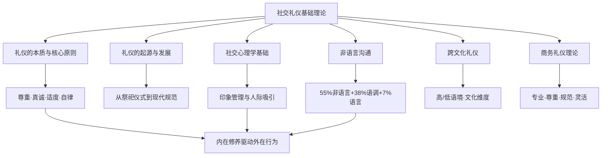

## 本章小结

基础理论是社交礼仪的"操作系统"——不懂底层逻辑，再多的技巧也只是机械模仿。本章从六个维度构建了礼仪的认知框架，下面将核心要点逐层提炼，并给出从理论到实践的转化路径。

### 7.1 六大模块核心知识图谱

### 7.2 各模块核心要点回顾

#### 模块一：礼仪的本质与核心原则

礼仪不是虚伪的客套，而是人类社会协作的行为编码系统。理解它的关键在于抓住四个核心原则：

| 原则 | 含义 | 常见违背表现 |
|------|------|-------------|
| **尊重** | 承认他人的人格、价值和边界 | 打断他人讲话、无视他人意见、过度打探隐私 |
| **真诚** | 以真实的态度对待他人，不做作 | 假笑、言不由衷的恭维、表面热情背后冷漠 |
| **适度** | 行为分寸与场合匹配 | 过度热情让人不适、过于拘谨显得冷漠 |
| **自律** | 控制本能冲动，遵循社会规范 | 情绪失控、不顾场合的言行、只顾自己舒适 |

礼仪的三大功能——**社会润滑**（降低互动摩擦）、**关系建构**（建立和维护人际连接）、**身份标识**（传递社会角色和修养水平）——贯穿于社交的每一个环节。理解这些，才能避免"学了一堆规矩却不知道为什么要这样做"的困境。

#### 模块二：礼仪的起源与发展

礼仪从原始社会的祭祀仪式中萌芽，经历了三个关键阶段：

1. **仪式化阶段**（原始社会-先秦）：礼仪源于宗教祭祀和图腾崇拜，核心功能是维系群体认同和等级秩序。跪拜、献祭、禁忌是最原始的礼仪形态。
2. **制度化阶段**（先秦-清末）：以《周礼》《仪礼》《礼记》为代表，礼仪被系统化为国家制度和社会规范，"礼"成为维护社会秩序的核心工具。
3. **现代化阶段**（近现代至今）：传统等级礼制瓦解，礼仪转向平等、尊重、效率导向的现代社交规范，并在全球化进程中不断融合。

理解这段历史的意义在于：知道一条规矩的来龙去脉，才能在该变通时不死守教条，在该尊重传统时不会轻率冒犯。比如中国传统座次礼仪源于古代的方位尊卑观念，现代商务场合中的座次安排虽然简化了，但"主位面门、客位背门"的习惯仍然保留——了解这个背景，你就不会在正式宴请中随意落座。

#### 模块三：社交心理学基础

社交礼仪的心理学根基主要来自三个理论体系：

**印象管理理论（戈夫曼）**：社会交往如同戏剧表演，每个人都在进行"印象管理"。前台（正式场合）展示精心管理的形象，后台（私下空间）放松自我。礼仪本质上就是一套"前台表演"的行为规范。理解这一点，不是要你变成一个虚伪的人，而是认识到：得体的礼仪是社交能力的一部分，就像演员的专业素养一样。

**首因效应与近因效应**：人们在初次见面的7秒内就会形成第一印象，且第一印象一旦形成，需要8-10次正面接触才能改变。这意味着初次见面的礼仪表现几乎决定了对方对你的基本判断。而在长期关系中，最近的互动（近因效应）对印象的影响更大——持续的良好礼仪比一次完美表现更重要。

**社会交换理论**：人际互动本质上是一种"成本-收益"的交换过程。礼仪行为的成本很低（一个微笑、一句问候），但收益很高（好感、信任、合作机会）。那些觉得"讲礼仪太累"的人，往往是因为把礼仪当成了一种消耗，而没有意识到它是一种高回报的社交投资。

**人际吸引法则**：接近性（物理距离越近越容易产生好感）、相似性（与自己相似的人更有吸引力）、互补性（对方拥有自己缺乏的特质）、互惠性（喜欢那些喜欢自己的人）。这些法则在社交礼仪中都有对应的应用场景。

#### 模块四：非语言沟通

阿尔伯特·梅拉比安（Albert Mehrabian）的研究揭示了一个反直觉的结论：在面对面沟通中，语言内容仅占信息传递的7%，语调和语速占38%，而面部表情、肢体语言等非语言信号占55%。这意味着"怎么说"远比"说什么"重要。

非语言沟通的七大系统：

| 系统 | 关键信号 | 礼仪应用 |
|------|---------|---------|
| **面部表情** | 六种基本表情（快乐、悲伤、愤怒、恐惧、厌恶、惊讶）跨文化通用 | 保持友善开放的表情，学会区分真诚微笑和社交微笑 |
| **眼神接触** | 注视时间、瞳孔变化、眨眼频率 | 交谈时保持60-70%的眼神接触时间，避免盯视或闪躲 |
| **肢体语言** | 手势、姿态、动作 | 开放姿态传递接纳，交叉手臂传递防御，适度手势增强表达 |
| **空间距离** | 亲密距离(0-45cm)、个人距离(45-120cm)、社交距离(120-360cm)、公共距离(360cm+) | 根据关系和场合选择合适的距离，不侵犯他人的舒适区 |
| **触觉行为** | 握手、拍肩、拥抱 | 触觉行为需谨慎，尊重对方的文化背景和个人边界 |
| **声音特征** | 音量、语速、语调、停顿 | 控制语速（每分钟150-200字为宜），语调有变化避免催眠式说话 |
| **外表着装** | 服装、配饰、发型、妆容 | 着装符合场合要求（正式/商务休闲/休闲），整洁得体 |

掌握非语言沟通的核心策略：**自我监控**（意识到自己的非语言信号）、**他人观察**（读懂对方的非语言信号）、**情境适配**（根据场合调整非语言行为）。

#### 模块五：跨文化礼仪

霍夫斯泰德的文化维度理论和爱德华·霍尔的高低语境理论，是理解跨文化礼仪差异的两把钥匙。

**高低语境文化的核心差异**：

| 维度 | 高语境文化（中国、日本、阿拉伯） | 低语境文化（美国、德国、北欧） |
|------|-------------------------------|--------------------------|
| 沟通方式 | 间接、含蓄、依赖语境 | 直接、明确、依赖语言本身 |
| 拒绝表达 | "我们再考虑一下"= 拒绝 | "不，谢谢"= 拒绝 |
| 时间观念 | 弹性时间，关系优先 | 严格守时，效率优先 |
| 决策方式 | 先建立关系再谈事情 | 先谈事情再考虑关系 |
| 空间距离 | 同性之间距离较近 | 需要更多个人空间 |

跨文化礼仪的核心策略是**文化谦逊**——不是背诵每个国家的规矩清单，而是培养对文化差异的敏感度，在不确定时保持观察、询问和尊重。具体而言：事先了解对方文化的基本礼仪禁忌；在不确定时宁可保守也不冒犯；出现失误时真诚道歉并快速调整。

#### 模块六：商务礼仪理论

商务礼仪是社交礼仪在商业领域的专业化应用，具有四大核心原则：

1. **专业性原则**：商务场合的第一要务是传递专业能力。着装、言谈、行为都要符合行业规范和企业形象。
2. **尊重性原则**：尊重客户的需求和选择、合作伙伴的利益和立场、同事的贡献和意见、竞争对手的专业和努力。
3. **规范性原则**：遵守法律法规、行业规范、公司制度和商业道德。规范不是束缚，而是降低沟通成本的共识。
4. **灵活性原则**：在遵守基本原则的前提下，根据具体情况灵活应变。不同行业、不同企业、不同客户群体的商务礼仪细节可能有差异。

商务礼仪的五大功能：塑造专业形象、促进商务合作、提高沟通效率、维护商业关系、展示企业文化。它不是"锦上添花"的装饰品，而是"地基"级别的职业素养。

### 7.3 理论框架的整合：道法术器四层模型

将本章六个模块放入"道法术器"的框架中，可以看到它们各自的位置和相互关系：

| 层级 | 含义 | 对应模块 | 核心作用 |
|------|------|---------|---------|
| **道**（本质规律） | 礼仪的底层逻辑和哲学根基 | 礼仪的本质与核心原则 | 理解"为什么要讲礼仪" |
| **法**（方法论） | 礼仪运作的规律和框架 | 社交心理学基础、跨文化礼仪 | 掌握"礼仪如何起作用" |
| **术**（技巧策略） | 具体场景中的行为指导 | 非语言沟通、商务礼仪理论 | 学会"具体怎么做" |
| **器**（工具支撑） | 辅助工具和历史参照 | 礼仪的起源与发展 | 获得"为什么这样做"的依据 |

四者的关系：**道**决定方向（不知道礼仪的本质，学再多规矩也是空壳），**法**提供框架（没有心理学和文化学的支撑，技巧缺乏判断力），**术**落地执行（理论最终要转化为具体行为），**器**丰富底蕴（历史和工具让实践更有深度和灵活性）。

### 7.4 常见认知误区纠正

学习基础理论后，需要警惕以下几种典型误区：

**误区一："礼仪就是虚伪的客套"**
纠正：礼仪的本质是尊重，不是表演。真诚的礼仪行为（比如认真倾听、守时赴约、表达感谢）不仅不虚伪，反而是内在修养的外在体现。戈夫曼的"前台理论"不是教你戴面具，而是让你认识到：在不同场合展现不同面向的自己，本身就是社交智慧的一部分。

**误区二："讲礼仪就是卑躬屈膝"**
纠正：礼仪的核心原则之一是"适度"。过度的礼貌反而会让人不舒服，甚至被视为谄媚。真正的礼仪是平等基础上的相互尊重，不是一方对另一方的讨好。

**误区三："我性格直，不需要学这些"**
纠正：直率和粗鲁是两回事。直率是"我说真话"，粗鲁是"我不在乎你的感受"。学习礼仪不是让你变得虚伪，而是让你的直率以一种对方能接受的方式表达出来。

**误区四："记住了规则就掌握了礼仪"**
纠正：规则只是骨架，判断力才是灵魂。同样一条规则（比如"见面要打招呼"），在不同文化、不同场合、不同关系中的具体表现完全不同。真正掌握礼仪的人，不是能背诵100条规矩的人，而是能在任何场合做出得体判断的人。

**误区五："现代社会自由了，礼仪不重要了"**
纠正：恰恰相反，现代社会的社交场景更复杂（面对面+线上+跨文化），信息传播更快（一次失礼可能被截图传播），人际关系更脆弱（第一印象的容错率更低）。现代社会对礼仪的要求不是降低了，而是提高了——不是要求你更拘谨，而是要求你更灵活。

### 7.5 从理论到实践：能力转化路径

理论学习的最终目的是转化为日常行为。以下是将本章知识转化为实际能力的分阶段路径：

**第一阶段：意识觉醒（1-2周）**
- 目标：建立"礼仪意识"，开始注意自己和他人的社交行为
- 行动：每天观察3个社交场景，分析其中的非语言信号和礼仪行为；回顾自己当天的社交互动，找出1个可以改进的地方
- 重点模块：礼仪的本质与核心原则、非语言沟通

**第二阶段：知识内化（3-4周）**
- 目标：理解行为背后的原理，形成判断力
- 行动：学习心理学理论，理解"为什么这样做有效"；研究至少3种不同文化的礼仪规范，培养跨文化敏感度
- 重点模块：社交心理学基础、跨文化礼仪

**第三阶段：刻意练习（2-3个月）**
- 目标：将理论转化为自然的行为习惯
- 行动：每周设定1个礼仪练习主题（如"本周专注眼神接触"或"本周练习主动问候"）；在真实社交场景中刻意运用，事后复盘
- 重点模块：非语言沟通、商务礼仪理论

**第四阶段：灵活运用（持续）**
- 行动：面对陌生的社交场合或跨文化场景，能快速判断并调整自己的行为；在坚持核心原则（尊重、真诚、适度、自律）的前提下，发展出适合自己的社交风格

这个路径不是线性的——实践中发现不足时，需要回到理论层面补充理解；理论有新认识时，也需要在实践中验证。**理论和实践是螺旋上升的关系，不是一次性的"学完就完"。**

### 7.6 下一步学习方向

基础理论为后续学习奠定了认知框架，接下来的章节将进入具体场景的实操指南：

- **日常社交礼仪**：问候、介绍、交谈、送礼等日常场景的行为规范
- **商务礼仪**：会面、谈判、宴请、通讯等商务场景的专业规范
- **餐桌礼仪**：中餐、西餐、自助餐等不同餐饮场景的规范
- **职场礼仪**：上下级关系、同事协作、会议发言等职场场景的规范
- **国际礼仪**：不同国家和地区的礼仪禁忌和习俗
- **数字社交礼仪**：微信、邮件、视频会议等线上社交场景的规范

带着本章建立的理论框架去学习这些具体场景，你会发现：每一条具体规矩都不是孤立的"规则"，而是"尊重、真诚、适度、自律"四大原则在特定场景中的具体体现。掌握了这个方法，即使遇到没学过的场景，你也能做出得体的判断。
