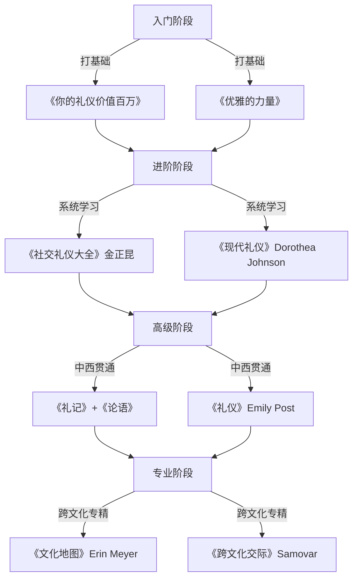
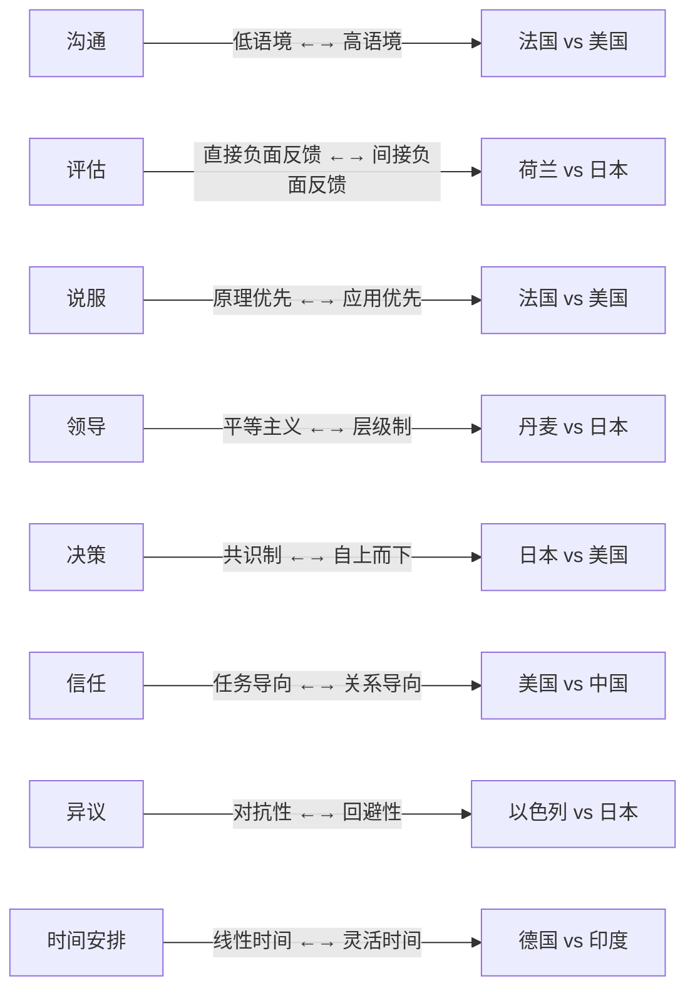

## 一、经典书籍推荐

社交礼仪是一门需要系统学习的学问。碎片化的短视频和公众号文章能提供零散的技巧，但只有通过经典书籍的系统阅读，才能构建起完整的礼仪知识体系——从"知道怎么做"到"理解为什么这样做"，最终达到"举手投足皆得体"的境界。

本节按照学习路径，将书籍分为四大类别：中国传统礼仪经典、西方礼仪经典、综合实用礼仪、跨文化与国际礼仪。每本书都会标注难度等级、核心价值和阅读方法，帮助你根据自身水平选择最合适的书目。

### 1.0 阅读路径总览

在展开具体书目之前，先建立一个全局视角。不同阶段的读者需要不同的书：



| 阶段 | 特征 | 推荐书目 | 阅读时间 |
|------|------|----------|----------|
| 入门 | 不知道礼仪的基本框架 | 你的礼仪价值百万、优雅的力量 | 每本1-2周 |
| 进阶 | 知道基本规则但想系统化 | 社交礼仪大全、现代礼仪 | 每本2-3周 |
| 高级 | 想理解礼仪背后的文化逻辑 | 礼记、论语、Emily Post | 每本1-2月 |
| 专业 | 需要处理跨文化场景 | 文化地图、跨文化交际 | 每本2-4周 |

---

### 1.1 中国礼仪经典

中国传统礼仪是中华文明的根基之一。理解这些经典，不是为了复古，而是为了理解中国社会中那些"说不清道不明"的行为逻辑——为什么长辈要坐主位？为什么递名片要用双手？为什么饭局上要先敬酒再动筷？这些问题的答案都藏在传统礼仪的文化基因里。

#### 1.1.1 《礼记》

- **作者**：西汉·戴圣编订（汇编先秦至汉初礼仪文献）
- **难度**：★★★★★（文言文原著难度极高，需借助注释）
- **阅读周期**：选读版2-4周，全本3-6个月

**核心内容解析**：

《礼记》共四十九篇，是儒家"三礼"（《周礼》《仪礼》《礼记》）中最易读、思想最丰富的一部。它不仅仅是礼仪操作手册，更是一部社会哲学著作。全书涵盖以下核心主题：

- **人生礼仪**：冠礼（成人礼）、婚礼、丧礼、祭礼——人生关键节点的仪式设计
- **日常规范**：《曲礼》篇详述言行举止，如"毋抟饭，毋放饭，毋流歠"（吃饭不要用手捏饭团，不要把放回碗里的饭再吃，不要大口喝汤发出声音）
- **社会伦理**：《大学》《中庸》《学记》等篇章讨论修身、治学、治国之道
- **教育理念**：《学记》是世界上最早的教育学专论

**为什么现在还值得读**：

《礼记》中许多思想具有超越时代的普适性。例如《曲礼》中"礼尚往来，往而不来非礼也，来而不往亦非礼也"，精确描述了社交互惠原则——现代社交心理学中的"互惠法则"与此完全吻合。再如"入境而问禁，入国而问俗，入门而问讳"，这就是现代跨文化交际中"文化敏感性"的古典表达。

**阅读建议**：

1. **不要从头到尾通读**。《礼记》四十九篇并非同等重要，建议按以下优先级选读：
   - 第一层必读：《曲礼》（日常行为规范）、《大学》（修身之道）、《中庸》（处世哲学）
   - 第二层推荐：《学记》（教育思想）、《乐记》（审美与教化）、《礼运》（社会理想）
   - 第三层选读：《内则》（家庭规范）、《少仪》（年少者礼仪）、《檀弓》（丧礼故事）
2. **版本选择**：
   - 入门：中华书局"中华经典名著全本全注全译"系列《礼记》（译注者：胡平生、陈美东），白话文翻译逐句对应
   - 进阶：上海古籍出版社《礼记集解》（孙希旦），学术注释详尽
   - 研究：《十三经注疏·礼记正义》（郑玄注、孔颖达疏），古籍研究者专用
3. **配合阅读**：读《礼记》时手边放一本《古代汉语词典》，遇到不理解的字词即时查阅

**核心语录精选**：

> "道德仁义，非礼不成；教训正俗，非礼不备；分争辨讼，非礼不决；君臣上下，父子兄弟，非礼不定。"——《曲礼》

翻译：道德仁义，没有礼就不能成就；教育训导端正风俗，没有礼就不能完备；分辨争讼，没有礼就不能决断；君臣上下、父子兄弟之间的关系，没有礼就不能确定。

---

#### 1.1.2 《论语》中的礼仪思想

- **作者**：孔子及其弟子（成书于战国初期）
- **难度**：★★★★☆（文言文，但比《礼记》通俗）
- **阅读周期**：精读版2-4周

**为什么单独推荐《论语》**：

《论语》不是一本礼仪手册，但它提出了中国礼仪哲学最核心的命题——**礼的本质是仁**。这个观点对现代人的启示是：礼仪不是表面的客套和形式，而是发自内心的对他人的尊重和关怀。

**核心礼仪思想梳理**：

| 原文 | 出处 | 现代解读 |
|------|------|----------|
| "不学礼，无以立" | 《季氏》 | 不学礼仪，就无法在社会上立足——礼仪是社会生存的基本技能 |
| "克己复礼为仁" | 《颜渊》 | 克制自己的欲望、使言行合乎礼，就是仁——礼仪的最高境界是内在修养 |
| "非礼勿视，非礼勿听，非礼勿言，非礼勿动" | 《颜渊》 | 四个"非礼勿"构成了行为自律的完整框架 |
| "己所不欲，勿施于人" | 《卫灵公》 | 换位思考是所有礼仪的底层逻辑 |
| "君子和而不同，小人同而不和" | 《子路》 | 社交中保持个性与和谐的平衡 |
| "恭而无礼则劳，慎而无礼则葸" | 《泰伯》 | 过度恭敬反而让人疲惫，过度谨慎反而显得胆怯——礼仪需要适度 |

**阅读建议**：

- **首选版本**：杨伯峻《论语译注》（中华书局）——学术界公认的权威注本，注释精准，译文流畅
- **通俗版本**：南怀馨《论语别裁》——视角独特，联系现实生活，但部分观点有争议
- **现代解读**：傅佩荣《论语三百讲》——适合初学者，每讲15分钟，可配合音频学习

**实操建议**：读完《论语》后，尝试用"己所不欲，勿施于人"这一条原则来审视自己日常的社交行为——你会发现这条简单的原则可以解决80%的社交冲突。

---

#### 1.1.3 《中国礼仪文化》

- **作者**：彭林（清华大学历史系教授、中国礼学研究中心主任）
- **难度**：★★★☆☆（学术著作但语言通俗）
- **阅读周期**：2-3周

**核心价值**：

这本书的最大价值在于**将古代礼仪与现代生活连接起来**。彭林教授不是简单地复述古籍，而是从现代人的视角重新诠释中国传统礼仪的意义。全书从以下几个维度展开：

1. **礼仪的历史演变**：从周公制礼到现代礼仪的演变脉络
2. **五礼系统**：吉礼（祭祀）、凶礼（丧葬）、军礼（军事）、宾礼（外交）、嘉礼（婚冠）——理解中国礼仪的完整分类体系
3. **礼仪的现代转化**：哪些传统礼仪应当继承？哪些需要改良？哪些应当摒弃？
4. **礼仪教育**：如何在现代社会中进行礼仪教育

**特别推荐章节**：

- 第三章"人生礼仪"——详解诞生礼、冠礼、婚礼、丧礼的文化内涵
- 第五章"社交礼仪"——古人在称谓、座次、迎来送往中的智慧
- 第七章"礼仪的当代价值"——传统礼仪如何在现代社会中发挥作用

**阅读建议**：这本书适合与《礼记》对照阅读。《礼记》提供原始文献，《中国礼仪文化》提供现代解读，两者结合效果最佳。

---

### 1.2 西方礼仪经典

西方礼仪体系经过数百年的演化，已形成一套高度系统化的规范。对于需要进行国际交往、在外企工作、或希望拓宽视野的读者来说，学习西方礼仪不是"崇洋"，而是掌握一种通用的国际社交语言。

#### 1.2.1 《礼仪》（Etiquette）

- **作者**：Emily Post（艾米莉·波斯特，1872-1960）
- **原名**：*Etiquette in Society, in Business, in Politics, and at Home*
- **首版**：1922年（至今仍由Emily Post Institute持续更新）
- **难度**：★★★☆☆（语言通俗，但内容体量大）
- **阅读周期**：选读2-3周，通读1-2月

**历史地位**：

这本书是西方礼仪文化的里程碑式著作。1922年首版时，美国正处于"咆哮的二十年代"——一战结束，社会阶层剧烈变动，大量新富阶层涌现，他们迫切需要一本"社交指南"来告诉他们该怎么做。Emily Post的这本书正好填补了这个空白，首年销量超过60万册，此后百年间持续再版，被誉为"西方礼仪的圣经"。

**内容架构**：

全书按场景分类，核心板块包括：

| 板块 | 涵盖内容 | 现代实用价值 |
|------|----------|-------------|
| 日常社交 | 称呼、介绍、握手、名片交换、谈话技巧 | ★★★★★ |
| 餐桌礼仪 | 西餐餐具使用、座次安排、用餐姿态、敬酒规范 | ★★★★★ |
| 商务礼仪 | 会议、邮件、电话、商务着装 | ★★★★☆ |
| 书面礼仪 | 请柬、感谢信、慰问信的格式和措辞 | ★★★☆☆ |
| 特殊场合 | 婚礼、葬礼、舞会、慈善活动的参与规范 | ★★★☆☆ |

**现代版本说明**：

Emily Post Institute每隔几年更新一次，最新版（第20版，由Emily Post的曾孙媳Peggy Post主编）大幅增加了数字社交礼仪的内容——电子邮件、社交媒体、短信通讯等方面的规范。**建议务必阅读最新版本**，早期版本中的许多规范（如淑女必须戴手套出门）已经过时。

**与中式思维的关键差异**：

理解这些差异有助于避免跨文化社交中的尴尬：

- **个人空间**：西方礼仪强调保持约一臂距离的个人空间，中国人习惯的距离更近
- **眼神接触**：西方礼仪中，适度的眼神接触表示真诚和自信；在中国文化中，长时间直视长辈或上级可能被视为不敬
- **直接 vs 委婉**：西方礼仪鼓励清晰直接的表达，"Yes"就是"Yes"，"No"就是"No"；中国文化更注重委婉和面子

---

#### 1.2.2 《现代礼仪》（Modern Manners: Tools to Take You to the Top）

- **作者**：Dorothea Johnson（多萝西娅·约翰逊）与Liv Tyler（丽芙·泰勒）
- **难度**：★★☆☆☆（入门级，语言通俗）
- **阅读周期**：1-2周

**核心特色**：

Dorothea Johnson是美国最知名的礼仪培训师之一，创办了华盛顿特区的"Protocol School of Washington"。她的孙女Liv Tyler（好莱坞影星）参与了本书的写作，使内容更加贴近现代年轻人的生活场景。

本书最大的优势是**实操性强**。每一章都配有具体的场景案例和对话示例：

- 商务午餐时如何点菜才不会显得失礼？
- 电梯里遇到CEO该怎么打招呼？
- 收到不合适的礼物该如何得体地回应？
- 如何在鸡尾酒会上优雅地同时端着酒杯和餐盘？

**特别推荐章节**：

- 第4章"The Art of Conversation"——如何开启、维持和优雅地结束一段对话
- 第7章"Dining Etiquette"——西餐礼仪的完整图解
- 第9章"Business Etiquette"——职场中的行为规范

---

#### 1.2.3 《商务礼仪》（Business Class: Etiquette Essentials for Success at Work）

- **作者**：Jacqueline Whitmore（杰奎琳·惠特莫尔）
- **难度**：★★☆☆☆
- **阅读周期**：1-2周

**核心价值**：

Jacqueline Whitmore是美国Palm Beach礼仪学校的创始人，长期为财富500强企业提供礼仪培训。这本书专注于**职场和商务场景**，是所有商务礼仪书中最具实操性的一本。

**关键知识点**：

1. **商务着装密码**：不同场合的着装标准（Business Formal / Business Casual / Smart Casual的区别和适用场景）
2. **商务用餐**：如何在商务餐中边吃边谈而不失礼？如何处理买单的尴尬时刻？
3. **商务通讯**：电子邮件的格式规范、回复时效、抄送规则
4. **商务旅行**：与同事/客户同车、同机、同住酒店时的行为边界
5. **国际商务**：不同国家的商务习惯差异（日本交换名片、中东的性别互动规则等）

---

### 1.3 综合实用礼仪

这一类书籍的共同特点是**面向中国读者、贴近中国国情**，不需要翻译和文化转换，拿来就能用。

#### 1.3.1 《社交礼仪大全》

- **作者**：金正昆（中国人民大学教授，中国礼仪研究第一人）
- **难度**：★★☆☆☆
- **阅读周期**：2-3周

**为什么这本书是入门首选之一**：

金正昆教授被称为"中国礼仪第一人"，他在央视《百家讲坛》主讲的礼仪课程曾引发全民学习礼仪的热潮。他的最大优势是**把中国传统礼仪与现代社交规范融为一体**，既不盲目复古，也不全盘西化。

**全书知识体系**：

社交礼仪大全
├── 个人礼仪
│   ├── 仪容礼仪（着装、妆容、发型）
│   ├── 仪态礼仪（站姿、坐姿、走姿、手势）
│   └── 语言礼仪（称呼、寒暄、话题选择）
├── 交往礼仪
│   ├── 见面礼仪（握手、鞠躬、拥抱的适用场景）
│   ├── 介绍礼仪（自我介绍、为他人介绍的顺序）
│   └── 通讯礼仪（电话、短信、微信、邮件）
├── 应酬礼仪
│   ├── 宴请礼仪（中餐、西餐、自助餐）
│   ├── 馈赠礼仪（选礼、送礼、收礼、回礼）
│   └── 拜访礼仪（时间、着装、伴手礼）
└── 职场礼仪
    ├── 面试礼仪（第一印象的决定性作用）
    ├── 办公室礼仪（上下级、同事之间的相处）
    └── 会议礼仪（座次、发言、记录）

**特别推荐**：书中关于"座次安排"的章节非常实用——中国式饭局、会议、乘车中的座次规则复杂且重要，金正昆教授给出了清晰的图示化规则。

---

#### 1.3.2 《你的礼仪价值百万》

- **作者**：周思敏
- **难度**：★☆☆☆☆（零基础友好）
- **阅读周期**：1-2周

**核心定位**：

这是一本**纯入门级**礼仪读物，适合对礼仪完全没有概念的读者。语言通俗，案例贴近生活，每章都有"小测试"帮助读者自我评估。

**适合人群**：

- 大学生和职场新人——需要快速建立基本的社交规范意识
- 性格内向、不善社交的人——提供具体的行为模板
- 希望了解礼仪基本框架的人——先建立全景再深入细节

**注意事项**：这本书的深度有限，适合快速入门，不适合作为唯一的礼仪学习资料。建议读完本书后进入金正昆的《社交礼仪大全》或Emily Post的《礼仪》进行系统学习。

---

#### 1.3.3 《优雅的力量》（The Power of Poise）

- **作者**：Jacqueline Whitmore（杰奎琳·惠特莫尔）
- **难度**：★★☆☆☆
- **阅读周期**：1-2周

**与《商务礼仪》的区别**：

如果说Whitmore的《商务礼仪》聚焦于"工作场景"，那么《优雅的力量》则聚焦于**"个人魅力的全面提升"**。它讨论的不仅是"该怎么做"，更是"如何从内到外散发优雅的气质"。

**核心观点**：

1. **优雅不是天生的，而是训练出来的**——通过持续的练习，任何人都可以培养出得体的举止
2. **内在修养决定外在表现**——自信、善良、从容是优雅的内核，技巧只是外壳
3. **礼仪的本质是尊重**——不是表演给别人看，而是让身边的人感到舒适

**特别实用的内容**：

- 如何在社交场合克服紧张和不自信
- 如何培养从容不迫的气场
- 如何通过肢体语言传递自信和亲和力

---

### 1.4 国际礼仪与跨文化交际

在全球化时代，跨文化交际能力已成为核心竞争力之一。以下三本书从不同角度帮助你理解和应对文化差异。

#### 1.4.1 《跨文化交际》（Communication Between Cultures）

- **作者**：Larry A. Samovar、Richard E. Porter、Edwin R. McDaniel
- **难度**：★★★★☆（大学教材级别）
- **阅读周期**：3-4周

**学术地位**：

这是跨文化交际领域使用最广泛的教材之一，目前已出到第9版。它不是一本"怎么做"的手册，而是一本帮助你**理解文化差异的底层逻辑**的理论著作。

**核心理论框架**：

1. **Hofstede文化维度理论**：个人主义vs集体主义、权力距离、不确定性规避、男性气质vs女性气质、长期导向vs短期导向、放纵vs克制——这六个维度可以解释绝大多数跨文化冲突的根源
2. **高低语境文化**：高语境文化（中国、日本、阿拉伯）依赖非语言线索和共享背景；低语境文化（美国、德国、北欧）依赖明确的语言表达
3. **非语言交际**：肢体语言、空间距离、时间观念、沉默的含义在不同文化中的巨大差异
4. **刻板印象与偏见**：如何识别和克服文化偏见

**实践价值**：

虽然定位为学术教材，但书中大量真实案例使其具有很强的可读性。例如，书中详细分析了为什么日本人在谈判中经常沉默——这不是"没意见"，而是在高语境文化中，沉默本身就是一种沟通方式。

---

#### 1.4.2 《国际商务礼仪》（International Business Etiquette）

- **作者**：Mitchell Robert
- **难度**：★★★☆☆
- **阅读周期**：2-3周

**实用价值**：

这是一本**按国家/地区分类的实用手册**。当你需要与某个特定国家的商业伙伴打交道时，可以直接查阅对应章节。每个国家/地区的介绍包括：

- 商务着装要求
- 名片交换规范
- 问候方式（握手/鞠躬/拥抱/贴面礼）
- 商务用餐习惯
- 谈判风格特点
- 送礼禁忌
- 时间观念差异
- 忌讳和敏感话题

**关键国家/地区速查**：

| 国家/地区 | 核心礼仪要点 | 典型禁忌 |
|-----------|-------------|----------|
| 日本 | 鞠躬礼、名片双手递接、不打断对方 | 不要用手指指人、筷子不要直插饭中 |
| 韩国 | 长幼有序、双手递接物品、脱鞋进屋 | 不要直呼年长者名字 |
| 印度 | 合十礼（Namaste）、右手用餐 | 不要用左手递东西、牛是神圣的 |
| 中东 | 性别互动谨慎、尊重宗教习惯 | 不要用左手、不要展示鞋底 |
| 德国 | 守时是底线、正式称呼 | 不要用名字直呼（除非对方邀请） |
| 美国 | 眼神接触表示真诚、握手有力 | 不要问收入/年龄/体重 |
| 巴西 | 关系先于生意、肢体接触较多 | 不要用"OK"手势（侮辱性含义） |

---

#### 1.4.3 《文化地图》（The Culture Map）

- **作者**：Erin Meyer（艾琳·迈耶，INSEAD商学院教授）
- **难度**：★★★☆☆（学术严谨但文笔生动）
- **阅读周期**：2-3周

**为什么这本书值得特别推荐**：

如果说Samovar的《跨文化交际》是"理论教科书"，那么《文化地图》就是"实战手册"。Erin Meyer在INSEAD商学院教授跨文化管理课程长达15年，书中所有案例都来自她亲身经历或调研的真实商业场景。

**八大文化维度模型**：

这是本书最核心的贡献——用八个维度来定位任何国家的文化特征：



**三个最有启发性的观点**：

1. **"做鱼"比喻**：你无法像鱼一样看到水——文化对你来说是透明的，你以为"全世界都这样"的行为方式，其实只是你所在文化的产物
2. **信任的两面性**：在任务导向文化中（美国、北欧），信任来自可靠的工作表现；在关系导向文化中（中国、巴西、沙特），信任来自共度时光和个人关系
3. **不要评判，要理解**：每种文化的行为模式都有其内在逻辑，理解这个逻辑比评判对错更重要

**阅读建议**：读完后，尝试用八大维度分析你自己的文化背景，再分析你最常接触的其他文化——你会惊讶于自己之前忽略了多少文化差异。

---

### 1.5 补充推荐：现代必读

除了以上经典书目，以下几本近年来影响力较大的书也值得一读：

#### 1.5.1 《人性的弱点》（How to Win Friends and Influence People）

- **作者**：Dale Carnegie（戴尔·卡耐基）
- **首版**：1936年
- **难度**：★☆☆☆☆
- **阅读周期**：1-2周

虽然这本书通常被归类为"人际沟通"而非"礼仪"，但它提出的许多原则（真诚地关心他人、记住别人的名字、做一个好的倾听者、避免批评和指责）实际上就是社交礼仪的底层逻辑。卡耐基的核心观点是：**所有技巧都建立在真诚的基础上**——这一条原则比任何具体的礼仪规则都重要。

**最适合搭配阅读**：与金正昆的《社交礼仪大全》一起读——卡耐基提供"道"，金正昆提供"术"，道术结合效果最佳。

#### 1.5.2 《非暴力沟通》（Nonviolent Communication）

- **作者**：Marshall B. Rosenberg（马歇尔·卢森堡）
- **难度**：★★☆☆☆
- **阅读周期**：1-2周

这本书不是传统意义上的礼仪书，但它解决了一个礼仪学习中经常被忽略的问题：**如何在冲突场景中保持得体**？很多人在正常社交中彬彬有礼，但一旦遇到冲突就"原形毕露"。非暴力沟通提供了一套四步法——观察、感受、需要、请求——帮助你在任何压力场景下都能保持尊重和清晰。

**四步法在社交冲突中的应用示例**：

| 步骤 | 暴力沟通（本能反应） | 非暴力沟通（训练后的反应） |
|------|---------------------|-------------------------|
| 观察 | "你每次都迟到！" | "我们约了3点，你3:20到的" |
| 感受 | "你根本不尊重我！" | "我感到不被重视" |
| 需要 | （未表达） | "对我来说守时很重要" |
| 请求 | "你以后能不能准时点？！" | "下次如果会晚到，能提前告诉我吗？" |

#### 1.5.3 《关键对话》（Crucial Conversations）

- **作者**：Kerry Patterson等
- **难度**：★★★☆☆
- **阅读周期**：2周

当对话涉及高风险、不同意见和强烈情绪时（如向老板提加薪、与伴侣讨论敏感话题、在会议上反驳上级），大多数人会本能地选择沉默或攻击。这本书提供了在这些"关键对话"中保持冷静、清晰、有礼的具体方法。

**与礼仪的关系**：礼仪的最高境界不是在轻松场景中的优雅，而是在高压场景中的从容。《关键对话》恰好训练的是后者。

---

### 1.6 主题阅读方案

针对不同需求，推荐以下阅读组合：

#### 方案一：职场新人快速入门（1个月）

第1周：《你的礼仪价值百万》——建立全景认知
第2周：《社交礼仪大全》金正昆——系统化学习
第3周：《现代礼仪》Dorothea Johnson——补充西方视角
第4周：《关键对话》——应对高压场景

#### 方案二：商务人士进阶（2个月）

第1-2周：《商务礼仪》Whitmore——夯实商务基础
第3-4周：《文化地图》Meyer——理解跨文化差异
第5-6周：《国际商务礼仪》——按国家查阅
第7-8周：《人性的弱点》Carnegie——修炼社交内功

#### 方案三：深度研究路线（3-6个月）

第1-2月：《礼记》（选读版）+《论语》（杨伯峻注本）——追溯礼仪文化根源
第3月：《中国礼仪文化》彭林——古今贯通
第4月：《礼仪》Emily Post——西方礼仪全景
第5月：《跨文化交际》Samovar——理论框架
第6月：《文化地图》Meyer——实战应用

#### 方案四：内向性格专项突破（1个月）

第1周：《优雅的力量》——建立自信认知
第2周：《非暴力沟通》——学习表达框架
第3周：《你的礼仪价值百万》——掌握具体技巧
第4周：《关键对话》——突破高压场景

---

### 1.7 阅读方法论

选对书只是第一步，**怎么读**决定了学习效果。以下是经过验证的高效阅读方法：

#### 1.7.1 SQ3R阅读法

适用于礼仪类书籍的高效阅读：

1. **Survey（浏览）**：先花20分钟快速翻完全书目录和标题，建立整体框架
2. **Question（提问）**：每章阅读前，根据标题提出问题——"这一章要解决什么问题？"
3. **Read（阅读）**：带着问题精读，标记关键信息
4. **Recite（复述）**：读完一章后合上书，用自己的话复述核心内容
5. **Review（复习）**：一周后回顾笔记，巩固记忆

#### 1.7.2 场景化学习法

礼仪知识如果只是"读过"而不"用过"，很快就会遗忘。建议采用以下方法：

1. **读一个知识点，当天就用**：读完"握手礼仪"，当天就找机会实践
2. **建立"社交场景清单"**：列出你最常遇到的社交场景（会议、饭局、面试、聚会等），对照书中的规范逐条检查自己的行为
3. **录像复盘**：在重要社交场合前录一段模拟演练的视频，回看自己的仪态、表情、手势
4. **找一个"礼仪伙伴"**：和朋友互相观察、互相提醒

#### 1.7.3 笔记模板

阅读礼仪书籍时，建议使用以下笔记结构：

```markdown
# 《书名》读书笔记

## 核心理念（一句话总结这本书的核心观点）

## 关键知识点
### 场景1：XXX
- 规范做法：
- 常见错误：
- 原理（为什么这样做）：
- 我的实践经验：

## 文化差异对照（中 vs 西 vs 其他文化）
| 行为 | 中国习惯 | 西方习惯 | 注意事项 |
|------|----------|----------|----------|

## 金句摘录
- "..."
- "..."

## 行动清单
- [ ] 这周实践：...
- [ ] 下周实践：...
```

---

### 1.8 常见误区与纠正

在选择和阅读礼仪书籍时，很多人会陷入以下误区：

**误区一："礼仪就是虚伪的客套"**

纠正：礼仪的本质是**尊重**，不是表演。你不需要说违心的话、做违心的事，只需要在表达方式上考虑对方的感受。真诚+得体=最好的礼仪。

**误区二："学礼仪就要找一本最权威的书从头读到尾"**

纠正：礼仪学习应该是**场景驱动**的。先识别你最需要提升的场景（如商务饭局、职场沟通、社交聚会），然后针对性地阅读相关章节，边学边用。

**误区三："西方礼仪比中国礼仪更先进"**

纠正：没有"更先进"之分，只有"适用场景"之分。在中国的社交场景中，中国礼仪更适用；在国际场景中，需要灵活切换。最好的状态是"两套系统都懂，根据场景自如切换"。

**误区四："读完书就学会了"**

纠正：礼仪是一种**技能**，不是知识。就像游泳不能只靠看书一样，礼仪必须通过反复练习才能内化为习惯。读完书只是"知道"，练到条件反射才是"会了"。

**误区五："老书过时了，不需要读"**

纠正：《论语》写于2500年前，《人性的弱点》写于1936年，但它们讨论的是人性的根本规律——这些规律不会因为时代变化而改变。经典之所以是经典，恰恰是因为它们具有超越时代的普适性。

---

### 1.9 书籍对比速查表

| 书名 | 作者 | 难度 | 侧重 | 最佳适用场景 | 阅读时间 |
|------|------|------|------|-------------|----------|
| 《礼记》 | 戴圣编订 | ★★★★★ | 中国传统礼仪根源 | 深度研究 | 1-6月 |
| 《论语》 | 孔子弟子 | ★★★★☆ | 礼仪哲学与内修 | 提升内在修养 | 2-4周 |
| 《中国礼仪文化》 | 彭林 | ★★★☆☆ | 古今贯通 | 系统了解中国礼仪 | 2-3周 |
| 《礼仪》Emily Post | Emily Post | ★★★☆☆ | 西方礼仪全景 | 国际交往 | 2-8周 |
| 《现代礼仪》 | Dorothea Johnson | ★★☆☆☆ | 西方实用礼仪 | 快速入门 | 1-2周 |
| 《商务礼仪》 | Jacqueline Whitmore | ★★☆☆☆ | 职场商务场景 | 外企/商务人士 | 1-2周 |
| 《社交礼仪大全》 | 金正昆 | ★★☆☆☆ | 中国现代礼仪 | 国内社交/职场 | 2-3周 |
| 《你的礼仪价值百万》 | 周思敏 | ★☆☆☆☆ | 礼仪入门 | 零基础读者 | 1-2周 |
| 《优雅的力量》 | Jacqueline Whitmore | ★★☆☆☆ | 个人魅力提升 | 自信建设 | 1-2周 |
| 《跨文化交际》 | Samovar | ★★★★☆ | 跨文化理论 | 学术/深度研究 | 3-4周 |
| 《国际商务礼仪》 | Mitchell Robert | ★★★☆☆ | 按国家实操 | 跨国商务 | 2-3周 |
| 《文化地图》 | Erin Meyer | ★★★☆☆ | 文化差异实操 | 国际团队管理 | 2-3周 |
| 《人性的弱点》 | Dale Carnegie | ★☆☆☆☆ | 社交底层逻辑 | 人际沟通 | 1-2周 |
| 《非暴力沟通》 | Marshall Rosenberg | ★★☆☆☆ | 冲突中的得体 | 高压场景应对 | 1-2周 |
| 《关键对话》 | Kerry Patterson | ★★★☆☆ | 高风险沟通 | 职场关键对话 | 2周 |

---

