## 二、优质课程推荐

社交礼仪的学习并非一朝一夕，选择合适的课程能让你少走弯路。市面上礼仪课程质量参差不齐——有些只讲理论不落地，有些只教动作不懂原理，有些则过时陈旧。本节按照学习场景、深度层级和目标方向，精选经过验证的优质课程，并给出选课策略和学习路径，帮助你找到最适合自己的那一门。

### 2.1 选课前的核心考量

在投入时间精力之前，先想清楚三个问题：

| 考量维度 | 关键问题 | 选课倾向 |
|---------|---------|---------|
| 学习目标 | 是为了职场晋升、社交自信，还是专业转型？ | 目标越明确，选课越精准 |
| 时间预算 | 每天能投入多少时间？周期多长？ | 碎片时间选音频/短视频，集中时间选系统课 |
| 基础水平 | 零基础还是有经验想进阶？ | 零基础选体系化入门课，有基础选专项提升课 |
| 学习偏好 | 喜欢听讲、看视频、还是互动练习？ | 听觉型选播客，视觉型选视频，实践型选线下 |

**选课的三个误区：**

- **误区一：只看名气不看内容**。名校课程不一定适合你的需求，很多高评分课程是因为受众基数大，而非内容质量高。务必试看前两节课再决定。
- **误区二：贪多求全**。同时报三四门课，结果每门都学不完。同一阶段专注一门，学完再选下一门。
- **误区三：只学不练**。课程再好，如果没有刻意练习的环节，学完也很难内化。优先选择有作业、有反馈、有社群的课程。

### 2.2 线上系统课程

#### 2.2.1 中文平台精品课程

**中国大学MOOC - 《社交礼仪》（中国人民大学）**

这是国内社交礼仪领域最权威的免费课程之一。金正昆教授是中国人民大学国际关系学院教授，长期从事礼仪学研究与教学，被称为"中国礼仪教授第一人"。

- **课程结构**：分为个人礼仪、交往礼仪、通联礼仪、应酬礼仪四大模块，共约12周，每周2-3个视频，单个视频时长10-20分钟。
- **核心优势**：理论根基扎实，每个知识点都追溯到文化渊源和心理学原理，不是单纯教你"该怎么做"，而是解释"为什么要这样做"。例如讲握手礼仪时，会从人类肢体接触的心理学意义讲起，再引出不同文化背景下握手的差异。
- **学习建议**：适合零基础学员系统入门。建议配合笔记，每学完一个模块就用一周时间在生活中实践，不要一口气看完。
- **获取方式**：中国大学MOOC平台免费学习，可选择付费获得认证证书（通常99-199元）。开课周期不固定，需关注开课时间。

**得到APP - 熊太行《有效沟通·职场》**

熊太行是资深媒体人、人际关系研究者，他的课程最大特点是"接地气"——所有案例都来自真实的中国职场场景，不会出现"在西方商务场合你应该如何如何"这类水土不服的内容。

- **课程结构**：约50讲，每讲10-15分钟，围绕职场中具体场景展开：初次见面如何破冰、如何拒绝不合理请求、如何在会议上得体发言、如何处理上下级关系中的礼仪边界等。
- **核心优势**：场景化教学，每一讲解决一个具体问题。不是泛泛而谈"要尊重别人"，而是给出具体的话术模板和行为指引。例如"如何在饭局上得体地敬酒"会精确到端杯高度、说话顺序、眼神接触等细节。
- **学习建议**：适合已进入职场1-3年、遇到具体社交困惑的人。不建议零基础学员直接学这门，因为它假设你已有基本礼仪认知。
- **获取方式**：得到APP付费订阅，约99元。

**网易云课堂 / 腾讯课堂 - 商务礼仪实战类课程**

这两个平台上有大量个人讲师和培训机构开设的商务礼仪课，质量参差。选择时重点看以下指标：

- **讲师背景**：是否有企业培训经验（而非只做学术研究），是否服务过知名品牌或机构。
- **课程大纲**：是否涵盖你真正需要的场景。有些课程标题写"商务礼仪"，内容全是餐桌礼仪，与你的需求不匹配。
- **评价筛选**：忽略五星好评，重点看三到四星评价中提到的具体问题。关注"学完之后是否真的用上了"这类反馈。
- **推荐筛选条件**：课程时长8小时以上（太短的往往蜻蜓点水）、有实操练习环节、讲师有500强企业培训经历。

**樊登读书会 - 礼仪相关书籍解读**

樊登读书会中有大量与社交礼仪相关的书籍解读，适合碎片时间快速了解经典著作的核心观点：

- 《非暴力沟通》：理解沟通中的尊重与表达
- 《关键对话》：高风险场景下的得体沟通
- 《影响力》：理解社交互动中的心理学机制
- 《人性的弱点》：经典的人际关系指南

**学习建议**：听书解读适合做"入门侦察"，听完觉得某个领域特别感兴趣，再找对应的深度课程系统学习。

#### 2.2.2 英文平台精品课程

**Coursera - "Successful Negotiation: Essential Strategies and Skills"（密歇根大学）**

George Siedel教授的这门课在Coursera上累计超过400万学员注册，是商务沟通领域评分最高的课程之一。

- **课程结构**：4周，每周约3小时，分为谈判准备、谈判策略、跨文化沟通、合同礼仪四大模块。
- **核心优势**：以谈判为切入点，系统讲解商务场合的沟通礼仪。每个模块都有案例分析和模拟练习。跨文化沟通部分尤其出色，详细对比了美国、欧洲、东亚、中东等地区的商务礼仪差异。
- **适合人群**：需要进行国际商务交往的人士、外贸从业者、跨国企业员工。
- **学习建议**：英语四级水平即可跟上。建议开英文字幕而非中文字幕，因为翻译会丢失很多细微表达。可免费旁听全部内容，付费（约300元）可获得证书。

**LinkedIn Learning - "Professional Networking"系列**

LinkedIn Learning上有多个与社交礼仪相关的课程，特点是短小精悍、紧贴职场实际：

- "Building Professional Relationships"：约1小时，讲如何在职场中建立和维护人脉
- "Executive Presence for Women"：约40分钟，针对女性职场形象与社交礼仪
- "Cross-Cultural Communication"：约1小时，跨文化沟通中的礼仪与禁忌

**核心优势**：课程短、案例新、与LinkedIn平台打通——学完可以直接在LinkedIn上练习社交技巧。很多公司为员工提供LinkedIn Learning企业账号，可以免费使用。

**edX - "Communicating Strategically"（普渡大学）**

这门课侧重于战略性沟通——不只是"怎么说话得体"，而是"如何通过沟通达成目标"。课程内容包括：受众分析、信息架构、非语言信号的解读与运用、正式场合的演讲礼仪等。适合需要在公众场合发言、做汇报的人士。

### 2.3 线下培训课程

线下培训的价值在于"即时反馈"——你做一个动作、说一句话，老师立刻指出问题并给出纠正方案。这是线上课程无法替代的。

#### 2.3.1 认证类培训

**国际礼仪培训师认证课程（IETC）**

如果你的职业方向是礼仪培训师、企业内训师，或者你在人力资源部门负责员工培训，这个认证值得考虑。

- **课程内容**：国际商务礼仪体系、社交礼仪教学法、课程设计与开发、实操演练与考核。
- **培训周期**：通常3-5天集中培训，包含理论学习和大量实操演练。
- **费用范围**：8000-15000元，含教材和认证费用。
- **证书价值**：IETC认证在国内礼仪培训行业有一定认可度，但并非唯一标准。实际就业中，企业更看重培训师的实际授课能力和行业经验。
- **选择建议**：报名前先了解该机构往期学员的就业情况，不要只看宣传材料。优先选择提供后续支持（如推荐授课机会）的机构。

**国际注册高级礼仪培训师（IPA）**

另一个常见的认证体系，由国际认证协会颁发。课程内容与IETC类似，但侧重点略有不同——IPA更注重国际礼仪标准的统一性，IETC更注重本土化应用。

#### 2.3.2 短期实战培训

**高端商务礼仪工作坊（1-2天）**

这类培训通常由新精英、樊登读书会线下活动、各地企业家协会等机构组织，特点是：

- **小班教学**：通常15-30人，保证每人有练习机会
- **场景模拟**：模拟商务宴请、会议发言、客户接待等真实场景
- **即时反馈**：讲师逐一点评，指出具体问题和改进方向
- **费用范围**：2000-8000元/天，含午餐和茶歇

**适合人群**：企业管理者、需要接待客户的一线员工、准备参加重要商务活动的人士。

**个人形象设计课程**

这是一类更侧重"外在形象"的课程，与传统社交礼仪课程互补：

- **色彩诊断**：通过专业工具确定你的个人色彩（冷暖色调、深浅对比），从而指导服装、妆容、配饰的选择。
- **风格定位**：根据你的职业、性格、体型，确定最适合你的着装风格（如经典型、自然型、戏剧型等）。
- **仪态训练**：站姿、坐姿、行走姿态、手势运用等形体训练。
- **费用范围**：一对一课程通常3000-10000元，小班课1000-3000元。

**选择建议**：形象设计行业鱼龙混杂，选择时重点看讲师是否有国际认证（如AICI国际形象顾问协会认证）、是否提供详细的诊断报告（而非只给口头建议）、是否有后续跟踪服务。

### 2.4 播客与音频课程

音频课程的最大优势是不占用手和眼睛，适合通勤、做家务、运动时学习。但也要注意：礼仪是"做"出来的，不是"听"出来的，音频学习必须配合实践。

#### 2.4.1 中文播客推荐

**《金正昆谈礼仪》**

- **平台**：喜马拉雅、蜻蜓FM、得到APP
- **内容范围**：日常礼仪、职场礼仪、商务礼仪、涉外礼仪，金正昆教授以其标志性的幽默风格讲解。
- **单集时长**：15-30分钟
- **学习价值**：内容权威全面，适合系统了解中国礼仪文化。但部分节目年代较早（十年前录制），一些关于数字化社交礼仪（如微信礼仪、视频会议礼仪）的内容可能不够新。
- **学习建议**：从头到尾听一遍建立框架，然后针对自己的薄弱环节反复听。

**《好好说话》**

- **平台**：喜马拉雅
- **主创团队**：马东、黄执中、周玄毅、邱晨、胡渐彪（原《奇葩说》辩手团队）
- **内容范围**：沟通技巧与社交智慧，每期围绕一个具体场景给出话术建议和策略分析。
- **单集时长**：8-15分钟
- **学习价值**：这门课的最大价值不在于"礼仪"本身，而在于"得体表达"——如何在保持真诚的同时让对方感到舒适。例如如何优雅地说"不"、如何在冲突中保持体面、如何在社交场合化解尴尬。
- **学习建议**：特别适合觉得自己"不会说话"的人。建议边听边在本子上记下自己最需要的场景，每周重点练习一个。

**《文化有限》**

- **平台**：小宇宙、喜马拉雅
- **内容范围**：虽然是文化类播客，但经常涉及社交礼仪、人际交往、文化差异等话题。风格轻松，适合在不想"正经学习"的时候听。
- **学习价值**：潜移默化地培养文化素养和社交敏感度。

#### 2.4.2 英文播客推荐

**"The Art of Charm"**

- **平台**：Apple Podcasts、Spotify
- **内容范围**：社交技巧、人际沟通、自信建立。每期邀请心理学家、社交专家、商业领袖分享经验。
- **适合人群**：英语水平中等以上、希望提升社交自信的人。

**"HBR IdeaCast"（哈佛商业评论）**

- **平台**：Apple Podcasts、Spotify
- **内容范围**：商业管理与职场沟通，经常涉及商务礼仪、领导力沟通、跨文化管理等话题。
- **适合人群**：管理者和商务人士，每期约25分钟。

### 2.5 视频学习资源

视频的优势在于"看得见"——肢体语言、表情管理、空间距离等非语言要素，只有通过视频才能准确传达。

#### 2.5.1 TED演讲精选

以下TED演讲是社交礼仪与沟通领域的经典之作，每一场都值得反复观看：

| 演讲标题 | 演讲者 | 核心观点 | 时长 | 推荐理由 |
|---------|--------|---------|------|---------|
| Your body language may shape who you are | Amy Cuddy | 肢体语言不仅影响别人对你的看法，还改变你对自己的认知 | 21min | 理解"具身认知"在社交中的应用 |
| How to speak so that people want to listen | Julian Treasure | 有效说话的七个习惯，以及破坏沟通的四个"杀手" | 10min | 短小精悍，实操性极强 |
| The power of vulnerability | Brené Brown | 脆弱不是弱点，而是建立深度连接的钥匙 | 20min | 重新理解社交中的"真诚" |
| 10 ways to have a better conversation | Celeste Headlee | 十个让对话更有效的原则 | 12min | 极其实用，每个原则都可立刻使用 |
| How great leaders inspire action | Simon Sinek | "黄金圆环"理论——为什么有些人天生有感染力 | 18min | 理解社交影响力的底层逻辑 |

**观看建议**：不要只是"看一遍就完"。每个演讲看三遍——第一遍理解大意，第二遍记笔记，第三遍模仿演讲者的表达方式（语速、停顿、肢体语言）。这才是把TED演讲变成自己能力的方式。

#### 2.5.2 B站与YouTube系统课程

**B站推荐搜索关键词**：

- "商务礼仪 完整课程"：可找到高校录制的完整课程
- "形体礼仪 教学"：仪态训练的实操视频
- "社交心理学"：理解社交行为背后的心理机制
- "红酒礼仪""西餐礼仪"：特定场景的专项学习

**YouTube推荐频道**：

- **Charisma on Command**：分析名人的社交技巧，拆解他们的肢体语言、话术策略和情商运用。风格轻松有趣，适合入门。
- **Vanessa Van Edwards（Science of People）**：基于行为科学研究社交技巧，内容有数据支撑，不是"鸡汤"。
- **The School of Life**：从哲学和心理学角度探讨人际关系，帮助你建立更深层的社交认知。

**学习建议**：B站和YouTube的免费内容质量参差，建议优先观看播放量高、评论区正面反馈多的视频。对于系统性学习，还是建议搭配付费课程，免费内容作为补充和练习素材。

### 2.6 推荐书籍（配合课程使用）

课程学习需要书籍做补充——课程帮你建立框架，书籍帮你填充细节。以下书籍与前文课程形成互补：

| 书籍 | 作者 | 与哪门课程配合 | 核心价值 |
|------|------|--------------|---------|
| 《礼仪金说》 | 金正昆 | 金正昆MOOC课程 | 课程的书面版，内容更系统更详细 |
| 《非暴力沟通》 | Marshall Rosenberg | 《好好说话》 | 理解"得体沟通"的底层心理学框架 |
| 《影响力》 | Robert Cialdini | Coursera谈判课 | 理解社交说服的六大原理 |
| 《关键对话》 | Kerry Patterson | 《有效沟通》 | 高风险场景的沟通策略 |
| 《The Charisma Myth》 | Olivia Fox Cabane | Charisma on Command | 将"魅力"拆解为可训练的技能 |

### 2.7 学习路径规划

不同基础和目标的读者，适合不同的学习路径。以下是三条推荐路径：

```mermaid
graph TD
    A[确定学习目标] --> B{目标方向}
    B -->|职场社交| C[路径一：职场提升]
    B -->|社交自信| D[路径二：个人成长]
    B -->|专业发展| E[路径三：礼仪培训师]
    
    C --> C1[得到APP·有效沟通]
    C1 --> C2[LinkedIn Learning系列]
    C2 --> C3[Coursera谈判课]
    C3 --> C4[线下商务工作坊]
    
    D --> D1[金正昆MOOC·社交礼仪]
    D1 --> D2[《好好说话》音频]
    D2 --> D3[TED演讲精选]
    D3 --> D4[《非暴力沟通》]
    
    E --> E1[金正昆MOOC·系统入门]
    E1 --> E2[IETC认证课程]
    E2 --> E3[形象设计课程]
    E3 --> E4[企业内训实践]
    
    style C fill:#2d5a27
    style D fill:#1a3a5c
    style E fill:#5c2d1a
```

**路径一：职场社交提升（3-6个月）**

适合人群：进入职场1-5年，感到社交能力是职业瓶颈的上班族。

1. **第1-2个月**：学完得到APP《有效沟通》，每天通勤听《好好说话》。重点练习每周一个场景（如本周练习"会议发言"，下周练习"客户接待"）。
2. **第3-4个月**：学习LinkedIn Learning的Professional Networking系列，同步阅读《关键对话》。在工作中主动寻找练习机会。
3. **第5-6个月**：选修Coursera谈判课（如有国际业务需求），或参加一次线下商务礼仪工作坊。回顾之前的练习成果，找出仍需改进的环节。

**路径二：个人社交自信（2-4个月）**

适合人群：社交场合容易紧张、不知道如何得体表现的普通人。

1. **第1-2个月**：完成金正昆MOOC课程，建立系统的礼仪知识框架。每天听一集《好好说话》。
2. **第3-4个月**：看TED演讲精选，阅读《非暴力沟通》和《人性的弱点》。每周给自己设定一个"社交小挑战"（如主动和陌生人聊天3分钟、在聚会中做一次自我介绍）。

**路径三：成为礼仪培训师（6-12个月）**

适合人群：希望从事礼仪培训行业的专业人士。

1. **第1-3个月**：完成金正昆MOOC课程+《礼仪金说》全书阅读，建立扎实的理论基础。
2. **第4-6个月**：参加IETC或IPA认证培训，获得行业认证。
3. **第7-9个月**：学习个人形象设计课程，拓展服务范围。
4. **第10-12个月**：在企业或社区做免费培训实践，积累案例和口碑。建立自己的课程体系。

### 2.8 课程效果最大化的五个方法

选对课程只是第一步，学完能不能用上才是关键。以下五个方法经过大量学习者验证有效：

**方法一：费曼学习法**

每学完一个知识点，试着用自己的话向一个完全不懂的人解释。如果解释不清楚，说明你还没有真正理解。可以在家人、朋友身上练习，也可以对着手机录音自己听。

**方法二：场景预演**

在参加重要社交场合之前（如商务宴请、客户会议、婚礼），提前在脑海中"预演"一遍：我会怎么进门、怎么打招呼、怎么坐下、怎么点菜、怎么敬酒、怎么告辞。预演时把课程中学到的具体技巧嵌入每个环节。

**方法三：录像复盘**

用手机录下自己练习礼仪动作的过程（如握手、鞠躬、自我介绍），然后回放对比课程中的标准示范。你会发现自己以为做对的动作，实际上有很多偏差。这个方法在仪态训练中尤其有效。

**方法四：刻意练习+即时反馈**

每天选一个具体的礼仪技巧刻意练习（如今天练"眼神接触3秒"，明天练"微笑时露出上排牙齿"），并在社交场合中有意识地使用。结束后立刻记录：做到了吗？效果如何？哪里还不自然？

**方法五：建立"礼仪错题本"**

记录自己在社交场合中犯的错误或感到不自在的场景，分析原因，找到对应的课程内容复习，然后制定改进方案。这个本子就是你最个性化的学习资料。

### 2.9 课程评价与对比总结

| 维度 | 金正昆MOOC | 得到·有效沟通 | Coursera谈判课 | 线下工作坊 |
|------|-----------|-------------|--------------|-----------|
| 费用 | 免费 | 约99元 | 免费旁听/付费证书 | 2000-8000元 |
| 时长 | 12周 | 50讲 | 4周 | 1-5天 |
| 理论深度 | ★★★★★ | ★★★☆☆ | ★★★★☆ | ★★★☆☆ |
| 实操性 | ★★★☆☆ | ★★★★★ | ★★★★☆ | ★★★★★ |
| 中国本土化 | ★★★★★ | ★★★★★ | ★★☆☆☆ | ★★★★☆ |
| 国际视野 | ★★★☆☆ | ★★☆☆☆ | ★★★★★ | ★★★☆☆ |
| 互动性 | ★★☆☆☆ | ★★☆☆☆ | ★★★☆☆ | ★★★★★ |
| 适合阶段 | 入门系统学习 | 职场实战 | 商务/国际 | 综合提升 |

**终极建议**：没有一门课程能满足所有需求。最有效的学习方式是"一门系统课打底+一门实战课落地+持续的音频/视频补充"。先选一门最匹配你当前阶段的课程开始，学完再根据新的需求选择下一门。行动永远比选择更重要。
