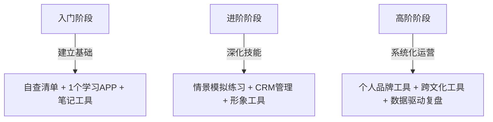

## 三、实用工具推荐

掌握社交礼仪，既需要理论学习，也需要在日常生活中反复实践和自我校准。好的工具能加速这个过程——它帮你建立习惯、提供即时反馈、降低遗忘成本。本节按使用场景分类，推荐从数字工具到实体物品的完整工具链，覆盖自查、学习、实操、进阶四个阶段。

### 3.1 礼仪自查清单：你的随身校准器

自查清单是最基础也最有效的工具。它的价值不在于"检查"本身，而在于**将无意识的行为转化为有意识的选择**。行为心理学研究表明，当人开始有意识地观察自己的某个行为时，该行为的改善率高达 60%（Kanfer & Goldstein, 1991）。清单的作用就是触发这种"有意识观察"。

#### 3.1.1 日常社交自查清单

**出门前 3 分钟检查（适用于所有外出场景）：**

| 检查项 | 标准 | 常见问题 |
|--------|------|----------|
| 着装整洁度 | 衣物无褶皱、无污渍、无破损；颜色搭配协调 | 领口发黄、袖口磨损、袜子颜色不搭 |
| 仪容干净度 | 面部清洁、头发整齐、指甲修剪、口气清新 | 头屑落在肩上、指甲过长、口腔异味 |
| 香水用量 | 喷 1-2 下即可，1 米外不应闻到 | 喷太多变成"嗅觉炸弹" |
| 随身物品 | 纸巾、名片（如有需要）、手机充满电 | 忘带纸巾、手机没电无法加微信 |

**社交互动中的行为检查：**

- [ ] 见到熟人时主动打招呼，不等对方先开口
- [ ] 握手时注视对方眼睛，力度适中（约 2 秒），不软绵绵也不捏疼对方
- [ ] 递名片/接名片时用双手，接到后认真看一眼再收好
- [ ] 对话中保持适当眼神接触（60%-70% 的时间），不一直盯着也不到处看
- [ ] 手机调静音或震动，不当众接打电话、不频繁看手机
- [ ] 与人同行时，主动为后面的人扶门；进出电梯时让对方先行
- [ ] 说"请""谢谢""对不起"的频率是否足够——大多数人用得太少
- [ ] 告别时有明确的结束语（如"今天聊得很开心"），不突然消失

#### 3.1.2 职场礼仪自查清单

**每日工作礼仪检查（建议设为每周提醒，逐项评估）：**

**守时维度：**
- [ ] 过去一周是否有迟到记录（会议、上班、约定）——0 次为合格
- [ ] 是否提前 5 分钟到达重要会议/会面
- [ ] 如果迟到，是否第一时间通知对方并道歉

**沟通维度：**
- [ ] 邮件是否包含主题行、称呼、正文、落款四要素
- [ ] 是否在 24 小时内回复工作消息和邮件（非紧急情况）
- [ ] 群聊中是否避免了语音消息轰炸、表情包刷屏
- [ ] 是否尊重他人的"请勿打扰"信号（降噪耳机、关着的门）

**协作维度：**
- [ ] 会议中是否控制了自己的发言时长，给他人留出空间
- [ ] 是否在公共区域保持低音量交谈
- [ ] 使用完公共设施（打印机、微波炉、会议室）后是否恢复原样
- [ ] 是否在分享他人工作成果时注明出处

#### 3.1.3 商务场景自查清单

**商务宴请检查表：**

| 阶段 | 检查要点 | 容易忽略的细节 |
|------|----------|----------------|
| 宴请前 | 确认对方饮食禁忌、宗教习惯、过敏史 | 是否提前了解了对方的职位和称呼方式 |
| 餐厅选择 | 环境安静、交通便利、有包间 | 是否确认了停车位、Wi-Fi、发票 |
| 座次安排 | 主位面门、主宾坐右、主人坐左 | 中式圆桌和西式长桌规则不同 |
| 点菜 | 先问忌口，荤素搭配，不点带壳/难夹的菜 | 是否准备了 2-3 道"安全菜"（大众口味） |
| 敬酒 | 先等主宾举杯，杯沿低于对方 | 是否准备了以茶代酒的得体说法 |
| 结账 | 提前买单或中途去洗手间时结账 | 不当着客人面看账单金额 |
| 送别 | 送至电梯/车旁，确认对方安全离开 | 是否在宴请后 24 小时内发感谢消息 |

**商务通讯自查：**

- [ ] 微信添加商务联系人时，附上自我介绍和来源说明
- [ ] 微信名/头像/朋友圈是否适合商务场合被看到
- [ ] 发送文件前确认文件名规范（不含"最终版""修改版3"等临时命名）
- [ ] 电话沟通前是否先发消息确认对方是否方便接听
- [ ] 视频会议前测试了摄像头、麦克风、背景环境

#### 3.1.4 如何有效使用自查清单

清单的价值在于**持续使用**而非一次填写。推荐以下方法：

1. **拍照存手机**：将最常用的 3-5 个清单截图设为手机备忘录，利用碎片时间扫一眼
2. **每周复盘**：选一个固定时间（如周日晚上），花 5 分钟对照清单回顾本周表现
3. **标记薄弱项**：连续 3 周都打勾的项目可以暂时移出清单，集中精力攻克未通过项
4. **场景触发**：将清单与特定场景绑定——比如"见客户前默念商务清单"、"进会议室前检查守时清单"

### 3.2 数字学习工具：系统化的知识获取

#### 3.2.1 专业礼仪 APP

**中文应用推荐：**

| APP名称 | 平台 | 核心功能 | 适用场景 | 费用 |
|---------|------|----------|----------|------|
| 金正昆礼仪讲座（音频版） | 喜马拉雅/得到 | 系统化音频课程，覆盖日常、职场、商务全场景 | 通勤路上系统学习 | 部分免费 |
| 社交礼仪百科 | 各应用商店 | 礼仪知识库+场景问答+自我测试 | 快速查询特定场景礼仪 | 免费+内购 |
| 普通话测试 | 各应用商店 | 发音纠正、语速控制、表达训练 | 提升口头表达的基础素养 | 免费 |
| 薄荷健康（间接相关） | iOS/Android | 饮食管理、体态管理 | 保持良好体态是礼仪外在基础 | 免费+会员 |

**英文应用推荐：**

| APP名称 | 平台 | 核心功能 | 特色 |
|---------|------|----------|------|
| Etiquette Scholar | Web/iOS | 全面的西式礼仪知识库 | 涵盖商务、餐桌、社交全场景 |
| Toastmasters（官方APP） | iOS/Android | 演讲训练、会议管理、反馈系统 | 提升公众表达和临场应变能力 |
| Table Manners | iOS | 餐桌礼仪互动学习 | 3D 模拟用餐场景，学习西餐礼仪 |
| Culture Trip | iOS/Android | 各国文化习俗指南 | 出国前快速了解目的地礼仪禁忌 |

**使用建议**：不要同时使用超过 2 个 APP。选择一个系统学习类 APP（如金正昆音频课程）+ 一个查漏补缺类 APP（如社交礼仪百科），效果最佳。

#### 3.2.2 语言学习工具

社交场合中，跨语言能力是巨大的加分项。以下工具帮助你掌握基本的外语社交用语：

| 工具名称 | 适用语言 | 学习方式 | 推荐理由 |
|----------|----------|----------|----------|
| Duolingo | 40+ 语言 | 游戏化闯关，每日 15 分钟 | 零基础友好，碎片时间可用 |
| Babbel | 14 种语言 | 对话场景驱动，强调实用表达 | 商务场景用语更丰富 |
| HelloTalk | 100+ 语言 | 与母语者文字/语音交流 | 真实社交场景的即时练习 |
| DeepL / Google 翻译 | 全语种 | 实时翻译 | 商务场景应急沟通，但不要依赖 |

**关键社交用语速查**（建议保存至手机备忘录）：

| 场景 | 英语 | 日语 | 韩语 |
|------|------|------|------|
| 初次见面 | Nice to meet you | はじめまして | 처음 뵙겠습니다 |
| 请多关照 | Please take care of me | よろしくお願いします | 잘 부탁드립니다 |
| 失陪一下 | Excuse me for a moment | ちょっと失礼します | 잠시 실례합니다 |
| 感谢款待 | Thank you for having me | お招きいただきありがとうございます | 초대해 주셔서 감사합니다 |
| 告别用语 | It was a pleasure meeting you | お会いできて嬉しかったです | 만나서 반가웠습니다 |

#### 3.2.3 在线学习网站与博客

**权威网站：**

| 网站 | 地址 | 定位 | 内容特色 |
|------|------|------|----------|
| Emily Post Institute | emilypost.com | 美国最权威礼仪机构 | 覆盖日常、商务、婚礼、数字礼仪，持续更新现代规范 |
| Debrett's | debrett.com | 英国礼仪权威 | 英式社交礼仪、贵族礼仪、国际礼仪指南 |
| 中国礼仪网 | 中国礼仪行业门户 | 中国礼仪行业综合平台 | 传统礼仪、现代商务礼仪、礼仪培训信息 |
| The Etiquette School of New York | etiquetteschool.com | 专业礼仪培训 | 商务礼仪、国际礼仪课程和咨询 |

**中文优质内容平台：**

| 平台 | 推荐搜索关键词 | 内容形式 | 质量筛选方法 |
|------|----------------|----------|-------------|
| 知乎 | "社交礼仪""商务礼仪""餐桌礼仪" | 长文+问答 | 看点赞数>500、作者有认证标签的回答 |
| B站 | "金正昆礼仪""商务礼仪教学""西餐礼仪" | 视频课程 | 优先选择高校教授或专业机构出品 |
| 微信公众号 | "社交礼仪""职场礼仪" | 图文+短视频 | 关注粉丝>10万、更新频率稳定的号 |
| 得到APP | "社交""沟通""礼仪" | 音频课程+电子书 | 选评分>4.5、购买人数>1万的课程 |
| 播客（小宇宙） | "社交""人际""礼仪" | 音频访谈 | 选择专业主持人或行业嘉宾的节目 |

**英文优质博客：**

- **The Art of Manliness**（artofmanliness.com）：男性社交礼仪、绅士行为准则、传统礼仪的现代应用
- **Corporette**（corporette.com）：女性职场着装和社交礼仪指南
- **Business Insider - Lifestyle**：商务社交场景分析、真实案例

#### 3.2.4 社交媒体形象管理工具

在数字时代，你的社交媒体账号就是你的"第二张名片"。以下工具帮助你管理线上形象：

| 工具 | 功能 | 适用平台 | 用途 |
|------|------|----------|------|
| Canva | 社交媒体封面/头像设计 | 微信、LinkedIn、Instagram | 制作专业、统一的个人品牌形象 |
| Linktree / 链接树 | 多链接聚合页面 | 全平台 | 在一个页面展示你的所有专业链接 |
| Grammarly | 英文写作检查 | 邮件、LinkedIn | 确保英文商务沟通无语法错误 |
| 秘塔写作猫 | 中文写作检查 | 邮件、微信 | 中文商务沟通的错别字和语病检查 |
| 醒图 / Snapseed | 照片编辑 | 朋友圈、LinkedIn | 职业形象照的基础修图 |

### 3.3 沟通与社交实操工具

#### 3.3.1 邮件礼仪模板

邮件是正式商务沟通的第一选择。以下模板覆盖最常见场景，可直接修改使用：

**初次商务联系邮件模板：**

主题：[公司名称][事项关键词] - [你的姓名]

[对方称呼] 您好：

我是[公司名称]的[职位]，[姓名]。[说明认识渠道：在XX会议上
有幸听取了您的分享 / 经XX介绍 / 了解到贵公司在XX领域的工作]。

[正文核心：简明扼要说明来意，2-3句话]
- 如果是请求：具体说明需要什么帮助，预计占用多长时间
- 如果是合作：说明合作方向和预期收益
- 如果是感谢：具体说明感谢的原因

如有方便，期待能与您进一步交流。我的联系方式如下：
电话：[号码]
微信：[微信号]

祝工作顺利！

[你的姓名]
[职位] | [公司]
[电话] | [邮箱]

**跟进未回复邮件的模板（发送后 3-5 个工作日）：**

主题：Re: [原邮件主题]

[对方称呼] 您好：

打扰了。之前发送了一封关于[简要主题]的邮件，不确定您是否
有时间查看。理解您工作繁忙，特此简要跟进：

[用1句话概括原始请求]

如需更多信息，我随时可以补充。感谢您的时间。

[你的姓名]

**邮件场景速查表：**

| 场景 | 主题行写法 | 称呼方式 | 回复时限 |
|------|-----------|----------|----------|
| 求职 | 应聘[岗位名称] - [姓名] - [来源] | 尊敬的HR / XX经理 | — |
| 邀请 | [活动名称]邀请函 - [日期] | [对方姓名]+职务 | 收到后 24 小时内回复 |
| 感谢 | 感谢[具体事项] - [姓名] | [对方姓名] | 事件后 24 小时内发送 |
| 道歉 | 关于[事件]的说明与致歉 | [对方姓名]+职务 | 越快越好，最迟当天 |
| 委婉拒绝 | Re: [原邮件主题] | [对方姓名] | 收到后 48 小时内回复 |

#### 3.3.2 社交消息回复话术库

微信/短信等即时通讯中的回复，决定了别人对你的第一印象和持续印象。

**常见场景回复对比：**

| 场景 | 不推荐回复 | 推荐回复 | 为什么 |
|------|-----------|----------|--------|
| 别人发来名片 | "收到" | "收到，已备注。[你的名字]，[你的职位/公司]，很高兴认识您！" | 给对方同步你的信息，建立双向连接 |
| 被邀请参加活动 | "好的" | "谢谢邀请！我确认一下日程，[时间]前给您回复，可以吗？" | 表达感谢+明确时间节点 |
| 别人帮忙后 | "谢谢" | "太感谢了！帮了大忙。下次有需要我帮忙的地方，尽管说。" | 具体化感谢+主动提供回馈 |
| 拒绝邀请 | "去不了" | "非常感谢邀请，遗憾这次时间冲突无法参加。希望下次有机会！" | 感谢+遗憾+留余地 |
| 久未联系的熟人 | "在吗？" | "XX你好，上次在[场合]见面后一直想联系。[说明来意或问候]" | 不浪费对方时间，直接说明目的 |
| 已读不回（对方的） | "？" / "怎么不回消息" | 换个方式联系，或间隔 1-2 天后温和跟进 | 尊重对方时间，不给压力 |

**回复时间的社交潜规则：**

- 工作消息：4 小时内回复（工作时间内），非工作时间可次日回复
- 社交消息：24 小时内回复
- 紧急消息：尽快回复，即使只是"收到，稍后详细回复"
- 群聊@你：当天回复
- 超过 24 小时未回复：回复时先说"抱歉回复晚了"，无需长篇解释

#### 3.3.3 电子名片工具

在无纸化时代，电子名片正在替代传统名片。以下是主流工具对比：

| 工具名称 | 平台 | 核心功能 | 费用 | 适用人群 |
|----------|------|----------|------|----------|
| 微信"名片"功能 | 微信 | 一键分享个人/企业微信名片 | 免费 | 所有人（中国社交场景首选） |
| LinkedIn | App/Web | 专业社交名片，含工作经历 | 免费+Premium | 国际商务场景 |
| CamCard（名片全能王） | iOS/Android | 扫描实体名片、电子名片管理 | 免费+VIP | 需要管理大量商务联系人 |
| HiHello | iOS/Android | 数字名片设计+分享+CRM | 免费+Pro | 追求个性化名片设计 |
| 干部网络学院名片 | 小程序 | 政务/事业单位专用名片 | 按机构 | 体制内工作者 |

**使用电子名片的最佳实践：**

1. **头像即第一印象**：使用专业拍摄的正面照，背景简洁，穿着得体。避免用风景照、卡通头像、墨镜照
2. **信息要完整**：姓名、公司、职位、电话、邮箱是必备项。LinkedIn 上还应填写行业
3. **及时更新**：换工作、换号码、升职后 24 小时内更新所有平台的名片信息
4. **分层展示**：微信朋友圈设置分组——客户组、同事组、朋友组展示不同内容

### 3.4 形象管理工具

#### 3.4.1 着装搭配工具

| 工具 | 类型 | 功能 | 适用场景 |
|------|------|------|----------|
| 小红书 | 社交平台 | 搜索"职场穿搭""商务着装"获取真人示范 | 日常穿搭灵感 |
| Pinterest | 图片平台 | 搜索"business casual""formal dress"获取国际风格参考 | 国际化着装参考 |
| 考拉海购/天猫 | 电商 | 品牌服装购买+搭配推荐 | 实际购买服装 |
| 穿搭类APP（如"小红衣橱"） | 工具 | 记录衣橱、规划搭配、避免重复购买 | 管理个人衣橱 |
| 得物 | 电商+社区 | 鞋服鉴定+穿搭社区 | 了解品牌真伪和搭配 |

**不同场合的着装速查表：**

| 场合 | 男性着装 | 女性着装 | 绝对禁忌 |
|------|----------|----------|----------|
| 日常职场 | 衬衫+西裤/卡其裤+皮鞋 | 衬衫/针织衫+半裙/西裤+中跟鞋 | 拖鞋、短裤、吊带 |
| 商务正式 | 深色西装+领带+皮鞋 | 套裙/套装+低跟鞋 | 牛仔裤、运动鞋 |
| 商务休闲 | Polo衫+西裤+乐福鞋 | 连衣裙/衬衫+西裤 | 运动装、过于随意 |
| 晚宴/酒会 | 深色西装（可不打领带） | 晚礼服/鸡尾酒裙 | 过于暴露或过于朴素 |
| 周末聚会 | 休闲衬衫+牛仔裤+休闲鞋 | 裙装/针织+休闲鞋 | 运动服（除非是运动场合） |

#### 3.4.2 仪容管理产品推荐

**基础护肤三件套（不分性别均适用）：**

| 步骤 | 推荐产品（平价） | 推荐产品（中端） | 作用 |
|------|-----------------|-----------------|------|
| 洁面 | 旁氏米粹氨基酸洁面 | 芙丽芳丝氨基酸洁面 | 清洁面部油脂和污垢 |
| 保湿 | 珂润面霜 | 理肤泉B5面霜 | 保持皮肤健康状态 |
| 防晒 | 碧柔水感防晒 | 安耐晒小金瓶 | 防紫外线、防止皮肤老化 |

**口腔护理（社交距离的核心）：**

| 产品 | 推荐 | 用途 | 使用频率 |
|------|------|------|----------|
| 电动牙刷 | 飞利浦/欧乐B | 高效清洁，减少口臭来源 | 每日早晚各 2 分钟 |
| 牙线 | 欧乐B扁线 | 清除牙缝残渣 | 每晚一次 |
| 漱口水 | 李施德林（温和型） | 饭后/社交前清新口气 | 饭后或社交前 |
| 舌苔刷 | 不锈钢材质 | 清除舌面细菌 | 每日晨起 |

**发型管理：**

- 男性：每 3-4 周理发一次，保持鬓角和后颈整洁；使用发蜡/发泥定型，避免用太多发胶
- 女性：根据脸型选择发型，社交场合扎起或整理好散发；使用干发喷雾控制油脂
- 通用：重要场合前 1-2 天理发（而非当天，留出"适应期"）

### 3.5 社交场景模拟与练习工具

#### 3.5.1 情景模拟练习

**AI 对话练习法：**

利用 AI 对话工具（如 ChatGPT、Kimi、豆包）模拟社交场景。这是零成本、零尴尬的练习方式。

推荐练习场景和提示词模板：

| 场景 | 提示词示例 |
|------|-----------|
| 自我介绍 | "请扮演一位商务活动的参与者，我来练习30秒自我介绍。请给我反馈：内容是否清晰、语气是否自信、是否需要改进。" |
| 敬酒词 | "假设你是我的领导，我在公司年会上向你敬酒。请帮我演练一段得体的敬酒词，然后给我改进建议。" |
| 委婉拒绝 | "请模拟以下场景：同事邀请我参加一个我并不想去的聚会。我练习委婉拒绝的表达，请给反馈。" |
| 冷场化解 | "假设我们在一个商务晚宴上，聊天突然冷场了。请模拟这个场景，让我练习如何自然地开启新话题。" |
| 道歉沟通 | "请模拟以下场景：我因为疏忽导致工作失误，需要向客户道歉。帮我练习一个得体的道歉方式。" |

**镜子练习法：**

对着镜子练习是最传统的也是最有效的方法之一：

1. **微笑练习**：嘴角上扬露出 6-8 颗牙齿，眼睛也跟着笑（"眼笑"）。每天练习 1 分钟
2. **站姿练习**：头顶好像被一根线提着，肩膀自然下沉，双脚与肩同宽。每天靠墙站立 3 分钟
3. **手势练习**：说话时双手自然放在身前或做出适当手势。避免抱臂、插兜、指指点点
4. **眼神练习**：对着镜子中的自己保持稳定的眼神接触，不游移。每次 30 秒

#### 3.5.2 社交复盘工具

每次重要社交活动后，花 5 分钟复盘能加速你的进步。

**复盘记录模板（建议保存至手机备忘录或笔记 APP）：**

日期：[年-月-日]
场景：[活动类型和场合]
参与人：[关键人物和关系]

做得好的：
1. [具体行为] → [正面结果]
2. ...

可以改进的：
1. [具体行为] → [更好的做法]
2. ...

下次注意：
1. [具体行动项]
2. ...

学到的新知识：
[例如：XX的称呼方式、某个行业的社交习惯]

**推荐笔记工具：**

| 工具 | 优势 | 适用场景 |
|------|------|----------|
| 备忘录（系统自带） | 最快打开，零学习成本 | 即时记录灵感和复盘 |
| Notion | 结构化模板，可建立社交数据库 | 长期系统性复盘 |
| Flomo（浮墨笔记） | 卡片式记录，标签分类 | 碎片化记录社交感悟 |
| 飞书文档 | 协作功能强 | 团队/家庭共享礼仪规范 |

### 3.6 跨文化社交工具

#### 3.6.1 文化差异速查工具

| 工具 | 类型 | 功能 | 适用场景 |
|------|------|------|----------|
| Hofstede Insights | 网站 | 输入国家名，查看文化维度对比 | 出国前/与外国人合作前 |
| Culture Trip | APP+网站 | 各国文化习俗、禁忌、礼仪指南 | 旅行和出差前快速了解 |
| Kwintessential | 网站 | 商务文化指南、翻译服务 | 国际商务场景 |
| 世界礼仪大全（书籍） | 参考书 | 100+ 国家的社交礼仪详解 | 深度研究特定国家文化 |

**常见文化差异速查表：**

| 事项 | 中国 | 日本 | 美国 | 中东 | 印度 |
|------|------|------|------|------|------|
| 问候方式 | 点头/握手 | 鞠躬 | 握手+眼神接触 | 同性握手/拥抱 | 合十礼（Namaste） |
| 名片交换 | 双手递接，看一眼 | 双手递接，仔细阅读 | 单手递，随意放 | 单手递 | 右手递 |
| 时间观念 | 灵活（15分钟内可接受） | 极度守时 | 守时（5分钟内） | 灵活（30分钟内） | 灵活 |
| 餐桌用筷/手 | 筷子 | 筷子 | 刀叉 | 右手 | 右手 |
| 小费文化 | 不常见 | 不要给 | 15%-20% | 不强制 | 不强制 |
| 禁忌话题 | 收入、年龄 | 二战、天皇 | 收入、年龄 | 宗教、政治敏感 | 种姓、牛 |
| 礼物禁忌 | 钟、伞、梨 | 白色包装、4件套 | 过于昂贵的礼物 | 酒、猪肉制品 | 牛皮制品 |

#### 3.6.2 时区和日历工具

国际社交中，尊重对方的时区是基本礼仪：

| 工具 | 功能 | 优势 |
|------|------|------|
| World Time Buddy | 多时区对比 | 直观显示各地当前时间，快速找到共同可用时段 |
| Calendly | 在线预约工具 | 让对方选择适合他们时区的时间，自动转换 |
| Google Calendar | 日历管理 | 设置多时区显示，发送邀请时自动转换时间 |
| 飞书日历 | 国内团队协作 | 时区转换+会议室预约+日程同步 |

### 3.7 物理工具与随身装备

#### 3.7.1 社交随身包清单

以下物品建议常备在随身包或办公室抽屉中：

| 物品 | 用途 | 推荐产品 | 优先级 |
|------|------|----------|--------|
| 纸巾/湿巾 | 个人清洁、应急 | Tempo/维达 | ★★★★★ |
| 便携漱口水 | 饭后/社交前清新口气 | 李施德林小瓶装 | ★★★★★ |
| 免洗洗手液 | 保持手部清洁 | 滴露便携装 | ★★★★☆ |
| 名片夹 | 保持名片整洁、有序 | 皮质名片夹 | ★★★★☆ |
| 小镜子 | 随时检查仪容 | 随身折叠镜 | ★★★☆☆ |
| 创可贴 | 应急（也用于给他人） | 防水型创可贴 | ★★★☆☆ |
| 便携充电宝 | 保持通讯畅通 | 10000mAh 足够 | ★★★★☆ |
| 万能转接头 | 会议/出差连接投影仪 | Type-C/HDMI 转接 | ★★★☆☆ |

#### 3.7.2 办公桌礼仪工具

你的办公桌是同事对你工作态度的"无声评价"：

- **整洁收纳**：文件架、笔筒、线缆收纳盒——避免桌面杂乱
- **降噪耳机**：佩戴即表示"请勿打扰"，这是全球通用的职场信号
- **绿植**：一小盆绿植（如绿萝、多肉）能提升环境亲和力
- **请勿打扰/欢迎来访标识**：小桌牌或门挂牌，明确你的状态

### 3.8 进阶工具：数据驱动的社交能力提升

#### 3.8.1 社交网络管理 CRM

当你需要管理大量社交关系时，可以借助轻量级 CRM 工具：

| 工具 | 适合场景 | 核心功能 | 费用 |
|------|----------|----------|------|
| 微信标签+备注 | 日常社交 | 给联系人打标签、写备注（如认识时间、场合、关键信息） | 免费 |
| Notion 社交数据库 | 系统化管理 | 建立联系人数据库，记录互动历史和跟进计划 | 免费+付费 |
| 钉钉/飞书通讯录 | 职场社交 | 企业通讯录、组织架构、联系人搜索 | 免费 |
| HubSpot CRM | 商务社交 | 专业客户关系管理、邮件追踪、日程提醒 | 免费起步 |

**微信联系人管理最佳实践：**

1. **添加时**：备注格式建议为 `[姓名]-[公司/学校]-[认识场景]`，如"张三-腾讯-2024产品经理大会"
2. **标签分组**：建立"工作""客户""行业朋友""生活"等标签组
3. **定期整理**：每季度花 30 分钟检查标签和备注是否需要更新
4. **生日提醒**：在日历中设置重要联系人的生日，及时送上祝福

#### 3.8.2 个人品牌监测工具

如果你需要建立或维护个人品牌，以下工具帮助你了解外界对你的认知：

| 工具 | 功能 | 用途 |
|------|------|------|
| 百度搜索/Google | 搜索自己的名字 | 了解公开信息中别人看到的你 |
| 脉脉 | 职场社交平台 | 了解行业人脉中的口碑 |
| LinkedIn Profile Views | 查看谁看了你的主页 | 了解你的社交吸引力 |
| 新榜/飞瓜 | 内容平台分析 | 如果运营个人账号，监测内容表现 |

### 3.9 工具选择建议：根据阶段和场景匹配

不同阶段的人需要不同的工具组合。以下是针对三个阶段的推荐：

**入门阶段（0-3 个月）—— 重点：建立习惯**

| 工具类型 | 推荐 | 每日投入时间 |
|----------|------|-------------|
| 自查清单 | 日常社交清单（打印/截图） | 2 分钟 |
| 学习 APP | 金正昆音频课程（通勤听） | 15-30 分钟 |
| 笔记工具 | 手机备忘录（随时记录社交感悟） | 5 分钟 |
| 模拟练习 | AI 对话练习（每周 1 次，每次 10 分钟） | 10 分钟/周 |

**进阶阶段（3-12 个月）—— 重点：场景拓展**

| 工具类型 | 推荐 | 每日投入时间 |
|----------|------|-------------|
| 职场清单 | 商务礼仪清单 + 餐桌礼仪清单 | 3 分钟 |
| 专业学习 | Coursera/LinkedIn Learning 课程 | 30 分钟 |
| 社交管理 | 微信标签系统 + 联系人备注 | 每周 15 分钟 |
| 形象管理 | 着装搭配APP + 护肤产品 | 10 分钟 |
| 复盘 | Notion/Flomo 社交复盘日志 | 每次社交后 5 分钟 |

**高阶阶段（12 个月以上）—— 重点：系统化与个性化**

| 工具类型 | 推荐 | 投入频率 |
|----------|------|----------|
| 跨文化工具 | Hofstede Insights + 文化地图 | 按需使用 |
| 个人品牌 | 搜索引擎监测 + LinkedIn 优化 | 每月 1 次 |
| 社交 CRM | Notion 数据库 / HubSpot | 每周 30 分钟维护 |
| 持续学习 | 高级课程 + 社交活动实践 | 持续进行 |

### 3.10 常见误区与纠正

**误区 1：收集了大量工具但从不使用**

很多人下载了一堆 APP、收藏了一堆网站，但从不打开。工具的价值在于使用频率，而非数量。**建议**：精选 2-3 个工具，坚持使用 21 天养成习惯后再考虑增加。

**误区 2：过度依赖工具，忽视真实互动**

对着 APP 学礼仪和在真实场景中练习，效果差距是 10 倍以上。工具是辅助，不是替代。**建议**：学一个知识点后，48 小时内必须在真实场景中实践一次。

**误区 3：用工具模板回答显得"太假"**

直接复制粘贴话术模板会让回复显得生硬。**建议**：把模板当作骨架，根据你和对方的关系、语气习惯来调整措辞。核心原则是真诚，工具帮你表达真诚，而不是替代真诚。

**误区 4：只关注线上形象，忽视线下表现**

花大量时间美化 LinkedIn 主页，但见面时表现不佳。**建议**：线上线下投入时间比控制在 3:7——线下真实的你才是核心竞争力。

**误区 5：清单打勾等于"做到了"**

清单打勾可能只是自我欺骗。**建议**：在重要社交活动后，主动问信任的朋友"你觉得我今天表现怎么样"。真实反馈比自我评估准确 10 倍。

### 3.11 本节核心要点

1. **工具不在多，在于精**：一个自查清单 + 一个学习工具 + 一个记录工具，足以覆盖 90% 的需求
2. **自查清单是最高效的入门工具**：将无意识行为转为有意识选择，立竿见影
3. **模板是骨架不是答案**：所有话术模板都需要根据你的个人风格进行调整
4. **社交复盘是进步的加速器**：每次重要社交后花 5 分钟记录，一年后回看进步会非常明显
5. **工具服务于人，而非人服务于工具**：当某个工具变成了负担而不是帮助时，果断放弃它
6. **真实互动永远比模拟练习更有效**：工具帮你准备，但真正的成长发生在与真人交往的每一刻
