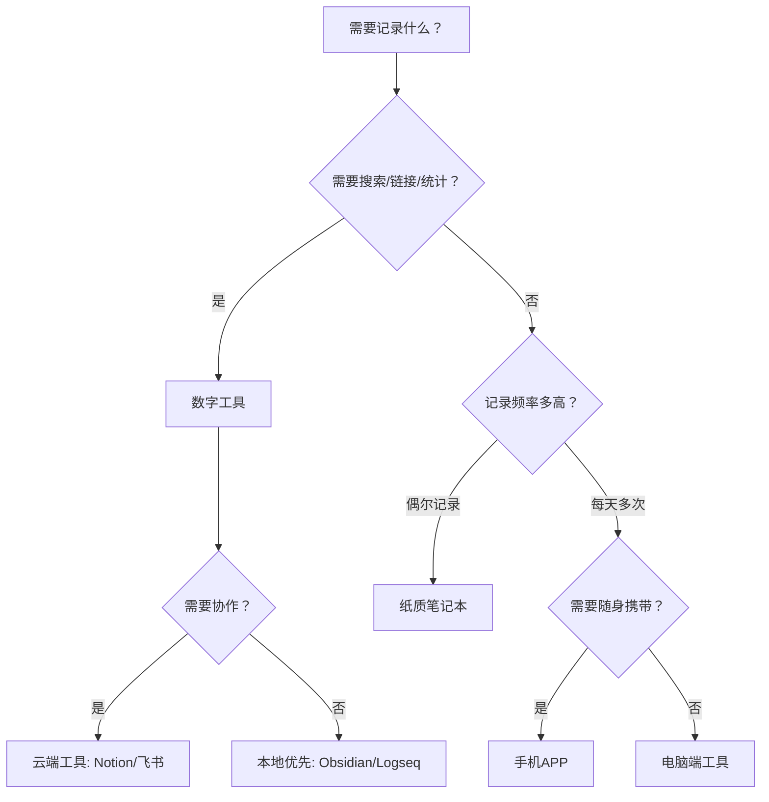
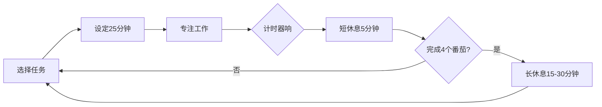
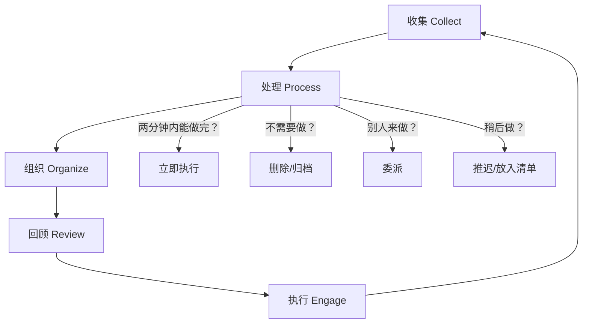
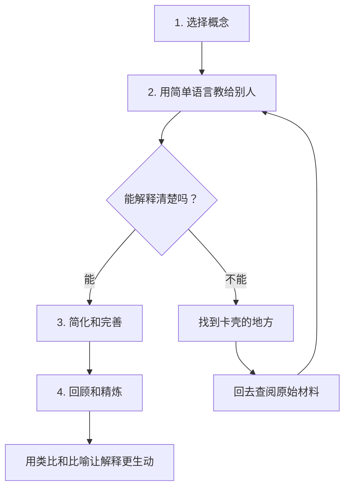

# 附录二：工具清单

> 工具是杠杆，不是答案。一把好锤子能让钉子进得更深，但前提是你知道该钉在哪里。本附录整理了个人提升全过程中最实用的工具、方法和系统——从目标设定到情绪调节，从知识管理到健康监测。每一种工具都附带原理说明、操作步骤、常见误区和进阶用法，帮你选对工具、用对方法、形成系统。

---

## 一、工具选择的核心原则

在逐一介绍具体工具之前，先建立选择工具的底层逻辑。很多人陷入"工具收集癖"——下载了十几个APP，每个用了三天就弃掉。问题不在工具本身，而在于选择和使用的方法。

### 1.1 五条选工具铁律

| 原则 | 说明 | 反面案例 |
|------|------|----------|
| **简单优先** | 能用纸笔解决的，不要用APP。越简单的工具摩擦成本越低，越容易坚持 | 为了记录喝水量下载一个带社交功能的APP，结果花在APP上的时间比喝水还多 |
| **单一系统** | 同类任务只用一个工具，避免信息散落在多处 | 目标写在Notion、待办在滴答清单、日记在DayOne，三个系统互相不知道彼此的存在 |
| **够用即止** | 工具的功能够用就行，不需要80%你用不到的功能 | 用Excel记个账，却花两天学VBA宏 |
| **定期清理** | 每季度审视一次工具栈，砍掉3个月没打开过的工具 | 手机里存了20个效率APP，真正每天用的只有微信和日历 |
| **行动为王** | 任何工具都无法替代你实际去做。如果工具变成了拖延的借口，果断放弃 | 花一整天对比哪款笔记软件更好，结果一个字也没记 |

### 1.2 纸质 vs 数字：如何选择

**纸质工具的优势：** 书写过程本身增强记忆编码（普林斯顿大学2014年研究证实手写笔记比打字的理解深度高29%）；没有通知干扰；不受电量限制；视觉触觉协同增强记忆锚定。

**数字工具的优势：** 全文搜索秒级定位；跨设备同步；自动统计和可视化；链接和引用方便知识网络构建；模板复用减少重复劳动。

**最佳实践：** 大多数人适合"混合模式"——用纸笔做深度思考和每日规划（晨间日志、手绘思维导图），用数字工具做长期存储和检索（知识库、项目管理、数据追踪）。

---

## 二、目标管理工具

目标管理是一切自我提升的起点。没有清晰的目标，时间管理、习惯养成都是在没有方向的路上加速奔跑。

### 2.1 OKR 框架（目标与关键结果）

**来源与原理：** OKR 由英特尔前CEO安迪·格鲁夫发明，被谷歌在1999年大规模采用并推广至全球。其核心理念是：目标要有野心（完成70%即为理想），关键结果必须可量化、有时限。

**适用场景：** 季度/年度目标设定与对齐；团队目标分解（本附录聚焦个人使用）

**标准结构：**

O（Objective）：设定1-3个鼓舞人心的目标
  KR1（Key Result）：可量化的关键结果1 → 截止日期
  KR2（Key Result）：可量化的关键结果2 → 截止日期
  KR3（Key Result）：可量化的关键结果3 → 截止日期

**完整示例：**

O1：建立稳定的运动习惯（季度目标）
  KR1：每周运动不少于4次，持续12周        → 6月30日  评分：___
  KR2：完成一次10公里跑                    → 5月15日  评分：___
  KR3：体脂率从22%降至18%                  → 6月30日  评分：___

O2：提升专业竞争力（季度目标）
  KR1：完成《XX领域》系统课程，通过率>90%   → 5月31日  评分：___
  KR2：在团队内做2次技术分享                → 6月15日  评分：___
  KR3：输出3篇高质量技术博客                → 6月30日  评分：___

**评分标准：**

| 分值 | 含义 |
|------|------|
| 0.0-0.3 | 几乎没有进展 |
| 0.4-0.6 | 有进展但未达预期 |
| 0.7 | 理想完成度（谷歌标准下的"成功"） |
| 0.8-1.0 | 超额完成（可能目标定得太低） |

**常见误区：**

- **把KR写成任务清单。** KR是结果，不是动作。"每天跑步30分钟"是任务，"10公里跑进55分钟"才是关键结果。
- **目标太多。** 个人OKR同一时期不超过3个O，每个O不超过5个KR。精力分散等于没有目标。
- **设置后不管。** OKR需要每周review进度，每月做一次正式复盘。不review的OKR等于没写。
- **把OKR和绩效考核混为一谈。** 个人使用时，OKR是方向指引，不是惩罚工具。完成60%-70%已经是好成绩。

### 2.2 SMART 目标法

**来源与原理：** SMART 由管理学家乔治·多兰在1981年提出，是目标设定领域最经典的框架。五个字母分别代表目标必须满足的五个约束条件——缺任何一个，目标就容易落空。

**五要素详解：**

| 要素 | 含义 | 模糊目标 | SMART目标 |
|------|------|----------|-----------|
| **S** - Specific | 具体明确 | "我要变健康" | "我要把静息心率降到70以下" |
| **M** - Measurable | 可衡量 | "我要多读书" | "我要读完12本非虚构类书籍" |
| **A** - Achievable | 可达成 | "我要一个月瘦20斤" | "我要每周减重0.5公斤" |
| **R** - Relevant | 相关性强 | "我要学画画"（但职业是程序员） | "我要学数据可视化"（与职业发展直接相关） |
| **T** - Time-bound | 有时限 | "我要学会Python" | "我要在3个月内用Python完成一个数据分析项目" |

**自检清单：**

- [ ] 目标是否足够具体，别人听了能准确理解你想做什么？
- [ ] 是否有明确的量化指标，完成与否一目了然？
- [ ] 以你当前的资源和能力，这个目标是否在合理挑战范围内？
- [ ] 这个目标是否与你当前阶段的人生重点一致？
- [ ] 是否有明确的截止日期和中间里程碑？

**SMART 的局限性：** SMART适合单项具体目标，但不适合管理复杂的目标体系。如果你同时有5个以上的目标需要追踪，建议用OKR做上层框架，每个KR用SMART来细化。

### 2.3 人生平衡轮

**原理：** 人生平衡轮（Wheel of Life）源自教练技术领域，由保罗·梅耶（Paul J. Meyer）创立的"成功激励机构"推广。其核心洞察是：人的幸福感不取决于某个维度的极致表现，而取决于各维度的均衡发展。一个在事业上打10分但健康只有2分的人，整体生活质量远不如各维度都在7分的人。

**八个核心维度：**

| 维度 | 评估问题 |
|------|----------|
| 职业发展 | 你对当前的工作/事业方向满意吗？有清晰的成长路径吗？ |
| 财务状况 | 你的收入能支撑理想生活吗？有应急储备和投资规划吗？ |
| 健康运动 | 你的身体状况如何？有持续的运动习惯吗？ |
| 亲密关系 | 你与伴侣/家人的关系质量如何？情感需求是否被满足？ |
| 家庭关系 | 你与父母、兄弟姐妹的关系如何？家庭义务是否平衡？ |
| 社交友谊 | 你有可信赖的朋友吗？社交质量如何？ |
| 个人成长 | 你在持续学习和进步吗？有明确的成长方向吗？ |
| 休闲娱乐 | 你有让自己真正放松和快乐的活动吗？ |

**操作步骤：**

1. 画一个圆，分成8个扇形，每个扇形代表一个维度
2. 每个扇形从圆心（0分）到边缘（10分）标10个刻度
3. 对每个维度的当前满意度打分（诚实面对，不要自我美化）
4. 将相邻分值点用线段连接，形成一个不规则的"轮子"
5. 观察轮子的形状——越不圆，说明越失衡
6. 找出最低分的1-2个维度，作为本季度重点改善方向

**进阶用法——双轮对比：** 画两个轮子，一个是"现状轮"（你现在的状态），一个是"理想轮"（你希望6个月后的状态）。两者差距最大的维度，就是需要优先投入精力的地方。

### 2.4 目标管理工具推荐

| 工具 | 类型 | 优势 | 适合人群 | 价格 |
|------|------|------|----------|------|
| **滴答清单** | APP | 待办+日历+番茄钟合一，中文体验好 | 喜欢一体化工具的人 | 免费/Pro ¥139/年 |
| **Notion** | 全能工作台 | OKR模板+数据库+看板，灵活度极高 | 喜欢折腾和自定义的人 | 免费/Pro $8/月 |
| **Obsidian** | 本地笔记 | 双向链接+本地存储，配合Goals插件可用 | 注重隐私的技术型用户 | 免费 |
| **纸质手帐** | 纸质 | 零学习成本，手写增强记忆 | 喜欢仪式感和手写的人 | ¥30-100 |
| **飞书多维表格** | 在线表格 | 表格+看板+甘特图，团队协作友好 | 需要团队对齐的人 | 免费 |

---

## 三、时间管理工具

时间管理的本质不是"做更多的事"，而是"把时间花在真正重要的事上"。

### 3.1 番茄工作法

**来源与原理：** 由弗朗西斯科·西里洛（Francesco Cirillo）在1980年代末发明，因他使用的厨房计时器形状像番茄而得名。其科学基础是"注意力的脉冲式运作"——人的专注力天然以25-45分钟为一个周期波动，在疲劳之前主动休息，比硬撑到崩溃的总产出更高。

**标准流程：**

**五条实操规则：**

1. **番茄钟不可分割。** 一个番茄钟是25分钟的原子单位，不能在中间暂停做别的事。
2. **被打断就作废。** 如果被不可避免的打扰中断（同事找你、紧急电话），这个番茄钟作废，重新开始。
3. **提前完成不提前结束。** 如果任务在15分钟内完成了，剩余时间用于"过度学习"——回顾、优化、预习下一步。
4. **预估番茄数。** 开始前预估任务需要几个番茄钟，完成后对比实际用时，逐步提高预估准确度。
5. **记录追踪。** 每天记录完成了多少个番茄钟，用于分析自己的专注力趋势。

**进阶调整：** 25分钟不是金科玉律。如果你发现25分钟太短（经常进入心流被打断），可以尝试50分钟工作+10分钟休息。关键是找到自己的"注意力脉冲周期"——大多数人落在25-50分钟之间。

**推荐工具：**

| 工具 | 平台 | 特色 |
|------|------|------|
| Forest（专注森林） | iOS/Android | 种树激励机制，放下手机树才能长 |
| 滴答清单内置番茄钟 | 全平台 | 与任务管理无缝衔接 |
| Pomofocus | 网页版 | 免费、极简、无需注册 |
| 物理计时器 | 实体 | 零干扰，翻转即开始 |

### 3.2 四象限法则（艾森豪威尔矩阵）

**来源与原理：** 美国第34任总统德怀特·艾森豪威尔曾说："紧急的事很少是重要的，重要的事很少是紧急的。"这个矩阵将所有任务按"重要"和"紧急"两个维度分为四类，帮你做出更明智的时间分配决策。

              紧急                    不紧急
  ┌────────────────────────┬────────────────────────┐
  │      第一象限           │      第二象限           │
重│      立即做             │      计划做             │
要│                        │                        │
  │ · 临近截止的项目       │ · 长期学习和技能提升   │
  │ · 突发危机处理         │ · 运动和健康管理       │
  │ · 紧急客户需求         │ · 关系维护和深度沟通   │
  │ · 生病就医             │ · 战略规划和复盘       │
  ├────────────────────────┼────────────────────────┤
  │      第三象限           │      第四象限           │
不│      委托/简化          │      尽量不做           │
重│                        │                        │
要│ · 大部分会议           │ · 无目的刷社交媒体     │
  │ · 常规邮件回复         │ · 过度追剧/游戏        │
  │ · 部分行政事务         │ · 无意义的争论         │
  │ · 别人甩过来的活       │ · 完美主义的细节雕琢   │
  └────────────────────────┴────────────────────────┘

**核心策略——扩大第二象限：**

大多数人把80%的时间花在第一象限（救火）和第三象限（忙碌但不重要），只有不到10%花在第二象限。但真正改变人生轨迹的是第二象限的活动。你今天花1小时学的技能，可能在三年后帮你省下1000小时。

**具体操作方法：**

1. **每天早上**把当天所有待办事项写下来
2. **逐项分类**到四个象限（诚实面对——很多你以为"紧急"的事其实并不重要）
3. **时间分配目标：** 第一象限≤20%，第二象限≥50%，第三象限委托或批量处理，第四象限压缩到≤5%
4. **批量处理第三象限：** 把邮件回复、行政事务集中到固定时段（如每天下午4:00-4:30统一处理），而不是全天随时响应
5. **设立"第二象限保护时间"：** 每天固定2小时深度工作，这段时间手机静音、关闭通知、不接受打扰

**常见误区：**

- 把"紧急"和"重要"混为一谈。刷朋友圈不紧急也不重要，但因为它"快速能做完"，你总是优先做它。
- 不敢对第三象限说"不"。别人让你帮忙的事大部分属于第三象限——对别人重要，对你不重要。学会礼貌拒绝或延迟处理。
- 忽略第二象限的"复利效应"。运动、学习、关系维护的收益是延迟的、累积的，不会立刻给你正反馈，但半年后差距会非常明显。

### 3.3 时间块规划法（Time Blocking）

**原理：** 卡尔·纽波特（Cal Newport）在《深度工作》中强力推荐的方法。核心理念是：不要靠意志力来决定做什么——提前把时间分配好，到了时间就切换到预设任务，减少决策疲劳。

**操作步骤：**

1. 前一天晚上或当天早上，把一天划分为若干时间块（30分钟或1小时为单位）
2. 为每个时间块分配特定类型的活动（不是具体任务，而是任务类型）
3. 保留20-30%的弹性时间应对突发情况
4. 在时间块内只做对应类型的事——不要在"深度工作块"里回消息

**示例模板（适合知识工作者）：**

06:00-06:45  晨间仪式    → 运动/冥想/冷水澡
06:45-07:30  输入时间    → 阅读/播客/学习
07:30-08:00  规划时间    → 回顾昨日+规划今日
08:00-10:00  深度工作1   → 最重要的创造性工作（关通知）
10:00-10:15  休息        → 走动/拉伸/喝水
10:15-12:00  深度工作2   → 第二项核心任务
12:00-13:30  午餐+休息   → 午睡20分钟效果显著
13:30-15:00  协作时间    → 会议/沟通/讨论
15:00-15:15  休息        → 短暂离开屏幕
15:15-16:30  执行时间    → 常规任务/邮件/行政
16:30-17:00  日回顾      → 今日总结+明日规划
17:00-18:30  个人生活    → 通勤/晚餐/家务
18:30-20:30  成长时间    → 副业/学习/爱好
20:30-21:30  关系时间    → 家人/朋友/伴侣
21:30-22:00  晚间仪式    → 阅读/冥想/准备入睡

**进阶技巧——主题日：** 如果你的工作类型多样，可以给每天设定一个主题。比如周一=战略规划日，周二=写作日，周三=会议日，周四=学习日，周五=复盘日。这样可以减少上下文切换的认知损耗。

### 3.4 GTD（Getting Things Done）

**来源与原理：** 大卫·艾伦（David Allen）在2001年提出的系统化工作流管理方法。核心思想是：大脑是用来产生想法的，不是存储想法的。把所有未完成的事项从大脑中"卸载"到一个可信赖的外部系统，大脑才能真正放松并专注于当下。

**五步工作流：**

1. **收集（Collect）：** 把所有占据你大脑的事项写下来——工作任务、个人想法、待读文章、购物需求……任何让你惦记的事。用一个统一的"收集箱"（笔记本或APP收件箱）。
2. **处理（Process）：** 逐条处理收集箱里的每一项。问自己："这件事需要行动吗？"如果不需要，删除或归档。如果需要行动且2分钟内能做完，立即执行。
3. **组织（Organize）：** 需要行动但不能立即做的，归入对应的清单——项目清单、下一步行动清单、等待清单（委派给别人的）、日程表（有固定时间的）。
4. **回顾（Review）：** 每周做一次"周回顾"——清空收件箱、审视所有清单的进展、更新项目状态、规划下周重点。这是GTD最关键的环节，不做回顾的GTD会迅速退化为一堆没人看的清单。
5. **执行（Engage）：** 根据情境、时间、精力和优先级，从清单中选择当前最该做的事。

**GTD最适合的场景：** 同时处理多个项目，每天有大量不同类型的任务和信息输入，经常感觉"脑子里一团乱"的人。GTD的强项是"清空大脑"，但不擅长目标管理——建议配合OKR或SMART一起使用。

---

## 四、知识管理工具

知识管理的目标不是"收集更多信息"，而是"让知识在需要的时候能被找到和使用"。

### 4.1 卡片笔记法（Zettelkasten）

**来源与原理：** 德国社会学家尼克拉斯·卢曼（Niklas Luhmann）使用这套方法一生发表了70多本书和400多篇论文。他的笔记系统包含约9万张卡片，通过编号和交叉引用形成了一张巨大的知识网络。

**核心原则：**

- **一张卡片一个想法。** 不要在一张卡片上写多个概念。每个原子化的笔记更容易被重新组合。
- **用自己的话写。** 不要复制粘贴原文。用自己的语言重新表述，迫使你真正理解。
- **建立链接。** 新卡片写完后，问自己："这个想法和我已有的哪些想法有关？"建立双向链接。
- **顺序不重要，链接才重要。** 不需要提前分类——笔记之间的链接自然会形成结构。

**三种笔记类型及处理流程：**

| 类型 | 来源 | 生命周期 | 处理方式 |
|------|------|----------|----------|
| **闪念笔记** | 灵感、随想、碎片想法 | 1-2天内处理 | 转化为永久笔记或删除 |
| **文献笔记** | 阅读/学习时的记录 | 保留原始出处 | 提炼核心观点后转化为永久笔记 |
| **永久笔记** | 经过思考的独立知识卡片 | 永久保存 | 放入知识库，建立链接 |

**操作示例——从阅读到永久笔记：**

原文："番茄工作法的核心不是25分钟这个数字，而是'专注-休息'的节奏切换。"
——《番茄工作法图解》第3章

我的文献笔记：
- 番茄钟的本质 = 节奏管理，不是时间管理
- 25分钟是经验值，可调整
- 关键是"进入专注→保持→主动休息"的循环

转化为永久笔记（用自己的话）：
"专注力不是恒定的，而是波浪式的。番茄工作法之所以有效，
是因为它顺应了注意力的自然节奏——在波峰时专注，在波谷时
休息。与其强迫自己连续工作4小时，不如分成多个'专注冲刺'
+短休息的循环。这类似于运动中的间歇训练（HIIT），单位时间
的产出反而更高。

→ 链接：[[间歇训练原理]]、[[心流状态]]、[[注意力恢复理论]]"

**推荐工具深度对比：**

| 工具 | 存储方式 | 链接能力 | 学习成本 | 插件生态 | 适合谁 |
|------|----------|----------|----------|----------|--------|
| **Obsidian** | 本地Markdown | 双向链接+图谱 | 中等 | 极丰富（2000+插件） | 重度笔记用户、程序员、研究者 |
| **Logseq** | 本地Markdown | 双向链接+大纲 | 中等 | 丰富 | 喜欢大纲式思维的人 |
| **Notion** | 云端 | 弱（数据库关联） | 低 | 无插件但模板多 | 喜欢所见即所得的人 |
| **语雀** | 云端 | 一般 | 低 | 无 | 团队知识库 |
| **Heptabase** | 云端 | 白板+卡片 | 低 | 无 | 视觉化思维的人 |
| **纯文本文件夹** | 本地 | 手动链接（[[wikilink]]） | 极低 | 无 | 极简主义者 |

### 4.2 费曼学习法

**原理：** 诺贝尔物理学奖得主理查德·费曼的学习方法论，被总结为"以教促学"。认知科学中对应的概念是"生成效应"（Generation Effect）——主动用自己的话解释比被动阅读的记忆保持率高40%-70%。

**四步流程：**

**具体操作指南：**

1. **选择一个你正在学习的概念。** 比如"什么是复利效应"。
2. **假装教给一个12岁小孩。** 不用任何行话术语，只用最简单的词汇和生活中的例子。比如："你把钱借给银行，银行每年给你利息。第二年，利息也会产生利息——就像滚雪球，越滚越大。"
3. **发现卡壳的地方。** 当你发现自己说不清楚，或者只能用"总之就是……"来糊弄的时候，那里就是你的知识盲区。回去翻书、查资料，直到你能用自己的话说清楚。
4. **简化和类比。** 最好的解释都有一个精准的类比。复利就像"滚雪球"，DNA就像"生命的源代码"，递归就像"俄罗斯套娃"。

**实践方法：**

- **费曼笔记本：** 每学一个新概念，用一页纸写出"如果教给别人，我会怎么说"
- **录视频/音频：** 对着手机摄像头讲解，回看时你会发现自己哪里在含糊其辞
- **写博客/公众号：** 公开写作是最好的费曼练习——因为有读者，你必须把话说清楚
- **学习小组中轮流讲解：** 每次学习会指定一个人讲解本周学到的核心概念

### 4.3 思维导图

**原理：** 由托尼·布赞（Tony Buzan）在1970年代提出。思维导图模拟了大脑的放射性思维模式——一个中心概念向外发散出多个分支，每个分支再细分为更小的子分支。相比线性笔记，思维导图更符合大脑的自然联想方式，有助于整体把握和创造性思考。

**绘制原则：**

1. **中心放主题，向外发散。** 一张图只说一个大主题。
2. **主分支不超过7个。** 人的工作记忆容量为7±2个项目（米勒定律），超过7个分支就记不住了。
3. **用关键词，不用长句。** 每个节点一个关键词或短语（不超过5个字），而不是一整句话。
4. **颜色编码。** 每个主分支用不同颜色，帮助视觉区分和记忆。
5. **加图标和符号。** 重要的节点加星号、感叹号或小图标，增强视觉锚点。
6. **定期迭代。** 思维导图不是一次性的，随着理解加深要持续更新。

**三种使用场景：**

| 场景 | 用法 | 效果 |
|------|------|------|
| **学习笔记** | 读完一章书后，凭记忆画思维导图，再对照原文补充 | 被动笔记→主动回忆，记忆保持率提升200% |
| **头脑风暴** | 把核心问题放中心，快速联想所有相关的想法，不评判不筛选 | 5分钟产生30+个想法 |
| **项目规划** | 中心放项目目标，分支放各工作流，子分支放具体任务 | 全局视角，不遗漏关键环节 |

**推荐工具：**

| 工具 | 特色 | 价格 |
|------|------|------|
| XMind | 功能全面，模板丰富，导出格式多 | 免费版够用/Pro ¥388/年 |
| 幕布 | 大纲笔记一键转思维导图 | 免费/Pro ¥99/年 |
| ProcessOn | 在线协作，支持流程图+思维导图 | 免费（有数量限制） |
| 手绘+纸笔 | 零门槛，手写增强记忆，随时可用 | 纸笔成本 |

### 4.4 渐进式摘要（Progressive Summarization）

**原理：** 由蒂亚戈·福特（Tiago Forte）在PARA方法论中提出。核心思想是：不要一次性把笔记整理完美——分层摘要，每次用到时再提炼一层。

**五个层级：**

| 层级 | 操作 | 示例 |
|------|------|------|
| L0 | 原始笔记 | 原文摘录的整段话 |
| L1 | 加粗关键句 | 把核心观点的句子加粗 |
| L2 | 高亮核心短语 | 在加粗句中再高亮最关键的几个词 |
| L3 | 写一句话摘要 | 在笔记顶部用自己的话总结核心要点 |
| L4 | 融入自己的作品 | 把提炼后的观点写入博客/报告/课程 |

**为什么有效：** 大部分笔记你不会再看第二遍。L1-L2的笔记已经足够快速回忆。只有真正被反复使用的笔记才值得做到L3-L4。这避免了"整理笔记的时间比用笔记的时间还长"的问题。

---

## 五、习惯追踪工具

习惯是自我提升的基础设施——它把需要意志力的行为变成自动驾驶。

### 5.1 习惯追踪表

**原理：** 杰瑞·宋飞（Jerry Seinfeld）的"不断链"法则——每天完成习惯后在日历上画一个X，连续的X链会形成强烈的视觉激励，让你不想"断链"。

**纸质版模板：**

习惯名称：每天阅读30分钟          月份：____年____月

┌────┬────┬────┬────┬────┬────┬────┐
│ 一 │ 二 │ 三 │ 四 │ 五 │ 六 │ 日 │
├────┼────┼────┼────┼────┼────┼────┤
│ ✓  │ ✓  │ ✓  │ ✓  │ ✓  │    │    │ ← 第1周
├────┼────┼────┼────┼────┼────┼────┤
│ ✓  │ ✓  │ ✗  │ ✓  │ ✓  │ ✓  │    │ ← 第2周
├────┼────┼────┼────┼────┼────┼────┤
│    │    │    │    │    │    │    │ ← 第3周
├────┼────┼────┼────┼────┼────┼────┤
│    │    │    │    │    │    │    │ ← 第4周
└────┴────┴────┴────┴────┴────┴────┘

本月统计：完成___天 / 30天 = ___%
连续最长天数：___天

**数字工具推荐：**

| 工具 | 平台 | 特色 |
|------|------|------|
| Habitica | 全平台 | 游戏化——习惯养成变成RPG打怪升级 |
| Streaks | iOS | 苹果设计奖，极简美观，最多追踪12个习惯 |
| Loop Habit Tracker | Android | 开源免费，统计图表强大 |
| 滴答清单 | 全平台 | 习惯+待办合一 |
| 纸质日历 | 实体 | 视觉冲击力最强，放在桌上每天提醒 |

**多习惯同时追踪的注意事项：** 同时培养的新习惯不超过3个。研究表明，意志力是有限资源，同时改变太多行为会快速耗竭导致全部放弃。先巩固一个习惯（通常需要21-66天），再叠加新的。

### 5.2 习惯堆叠法（Habit Stacking）

**原理：** 詹姆斯·克利尔（James Clear）在《原子习惯》中提出。利用大脑已有的神经通路——把新习惯"嫁接"到已经稳固的旧习惯上，让旧习惯成为新习惯的触发器。

**公式：** 在 [当前习惯] 之后，我会 [新习惯]

**设计规则：**

1. **锚定习惯必须是已经在做的。** 不要用一个还没稳固的习惯去触发新习惯。
2. **新习惯必须极小。** 开始时只做2分钟版本——"读2页书"而不是"读30分钟"。
3. **地点和时间要一致。** 在同一个场景触发，大脑才能建立稳定的条件反射。
4. **逐步扩展。** 当2分钟版本成为自动行为后，再逐步增加时长和难度。

**经典堆叠链示例：**

晨间链：
  闹钟响 → 关闹钟不看手机 → 喝一杯水 → 做5分钟拉伸 → 写今日最重要的3件事

工作链：
  坐到工位 → 打开番茄钟 → 关闭所有通知 → 开始第一个深度任务

晚间链：
  关电脑 → 写明日待办 → 阅读15分钟 → 写感恩日记 → 放下手机

### 5.3 承诺装置（Commitment Device）

**原理：** 行为经济学中的"预先承诺"策略——在意志力充沛时做出约束，防止意志力薄弱时偏离轨道。奥德修斯让船员把自己绑在桅杆上听塞壬的歌声，就是最早的承诺装置。

**七种承诺装置及效果评级：**

| 方法 | 操作 | 效果 | 适用场景 |
|------|------|------|----------|
| **公开承诺** | 在朋友圈/社交媒体宣布目标 | ★★★☆ | 需要社交压力驱动的人 |
| **惩罚金** | 未完成则向不喜欢的机构捐钱 | ★★★★ | 对金钱敏感的人 |
| **伙伴监督** | 找人互相打卡监督 | ★★★☆ | 需要陪伴感的人 |
| **环境设计** | 把诱惑移走（卸载APP、把零食藏起来） | ★★★★★ | 所有人（最推荐） |
| **预先支付** | 提前付课费/健身房年卡 | ★★★☆ | 需要"沉没成本"驱动的人 |
| **Ulysses合约** | 用网站（如stickk.com）绑定金钱，未达标自动扣除 | ★★★★★ | 对抗顽固坏习惯 |
| **身份认同** | 不说"我在戒烟"，说"我不是吸烟的人" | ★★★★★ | 长期行为改变 |

**最有效的组合：** 环境设计 + 身份认同。环境设计降低好习惯的摩擦力、增加坏习惯的摩擦力；身份认同从内心改变行为驱动。两者叠加效果最强。

### 5.4 习惯养成的科学时间线

很多人听说过"21天养成习惯"——这是一个广泛流传的误解。伦敦大学学院（UCL）2009年的研究表明：

- **平均养成时间：66天**（而非21天）
- **范围：18天到254天**，取决于习惯的复杂度和个人差异
- **简单习惯**（如"每天喝一杯水"）：18-30天
- **中等习惯**（如"每天运动30分钟"）：45-90天
- **复杂习惯**（如"每天写作1小时"）：90-254天

**关键洞察：** 偶尔漏掉一天不会毁掉整个习惯链。研究发现，只要不是连续两天漏掉，习惯养成的速度几乎不受影响。所以——漏了一天不要自责，第二天立刻回到轨道上就好。

---

## 六、情绪管理工具

情绪管理不是"消灭负面情绪"，而是"不被情绪绑架"——能够觉察情绪、理解情绪、选择回应方式。

### 6.1 ABC 情绪记录法

**来源与原理：** 阿尔伯特·艾利斯（Albert Ellis）创建的理性情绪行为疗法（REBT）的核心模型。A-B-C代表情绪产生的三个环节：触发事件（A）→信念解读（B）→情绪和行为结果（C）。关键洞察：让你痛苦的不是事件本身，而是你对事件的解读方式。

**记录模板：**

日期：___________  时间：___________

A - 发生了什么？（客观描述事实，不加解读）
_________________________________________________
例："会议上领导没有采纳我的方案"

B - 我当时的想法/解读是什么？
_________________________________________________
例："领导不认可我的能力，我在团队里没有价值"

C - 我产生了什么情绪？做了什么？
_________________________________________________
例："沮丧、愤怒。后续会议不再发言"

D - 辩驳（D-Dispute）：我的想法合理吗？有哪些证据支持/反对？
_________________________________________________
例："支持证据：方案确实没被采纳。反对证据：领导上周刚表扬过我的另一个项目；
会上还有3个人的方案也没被采纳；领导提出了具体改进建议，说明他认真看了"

E - 新的想法和感受（E-Effective new belief）
_________________________________________________
例："方案没被采纳不等于能力被否定。领导提了改进意见，说明有机会完善后重新提交。
情绪从'沮丧'变为'平静'，行动：修改方案后再次提交。"

**为什么有效：** 写下来本身就是一种"认知解离"——把情绪从你身上剥离出来，变成一个可以客观观察的对象。大多数人记录ABC一个月后会发现，自己的负面情绪80%来自几种固定的思维模式（灾难化、非黑即白、过度概括等），识别模式后就能更快地自我调节。

### 6.2 情绪温度计

**操作方法：**

1. 每天定时3次（早/中/晚），给自己的情绪打分：1-10分
2. 同时记录一句话说明：此刻在做什么，情绪触发因素是什么
3. 持续记录1-2周
4. 分析数据，找出情绪波动的规律

**数据分析示例：**

时间维度：
  周一情绪普遍最低 → 可能是"周日焦虑"的延续
  下午3-4点情绪下降 → 可能是血糖低落或精力低谷

触发因素统计：
  会议过多的天数情绪平均分：4.2
  有运动的天数情绪平均分：7.8
  睡眠不足的天数情绪平均分：3.9
  
  结论：运动和睡眠是情绪最大的正向因素，过多会议是最大的负向因素

**进阶用法——情绪日历：** 在月历上用颜色标记每天的情绪状态（绿=好，黄=一般，红=差）。一个月后你会看到清晰的模式——哪些天是"高危日"，提前做好应对准备。

### 6.3 STOP 技术（情绪急救）

**适用场景：** 情绪即将失控——愤怒、焦虑、恐慌正在快速上升。

**四步操作：**

| 步骤 | 动作 | 时间 | 内部对话 |
|------|------|------|----------|
| **S** - Stop | 立即停止当前动作 | 即刻 | "暂停。我现在情绪在上升。" |
| **T** - Take a breath | 深呼吸3次（4秒吸-7秒屏-8秒呼） | 30秒 | "我在呼吸。我的身体在放松。" |
| **O** - Observe | 观察身体感受和情绪 | 30秒 | "我的胸口发紧。我在愤怒。这个愤怒是关于……" |
| **P** - Proceed | 有意识地选择下一步行动 | - | "我选择……而不是本能反应……" |

**为什么STOP有效：** 神经科学的研究表明，情绪反应（杏仁核触发）到理性介入（前额叶皮层激活）之间有约6秒的延迟窗口。STOP技术本质上是人为创造这6秒的"冷却期"，让前额叶皮层重新上线。

**进阶变体——RAIN法：** 当STOP不够用（情绪特别强烈）时，使用更深入的RAIN法：

- **R** - Recognize（识别）：我在经历什么情绪？
- **A** - Allow（允许）：这个情绪可以存在，我不需要对抗它
- **I** - Investigate（探究）：这个情绪背后是什么需求没有被满足？
- **N** - Non-identification（不认同）：我有这个情绪，但我不等于这个情绪

### 6.4 认知重构日常练习

**识别十大认知扭曲：**

| 扭曲模式 | 特征 | 示例 | 理性替代 |
|----------|------|------|----------|
| 灾难化 | 把小事想成大灾难 | "这次面试搞砸了，我的职业生涯完了" | "一次面试不好不代表全部，下次可以改进" |
| 非黑即白 | 只有完美或失败 | "今天没完成计划，我太废了" | "完成了70%已经不错，明天继续" |
| 过度概括 | 一次失败=永远失败 | "又被拒绝了，我永远找不到对象" | "这次不合适不代表永远不合适" |
| 读心术 | 假设别人在想什么 | "他看了我一眼，一定觉得我很蠢" | "我不知道他在想什么，可能是巧合" |
| 情绪推理 | 感觉=事实 | "我感觉自己没用，所以我一定没用" | "感觉不等于事实，列出我实际做到的事" |
| 应该思维 | 用"应该"绑架自己 | "我应该每天学习8小时" | "根据我的实际情况，每天3小时已经很努力" |
| 贴标签 | 用一个标签定义自己 | "我就是个拖延症患者" | "我在这件事上拖延了，但我不是'拖延的人'" |
| 过滤 | 只看负面忽略正面 | 10个好评1个差评，只记住差评 | 刻意关注正面反馈 |
| 个人化 | 把与自己无关的事揽到身上 | "朋友心情不好一定是我做错了什么" | "他可能有自己的事情要处理" |
| 放大/缩小 | 放大自己的缺点，缩小自己的优点 | "那个小错误太大了" + "那个成就不算什么" | 客观评估，用数据说话 |

**练习方法：** 每天晚上回顾当天的情绪事件，用ABC模板记录，然后对着上面的表格检查自己陷入了哪些认知扭曲。坚持4周后，你会发现自己能在情绪升起的瞬间就识别出扭曲模式。

---

## 七、健康监测工具

身体是所有自我提升的硬件基础。没有好的身体状态，再好的目标管理和学习方法都无法执行。

### 7.1 运动记录表

周次：第___周    日期：___月___日 至 ___月___日

┌──────┬──────────┬────────┬────────┬────────┬──────────┐
│ 日期 │ 运动类型 │ 时长   │ 强度   │ 心率区间│ 主观感受 │
├──────┼──────────┼────────┼────────┼────────┼──────────┤
│ 周一 │          │   min  │低/中/高│  区间__ │          │
│ 周二 │          │   min  │        │         │          │
│ 周三 │          │   min  │        │         │          │
│ 周四 │          │   min  │        │         │          │
│ 周五 │          │   min  │        │         │          │
│ 周六 │          │   min  │        │         │          │
│ 周日 │          │   min  │        │         │          │
└──────┴──────────┴────────┴────────┴────────┴──────────┘

本周总结：
  运动次数：___次    总时长：___分钟
  有氧：___分钟    力量：___分钟    柔韧：___分钟
  体感最佳的一天：________（原因：__________）
  需要调整的：________________________________

**心率区间参考（基于最大心率≈220-年龄）：**

| 区间 | 心率范围 | 体感 | 主要效果 |
|------|----------|------|----------|
| 区间1（热身） | 50-60% | 轻松聊天 | 恢复、放松 |
| 区间2（燃脂） | 60-70% | 微喘但能说话 | 脂肪代谢、有氧基础 |
| 区间3（有氧） | 70-80% | 说话有点吃力 | 心肺能力提升 |
| 区间4（无氧） | 80-90% | 只能说几个字 | 速度和乳酸耐受 |
| 区间5（极限） | 90-100% | 无法说话 | 爆发力（只能维持很短时间） |

**推荐运动APP：**

| APP | 特色 | 适合 |
|-----|------|------|
| Keep | 国内最大运动社区，课程丰富 | 入门到中级运动者 |
| Nike Run Club | 专业跑步训练计划+语音指导 | 跑步爱好者 |
| Strava | 骑行+跑步社交平台 | 户外运动爱好者 |
| Apple健身/华为运动 | 与手表深度整合 | 智能手表用户 |

### 7.2 饮食日记

日期：___________

早餐：________________________  时间：____:____
午餐：________________________  时间：____:____
晚餐：________________________  时间：____:____
加餐/零食：____________________

饮水量：_____ 杯（约_____ ml）    目标：8杯/2000ml

膳食平衡自评：
  蔬菜：□充足（≥300g）  □不足
  水果：□充足（≥200g）  □不足
  蛋白质：□充足（肉/蛋/豆/奶） □不足
  粗粮占比：□>1/3  □<1/3
  
整体评分：___/10
今日饮食情绪：□正常进食  □情绪性进食  □暴食  □食欲不振

**为什么记录饮食有效：** 美国营养学杂志的研究表明，仅仅是"记录"这个行为就能减少15%-20%的不健康食物摄入——因为记录迫使你面对自己实际吃了什么，而不是"觉得自己吃了什么"。

### 7.3 睡眠记录表

日期：___________

就寝时间：____:____
放下手机时间：____:____
入睡时间（估计）：____:____
夜间醒来：□无  □有___次（原因：__________）
最终醒来：____:____
起床时间：____:____

总睡眠时长：___小时___分钟
睡眠效率（睡眠时间/在床时间）：___%
主观质量评分：___/10

影响因素：
  □ 咖啡因（摄入时间：____）    □ 运动（时间：____）
  □ 屏幕蓝光                     □ 饮酒
  □ 压力/焦虑                    □ 环境（噪音/温度/光线）
  □ 其他：__________

**睡眠质量的关键指标：**

| 指标 | 健康范围 | 需要关注 |
|------|----------|----------|
| 睡眠时长 | 7-9小时（成人） | <6小时或>10小时 |
| 入睡时间 | <20分钟 | >30分钟（可能是失眠） |
| 睡眠效率 | >85% | <80%（在床时间过多） |
| 夜间醒来 | 0-1次 | ≥3次 |
| 白天精力 | 全天大部分时间清醒 | 下午极度困倦 |

**数字工具：** Sleep Cycle（手机放枕边即可监测，自动在浅睡眠时唤醒）、华为/Apple手表（提供详细的睡眠阶段分析）。

---

## 八、自我反思工具

反思是从经验中提取智慧的关键步骤——没有反思的经验只是"发生了的事"，有反思的经验才是"学到的东西"。

### 8.1 每日三问

**操作方法：** 每天睡前花5分钟回答以下三个问题。不要长篇大论，每个问题一两句话即可——关键是每天做，而不是每次写很多。

1. **今天做得最好的一件事是什么？** （培养正向关注，避免只看到不足）
2. **今天有什么可以改进的地方？** （保持成长型思维，但只选一个最重要的）
3. **明天最重要的一件事是什么？** （让潜意识在睡眠中提前准备）

**进阶版——每日五问（适合高强度成长期）：**

1. 今天我花了最多时间的三件事是什么？它们重要吗？
2. 今天我有没有回避什么该做的事？为什么？
3. 今天有没有什么让我情绪波动的事？根源是什么？
4. 今天我学到了什么新东西？
5. 今天我帮助了谁，或者被谁帮助了？

### 8.2 感恩日记

**科学依据：** 积极心理学之父马丁·塞利格曼（Martin Seligman）的研究表明，持续记录感恩事项是最有效的幸福提升策略之一。加州大学戴维斯分校的罗伯特·埃蒙斯（Robert Emmons）教授的实验发现：坚持写感恩日记10周的参与者，比对照组幸福感高25%，对未来更乐观，身体不适症状更少，运动时间也更多。

**操作要点：**

- 每天写下3件值得感恩的事（可以是很小的事）
- 不要重复——尽量写当天发生的新事情
- 写清楚"为什么感恩"——不是"感恩阳光"，而是"感恩今天午休时在阳台上晒了15分钟太阳，让我整个下午精力充沛"
- 每周回顾一次，重温这周的感恩时刻

**示例：**

2025年3月15日

1. 感恩今天早上出门时邻居主动跟我打招呼微笑。
   让我意识到我住在一个友善的社区，这种小互动让人心情好了一整天。

2. 感恩午餐时同事分享了她做的曲奇饼干。
   在忙碌的工作中收到这样的小惊喜，感觉被关心着。

3. 感恩今天终于把拖了两周的报告写完了。
   提交的那一刻如释重负，证明我其实是有能力克服拖延的。

### 8.3 周回顾模板

**每周日晚花30分钟做一次深度回顾，这是GTD系统中最重要的环节：**

第___周回顾（___月___日 至 ___月___日）

一、本周成就（完成的重要事项）
1. ___________________________________________
2. ___________________________________________
3. ___________________________________________

二、本周数据
  运动：___次 / 目标___次    ✓/✗
  阅读：___页 / 目标___页    ✓/✗
  番茄钟：___个 / 目标___个  ✓/✗
  早起：___天 / 目标___天    ✓/✗
  情绪平均分：___/10

三、本周最大收获
________________________________________________

四、本周最大教训
________________________________________________

五、未完成/需推迟
________________________________________________

六、下周重点（最多3件）
1. ___________________________________________
2. ___________________________________________
3. ___________________________________________

七、下周需要特别注意的
________________________________________________

### 8.4 价值观排序

**操作方法：**

1. 从以下价值观清单中选出你认为重要的（不限数量）：

健康  家庭  财务自由  事业成就  自由  诚实  
创造力  学习成长  社交/友谊  冒险/刺激  安全/稳定  
影响力  内心平静  审美/美感  快乐/乐趣  贡献/服务  
独立  归属感  精神/信仰  智慧  正义/公平

2. 两两比较：如果只能保留一个，你选哪个？（淘汰赛制）
3. 取前5个作为核心价值观
4. 写下每个价值观对你意味着什么（定义越具体越好）
5. 检查：你过去一周的时间分配是否与核心价值观一致？如果不一致，哪里需要调整？

**为什么价值观排序很重要：** 价值观是所有决策的底层操作系统。当你面临选择困难时——要不要接这个offer？要不要结束这段关系？要不要搬到另一个城市？——回到你的核心价值观，答案往往就清晰了。

---

## 九、数字工具生态全景

### 9.1 按场景推荐的工具栈

| 场景 | 推荐工具 | 备选 | 月成本 |
|------|----------|------|--------|
| **任务管理+日程** | 滴答清单 | Things 3（仅苹果）/ Microsoft To Do | ¥0-12 |
| **知识库+笔记** | Obsidian | Logseq / Notion | ¥0 |
| **习惯追踪** | 滴答清单内置 / Loop | Habitica / Streaks | ¥0 |
| **时间记录** | Toggl Track | 番茄Todo | ¥0 |
| **运动健身** | Keep | Nike Run Club / Strava | ¥0 |
| **冥想正念** | 小睡眠 / Headspace | 潮汐 | ¥0-15 |
| **记账理财** | 随手记 / MoneyWiz | 钱迹 | ¥0-10 |
| **日记/反思** | Day One / 纸质 | Flomo | ¥0-25 |
| **思维导图** | XMind / 幕布 | ProcessOn | ¥0 |
| **阅读管理** | 微信读书 / 豆瓣 | Apple Books | ¥0 |

### 9.2 极简工具栈方案（零成本版）

如果不想在工具上花一分钱，以下组合完全免费且覆盖所有核心需求：

目标管理：纸笔（一本笔记本 + 一支笔）
任务管理：Microsoft To Do（免费）
知识库：Obsidian（本地免费）
习惯追踪：Loop Habit Tracker（Android免费）/ 纸质打卡表
运动：Keep（免费课程）
记账：随手记（免费版够用）
日记/反思：纸笔 或 Flomo（免费版每日可记录足够条目）

---

## 十、工具使用的常见陷阱

### 陷阱一：工具收集症

**症状：** 每看到一个新工具就想试试，手机里装了十几个效率APP，每个都只用了一周。

**根因：** 用"探索新工具"替代了"实际去做"——探索新工具给你一种"在进步"的错觉，实际上什么都没做。

**处方：** 同类任务只保留一个工具。如果一个工具在两周内无法融入你的日常流程，果断放弃换下一个。不要追求"完美工具"——不存在完美工具，只存在"够用且你真的在用"的工具。

### 陷阱二：过度系统化

**症状：** 花了3天设计一套完美的GTD系统、OKR模板、习惯追踪表，然后发现维护系统本身比执行任务还累。

**根因：** 完美主义倾向——总觉得"系统搭好了我就能行动"，实际上系统搭建本身就是一种高级形式的拖延。

**处方：** 从最小系统开始——一张纸+三个清单（今天做、本周做、以后做）。用两周确认不够用了，再升级工具。系统复杂度应该跟你的任务复杂度匹配。

### 陷阱三：数据过载

**症状：** 追踪了20个指标——体重、体脂、步数、心率、睡眠、情绪、阅读页数、番茄钟数、卡路里……每天花30分钟填数据。

**根因：** 把"记录"当成了"行动"。数据是手段，改变行为才是目的。

**处方：** 每个领域只追踪1-2个核心指标。比如健康管理只追踪"每周运动次数"和"每日睡眠时长"。当这两个指标稳定了，再考虑增加。

### 陷阱四：忽视反馈循环

**症状：** 每天记录数据但从不回看分析，打卡表打了一堆勾但从不复盘。

**根因：** 只有输入（记录）没有输出（分析和调整），系统变成了单向的信息黑洞。

**处方：** 设定固定时间回顾——每天睡前看一眼当天数据（2分钟），每周日做一次周回顾（30分钟），每月1号做一次月复盘（1小时）。没有回顾的记录等于没记录。

### 陷阱五：照搬别人的系统

**症状：** 看到某个博主的Notion模板很漂亮，花了一下午复制过来，结果完全不适合自己的工作方式。

**根因：** 别人的系统是根据别人的需求、习惯和工作方式设计的。你的生活和他不一样。

**处方：** 借鉴思路，不照搬系统。看到好的方法论，理解它的核心原理，然后根据自己的实际情况设计执行方式。

---

## 十一、从零开始的30天启动计划

如果这份工具清单让你眼花缭乱不知道从哪里开始，以下是循序渐进的30天启动方案：

### 第1周：建立最小系统

Day 1-2：准备一本笔记本（或手机备忘录）
  → 每天睡前写"每日三问"（3分钟）
  → 每天早上写下当天最重要的3件事

Day 3-4：画一次人生平衡轮
  → 诚实评估8个维度，找出最需要改善的1-2个

Day 5-7：设定一个SMART目标
  → 聚焦你最需要改善的维度，用SMART法则设定一个30天目标

### 第2周：引入追踪

Day 8-10：开始习惯追踪
  → 选1个最想养成的习惯，用纸质打卡表追踪
  → 用习惯堆叠法把它绑到已有习惯上

Day 11-14：尝试番茄工作法
  → 每天至少完成3个番茄钟
  → 记录每个番茄钟做了什么

### 第3周：加入反思

Day 15-17：开始感恩日记
  → 每天写3件感恩的事

Day 18-21：第一次周回顾
  → 用周回顾模板做一次完整复盘
  → 检查习惯追踪数据和目标进度
  → 调整下周计划

### 第4周：优化和固化

Day 22-24：根据两周的数据，调整工具
  → 哪些工具在用？哪些已经被弃用？果断删除不用的

Day 25-28：建立晨间和晚间仪式
  → 晨间：写下今日3件要事 + 习惯打卡
  → 晚间：每日三问 + 感恩日记 + 准备明天

Day 29-30：第一次月复盘
  → 回顾30天的变化
  → 设定下个月的OKR
  → 确定要新增或减少的工具

---

## 十二、工具与方法速查表

当你不知道该用什么工具时，查这张表：

| 我遇到的问题 | 推荐方法/工具 | 章节 |
|-------------|--------------|------|
| 不知道人生方向 | 人生平衡轮 + 价值观排序 | §2.3, §8.4 |
| 目标总是完不成 | OKR + SMART + 承诺装置 | §2.1, §2.2, §5.3 |
| 每天很忙但不知道忙了什么 | 时间块规划法 + 四象限法则 | §3.2, §3.3 |
| 总是拖延 | 番茄工作法 + 环境设计 + 习惯堆叠 | §3.1, §5.2, §5.3 |
| 读了很多书但记不住 | 卡片笔记法 + 费曼学习法 | §4.1, §4.2 |
| 信息太多记不住 | 渐进式摘要 + 思维导图 | §4.4, §4.3 |
| 坚持不了好习惯 | 习惯打卡 + 堆叠法 + 承诺装置 | §5.1, §5.2, §5.3 |
| 情绪经常失控 | ABC记录法 + STOP技术 + 认知重构 | §6.1, §6.3, §6.4 |
| 睡眠质量差 | 睡眠记录表 + 睡眠卫生优化 | §7.3 |
| 信息焦虑/FOMO | 渐进式摘要 + 定期清理信息源 | §4.4 |
| 做决策困难 | 价值观排序 + 决策矩阵 | §8.4 |
| 感觉生活没有意义 | 感恩日记 + 每日反思 + 人生平衡轮 | §8.2, §8.1, §2.3 |

---

> **最后一句话：** 最强大的工具是你的大脑加上一支笔。再精美的APP、再复杂的系统，都无法替代你每天坐下来、想清楚、然后去做的这个动作。从今天开始，拿出纸笔，写下明天最重要的三件事。这比研究十个效率APP有用一百倍。
