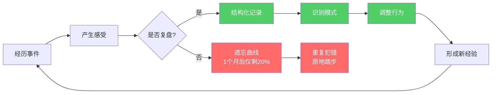
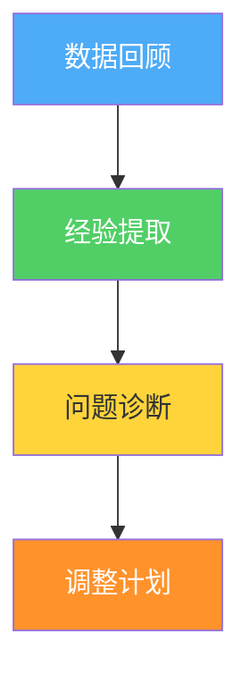
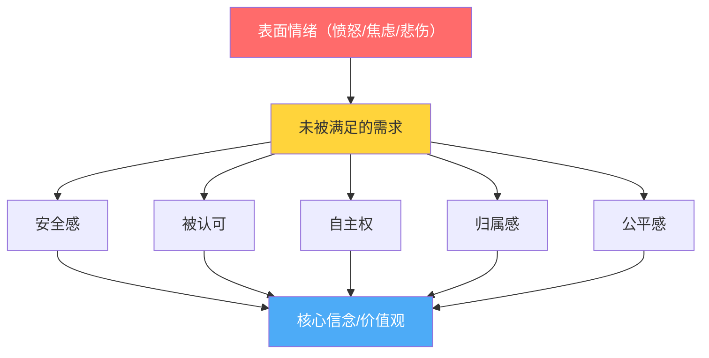
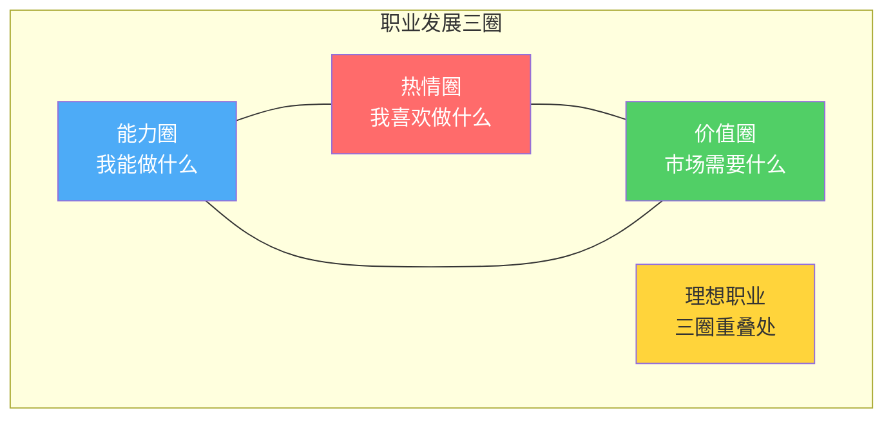

# 附录五：月度复盘模板

> 月度复盘不是月末的一次"考试"，而是你与自己签订的一份成长契约。每月花1-2小时认真回顾、诚实面对、果断调整——这个习惯本身就是复利效应最典型的体现。本章不仅提供一套完整的复盘模板，更会教你复盘的方法论，让你从"填表格"升级为"真反思"。

## 为什么月度复盘是个人成长的核心引擎

### 复盘的理论基础

复盘（After Action Review）最初由美国陆军在越战后系统化提出，后来被联想集团柳传志引入企业管理，再后来被个人成长领域广泛采用。其核心逻辑可以用一个公式表达：

**成长 = 经验 + 反思 + 行动调整**

没有反思的经验只是经历，不是成长。神经科学研究表明，人类大脑对经历过的事情存在"遗忘曲线"——艾宾浩斯发现，一个月后我们只记得事情的约20%。月度复盘的本质是在遗忘发生之前，把隐性经验显性化、把模糊感受结构化。

### 月度复盘 vs 日记 vs 周复盘的区别

很多人分不清这三者的关系，导致要么重复劳动，要么遗漏关键环节：

| 维度 | 日记 | 周复盘 | 月度复盘 |
|------|------|--------|----------|
| 频率 | 每天 | 每周 | 每月 |
| 关注点 | 当天发生了什么 | 本周任务完成情况 | 趋势、模式、系统性问题 |
| 深度 | 表面记录 | 任务检查 | 深层反思 |
| 时间视角 | 1天 | 1周 | 1个月+ |
| 核心输出 | 事件记录 | 进度报告 | 模式识别 + 系统调整 |
| 比喻 | 拍照 | 快进视频 | 纪录片旁白 |

**关键区别：** 月度复盘的任务不是"记录发生了什么"（日记已经做了），也不是"检查任务完成了没有"（周复盘已经做了），而是**发现跨周的规律、识别反复出现的问题、调整底层系统**。

例如：日记记录"今天又熬夜到1点"，周复盘记录"本周有3天熬夜"，月度复盘则会发现"每次项目deadline前一周必熬夜→根源是时间估算偏乐观→需要在项目规划时增加30%缓冲时间"。

### 什么样的人最需要月度复盘

以下几类人从月度复盘中获益最大：

1. **感觉"忙但没进步"的人**——复盘帮你区分"忙"和"有效"
2. **总在同一类问题上跌倒的人**——复盘帮你识别反复出现的模式
3. **目标感模糊的人**——复盘帮你校准方向
4. **情绪波动大的人**——复盘帮你发现情绪触发模式
5. **想要系统性提升的人**——复盘帮你建立反馈循环

***

## 使用说明

### 复盘的时机选择

**最佳时间：** 每月最后一个周末（建议周日下午2-4点）

选择这个时间的理由：
- 周末心态放松，不容易敷衍了事
- 下午精力尚可，不会因为疲惫而草率收尾
- 留出缓冲——如果本月还有"收尾"的事情，可以在此之前完成

**不建议的时间：**
- 月初第一天——容易变成"先干活再说"，一拖再拖
- 工作日晚上——精力不足，容易流于形式
- 假期中间——心态太放松，缺乏反思的严肃感

### 预计耗时

| 复盘深度 | 适合场景 | 耗时 | 使用频率 |
|----------|----------|------|----------|
| 快速版 | 本月较平稳、无重大事件 | 30-45分钟 | 每月可用 |
| 标准版 | 日常使用 | 1-1.5小时 | 推荐频率 |
| 深度版 | 本月有重大变化或转折 | 2-3小时 | 重大月份使用 |

**标准版是你的默认选择。** 只有当本月发生了重大事件（换工作、分手、搬家、项目上线等）时，才使用深度版。

### 准备材料清单

在开始复盘之前，准备好以下材料，避免复盘中途被打断：

- **本月的4-5份周复盘记录**——这是月度复盘最重要的输入
- **习惯打卡记录**（App截图或纸质记录）
- **本月日历/日程表**——回忆重要事件的时间线
- **财务记录**（记账App导出或账单）
- **情绪日记**（如果有记录的话）
- **一本空白笔记本**——用于画平衡轮和自由书写

### 心态准备——复盘的心理建设

复盘前花3分钟做一次深呼吸，提醒自己以下原则：

1. **诚实但不苛刻。** 复盘的目标是发现真相，不是自我审判。你可以对自己说"这个月运动做得不够好"，但不要说"我就是个没毅力的人"。
2. **关注系统而非个人。** 问题往往出在系统（环境、流程、习惯设计）上，而非你的意志力上。
3. **完成比完美重要。** 不是每个空格都必须填满，跳过不适用的部分，抓住本月最值得反思的2-3个点就够了。
4. **你是唯一的读者。** 不需要写得漂亮，不需要逻辑通顺，写给自己看的真话最有价值。

***

## 一、基本数据回顾

### 月份信息

填写基本的月份信息，建立时间锚点。看起来简单，但坚持记录后，你会拥有一个清晰的"时间轴"，可以对比不同月份的状态。

复盘月份：____年____月
复盘日期：____年____月____日
本月天数：____天
本月工作日：____天
本月休息日：____天

### 月度目标回顾

这是复盘的起点。月初设定的目标是你的"预测"，月底回顾是"实际结果"。两者的差异就是你需要分析的核心数据。

**填写示例（供参考）：**

月初设定的目标：
1. 完成《深度工作》阅读并写读书笔记
   完成情况：☑ 完成  □ 部分完成  □ 未完成
   完成度：100%
   原因分析：利用通勤时间每天读20页，提前5天完成

2. 每周运动4次，累计16次
   完成情况：□ 完成  ☑ 部分完成  □ 未完成
   完成度：75%（完成12次）
   原因分析：第3周感冒休息了4天，恢复后动力下降；实际除生病外都坚持了

3. 存款5000元
   完成情况：□ 完成  □ 部分完成  ☑ 未完成
   完成度：60%（存了3000元）
   原因分析：朋友结婚份子钱超预算1500元，这笔意外支出没有预留空间

**注意看示例中的区别：** 目标1的成功原因可以复制（利用通勤时间），目标2的失败原因是客观+主观混合（生病是客观，恢复后动力下降是主观），目标3的失败暴露了预算系统的问题（没有预留意外支出空间）。**这就是复盘的价值——从每个结果中提取可操作的洞察。**

**常见错误：** 只写"完成/未完成"就跳过。不分析原因的目标回顾毫无意义。

### 目标完成度的评估标准

为了避免自我欺骗，建议使用以下标准来判断"完成度"：

| 完成度区间 | 定义 | 说明 |
|-----------|------|------|
| 100% | 完全达成 | 目标的所有指标都满足 |
| 80%-99% | 基本达成 | 核心指标达成，细节有偏差 |
| 60%-79% | 部分完成 | 有实质性进展，但未达核心标准 |
| 40%-59% | 严重不足 | 有动作但效果差，需要根本性调整 |
| 0%-39% | 几乎未完成 | 基本没有行动，需要重新评估目标合理性 |

**特别注意：** 如果你的目标完成度长期低于60%，问题大概率不在执行力，而在目标设定本身——可能是目标不清晰、不切实际、或者不重要（只是你觉得"应该"做）。

***

## 二、各模块深度复盘

每个模块的复盘遵循统一的四步框架：

1. **数据回顾**：用数字说话，不靠"感觉"
2. **经验提取**：做对了什么？为什么做对了？
3. **问题诊断**：做错了什么？根源是什么？
4. **调整计划**：下个月具体改什么？怎么改？

***

### 2.1 身体健康复盘

健康是一切的基础。本模块从运动、饮食、睡眠三个维度全面回顾你的身体状态。

#### 运动复盘

运动复盘的核心不是"完成了多少次"，而是**运动是否真正改善了你的身体状态**。有些人每天跑步但膝盖越来越差，有些人每周只运动3次但体能持续提升——质量比数量重要。

本月运动总结：
  计划运动次数：____次    实际完成：____次    完成率：___%
  计划运动时长：____小时  实际时长：____小时  完成率：___%

运动类型分布：
  有氧运动：____次，____分钟（跑步/游泳/骑车/跳绳等）
  力量训练：____次，____分钟（举铁/俯卧撑/深蹲等）
  柔韧训练：____次，____分钟（拉伸/瑜伽/普拉提等）
  其他运动：____次，____分钟（球类/攀岩/武术等）

**填写指导：** 如果你不确定自己的运动是否"平衡"，参考以下建议比例：

| 目标 | 有氧:力量:柔韧 | 说明 |
|------|---------------|------|
| 减脂为主 | 5:3:2 | 有氧消耗热量，力量保住肌肉 |
| 增肌为主 | 2:5:3 | 力量训练是核心，有氧辅助恢复 |
| 健康维持 | 3:3:4 | 三者均衡，柔韧训练预防伤病 |
| 改善体态 | 2:4:4 | 力量+柔韧纠正姿势问题 |

身体变化记录：
  体重变化：____kg → ____kg（变化：____kg）
  体脂率变化：____% → ____%（变化：____%）
  体能变化（主观感受）：_____________________________________________
    （参考：爬楼梯是否更轻松？跑步配速是否提升？力量训练重量是否增加？）

**重要提醒：** 不要只看体重。体重受水分、饮食、排便等多种因素影响，单日波动1-2kg很正常。更值得关注的趋势是：
- **体重**：看周均值的趋势，不看单日
- **体脂率**：有条件的话每周测一次，看月度趋势
- **体能指标**：5km跑用时、最大深蹲重量、能做多少个引体向上

运动中的困难和挑战：
_________________________________________________
（示例：下雨天不想出门→解决方案：准备了室内替代训练方案）

下月运动调整计划：
_________________________________________________
（示例：增加每周1次瑜伽课，改善肩颈僵硬问题）

#### 饮食复盘

饮食复盘不要求你精确计算每餐热量（除非你是健身爱好者），但需要对本月的整体饮食质量有一个判断。

本月饮食健康度评分：___/10

评分参考标准：
  9-10分：几乎每餐营养均衡，零食极少，规律饮食
  7-8分：大部分时间吃得不错，偶尔放纵
  5-6分：好坏参半，外卖较多，但基本三餐规律
  3-4分：经常不规律，垃圾食品偏多
  1-2分：饮食完全失控

做得好的方面：
1. _______________________________________________
2. _______________________________________________

需要改进的方面：
1. _______________________________________________
2. _______________________________________________

下月饮食调整计划：
_________________________________________________
（建议只聚焦1-2个具体改变，比如"每周外卖不超过3次"，不要试图一步到位）

**常见误区：**
- ❌ "我要吃得更健康"——太模糊，无法执行
- ✅ "午餐自带便当，每周至少3天"——具体、可衡量、可执行
- ❌ "戒掉所有垃圾食品"——过于极端，容易反弹
- ✅ "工作日不吃零食，周末允许自己吃一次"——有弹性，可持续

#### 睡眠复盘

睡眠质量直接影响第二天的认知能力、情绪稳定性和运动表现。研究表明，连续一周每晚少睡1.5小时，认知能力下降程度等同于连续24小时不睡觉。

本月平均睡眠时长：____小时
本月平均入睡时间：____:____
本月平均起床时间：____:____
本月睡眠质量评分：___/10

**睡眠质量评分参考：**

| 分数 | 描述 | 典型表现 |
|------|------|----------|
| 9-10 | 优质睡眠 | 入睡快（<15分钟），整夜不醒，起床清醒 |
| 7-8 | 良好睡眠 | 偶尔需要20分钟入睡，偶尔醒来一次 |
| 5-6 | 一般睡眠 | 入睡困难或半夜醒来，白天偶尔犯困 |
| 3-4 | 较差睡眠 | 经常失眠，依赖咖啡提神 |
| 1-2 | 严重问题 | 几乎每天失眠，白天精力严重不足 |

影响睡眠的主要因素：
_________________________________________________
（示例：手机刷到12点、咖啡喝太晚、室友打呼、焦虑想事情）

改善睡眠的有效措施：
_________________________________________________
（示例：11点手机放到客厅充电、下午3点后不喝咖啡、使用耳塞）

下月睡眠改善计划：
_________________________________________________

**进阶技巧——睡眠效率计算：**

睡眠效率 = 实际睡眠时间 / 在床上的总时间 × 100%

如果你在床上躺了8小时，实际睡了6.5小时，睡眠效率 = 81%。健康标准是85%以上。如果你的效率低于85%，说明你在床上花了太多"清醒时间"——解决方案是**减少在床上的时间**（听起来反直觉，但这是CBT-I失眠认知行为疗法的核心策略）。

***

### 2.2 心理健康复盘

心理健康和身体健康同等重要，但往往被忽视。本模块帮助你追踪情绪模式、管理压力、培养正念。

#### 情绪复盘

情绪复盘的核心目标不是"控制情绪"（情绪无法也不应该被控制），而是**理解情绪的触发模式，缩短负面情绪的持续时间**。

本月情绪统计：
  平均情绪分：___/10
  最佳情绪日：___月___日（___分）
  最差情绪日：___月___日（___分）
  情绪稳定天数：____天/____天（情绪波动≤3分的天数）
  情绪波动幅度：___（最高分 - 最低分）

**情绪评分指南：**

| 分数 | 情绪状态 | 典型表现 |
|------|----------|----------|
| 9-10 | 非常愉悦 | 充满活力，对事物有兴趣，愿意社交 |
| 7-8 | 积极平稳 | 心情不错，正常工作生活 |
| 5-6 | 中性 | 没有特别开心也没有不开心 |
| 3-4 | 低落 | 提不起劲，想独处，容易烦躁 |
| 1-2 | 很差 | 强烈的悲伤/焦虑/愤怒，影响正常功能 |

本月主要情绪事件：

事件1：
  日期：___月___日
  事件：_____________________________________________
  情绪反应：_____________________________________________
    （用具体的词：焦虑、愤怒、委屈、失望、羞耻、嫉妒、恐惧等）
  处理方式：_____________________________________________
    （健康方式：运动/倾诉/写日记/冥想/散步）
    （不健康方式：暴饮暴食/刷手机逃避/酗酒/自我封闭）
  反思：_____________________________________________
    （这个情绪在告诉我什么？我的什么需求没有被满足？）

事件2：
  日期：___月___日
  事件：_____________________________________________
  情绪反应：_____________________________________________
  处理方式：_____________________________________________
  反思：_____________________________________________

**情绪分析的进阶方法——"情绪冰山"模型：**

情绪只是冰山露出水面的部分，水面下隐藏着更深层的需求：

当你发现自己反复因为同一类事情情绪波动时，大概率不是"这件事"的问题，而是你的某个核心需求长期没有被满足。

本月情绪管理的进步：
_________________________________________________
（示例：开始能在愤怒时暂停5秒再反应，而不是立刻爆发）

下月情绪管理重点：
_________________________________________________
（示例：识别"被忽视"这个触发点，练习在感到被忽视时直接表达需求）

#### 压力与心理能量复盘

压力不是敌人——适度的压力（心理学称为"良性压力"eustress）能激发潜能。但长期过高的压力（"恶性压力"distress）会损害身心健康。复盘的关键是区分两者。

本月整体压力水平：___/10

压力水平参考：
  1-3分：轻松自在，生活节奏舒适
  4-6分：有压力但可控，能正常应对
  7-8分：压力较大，经常感到紧迫或焦虑
  9-10分：压力爆表，身心俱疲，需要立即干预

主要压力来源排序：
1. _______________________________________________（强度：___/10，可控度：高/中/低）
2. _______________________________________________（强度：___/10，可控度：高/中/低）
3. _______________________________________________（强度：___/10，可控度：高/中/低）

**压力管理的"三分法"：** 把压力源分成三类，用不同的策略应对：

| 类型 | 定义 | 策略 | 示例 |
|------|------|------|------|
| 可消除型 | 可以直接消除的压力源 | 行动：直接解决 | 不必要的社交应酬→拒绝 |
| 可缓解型 | 无法消除但可以降低的 | 行动：改变应对方式 | 工作量大→优化流程/求助 |
| 需接纳型 | 无法改变的客观现实 | 心态：接纳+调整预期 | 家人性格→降低改变预期 |

有效的减压方式：
1. _______________________________________________
2. _______________________________________________
3. _______________________________________________

无效或有害的减压方式（需避免）：
_________________________________________________
（示例：刷短视频2小时后更焦虑、暴饮暴食后有罪恶感、熬夜逃避第二天更累）

心理能量水平变化趋势：月初___/10 → 月末___/10

**心理能量的"电池模型"：** 把心理能量想象成手机电池——它需要充电（休息、运动、社交、兴趣）也需要放电（工作、应酬、决策、情绪劳动）。如果你的月末能量持续低于月初，说明你的"充电"不够或"放电"太多。

#### 冥想/正念复盘

正念练习是情绪管理和压力缓解的核心技能。如果你还没有开始冥想，下文会给你一个简单的入门方案。如果你已经在练习，这个部分帮你追踪进展。

本月冥想练习统计：
  计划天数：____天    实际天数：____天    完成率：___%
  累计时长：____分钟  平均每次：____分钟

冥想质量评估：
  专注度提升：□ 明显 □ 一般 □ 无变化
  日常觉察力：□ 明显提升 □ 一般 □ 无变化
  情绪调节能力：□ 明显提升 □ 一般 □ 无变化

冥想中的突破或困难：
_________________________________________________

**冥想入门方案（如果你还没有开始）：**

| 阶段 | 时间 | 方法 | 目标 |
|------|------|------|------|
| 第1周 | 每天2分钟 | 只关注呼吸，数呼吸次数 | 建立习惯 |
| 第2-3周 | 每天5分钟 | 呼吸+身体扫描 | 培养觉察力 |
| 第4周+ | 每天10分钟 | 正念冥想（接纳思绪，不评判） | 深化练习 |

**常见误区：** "我冥想时脑子里想法太多，说明我不适合冥想"——这是最大的误解。冥想不是让大脑放空，而是**觉察到思绪飘走，然后温和地拉回来**。每次"拉回来"就是一次"心理俯卧撑"，想法越多说明你练得越多。

***

### 2.3 认知成长复复盘

认知成长决定了你解决问题的能力天花板。本模块从阅读、学习、思维三个维度追踪你的认知发展。

#### 阅读复盘

阅读复盘的关键不是"读了多少本"，而是**从阅读中提取了多少可执行的洞察**。

本月阅读统计：
  完成书籍：____本
  阅读总时长：____小时
  阅读总页数：____页

已读书籍记录：

书名1：《_______________》
  阅读时长：____小时
  核心观点：_____________________________________________
    （用1-3句话概括作者最核心的主张）
  最大收获：_____________________________________________
    （对你个人最有启发的一个观点）
  行动启示：_____________________________________________
    （读完这本书后，你会具体做什么不同的事？）
  推荐指数：★☆☆☆☆ / ★★☆☆☆ / ★★★☆☆ / ★★★★☆ / ★★★★★

**阅读质量评估标准——"3-2-1法则"：**

读完一本书后，问自己三个问题：
- **3个关键观点**：你能说出这本书的3个核心观点吗？
- **2个应用场景**：你能想到2个把书中知识用到实际生活中的场景吗？
- **1个行动承诺**：你愿意承诺在接下来1个月做1件因为读了这本书而改变的事吗？

如果回答不上来，说明阅读的"吸收率"不高——可能需要改变阅读方法（比如边读边做笔记、读完写摘要、和别人讨论）。

正在阅读的书籍：
  《_______________》进度：第___页/共___页（___%）

本月阅读笔记产出：____篇
本月最有价值的阅读笔记：_____________________________________________

#### 学习复盘

学习不仅限于读书，还包括课程、讲座、播客、实践中的学习等。本部分追踪你所有形式的学习投入。

本月课程/学习统计：
  学习时长：____小时
  完成课程模块：____个
  获得证书：____个

学习内容总结：
_________________________________________________

学以致用案例：
  案例1：_____________________________________________
    （学到的知识→应用的场景→产生的效果）
  案例2：_____________________________________________

学习中的困难：
_________________________________________________

下月学习计划：
_________________________________________________

**学以致用的检查清单：** 如果你学了很多但感觉"没用上"，试试这个方法：

| 步骤 | 操作 | 时间 |
|------|------|------|
| 1. 记录 | 学完后立刻写下3个关键知识点 | 学习后5分钟 |
| 2. 链接 | 思考这些知识和你当前工作的关联 | 学习后1天内 |
| 3. 实验 | 在接下来一周刻意使用一次 | 1周内 |
| 4. 复盘 | 记录使用效果和改进空间 | 月末复盘时 |

#### 思维复盘

思维模式是最难改变但影响最深远的东西。本部分帮助你觉察自己的思维习惯。

本月思维方式的变化：
  □ 看问题更全面了
  □ 做决策更理性了
  □ 更善于倾听不同观点了
  □ 更少被情绪左右判断了
  □ 更善于区分"事实"和"观点"了
  □ 其他：_____________________________________________

本月最重要的思维突破：
_________________________________________________
（示例：意识到自己一直在用"全有或全无"的思维看待工作——要么完美完成要么不做，
现在学会了"先做到60分，再迭代到80分"的渐进思维）

本月犯过的思维错误（认知偏差）：
1. _______________________________________________
   （示例：因为一个同事上次帮我帮得慢，这次就没找他帮忙——这是"以偏概全"）
2. _______________________________________________

**常见认知偏差速查表：**

| 偏差名称 | 定义 | 生活中的表现 |
|----------|------|------------|
| 确认偏差 | 只关注支持自己观点的信息 | 只看支持自己立场的新闻 |
| 锚定效应 | 被第一个接触到的信息锚定 | 看到原价999再看折扣价399觉得很便宜 |
| 损失厌恶 | 损失的痛苦 > 等额收益的快乐 | 不愿意卖掉亏损的股票 |
| 沉没成本 | 因为已经投入而不愿放弃 | 电影不好看但已经买了票所以看完 |
| 幸存者偏差 | 只看到成功案例忽略失败者 | "比尔盖茨辍学成功了所以学历不重要" |
| 达克效应 | 能力不足的人反而高估自己 | 刚学了一点就觉得"差不多了" |
| 光环效应 | 因为某一个优点而全面美化 | 长得好看就觉得人也善良 |
| 从众效应 | 跟随多数人的选择 | "大家都在买所以应该不错" |

**进阶练习——"钢铁人论证"：** 与其"打稻草人"（歪曲对方观点再反驳），不如练习"钢铁人论证"——把对方的观点强化到最合理的版本，然后再回应。这个练习能极大提升你的思维深度和沟通质量。

***

### 2.4 职业发展复盘

职业发展不只是"完成工作任务"，而是有意识地构建你的核心竞争力和职业资本。

本月工作成果：
  主要完成的项目/任务：
  1. _______________________________________________
     成果：_____________________________________________
     学到的：_____________________________________________
  2. _______________________________________________
     成果：_____________________________________________
     学到的：_____________________________________________
  3. _______________________________________________
     成果：_____________________________________________
     学到的：_____________________________________________

  获得的认可或反馈：
  _______________________________________________
  （包括正式的绩效评价和非正式的口头反馈）

  工作中的挑战和困难：
  _______________________________________________

**职业发展的"三个圈"模型：**

每月问自己：我在三个圈的重叠区投入了多少时间？如果超过50%的时间花在一个圈之外，需要调整。

本月职业发展行动：
  学习新技能：_____________________________________________
    （具体学了什么？达到了什么水平？）
  拓展人脉：认识___位新人，维护___位旧识
    （在哪里认识的？有没有后续互动？）
  输出成果：_____________________________________________
    （写了什么文章？做了什么分享？产出了什么作品？）
  行业研究：_____________________________________________
    （关注了什么趋势？对你的工作有什么启发？）

本月薪资/收入变化：_____________________________________________

职业满意度评估：___/10
  满意的方面：_____________________________________________
  不满意的方面：_____________________________________________

下月职业发展重点：
_________________________________________________

**职业满意度细分评估：**

| 维度 | 评分(/10) | 说明 |
|------|----------|------|
| 工作内容 | | 你做的事情是否有意义感 |
| 成长空间 | | 是否在学习和进步 |
| 薪资待遇 | | 回报是否匹配付出 |
| 人际关系 | | 与上级/同事的关系 |
| 工作生活平衡 | | 是否有足够个人时间 |
| 自主权 | | 对工作方式的掌控程度 |

如果总分低于50，认真考虑是否需要做出改变。如果某个维度特别低（<3），这是最需要优先解决的短板。

***

### 2.5 财务管理复盘

财务复盘不是"记账"——记账是日常习惯，复盘是要**发现消费模式、评估财务健康、调整策略**。

本月财务总结：

收入情况：
  总收入：________元
  收入来源构成：
    主业收入：________元（占比___%）
    副业收入：________元（占比___%）
    投资收益：________元（占比___%）
    其他收入：________元（占比___%）

**收入结构健康度参考：**

| 收入结构 | 健康度 | 说明 |
|----------|--------|------|
| 主业 >90% | ⚠️ 风险较高 | 收入来源单一，抗风险能力差 |
| 主业 70-90% | ✅ 正常 | 有少量副业补充 |
| 主业 50-70% | ✅ 较好 | 收入来源多元化 |
| 主业 <50% | ✅ 优秀 | 真正的财务自由正在路上 |

支出情况：
  总支出：________元
  预算执行率：___%（实际支出/预算×100%）
  超支项目：_____________________________________________
    （分析：为什么超支？是预算不合理还是消费失控？）
  节省项目：_____________________________________________
    （分析：为什么节省了？是刻意的还是碰巧的？）

**消费分类参考——"5-3-2法则"：**

| 类别 | 建议比例 | 包含内容 |
|------|---------|----------|
| 必要支出 | 50% | 房租/房贷、餐饮、交通、水电、保险 |
| 发展支出 | 30% | 学习、社交、兴趣、健康、形象 |
| 储蓄投资 | 20% | 应急基金、投资、长期目标 |

储蓄与投资：
  本月储蓄：________元
  储蓄率：___%（储蓄/收入×100%）
  投资操作：_____________________________________________
  投资收益：________元

财务健康评估：___/10

本月财务教训：
_________________________________________________
（示例：冲动买了某件东西后悔了→设置"24小时冷静期"规则）

下月财务调整计划：
_________________________________________________

**财务健康的底线指标：**

| 指标 | 健康标准 | 危险信号 |
|------|---------|----------|
| 应急基金 | ≥3个月生活费 | <1个月生活费 |
| 储蓄率 | ≥20% | <10% |
| 负债收入比 | ≤30% | ≥50% |
| 消费贷 | 0 | 有任何消费贷 |
| 保险 | 配齐基本险种 | 完全没有保险 |

***

### 2.6 人际关系复盘

人际关系是幸福感最强的预测因子之一——哈佛大学持续85年的"成人发展研究"（Grant Study）得出的核心结论是：**良好的人际关系让我们更健康、更快乐**。

本月社交统计：
  社交活动次数：____次
  新认识的人：____人
  深度交流的人：____人
  线上社交时长：____小时
  线下社交时长：____小时

**社交质量 vs 社交数量：** 你的社交满意度取决于质量而非数量。研究发现，拥有3-5个"可以打电话在凌晨3点倾诉"的朋友，比拥有500个社交媒体好友更能预测幸福感。

重要关系维护：

  亲密关系（伴侣/家人）：
    相处质量评分：___/10
    本月亮点：_____________________________________________
    需要改进：_____________________________________________
    下月具体行动：_____________________________________________

  友谊关系：
    联系的朋友数量：____人
    深度交流：____次
    本月亮点：_____________________________________________
    需要重新联系的朋友：_____________________________________________

  职场关系：
    与上级关系：___/10
    与同事关系：___/10
    本月亮点：_____________________________________________

**人际关系的"投资组合"思维：** 把你的人际关系想象成投资组合——有些关系是"蓝筹股"（稳定、长期、高价值），有些是"成长股"（新兴、有潜力），有些是"垃圾股"（消耗你能量、只带来负面情绪）。你的社交精力是有限的，需要有意识地分配。

沟通能力评估：
  本月沟通中做得好的地方：
  _______________________________________________
  本月沟通中的失误或教训：
  _______________________________________________
  （示例：和同事讨论方案时打断了对方→下次练习"先听完再回应"）

下月人际关系重点：
_________________________________________________

**沟通复盘的"STAR法"：**

- **S**ituation（情境）：在什么场景下
- **T**ask（任务）：需要沟通什么事
- **A**ction（行动）：你实际说了什么、怎么做的
- **R**esult（结果）：效果如何、对方反应如何

用这个框架记录本月的沟通"高光时刻"和"翻车现场"，会比泛泛而谈更有价值。

***

### 2.7 兴趣爱好与休闲复盘

兴趣爱好不是"浪费时间"——它们是心理能量的"充电站"，也是身份认同的重要组成部分。一个人如果只有工作，一旦失业或退休就会面临严重的身份危机。

本月兴趣爱好投入：
  投入时间：____小时
  满意度：___/10

兴趣爱好进展记录：
_________________________________________________
（示例：吉他——学会了《Romance》前半段，手指已经不那么疼了）

**休闲质量评估——"充电vs耗电"测试：**

| 休闲活动 | 做的时候感受 | 做完后感受 | 分类 |
|----------|------------|-----------|------|
| 刷短视频 | 还行/无聊 | 更累/空虚 | 耗电型 |
| 户外散步 | 一般 | 放松/清爽 | 充电型 |
| 和朋友聚餐 | 开心 | 满足/开心 | 充电型 |
| 熬夜打游戏 | 刺激 | 后悔/疲惫 | 耗电型 |

休闲娱乐评估：
  休闲时间是否充足：□ 是 □ 否
  休闲方式是否健康：□ 是 □ 需调整
  最喜欢的休闲活动：_____________________________________________
  需要减少的休闲方式：_____________________________________________
  需要增加的休闲方式：_____________________________________________

**"主动休闲" vs "被动休闲"：**

| 类型 | 特点 | 示例 | 效果 |
|------|------|------|------|
| 主动休闲 | 需要投入精力，有技能门槛 | 运动、画画、乐器、烹饪 | 心流体验，持久满足感 |
| 被动休闲 | 不需要精力投入，消费内容 | 刷手机、看剧、逛街 | 短暂放松，容易过度 |

两种都需要，但比例建议在 **7:3**（主动:被动）。如果你发现自己90%的休闲时间都在被动消费内容，这是本月需要调整的重点。

***

### 2.8 精神成长复盘

精神成长是"八维评分"中容易被忽视的一维，但它影响着你对人生意义的理解和内在的安定感。

本月精神成长评估：

价值观践行：
  本月是否按照自己的核心价值观生活：□ 是 □ 大部分 □ 偏离较多
  最践行的一个价值观：_____________________________________________
  最偏离的一个价值观：_____________________________________________

人生意义感：
  本月意义感评分：___/10
  让你感到最有意义的一件事：_____________________________________________
  为什么有意义：_____________________________________________

感恩记录：
  本月最感恩的3件事：
  1. _______________________________________________
  2. _______________________________________________
  3. _______________________________________________

独处与内省：
  本月独处时间是否充足：□ 是 □ 否
  最有价值的一次内省时刻：_____________________________________________

**精神成长的日常实践建议：**

| 实践 | 频率 | 时长 | 说明 |
|------|------|------|------|
| 感恩日记 | 每天 | 3分钟 | 写3件今天值得感恩的事 |
| 价值观检视 | 每周 | 10分钟 | 回顾本周的行为是否符合价值观 |
| 深度阅读 | 每周 | 30分钟 | 哲学/心理学/传记类 |
| 自然接触 | 每周 | 30分钟+ | 户外散步、看日落、观星 |
| 无屏幕时间 | 每天 | 30分钟 | 不看任何屏幕，和自己待着 |

***

## 三、习惯坚持复盘

### 3.1 习惯打卡总结

习惯是个人成长的"操作系统"——单次行为影响有限，但日复一日的习惯会产生惊人的复利效应。

本月习惯坚持情况：

┌────────────────┬────────┬────────┬────────┬────────┐
│ 习惯名称        │ 目标天数│ 完成天数│ 完成率  │ 趋势    │
├────────────────┼────────┼────────┼────────┼────────┤
│ （示例）晨跑     │  26天  │  20天  │  77%   │  ↑     │
│ （示例）阅读30min│  30天  │  25天  │  83%   │  →     │
│ （示例）冥想     │  30天  │  15天  │  50%   │  ↓     │
│                │   天   │   天   │   %   │  ↑→↓   │
│                │   天   │   天   │   %   │  ↑→↓   │
│                │   天   │   天   │   %   │  ↑→↓   │
└────────────────┴────────┴────────┴────────┴────────┘

整体习惯坚持率：___%
连续打卡最长天数：____天
断卡最多的原因：_____________________________________________

**习惯坚持率的评估标准：**

| 坚持率 | 评价 | 建议 |
|--------|------|------|
| ≥90% | 优秀 | 习惯已经基本自动化，可以增加新习惯 |
| 70-89% | 良好 | 正在养成中，继续坚持不要加量 |
| 50-69% | 一般 | 习惯设计可能有问题，需要调整触发条件 |
| <50% | 需要反思 | 目标太难/太多/触发条件不清晰，大幅简化 |

**习惯断卡的常见原因和对策：**

| 断卡原因 | 对策 |
|----------|------|
| 忘了 | 设置手机提醒/放在必经之处 |
| 太难了 | 把习惯缩小到"不可能失败"的程度 |
| 环境变了（出差/旅行） | 准备"旅行版"简化方案 |
| 情绪低落不想做 | 设定"最低标准"——心情不好只做1分钟也算 |
| 被其他事情挤掉了 | 固定时间段，绑定已有习惯 |

### 3.2 习惯调整建议

需要继续保持的习惯（完成率>80%，且带来明显正收益）：
1. _______________________________________________
2. _______________________________________________

需要加强的习惯（完成率50-80%，有价值但执行不够）：
1. _______________________________________________
   （原因：_____________________________________________）
   （调整方案：_____________________________________________）

需要放弃或替换的习惯（完成率<30%或弊大于利）：
1. _______________________________________________
   （替换为：_____________________________________________）

下月新增习惯（建议不超过2个）：
1. _______________________________________________
   （触发条件：_____________________________________________）
   （最低标准：_____________________________________________）

**"习惯堆叠"技巧：** 把新习惯绑定到已有习惯上，利用已有习惯的惯性带动新习惯。公式是：**在[已有习惯]之后，我会[新习惯]**。

例如：
- "刷完牙之后，我会做1分钟冥想"
- "坐下打开电脑之后，我会先写下今天最重要的3件事"
- "午餐后散步回来，我会阅读10页书"

***

## 四、综合评估

### 4.1 八维评分表

八维评分是月度复盘的"仪表盘"——它给你一个全局视角，看到哪些领域在进步、哪些在退步、哪些需要关注。

┌────────────┬──────┬──────┬──────┬──────────────────────┐
│ 评估维度    │ 上月  │ 本月  │ 变化  │ 关键变化说明          │
│            │ 评分  │ 评分  │      │                      │
├────────────┼──────┼──────┼──────┼──────────────────────┤
│ 身体健康   │  /10 │  /10 │  ↑→↓ │                      │
│ 心理健康   │  /10 │  /10 │  ↑→↓ │                      │
│ 认知成长   │  /10 │  /10 │  ↑→↓ │                      │
│ 职业发展   │  /10 │  /10 │  ↑→↓ │                      │
│ 财务管理   │  /10 │  /10 │  ↑→↓ │                      │
│ 人际关系   │  /10 │  /10 │  ↑→↓ │                      │
│ 兴趣爱好   │  /10 │  /10 │  ↑→↓ │                      │
│ 精神成长   │  /10 │  /10 │  ↑→↓ │                      │
├────────────┼──────┼──────┼──────┼──────────────────────┤
│ 综合均分   │      │      │      │                      │
└────────────┴──────┴──────┴──────┴──────────────────────┘

本月整体进步趋势：↑ / → / ↓

进步最大的领域：_______________（提升____分）
退步最大的领域：_______________（下降____分）
最需要关注的领域：_______________

**评分的一致性原则：** 为了确保跨月对比有意义，你需要保持评分标准的一致性。建议在第一次使用时写下你的评分标准，以后每月参照同一标准。比如"身体健康7分=每周运动3次以上，体重在目标范围内，没有生病"。

**特别提醒：** 如果你发现某个维度连续3个月低于4分，这已经不是"需要努力"的问题，而是**需要系统性干预**——可能需要外部帮助（教练、咨询师、医生）、或者彻底改变策略。

### 4.2 平衡轮绘制

平衡轮是评估人生各维度平衡状况最直观的工具。它不需要精确到小数——你的直觉往往比理性分析更准确。

**绘制方法：**

1. 画一个圆，分成8个扇形（对应8个维度）
2. 每个扇形从圆心（0分）到边缘（10分）标注刻度
3. 根据本月评分，在每个扇形中画点
4. 把8个点连成一条线——这就是你的"人生平衡轮"

          身体健康
             10
              |
    精神     / \     心理
    成长  8 /   \ 8  健康
          /     \
    兴趣 6       6 认知
    爱好 |   ○   | 成长
          \     /
    人际 4 \   / 4  职业
    关系    \ /    发展
              |
             财务管理

（示例：这是一个心理健康和精神成长较好，但人际关系和职业发展需要关注的平衡轮）

**如何解读你的平衡轮：**

| 平衡轮形态 | 含义 | 行动建议 |
|-----------|------|----------|
| 接近正圆 | 各方面均衡发展 | 选择1-2个维度重点突破 |
| 明显凹陷（<3分） | 存在严重短板 | 短板会拖累整体幸福感，优先补齐 |
| 明显尖角（>9分） | 某方面过度投入 | 检查是否为此牺牲了其他方面 |
| 椭圆形 | 有强弱之分但不极端 | 发挥优势，适度补弱 |

**进阶——3个月/6个月/12个月趋势对比：** 每月画完平衡轮后，保存好。3个月后并列看3个平衡轮，你会清晰地看到哪些维度在持续改善、哪些在原地踏步、哪些在恶化。这个趋势比任何单月的评分都更有价值。

***

## 五、关键反思

这是月度复盘中**最有价值的部分**。数据回顾是"骨架"，关键反思是"灵魂"。很多人复盘时草草跳过这一节——这是最大的浪费。

### 5.1 本月最大成就

记录成就不只是为了"自我表扬"——而是为了**提取成功模式，让它可以被复制**。

成就1：
  描述：_____________________________________________
  为什么重要：_____________________________________________
    （对你个人/职业/关系产生了什么具体影响？）
  成功因素：
    _______________________________________________
    （是能力？努力？运气？他人的帮助？时机？）
  可复制的经验：
    _______________________________________________
    （下次遇到类似情况，你会怎么做？）

成就2：
  描述：_____________________________________________
  为什么重要：_____________________________________________
  成功因素：_____________________________________________
  可复制的经验：_____________________________________________

成就3：
  描述：_____________________________________________
  为什么重要：_____________________________________________
  成功因素：_____________________________________________
  可复制的经验：_____________________________________________

**填写示例：**

成就1：
  描述：独立完成了公司季度报告的撰写，获得总监在全员会议上点名表扬
  为什么重要：这是我入职以来第一次在全员面前被正式认可，增强了我的职业信心
  成功因素：提前2天完成初稿，留出足够时间修改；主动找了3个部门确认数据准确性
  可复制的经验：以后重要交付物都要提前2天完成、留出修改缓冲；
    主动验证数据（而不是等着被人发现错误）

### 5.2 本月最大教训

教训比成就更有价值——因为人从痛苦中学到的东西远比从快乐中学到的深刻。

教训1：
  发生了什么：_____________________________________________
  我的反应：_____________________________________________
    （诚实描述——你是愤怒？逃避？自责？推卸？）
  事后反思：
    _______________________________________________
    （站在旁观者角度，客观分析这件事）
  下次如何做得更好：
    _______________________________________________
    （具体的行为改变，不是"以后注意"这种空话）

教训2：
  发生了什么：_____________________________________________
  我的反应：_____________________________________________
  事后反思：_____________________________________________
  下次如何做得更好：_____________________________________________

**填写示例：**

教训1：
  发生了什么：因为没有提前确认会议时间，导致和朋友约好的聚餐临时取消
  我的反应：先是对朋友道歉，然后对安排会议的同事心生不满
  事后反思：根本原因不是"同事安排了会议"——而是我没有在日历上及时更新，
    也没有在约聚餐时确认是否有冲突。这是自己的时间管理问题。
  下次如何做得更好：任何约会在确认时立刻写进日历，
    并设置提醒。在承诺社交活动前先检查日历。

### 5.3 本月意外收获

意外收获是"计划外"的惊喜——它往往提示了你的潜在兴趣和未曾注意的机会。

本月意外收获：
_________________________________________________
（示例：帮同事解决了一个技术问题，发现自己很喜欢"教别人"这件事，
可能适合往技术管理/培训方向发展）

为什么觉得这是收获：
_________________________________________________

如何把这个意外发现变成持续的机会：
_________________________________________________

### 5.4 本月最大遗憾

遗憾不是为了沉湎过去，而是为了**识别你真正在乎的东西**——如果你对某件事感到遗憾，说明它对你很重要。

遗憾：_____________________________________________
原因分析：
  _______________________________________________
  （是能力不足？机会错过？选择错误？还是不可控因素？）
如何弥补或避免：
  _______________________________________________
  （如果可以弥补→具体行动计划。如果已经无法弥补→接受并放下）

**遗憾处理的"三分法"：**

| 遗憾类型 | 特征 | 处理方式 |
|----------|------|----------|
| 可弥补型 | 还有机会行动 | 立刻制定行动计划 |
| 需接受型 | 已经无法改变 | 写下感受，然后有意识地放下 |
| 有价值型 | 暴露了在乎的事 | 记录下来，作为未来决策的参考 |

***

## 六、本月金句/洞见记录

好的句子和洞见是思维的"种子"——记录下来，让它们在未来某个时刻发芽。

本月阅读/学习/生活中最有启发的一句话或一个观点：

金句/洞见：_____________________________________________

来源：_____________________________________________
  （书名/播客/对话/自己的顿悟时刻）

为什么对我有启发：
_____________________________________________
  （不是泛泛的"说得对"，而是具体触动了你的什么经历或困惑）

如何应用到生活中：
_____________________________________________
  （具体的行为改变或思维方式调整）

**填写示例：**

金句/洞见："你以为的极限，只是别人的起点"

来源：朋友聊天时说的

为什么对我有启发：
  我一直觉得自己每天工作8小时已经很努力了，但朋友每天工作12小时
  还保持着学习习惯。这句话让我意识到"努力"的标准是相对的。

如何应用到生活中：
  不再用自己的"极限"来衡量努力程度，而是看看比自己强的人在做什么。
  下个月尝试每天多投入1小时在学习上。

***

## 七、下月规划

复盘是回头看，规划是向前看。两者缺一不可——没有复盘的规划是空中楼阁，没有规划的复盘是自说自话。

### 7.1 下月主题词

主题词是你下个月的"北极星"——当面临选择时，问自己"哪个选项更符合我的主题词？"

如果用一个词概括下个月的重点，那就是：_______________

为什么选择这个词：
_____________________________________________

这个主题词会如何影响我的日常决策：
_____________________________________________

**主题词示例和适用场景：**

| 主题词 | 适用场景 | 日常行为指引 |
|--------|---------|------------|
| 健康 | 身体状态下滑 | 优先运动和睡眠，拒绝深夜社交 |
| 突破 | 感觉停滞不前 | 尝试新事物，主动争取机会 |
| 稳定 | 刚经历重大变化 | 巩固现有成果，不急于开新战线 |
| 连接 | 感到孤独或孤立 | 主动约朋友、参加社交活动 |
| 深度 | 什么都想做但什么都不精 | 聚焦一件事做到极致 |
| 放松 | 持续高压状态 | 减少任务量，增加休闲时间 |
| 整理 | 生活/工作混乱 | 清理环境、整理文件、简化流程 |
| 创造 | 消费内容太多 | 每天产出一点东西（写/画/做） |

### 7.2 下月核心目标（3个）

**不要设超过3个核心目标。** 人的时间精力有限，目标太多等于没有目标。把精力集中在最高杠杆的事情上。

目标1：
  具体描述：_____________________________________________
  衡量标准：_____________________________________________
    （如何判断是否"做到了"？必须是可量化的指标）
  关键行动：
  1. _______________________________________________
  2. _______________________________________________
  3. _______________________________________________
  潜在障碍：_____________________________________________
  应对策略：_____________________________________________
  截止日期：_______________

目标2：
  具体描述：_____________________________________________
  衡量标准：_____________________________________________
  关键行动：
  1. _______________________________________________
  2. _______________________________________________
  3. _______________________________________________
  潜在障碍：_____________________________________________
  应对策略：_____________________________________________
  截止日期：_______________

目标3：
  具体描述：_____________________________________________
  衡量标准：_____________________________________________
  关键行动：
  1. _______________________________________________
  2. _______________________________________________
  3. _______________________________________________
  潜在障碍：_____________________________________________
  应对策略：_____________________________________________
  截止日期：_______________

**目标质量检查——SMART原则：**

| SMART | 含义 | 好的例子 | 差的例子 |
|-------|------|---------|---------|
| S-Specific | 具体 | 每天读20页技术书 | 多看点书 |
| M-Measurable | 可衡量 | 体重降到70kg | 减肥 |
| A-Achievable | 可实现 | 每周运动3次 | 每天跑10km |
| R-Relevant | 有关联 | 为跳槽准备面试题 | 学一个和工作无关的技能 |
| T-Time-bound | 有期限 | 6月30日前完成 | 以后找时间做 |

### 7.3 下月习惯计划

继续保持的习惯：
□ _______________________________________________
□ _______________________________________________
□ _______________________________________________

新增习惯（建议不超过2个）：
□ _______________________________________________
  触发条件：_____________________________________________
  最低标准：_____________________________________________
  （最低标准 = 心情最差、时间最少的那天也能完成的量）
□ _______________________________________________
  触发条件：_____________________________________________
  最低标准：_____________________________________________

戒除/减少的行为：
□ _______________________________________________
  替代行为：_____________________________________________
  （戒除一个习惯的最好方式不是"停止"，而是"替换"）

**新习惯设计的"2分钟法则"（来自James Clear《Atomic Habits》）：**

任何新习惯都应该从2分钟版本开始：

| 目标习惯 | 2分钟版本 | 说明 |
|----------|----------|------|
| 每天跑步30分钟 | 穿上跑鞋出门 | 先建立"出门"的习惯 |
| 每天阅读1小时 | 读1页 | 先建立"打开书"的习惯 |
| 每天冥想15分钟 | 坐下来闭眼深呼吸3次 | 先建立"坐下冥想"的动作 |
| 每天写日记500字 | 写1句话 | 先建立"动笔"的习惯 |

### 7.4 下月学习计划

阅读目标：____本书
  计划书目：
  1. 《_______________》（为什么选这本书：_____________________________________________）
  2. 《_______________》（为什么选这本书：_____________________________________________）

课程学习：_____________________________________________

技能练习：_____________________________________________

输出计划：_____________________________________________
  （学习不输出=白学。至少要写总结/做分享/教给别人）

**输入输出平衡法则：** 学习的本质不是"输入"，而是"输入→处理→输出"。只输入不输出的学习效率极低。建议遵循 **3:1 法则**——每3小时的输入（阅读/听课），至少1小时的输出（写总结/做笔记/讨论/教学）。

### 7.5 下月自我关怀计划

自我关怀不是"奢侈品"，而是"必需品"。长期忽视自我关怀会导致倦怠、效率下降、甚至健康问题。

运动安排：_____________________________________________
放松活动：_____________________________________________
社交计划：_____________________________________________
独处时光：_____________________________________________
奖励自己：_____________________________________________
  （为达成目标设定一个具体奖励——这不只是"锦上添花"，
  而是利用大脑的"奖赏回路"强化正向行为）

**自我关怀的"五感"检查表：** 当你感到倦怠时，检查以下五种需求是否被满足：

| 感官 | 需求 | 满足方式 |
|------|------|---------|
| 视觉 | 美好/宁静的环境 | 整理桌面、看自然风光、逛美术馆 |
| 听觉 | 安静/悦耳的声音 | 听音乐、去安静的地方、和喜欢的人聊天 |
| 触觉 | 舒适的身体感受 | 泡澡、按摩、穿舒适的衣服 |
| 味觉 | 美味健康的食物 | 做一顿好饭、去喜欢的餐厅 |
| 嗅觉 | 愉悦的气味 | 点香薰、闻花香、喝好茶 |

***

## 八、写给下个月的自己

这是复盘的最后一步，也是最有仪式感的一步。写一封给"未来自己"的信——它不需要文采，不需要逻辑，只需要真诚。

亲爱的下个月的我：

_________________________________________________
_________________________________________________
_________________________________________________
_________________________________________________
_________________________________________________
_________________________________________________
_________________________________________________
_________________________________________________

                              本月的我
                              ____年____月____日

**写信引导（如果不知道写什么）：**
- 这个月你最想记住的一件事是什么？
- 你最希望下个月的自己做到什么？
- 有什么事情你一直想做但还没开始？
- 对自己说一句鼓励的话

**为什么这封信有用：** 当下个月你打开复盘模板时，这封信会是你看到的第一批内容之一。它会在你和"上个月的自己"之间建立一条情感连接，提醒你当初的期望和承诺。很多人发现，正是这封信让他们坚持了复盘的习惯。

***

## 九、复盘完成检查

最后，用这个清单确认你的复盘是否完整：

复盘完成情况检查：
□ 回顾了本月所有每周检查清单
□ 完成了各模块的深度复盘（至少完成了最重要的3个模块）
□ 填写了八维评分表
□ 绘制了平衡轮
□ 记录了关键成就和教训（至少各1条）
□ 设定了下月核心目标（不超过3个）
□ 制定了下月习惯和学习计划
□ 写了给下个月自己的信

复盘完成时间：____:____
复盘耗时：____分钟

本次复盘的整体感受：
_________________________________________________

**特别提示：** 不要追求"全部填满"。如果你的时间只够完成一部分，优先完成以下核心内容（大约30分钟）：

1. ✅ 月度目标回顾（5分钟）
2. ✅ 最重要的2-3个模块复盘（15分钟）
3. ✅ 关键反思——成就和教训（5分钟）
4. ✅ 下月核心目标（5分钟）

完成比完美更重要。一份60分的复盘，远好过一份"计划做但没做"的100分复盘。

***

## 附：复盘的常见误区和纠正方法

在指导很多人做复盘之后，我总结了最常见的5个误区：

### 误区一：只看数字不看故事

**错误表现：** "运动完成率85%"写完就跳过，不分析为什么不是100%。

**纠正方法：** 每个数字后面都要问"为什么"。85%是什么原因？15%的缺口集中在哪几天？有没有规律？

### 误区二：只写问题不写成就

**错误表现：** 复盘变成"自我批评大会"，越复盘越丧。

**纠正方法：** 采用"3:1法则"——每发现1个问题，至少要记录3个做得好的地方。大脑天生有"负面偏差"，需要刻意平衡。

### 误区三：计划太宏大

**错误表现：** "下个月要每天运动、阅读、冥想、学英语、做副业"。

**纠正方法：** 下月核心目标不超过3个，新增习惯不超过2个。记住：**少即是多**。做到3件事远好过计划10件事但做到0件。

### 误区四：复盘和日记混为一谈

**错误表现：** "6月3日和朋友吃了火锅，6月5日加班到11点……"——这是日记，不是复盘。

**纠正方法：** 月度复盘不记录单个事件，而是**发现跨事件的模式**。不是"哪天吃了什么"，而是"本月外卖次数是否增加了？为什么？"

### 误区五：复盘一次就扔

**错误表现：** 做完复盘合上本子，下个月还是从零开始。

**纠正方法：** 把上月的复盘放在下月复盘的"输入"中。对比两个月的目标完成率、八维评分变化、习惯坚持率趋势——这才是月度复盘的真正价值所在。

***

> 💡 **复盘的核心原则：**
> 1. **诚实：** 不美化、不回避，真实面对自己的表现
> 2. **成长导向：** 关注"学到了什么"而非"做错了什么"
> 3. **行动导向：** 每次复盘都要产出具体的下月行动计划
> 4. **自我关怀：** 复盘不是自我批判，要肯定进步，包容不足
> 5. **持续迭代：** 复盘模板本身也需要根据使用体验不断优化
>
> 记住：**你不需要完美，你只需要比昨天的自己好一点点。** 每一次复盘都是一次与自己对话的机会，珍惜这个时刻。
