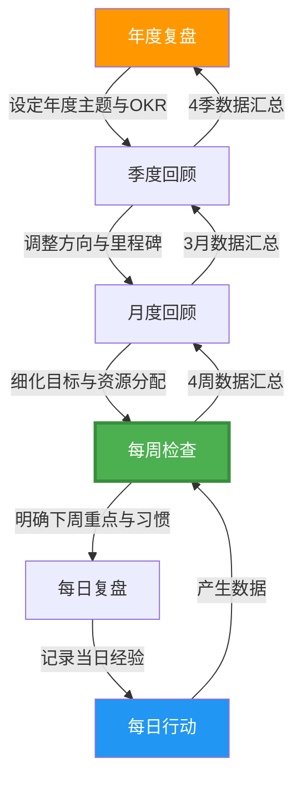
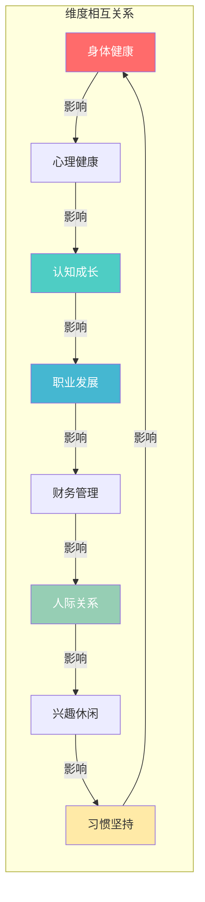

# 附录四：每周检查清单

> 本附录提供一套经过理论验证、实践打磨的每周自我检查系统。它不仅是一张勾选表，更是一套完整的自我审视方法论——从"为什么要检查"到"怎样检查才有效"，从"每个维度的深层逻辑"到"评分偏差的自我矫正"，层层递进，帮助你把每周30-60分钟的回顾时间，转化为持续成长的复利引擎。

---

## 为什么每周检查有效：理论基础

### 三大研究支撑

**1. Gollwitzer 的执行意图理论（Implementation Intentions）**

心理学家 Peter Gollwitzer 的研究表明，仅仅设定目标（"我要多运动"）对行为改变的推动力很弱；而将目标转化为"如果-那么"格式的执行意图（"如果到了周一早上7点，那么我就去跑步"），能将目标完成率从 22% 提升到 62%。每周检查清单的核心价值正在于此——它迫使你把模糊的"想变好"转化为具体的、可执行的、有时间节点的行动计划。

**2. Kolb 的经验学习循环（Experiential Learning Cycle）**

David Kolb 提出的学习循环包含四个阶段：具体经验 → 反思观察 → 抽象概念化 → 主动实验。大多数人停留在第一阶段（做事）和第三阶段（知道道理），却跳过了最关键的第二阶段——反思。每周检查正是系统化的"反思观察"环节，它让你从"做了什么"中提炼出"学到了什么"，然后在下周"主动实验"中验证。

**3. Drucker 的反馈分析法（Feedback Analysis）**

管理学大师 Peter Drucker 在《21世纪的管理挑战》中描述了他坚持了20年的方法：每当做出重要决策或采取重要行动时，写下期望的结果；9-12个月后，将实际结果与预期对比。每周检查清单是这个方法的高频版本——它让你每周都做一次微型的"反馈分析"，大幅缩短从行动到认知的反馈回路。

### 自我监控的心理学机制

Albert Bandura 的自我调节理论（Self-Regulation Theory）指出，人类的行为调节包含三个核心子过程：

| 子过程 | 说明 | 在每周检查中的体现 |
|--------|------|-------------------|
| **自我观察**（Self-Monitoring） | 持续关注自己的行为及其结果 | 逐项勾选清单，如实记录 |
| **自我判断**（Self-Judgment） | 将行为与标准对比，评估差距 | 1-5分评分，与上周对比 |
| **自我反应**（Self-Reaction） | 对判断结果产生情感和行为反应 | 制定下周改进计划 |

这三个子过程形成了一个正向循环：你观察得越仔细，判断就越准确；判断越准确，行为调整就越有效；行为调整越有效，你越愿意继续观察。这就是为什么"坚持"比"完美"更重要——即使某一周评分不理想，只要你完成了观察和判断，这个循环就在运转。

### 每周检查在个人成长系统中的位置

每周检查不是孤立的行为，它是个人成长时间层级系统中的关键连接层：

- **每日复盘**（5分钟）：记录当天的关键事件和情绪，提供原始数据
- **每周检查**（30-60分钟）：整合7天数据，识别模式，调整行为——这是个人成长系统的核心枢纽
- **月度回顾**（2小时）：整合4周数据，评估目标进展，重新分配资源
- **季度回顾**（半天）：评估战略方向，调整年度计划
- **年度复盘**（1-2天）：回顾全局，设定新的年度主题

> 💡 **关键洞察：** 每周检查之所以是"最重要的连接层"，是因为它的时间粒度刚好——足够短，能及时发现问题；足够长，能看到有意义的模式。每日检查太碎片化，月度检查又太慢。Goldstein et al. (2017) 的研究证实，每周回顾的频率在习惯养成和行为改变方面效果最佳。

### 主流回顾框架对比

| 框架 | 核心思路 | 优势 | 局限 | 适合人群 |
|------|---------|------|------|---------|
| **OKR 式** | 目标 → 关键结果 → 周任务 | 聚焦、可量化 | 可能忽略生活软性维度 | 目标驱动型 |
| **生命之轮**（Wheel of Life） | 8-10个维度平衡评分 | 全面、直观 | 评分主观性强 | 追求平衡型 |
| **柯维式**（7 Habits） | 以原则为中心，关注角色 | 深度反思 | 需要较强自律 | 原则导向型 |
| **GTD 式** | 清空收件箱、回顾项目清单 | 系统、不遗漏 | 偏重任务管理 | 事务繁忙型 |

**本清单的设计融合了以上框架的优点**：以生命之轮的多维度结构为骨架，以OKR的量化思维为评分方式，以柯维式的原则反思为深度，以GTD的清单管理为操作形式。你可以根据自身情况，侧重不同的框架。

---

## 使用说明

| 项目 | 说明 |
|------|------|
| **检查时间** | 每周日晚上（或其他固定时间，关键是形成仪式感） |
| **预计耗时** | 完整版 30-60 分钟，快速版 10 分钟 |
| **使用方式** | 逐项检查，诚实评估，记录思考 |
| **评分标准** | 每项 1-5 分（见下表） |
| **工具建议** | 打印 / 笔记软件 / Notion 模板（见进阶用法章节） |

### 评分标准通用参考

| 分数 | 含义 | 具体标准 |
|------|------|---------|
| **1 分** | 很差 | 本周几乎完全没有做到，或出现了明显的负面事件 |
| **2 分** | 较差 | 偶尔做到，但远低于计划，存在明显不足 |
| **3 分** | 一般 | 基本做到了，但没有亮点，也没有明显问题 |
| **4 分** | 良好 | 达到计划目标，有进步，有值得肯定的地方 |
| **5 分** | 优秀 | 超出预期，有突破，值得记录为里程碑 |

> 💡 **关于评分偏差：** 研究表明，人类对自身的评估存在系统性偏差。乐观的人倾向于给自己偏高的分数（"虚高效应"），而完美主义者倾向于给自己偏低的分数（"苛刻效应"）。建议用以下方法校准：问自己"如果我最好的朋友处于同样的情况，我会给他/她打几分？"——这个"旁观者视角"通常更准确。

---

## 一、身体健康检查

### 为什么身体健康是第一位的

身体是一切目标的"基础设施"。神经科学家 John Medina 在《Brain Rules》中指出，规律运动能提升认知功能、改善情绪调节、增强工作记忆——这意味着身体健康的收益远超"不生病"本身，它直接放大你在其他所有维度的表现。《柳叶刀》2018年的一项涵盖120万人的研究发现，每周运动3-5次、每次45分钟的人，心理健康状况最佳。这不是"有时间再运动"的问题，而是"不运动就没有时间"的问题。

### 运动与体能

- [ ] **本周运动次数是否达到计划目标？**（目标：____次，实际：____次）
  > 🔍 *为什么问这个：* 运动频率是衡量"是否把运动当作优先事项"的最直接指标。低于目标通常意味着时间被其他事情挤占了——这本身就是一个值得反思的信号。
- [ ] **每次运动时长是否充足？**（最低____分钟）
- [ ] **运动类型是否多样化？**（有氧 + 力量 + 柔韧）
  > 🔍 *评分参考：* 只做一种类型 = 2分；两种 = 3分；三种兼顾 = 4-5分。
- [ ] **运动前后是否有热身和拉伸？**
- [ ] **是否感受到体能的进步？**

**运动评分：** ___/5
**本周运动亮点：** _______________________________________________
**下周改进计划：** _______________________________________________

### 饮食与营养

- [ ] **本周三餐是否规律？**
- [ ] **蔬菜水果摄入是否充足？**（每天至少5份）
- [ ] **是否控制了垃圾食品和零食的摄入？**
- [ ] **饮水量是否达标？**（每天至少1500ml）
- [ ] **是否有暴饮暴食的情况？**
  > 🔍 *评分参考：* 连续7天三餐规律、蔬果达标、无暴食 = 4-5分；有2-3天不规律 = 3分；经常外卖零食、暴食1次以上 = 1-2分。

**饮食评分：** ___/5
**需要改进的饮食习惯：** _______________________________________________

### 睡眠与休息

- [ ] **本周是否保持了规律的作息时间？**
  > 🔍 *为什么问这个：* 睡眠研究者 Matthew Walker 在《Why We Sleep》中强调，规律性比时长更重要——即使睡够8小时，如果作息时间每天变化超过1小时，睡眠质量也会显著下降。
- [ ] **每晚睡眠时长是否达到7-8小时？**
- [ ] **睡眠质量如何？**（入睡是否顺利，夜间是否频繁醒来）
- [ ] **睡前1小时是否避免了屏幕使用？**
- [ ] **午休/小憩是否合理？**（建议 20-30 分钟，避免超过 45 分钟）

**睡眠评分：** ___/5
**影响睡眠的因素：** _______________________________________________

#### 深度自查（时间充裕时）

- [ ] 本周是否有意识地进行了"主动恢复"（如散步、泡脚、拉伸），而不仅仅是"瘫着不动"？
- [ ] 运动强度是否在合适的区间？（中等强度 = 能说话但不能唱歌的水平）
- [ ] 是否存在"补偿心理"——运动后觉得自己"应得"更多食物？

> 💡 **低分改善建议：** 如果身体健康维度持续低于3分，不要试图同时改变饮食、运动和睡眠。选择一个最薄弱的环节，用"微习惯"策略切入——比如每天只做5个俯卧撑、每天多喝一杯水、每天提前15分钟上床。微小的改变不会触发心理抗拒，但会积累惯性。

---

## 二、心理健康检查

### 为什么心理健康需要主动管理

很多人认为心理健康是"没有问题就行"，这就像认为身体健康是"没有生病就行"一样被动。积极心理学之父 Martin Seligman 的研究表明，"没有心理疾病"和"心理繁荣"之间存在巨大的空间。心理健康不仅是"不难受"，更是"有能力应对难受"。每周检查的目的不是消灭负面情绪，而是培养情绪觉察力——你能识别自己的情绪状态，理解情绪的来源，并选择适当的应对方式。

### 情绪管理

- [ ] **本周整体情绪状态如何？**
  > 🔍 *评分参考：* 大部分时间平静、偶尔有波动 = 4分；经常焦虑或低落 = 2分；情绪稳定且偶尔有积极高峰 = 5分。
- [ ] **是否有情绪失控的时刻？** 如有，处理方式是否得当？
- [ ] **是否识别并记录了主要的情绪触发因素？**
- [ ] **是否使用了健康的情绪调节方式？**（运动、倾诉、写日记等）
- [ ] **是否有持续的焦虑或低落情绪需要关注？**
  > 🔍 *为什么问这个：* 如果连续两周以上情绪评分低于2分，这不是"状态不好"，而是需要认真对待的信号。请参见综合评估部分的"何时寻求专业帮助"决策框架。

**情绪管理评分：** ___/5
**本周情绪记录：** _______________________________________________

### 压力与放松

- [ ] **本周压力水平如何？**（1-10分）：____
- [ ] **压力的主要来源是什么？**
- [ ] **是否采取了有效的减压措施？**
- [ ] **是否安排了足够的放松和休息时间？**
- [ ] **是否感到身心疲惫或倦怠？**

**压力管理评分：** ___/5
**有效减压方式：** _______________________________________________

### 冥想与正念

- [ ] **本周冥想/正念练习次数是否达标？**（目标：____次，实际：____次）
- [ ] **每次练习时长是否充足？**
- [ ] **练习过程中是否能保持专注？**
- [ ] **是否在日常生活中应用了正念觉察？**
  > 🔍 *为什么问这个：* 冥想的目的不是"坐着不动"，而是训练注意力的觉察力。哈佛大学 Killingsworth 和 Gilbert (2010) 的研究发现，人类有47%的时间处于"走神"状态，而走神与不快乐高度相关。冥想的核心价值是让你在日常生活中更快地觉察到"我现在走神了/焦虑了"。

**冥想练习评分：** ___/5

#### 深度自查

- [ ] 本周是否出现过"情绪传染"——被他人的情绪过度影响？
- [ ] 压力来源中，哪些是"可控"的？我对可控部分采取了行动吗？
- [ ] 是否存在"伪放松"行为？（刷手机、看短视频看似放松，实则消耗注意力）

> 💡 **低分改善建议：** 心理健康的改善不需要大动作。研究表明，每天3分钟的"情绪扫描"（闭眼，从头到脚感受身体各部位的状态）就能显著提升情绪觉察力。从这个极简练习开始。

---

## 三、认知成长检查

### 为什么认知成长需要结构化

认知心理学家 Anders Ericsson 的"刻意练习"理论告诉我们，单纯的经验积累不等于能力提升——只有在"舒适区边缘"进行有目标、有反馈的练习，才能实现真正的认知成长。换句话说，"干了10年"不等于"有10年经验"，可能只是"把第1年的经验重复了10次"。每周检查的目的，是确保你的学习和思考在"刻意"的轨道上。

### 阅读学习

- [ ] **本周阅读时长是否达标？**（目标：____小时，实际：____小时）
- [ ] **是否完成了计划的阅读量？**（目标：____页/章）
- [ ] **是否做了阅读笔记或批注？**
  > 🔍 *为什么问这个：* 认知科学中的"测试效应"（Testing Effect）表明，主动提取信息（如用自己的话总结、做笔记）比被动阅读的记忆保持率高 50-100%。不做笔记的阅读，一周后你可能只记得 10%。
- [ ] **是否有新的思考和见解产生？**
- [ ] **阅读内容是否与当前目标相关？**

**阅读学习评分：** ___/5
**本周阅读收获：** _______________________________________________
**值得记录的金句或观点：** _______________________________________________

### 课程与技能

- [ ] **本周是否按计划推进了课程学习？**
- [ ] **是否练习了新学的技能？**
- [ ] **是否将所学知识应用到了实际场景中？**
  > 🔍 *评分参考：* 学了但没用 = 2分；尝试应用但效果一般 = 3分；成功应用并产生实际价值 = 5分。学习的终极检验标准是"能否用出来"。
- [ ] **是否与他人分享或讨论了所学内容？**（费曼学习法：能教别人才算真正理解）

**课程学习评分：** ___/5

### 思维训练

- [ ] **本周是否进行了批判性思维练习？**
- [ ] **是否尝试从不同角度看待问题？**
- [ ] **是否写了反思日记或思考笔记？**
- [ ] **是否有意识地避免了常见的认知偏差？**

**思维训练评分：** ___/5

#### 深度自查

- [ ] 本周学到的最重要的一个概念是什么？我能否用自己的话向一个外行人解释清楚？（费曼检验）
- [ ] 我的学习是"输入驱动"还是"问题驱动"？如果是前者，能否转化为后者？
- [ ] 是否存在"学习焦虑"——用"我在学习"来逃避"我在行动"？

> 💡 **低分改善建议：** 用"最小学习单元"策略：每天只学习15分钟，但必须写一句话总结。这个"一句话"就是你的认知锚点，它会自然地串联成更大的知识网络。

---

## 四、职业发展检查

### 为什么职业发展需要每周审视

管理学大师 Peter Drucker 说过："效率是把事情做对，效能是做对的事情。"每周的职业检查，就是确保你在"做对的事情"。很多人在职业中陷入"忙碌陷阱"——每周都很忙，但三个月后发现并没有向目标靠近。每周检查帮你区分"紧急但不重要"和"重要但不紧急"的事，把时间投资到真正推动职业发展的事情上。

### 工作表现

- [ ] **本周是否完成了最重要的工作任务？**
  > 🔍 *为什么用"最重要"而非"所有"：* 帕累托原则告诉我们，20%的工作创造80%的价值。每周检查的首要目标是确保你完成了那20%。
- [ ] **工作质量是否达到自己的标准？**
- [ ] **是否有拖延的重要事项需要处理？**
- [ ] **是否主动承担了额外的责任或挑战？**
- [ ] **是否获得了有价值的反馈？**

**工作表现评分：** ___/5
**本周工作亮点：** _______________________________________________
**需要改进的方面：** _______________________________________________

### 人脉与社交

- [ ] **本周是否维护了重要的人脉关系？**
- [ ] **是否参加了有价值的社交或行业活动？**
- [ ] **是否帮助了他人或获得了他人的帮助？**
- [ ] **是否拓展了新的社交圈？**

**人脉维护评分：** ___/5

### 职业学习

- [ ] **本周是否学习了与职业相关的新知识或技能？**
- [ ] **是否关注了行业动态和趋势？**
- [ ] **是否为职业发展采取了具体行动？**（如更新简历、联系猎头、参加培训）

**职业学习评分：** ___/5

#### 深度自查

- [ ] 如果我下周被裁员，我的技能在市场上值多少？我本周为提升这个"市场价值"做了什么？
- [ ] 本周的工作中，有多少比例是"可被替代的执行"vs"不可替代的判断和创造"？
- [ ] 我的职业方向是否仍然与长期人生目标一致？还是在随波逐流？

> 💡 **低分改善建议：** 职业发展的"最小有效行动"是每周至少进行一次"有目的的对话"——和同事、同行、前辈聊一个具体的职业话题。这不需要额外时间，只需要把日常闲聊升级为有深度的交流。

---

## 五、财务管理检查

### 为什么财务需要每周审视

行为经济学家 Richard Thaler 在《Nudge》中提出了"心理账户"理论：人们对"小钱"的感知很弱，容易忽视日常的小额支出。但正是这些"无感消费"累积成了财务黑洞。每周财务检查的核心价值是"让无感变有感"——当你每周花10分钟审视支出时，你会自然地开始对消费决策保持警觉。

### 收支管理

- [ ] **本周是否记录了所有支出？**
  > 🔍 *为什么问这个：* "记录"本身就是最强的消费控制手段。研究发现，仅仅通过记录支出（不做任何其他干预），人们的非必要消费就减少了 15-20%。
- [ ] **支出是否在预算范围内？**
- [ ] **是否有不必要的消费？**
- [ ] **是否做到了量入为出？**

**收支管理评分：** ___/5
**本周意外支出：** _______________________________________________
**可以避免的支出：** _______________________________________________

### 理财与投资

- [ ] **本周是否关注了财务知识学习？**
- [ ] **是否按计划进行了储蓄或投资？**
- [ ] **是否评估了投资组合的表现？**

**理财学习评分：** ___/5

#### 深度自查

- [ ] 本周的支出中，"需要"和"想要"的比例是多少？比例是否合理？
- [ ] 如果收入突然减少50%，我的生活方式需要做哪些调整？我现在是否在为这种可能性做准备？
- [ ] 我的储蓄率是否在提升？还是收入涨了，支出也同比涨了？（生活方式膨胀陷阱）

> 💡 **低分改善建议：** 不需要复杂的预算系统。试试"50-30-20"简化法则：50%用于必需品，30%用于个人享受，20%用于储蓄和投资。每周检查时只需要看三个数字是否大致在这个比例。

---

## 六、人际关系检查

### 为什么人际关系需要结构化维护

哈佛大学长达 85 年的"成人发展研究"（Grant Study）得出了一个简洁而深刻的结论：**决定人生幸福的最重要因素不是财富、成就或名望，而是人际关系的质量。** Robert Waldinger 教授在 TED 演讲中总结道："好的关系让我们更健康、更快乐。就这么简单。"然而，人际关系是典型的"重要但不紧急"事项——它不会像工作截止日期那样逼你行动，但它的退化是缓慢而致命的。每周检查就是你对抗这种"温水煮青蛙"效应的工具。

### 亲密关系

- [ ] **本周是否与家人/伴侣进行了高质量的相处？**
  > 🔍 *关键区分：* "在一起"和"高质量相处"是两件事。坐在同一张沙发上各自刷手机不叫高质量相处。John Gottman 的研究表明，每天 6 分钟的专注对话比 2 小时的"同在"更有价值。
- [ ] **是否表达了爱意和感激？**
- [ ] **是否妥善处理了关系中的分歧？**
- [ ] **是否给予了对方足够的关注和支持？**

**亲密关系评分：** ___/5

### 友谊与社交

- [ ] **本周是否与朋友保持了联系？**
- [ ] **是否参加了社交活动？**
- [ ] **是否在社交中保持了真诚和善意？**
- [ ] **社交频率是否适中？**（不过多也不过少）

**友谊维护评分：** ___/5

### 沟通能力

- [ ] **本周沟通中是否有值得肯定的表现？**
- [ ] **是否有沟通不畅或冲突的情况？**
- [ ] **是否练习了倾听和表达的技巧？**
- [ ] **是否在重要对话中保持了冷静和理性？**

**沟通能力评分：** ___/5

#### 深度自查

- [ ] 本周我是否主动联系了一个"很久没联系"的人？还是只在"需要"时才联系别人？
- [ ] 在关系中，我是"给予者"还是"索取者"？本周的比例是否健康？
- [ ] 是否存在一段"应该维护但一直在逃避"的关系？

> 💡 **低分改善建议：** 关系维护的"最小有效行动"：每周主动给一个人发一条真诚的消息，不为了任何目的，只是关心。这个微小的习惯会在几个月后产生巨大的关系资本。

---

## 七、兴趣与休闲检查

### 为什么兴趣和休闲不是"浪费时间"

心理学家 Mihaly Csikszentmihalyi 的"心流"理论指出，真正的休闲不是"什么都不做"，而是"全身心投入一件让自己愉悦的事"。被动的消遣（刷手机、看综艺）提供的是"伪放松"——它消耗注意力却不恢复精力。主动的休闲（运动、手工、音乐、烹饪）才能真正让你"充电"。每周检查帮助你区分这两种休闲，并有意识地增加前者的比例。

### 兴趣爱好

- [ ] **本周是否投入了时间在兴趣爱好上？**
- [ ] **是否探索了新的兴趣领域？**
- [ ] **兴趣爱好是否带来了愉悦感和成就感？**

**兴趣爱好评分：** ___/5

### 休闲娱乐

- [ ] **本周是否安排了足够的休闲时间？**
- [ ] **休闲方式是否健康？**（避免过度刷手机、熬夜等）
  > 🔍 *评分参考：* 休闲时间以主动消遣为主 = 4-5分；以被动消遣为主 = 2-3分；几乎没有休闲时间 = 1分。
- [ ] **是否有户外活动或亲近自然的时间？**
- [ ] **是否做到了劳逸结合？**

**休闲质量评分：** ___/5

#### 深度自查

- [ ] 本周的休闲活动中，有哪些让我进入了"心流"状态？有哪些让我事后感觉"浪费了时间"？
- [ ] 我的兴趣爱好是否在"进步"？还是多年来一直在同一个水平重复？
- [ ] 是否存在"忙碌成瘾"——觉得休闲是"不务正业"，无法允许自己放松？

> 💡 **低分改善建议：** 在日历中"预约"休闲时间，就像预约工作会议一样。如果你不主动安排休闲，工作和琐事会自动填满所有时间。

---

## 八、习惯坚持检查

### 为什么习惯比意志力更可靠

James Clear 在《Atomic Habits》中指出，"你不会达到你的目标水平，你只会跌落到你的系统水平。"意志力是有限资源（Baumeister 的"自我损耗"理论），而习惯是自动化的行为模式——它不需要意志力来维持。每周习惯检查的目的不是"逼自己坚持"，而是审视习惯系统本身是否设计合理。

### 核心习惯打卡

| 习惯名称 | 周一 | 周二 | 周三 | 周四 | 周五 | 周六 | 周日 | 完成率 |
|---------|------|------|------|------|------|------|------|--------|
| 晨间仪式 | □ | □ | □ | □ | □ | □ | □ | __% |
| 运动 | □ | □ | □ | □ | □ | □ | □ | __% |
| 阅读 | □ | □ | □ | □ | □ | □ | □ | __% |
| 冥想 | □ | □ | □ | □ | □ | □ | □ | __% |
| 感恩日记 | □ | □ | □ | □ | □ | □ | □ | __% |
| 早睡 | □ | □ | □ | □ | □ | □ | □ | __% |
| ___ | □ | □ | □ | □ | □ | □ | □ | __% |
| ___ | □ | □ | □ | □ | □ | □ | □ | __% |

> 💡 **打卡表使用建议：** 不要超过 8 个习惯——习惯过多会分散注意力，导致每个都做不好。建议核心习惯 3-4 个，辅助习惯 2-3 个。如果你的打卡表长期出现大量空白，问题不在你的执行力，而在于你设定了太多习惯。

**整体习惯坚持率：** ____%
**连续打卡最长天数：** ____天

### 习惯复盘

- [ ] **哪个习惯的完成率最高？它为什么能坚持？**（找到"成功因素"以便复制）
- [ ] **哪个习惯的完成率最低？它的障碍是什么？**
- [ ] **是否存在"连锁反应"——一个习惯的完成/失败会影响其他习惯？**
  > 🔍 *为什么问这个：* Charles Duhigg 在《习惯的力量》中提出了"基石习惯"（Keystone Habit）的概念——某些习惯的改变会带动其他习惯的连锁改变。找到你的基石习惯，集中精力维护它。

#### 深度自查

- [ ] 我的习惯是否还服务于我的目标？还是已经变成了"为打卡而打卡"？
- [ ] 如果只能保留一个习惯，我会保留哪个？这个习惯是什么？（这就是你的基石习惯）
- [ ] 我的习惯设计是否考虑了"环境因素"？（如把运动鞋放在门口、把书放在枕边）

---

## 九、本周综合评估

### 整体评分

| 维度 | 评分（/5） | 上周评分 | 变化趋势 |
|------|-----------|---------|----------|
| 身体健康 | | | ↑ → ↓ |
| 心理健康 | | | ↑ → ↓ |
| 认知成长 | | | ↑ → ↓ |
| 职业发展 | | | ↑ → ↓ |
| 财务管理 | | | ↑ → ↓ |
| 人际关系 | | | ↑ → ↓ |
| 兴趣休闲 | | | ↑ → ↓ |
| 习惯坚持 | | | ↑ → ↓ |
| **综合均分** | | | |

> 💡 **如何画雷达图：** 在纸上画一个八角形，每个顶点代表一个维度，从中心（0分）到顶点（5分）。将每个维度的评分标记在对应轴上，连线形成的形状就是你本周的"人生形状"。理想的形状是接近正八边形，但现实中的偏差本身就是最有价值的信息。

### 如何解读评分

**模式识别——关注4个关键信号：**

1. **全面低分（均分 < 2.5）：** 你可能正处于"崩溃边缘"。这不是调整策略的问题，而是需要停下来做根本性的自我关怀。减少所有目标，优先恢复基本的生活节奏。

2. **单一维度极低（某维度 ≤ 2，其他正常）：** 这通常意味着生活中发生了特定事件。识别这个事件，判断它是"临时冲击"还是"结构性问题"，然后决定是短期应对还是长期调整。

3. **持续下降趋势（连续3周均分下降）：** 这是"温水煮青蛙"的信号。你可能在不知不觉中滑入了低谷。立即暂停所有"新增计划"，回到"只维护核心习惯"的模式。

4. **某维度持续远高于其他（差异 > 2分）：** 这是"偏科"信号。长期的维度失衡会导致"高分维度"的收益被"低分维度"的亏损抵消。例如，职业发展5分但身体健康1分，迟早会因为健康问题被迫中断职业。

### 维度间的相互关系

你的八个维度不是独立的——它们相互影响、相互制约：

| 如果这个维度低… | 最可能影响… | 原因 |
|----------------|------------|------|
| 身体健康 | 心理健康、认知成长、工作表现 | 睡眠不足、缺乏运动直接损害认知和情绪 |
| 心理健康 | 人际关系、工作表现、习惯坚持 | 情绪低落会削弱社交动力和执行力 |
| 人际关系 | 心理健康、职业发展 | 孤独感和关系冲突是主要的心理压力来源 |
| 习惯坚持 | 所有维度 | 习惯是其他维度改善的"基础设施" |

### 何时寻求专业帮助 vs 自我调整

**自我调整的情况：**
- 单周某维度评分下降，但整体稳定
- 能清晰识别问题原因（如某周加班导致运动减少）
- 自己有明确的改善计划，且有信心执行

**考虑寻求专业帮助的情况：**
- 连续 4 周以上心理健康评分低于 2 分
- 出现持续的失眠、食欲异常、社交回避等生理/行为症状
- 感觉"知道自己应该做什么，但就是做不到"超过一个月
- 情绪问题严重影响了工作效率或人际关系

> ⚠️ **重要提醒：** 寻求帮助不是软弱的表现。正如你不会因为感冒去看医生而觉得自己"不行"一样，心理健康问题同样需要专业支持。心理咨询师、教练、支持团体都是有效的资源。

### 如何利用趋势数据

每周评分的真正价值不在单周数据，而在趋势。建议：
- **每周：** 记录8个维度的评分，计算均分
- **每月：** 计算每个维度的月均分和变化趋势
- **每季度：** 绘制雷达图，观察"人生形状"的变化
- **每年：** 回顾全年数据，识别季节性模式和结构性趋势

**本周总结**

**最满意的 3 件事：**
1. _______________________________________________
2. _______________________________________________
3. _______________________________________________

**最不满意的 1 件事：**
1. _______________________________________________

**最重要的 1 个教训：**
_______________________________________________

**感恩的 3 件事：**
1. _______________________________________________
2. _______________________________________________
3. _______________________________________________

---

## 十、下周计划

### 用 SMART 框架设定下周目标

| SMART 要素 | 含义 | 示例（差） | 示例（好） |
|-----------|------|-----------|-----------|
| **S**pecific（具体） | 目标要明确，不能模糊 | "多运动" | "周一三五早上7点跑步30分钟" |
| **M**easurable（可衡量） | 有明确的衡量标准 | "多读书" | "读完《原则》第3-5章" |
| **A**chievable（可实现） | 在现有条件下可完成 | "每天运动2小时" | "每天运动30分钟" |
| **R**elevant（相关性） | 与长期目标相关 | "学做菜" | "学习工作需要的Python" |
| **T**ime-bound（有时限） | 有明确的截止时间 | "早点完成" | "周三前完成报告初稿" |

### 下周核心目标（最多 3 个）

> 💡 **为什么限制为3个：** 心理学家 Barry Schwartz 的"选择悖论"研究表明，目标越多，每个目标分配的注意力和执行力越少，最终完成率越低。3个是经过验证的"甜蜜点"——足够少以至于每个都能获得足够关注，足够多以至于覆盖了生活的主要方面。

1. _______________________________________________
2. _______________________________________________
3. _______________________________________________

### 艾森豪威尔优先矩阵

将下周任务按"紧急性"和"重要性"分类：

| | **紧急** | **不紧急** |
|---|---------|-----------|
| **重要** | ①立即做 | ②计划做（最值得关注的象限） |
| **不重要** | ③委托/快速处理 | ④考虑放弃 |

> 💡 **关键洞察：** 大多数人把时间花在①和③象限（紧急的事），但真正推动成长的是②象限（重要但不紧急）。每周计划时，至少确保有2个任务来自②象限。

### 下周重点任务

| 优先级 | 任务 | 所属象限 | 计划完成日 | 所需资源 |
|--------|------|---------|-----------|---------|
| ★★★ | | ①/② | | |
| ★★★ | | ①/② | | |
| ★★☆ | | ② | | |
| ★★☆ | | ③ | | |
| ★☆☆ | | ④ | | |

### 设定"伸展目标"（Stretch Goals）

伸展目标是"有点超出舒适区但并非不可能"的目标。它的作用是：
- 拉高你的天花板（即使只完成80%，也比保守目标的100%更好）
- 打破"我已经够好了"的自我安慰
- 创造"意外突破"的机会

**伸展目标设定原则：**
- 比你"确信能完成"的水平高出 20-30%
- 只设定 1 个伸展目标（多了会变成压力源）
- 即使没完成也不扣分——它的价值在于"拉伸"，不在于"达成"

**下周伸展目标：** _______________________________________________

### 下周习惯调整

**继续保持的好习惯：**
_______________________________________________

**需要加强的习惯：**
_______________________________________________

**需要戒除或减少的行为：**
_______________________________________________

### 下周自我关怀计划

- **运动安排：** _______________________________________________
- **放松活动：** _______________________________________________
- **社交计划：** _______________________________________________
- **学习计划：** _______________________________________________

---

## 快速版检查清单（10 分钟版）

### 什么时候用快速版 vs 完整版？

| 场景 | 推荐版本 | 原因 |
|------|---------|------|
| 正常周日晚上 | 完整版 | 这是你应该做的标准流程 |
| 出差/旅行中 | 快速版 | 环境变化时保持最低限度的自我觉察 |
| 身体不适/情绪低落 | 快速版 | 不要给自己额外压力，保持节奏比内容更重要 |
| 连续4周以上只用快速版 | 完整版 | 快速版用太久会失去深度反思的价值 |
| 第一次使用 | 完整版 | 需要完整的基线数据 |

> ⚠️ **重要原则：** 快速版不是"偷懒版"——它是在特定条件下的"最小可行回顾"。用快速版的关键不是"快"，而是"不断"。连续几周用快速版没有问题，但请定期回到完整版，否则你只是在"打勾"而非在"反思"。

- [ ] 本周运动____次，达标？ □是 □否
- [ ] 本周睡眠平均____小时，达标？ □是 □否
- [ ] 本周阅读____小时，达标？ □是 □否
- [ ] 本周情绪总体评分：____/10
- [ ] 本周最重要的成就：_____________________________
- [ ] 本周最大的遗憾：_____________________________
- [ ] 下周最重要的 1 件事：_____________________________

---

## 进阶用法

### 数字化工具推荐

| 工具 | 适合人群 | 优势 | 模板/公式 |
|------|---------|------|----------|
| **Notion** | 喜欢自定义界面的用户 | 数据库视图、关联、模板 | 创建"每周检查"数据库，8个属性对应8个维度，用 formula 字段计算均分 |
| **Excel/Google Sheets** | 数据分析爱好者 | 公式灵活、图表丰富 | 用 `=AVERAGE(B2:B9)` 计算均分，用折线图追踪趋势 |
| **Obsidian** | Markdown 爱好者 | 双链、本地存储、插件生态 | 使用 Dataview 插件查询历史评分 |
| **纸质笔记** | 喜欢手写的人 | 减少屏幕时间、书写本身是反思 | 打印本清单，用不同颜色标记趋势 |

### 构建个人仪表盘

如果你使用数字工具，建议构建一个"个人仪表盘"，包含以下视图：

1. **本周快照：** 8个维度的雷达图 + 与上周的对比
2. **趋势图：** 过去12周每个维度的折线图
3. **习惯热力图：** 类似 GitHub 贡献图，展示每个习惯的每日打卡情况
4. **关键指标：** 运动次数、阅读时长、冥想次数、睡眠时长的周趋势

### 月度/季度数据聚合

**月度聚合（每月最后一个周日）：**
- 计算当月4-5周的各维度均分
- 识别"最佳周"和"最差周"，分析原因
- 设定下月的"重点改善维度"（1-2个）

**季度聚合（每季度最后一个周日）：**
- 绘制季度雷达图对比
- 回顾季度初设定的OKR完成情况
- 调整长期方向和年度计划

### 问责伙伴制度（Accountability Partner）

研究表明，有问责伙伴的目标完成率比独自完成高出 65%（ASTD 研究）。具体做法：

1. 找一个同样在做个人成长的朋友
2. 每周日晚上互相发送本周评分和下周计划
3. 每月进行一次"深度对话"（30分钟），讨论当月的收获和困惑
4. 规则：只分享，不评判；只支持，不批评

---

## 常见误区

### 误区一：打勾代替反思

**症状：** 快速勾选所有项目，不写任何文字，不花时间思考。

**根源：** 把检查清单当成了"任务"而非"工具"。大脑倾向于用最省力的方式完成任务——勾选比思考省力得多。

**矫正方法：** 每个维度至少写一句话总结。如果某个维度你写不出任何话，说明你根本没有在反思——这一项的评分应该是 1 分。

### 误区二：自我评分过于严苛或过于宽松

**症状：**
- 严苛型：大多数时候给自己 1-2 分，即使客观上做得不错
- 宽松型：大多数时候给自己 4-5 分，回避承认不足

**根源：** 严苛型通常是完美主义者，把"理想中的自己"当作评分标准；宽松型通常是"自我保护"，把承认不足等同于承认失败。

**矫正方法：**
- 严苛型：用"进步标准"替代"绝对标准"——不要问"我离理想有多远"，问"我比上周进步了多少"。
- 宽松型：用"朋友标准"——"如果我最好的朋友处于同样的情况，我会给他/她打几分？"

### 误区三：分析瘫痪

**症状：** 花大量时间分析评分数据，纠结每个维度应该打3分还是4分，但不做任何实际改变。

**根源：** "分析"比"行动"安全——分析不会失败，但行动会。这是一种隐蔽的拖延。

**矫正方法：** 设定严格的时间限制——完整版不超过 60 分钟。如果时间到了你还没写完，停笔。未完成的部分留到下周。记住：一个 80% 完成的检查，好过一个 100% 完成但没有执行的检查。

### 误区四：完美主义扼杀一致性

**症状：** 某一周没有完成检查，就觉得"已经断了"，干脆放弃整套系统。

**根源：** "全有或全无"思维——要么完美执行，要么干脆不做。

**矫正方法：** 采用"两天规则"（来自 Jerry Seinfeld 的"不断链"方法的变体）：允许自己最多断两周，但不能连续断三周。断了一周？没关系，下周重新开始。断了两周？发出警告，第三周必须执行（即使是快速版）。**坚持不完美的执行，永远好过完美的放弃。**

### 误区五：忽视数据的时间维度

**症状：** 只看本周评分，不与历史数据对比。

**矫正方法：** 评分本身几乎毫无意义——有意义的是趋势。本周认知成长 3 分，如果上周是 2 分，这是巨大的进步；如果上周是 4 分，这是需要关注的信号。始终把本周数据放在时间序列中解读。

---

## 最后的话

> 💡 **坚持提示：** 前 4 周是最难的，很多人会在这个阶段放弃。请记住：即使某一周没有完成所有检查，也不要彻底放弃。断了一周不要紧，重新开始就好。完美是好的敌人，坚持比完美更重要。

本清单的设计哲学是"渐进式深度"——你可以从快速版开始，逐步过渡到完整版；从只填写评分开始，逐步增加文字反思；从只关注身体和职业两个维度开始，逐步扩展到全部八个维度。重要的不是你从哪里开始，而是你开始了——并且持续了下去。

**你的每周检查数据，就是你的人生仪表盘。** 它不会替你驾驶，但它会告诉你现在在哪里、开向何方、是否需要调整方向。祝你在每周30-60分钟的安静审视中，找到属于自己的成长节奏。
