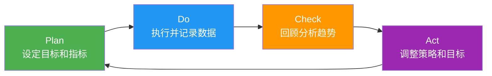
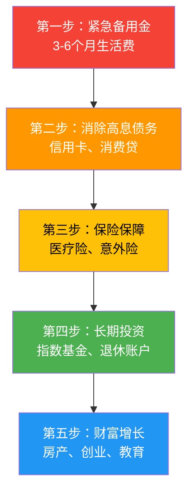

# 附录三：进度跟踪表

> 如果你不能度量它，你就不能改进它。——彼得·德鲁克

个人提升是一场漫长的旅程，而进度跟踪是这段旅程中最被低估的工具。大多数人设定目标时充满激情，却在执行过程中逐渐迷失方向——不是因为缺乏意志力，而是因为缺乏反馈。当你看不见进步时，大脑会自动判定"这件事没有价值"，然后悄悄把你引向更容易获得即时满足的事情。

本附录提供的不是一堆空白表格，而是一套完整的**进度跟踪系统**。它融合了行为科学、目标管理理论和实操经验，帮助你将模糊的"我要变好"转化为可量化、可追踪、可调整的具体行动。

**核心原则：**
- **简单优先**：跟踪的阻力越小，坚持的概率越大
- **趋势重于绝对值**：关注变化方向，不要执着于单次数字
- **回顾重于记录**：记录是手段，回顾和调整才是目的
- **弹性重于完美**：允许偶尔中断，重要的是重新开始

---

## 一、为什么进度跟踪有效：行为科学原理

在使用这些表格之前，理解它们为什么有效，能显著提升你坚持使用的动力。

### 1.1 反馈回路理论

人类行为受**反馈回路**驱动：行动→观察结果→调整行动。进度跟踪本质上是在人工构建一个**高频反馈回路**。在健身、学习等长期目标中，自然反馈往往来得太慢（三个月才能看到体型变化），而跟踪表提供了替代性的即时反馈——当你看到本周运动次数达标时，大脑会分泌多巴胺，产生成就感。

### 1.2 承诺一致性原理

心理学家罗伯特·西奥迪尼在《影响力》中指出：人一旦做出承诺（哪怕是写在纸上的承诺），就会倾向于让后续行为与之一致。当你在跟踪表中记录了目标，每次填写都是一次"重新承诺"，大脑会自动调整行为以匹配你写下的目标。

### 1.3 具体效应（Concreteness Effect）

认知心理学研究表明，具体信息比抽象信息更容易被记住和执行。"我要变得更健康"是抽象的，而"本周完成4次30分钟运动"是具体的。跟踪表强制你将模糊愿望转化为具体指标，大大提升执行概率。

### 1.4 损失厌恶

人对损失的敏感度约为收益的2倍。当你连续记录了21天运动数据，中断记录会让你感到"失去了这个连续记录"，这种损失厌恶会推动你继续记录。这就是为什么很多习惯追踪APP使用"连续天数"作为核心指标。

---

## 二、进度跟踪系统设计方法论

### 2.1 指标选择的SMART-PLUS原则

选择跟踪指标时，除了满足SMART原则（具体、可衡量、可达成、相关、有时限），还需要额外考虑：

| 原则 | 说明 | 示例 |
|------|------|------|
| **领先指标** | 能预测结果的行为指标 | 每周运动次数（领先）vs 体重变化（滞后） |
| **可控性** | 你能直接影响的指标 | 阅读时间（可控）vs 读书数量（部分可控） |
| **最小可行** | 只跟踪最关键的2-3个指标 | 身体健康：运动次数+睡眠时长+体重 |
| **低摩擦** | 记录成本低于30秒 | 用数字评分而非长篇描述 |

### 2.2 跟踪频率矩阵

不同的指标适合不同的跟踪频率：

┌─────────────┬──────────┬────────────┬──────────────┐
│ 频率         │ 适合指标  │ 记录方式    │ 回顾周期     │
├─────────────┼──────────┼────────────┼──────────────┤
│ 每日         │ 情绪评分  │ 1-10数字   │ 每周看趋势   │
│              │ 睡眠时长  │ 入睡/起床  │              │
│              │ 习惯打卡  │ ✓/✗       │              │
├─────────────┼──────────┼────────────┼──────────────┤
│ 每周         │ 运动次数  │ 次数+时长  │ 每月看趋势   │
│              │ 阅读进度  │ 页数/本数  │              │
│              │ 社交活动  │ 类型+感受  │              │
├─────────────┼──────────┼────────────┼──────────────┤
│ 每月         │ 体重/体脂 │ 精确数字   │ 每季度看趋势  │
│              │ 财务收支  │ 金额      │              │
│              │ 技能评估  │ 水平评分   │              │
├─────────────┼──────────┼────────────┼──────────────┤
│ 每季度       │ 职业里程碑│ 完成/未完成 │ 每年看趋势   │
│              │ 人脉维护  │ 互动记录   │              │
│              │ 综合评估  │ 各维度评分  │              │
└─────────────┴──────────┴────────────┴──────────────┘

### 2.3 数据驱动的PDCA循环

进度跟踪不是单向记录，而是一个持续改进的循环：

**关键提醒：** 大多数人只做了Plan和Do，跳过了Check和Act。这导致跟踪变成了无意义的填表游戏。每个月至少花30分钟回顾数据，问自己三个问题：
1. 哪些指标在改善？为什么？
2. 哪些指标在恶化？原因是什么？
3. 下个月我需要调整什么？

---

## 三、总览仪表盘

### 3.1 年度目标总览

这是你的个人提升"驾驶舱"，一眼看到所有模块的状态。

年度：___________

┌─────────────┬──────────────────┬──────┬──────┬──────────┐
│ 提升模块     │ 年度目标          │ 目标值│ 当前值│ 完成状态  │
├─────────────┼──────────────────┼──────┼──────┼──────────┤
│ 身体健康     │                  │      │      │ ○ 进行中  │
│ 心理健康     │                  │      │      │ ○ 未开始  │
│ 认知成长     │                  │      │      │ ○ 已完成  │
│ 职业发展     │                  │      │      │ ○ 暂停中  │
│ 财务管理     │                  │      │      │          │
│ 人际关系     │                  │      │      │          │
│ 兴趣爱好     │                  │      │      │          │
│ 精神成长     │                  │      │      │          │
└─────────────┴──────────────────┴──────┴──────┴──────────┘

**填写示例：**

| 提升模块 | 年度目标 | 目标值 | 当前值 | 完成状态 |
|---------|---------|--------|--------|---------|
| 身体健康 | 养成规律运动习惯 | 150次/年 | 42次(截至4月) | ○ 进行中 |
| 心理健康 | 建立冥想习惯 | 每日10分钟 | 均5分钟/天 | ○ 进行中 |
| 认知成长 | 年读30本书 | 30本 | 11本 | ○ 进行中 |
| 职业发展 | 获得PMP认证 | 通过考试 | 备考中 | ○ 未开始 |
| 财务管理 | 建立6个月应急基金 | 6万 | 2.8万 | ○ 进行中 |

**使用要点：**
- 每月更新一次"当前值"列
- 用颜色或符号标记状态：绿色=超前进度，黄色=略落后，红色=严重落后
- 如果某项目标连续3个月无进展，需要重新评估：是目标不合理，还是执行有问题？

### 3.2 人生平衡轮评估

在开始详细跟踪之前，先做一个快速的"平衡轮"评估，找出最需要关注的领域。

评估日期：____年____月____日

各维度满意度评分（1-10分，1=极不满意，10=极满意）：

身体健康：___/10    心理健康：___/10
认知成长：___/10    职业发展：___/10
财务管理：___/10    人际关系：___/10
兴趣爱好：___/10    精神成长：___/10

综合均分：___/10

最需要提升的维度（选2个）：
1. ____________ 原因：____________
2. ____________ 原因：____________

当前最大的人生瓶颈：____________

---

## 四、身体健康模块

身体健康是所有个人提升的基础。没有好的身体状态，再完美的计划都无法执行。这个模块的跟踪重点是**运动、饮食、睡眠和体测数据**四个维度。

### 4.1 运动进度跟踪表

运动是回报率最高的投资之一。研究表明，每周150分钟中等强度运动可以：
- 降低心血管疾病风险35%
- 改善抑郁症状效果与药物相当
- 提升认知功能，增强记忆力
- 改善睡眠质量

月份：____年____月

┌──────┬──────────┬──────────┬──────────┬──────────┐
│ 周次 │ 计划运动  │ 实际运动  │ 完成次数 │ 完成率   │
│      │ 次数/周  │ 次数/周  │ 达标?    │          │
├──────┼──────────┼──────────┼──────────┼──────────┤
│ 第1周│    次    │    次    │   □是 □否│    %     │
│ 第2周│    次    │    次    │   □是 □否│    %     │
│ 第3周│    次    │    次    │   □是 □否│    %     │
│ 第4周│    次    │    次    │   □是 □否│    %     │
└──────┴──────────┴──────────┴──────────┴──────────┘

月度运动总时长：_____ 分钟
月度运动类型分布：
  □ 有氧运动（跑步/游泳/骑行）：_____ 次，_____ 分钟
  □ 力量训练：_____ 次，_____ 分钟
  □ 柔韧训练（瑜伽/拉伸）：_____ 次，_____ 分钟
  □ 其他：_____ 次，_____ 分钟

本月运动亮点：
_________________________________________________

下月运动改进计划：
_________________________________________________

**填写示例：**

月份：2025年3月

┌──────┬──────────┬──────────┬──────────┬──────────┐
│ 周次 │ 计划运动  │ 实际运动  │ 完成次数 │ 完成率   │
│      │ 次数/周  │ 次数/周  │ 达标?    │          │
├──────┼──────────┼──────────┼──────────┼──────────┤
│ 第1周│    4次   │    3次   │   □否    │   75%    │
│ 第2周│    4次   │    4次   │   □是    │  100%    │
│ 第3周│    4次   │    5次   │   □是    │  125%    │
│ 第4周│    4次   │    4次   │   □是    │  100%    │
└──────┴──────────┴──────────┴──────────┴──────────┘

月度运动总时长：540 分钟
月度运动类型分布：
  ✓ 有氧运动（跑步）：8次，240分钟
  ✓ 力量训练：6次，180分钟
  ✓ 柔韧训练（瑜伽）：2次，60分钟
  ✗ 其他：0次，0分钟

本月运动亮点：
第3周超额完成，因为和朋友约了晨跑，社交+运动双赢。

下月运动改进计划：
增加柔韧训练频率到每周2次，减少跑步膝盖不适。

**运动跟踪进阶技巧：**
- **记录主观疲劳度（RPE）**：1-10分，帮助你了解身体恢复状态
- **追踪渐进超负荷**：力量训练记录重量×组数×次数，确保持续进步
- **监控静息心率**：晨起测量，长期下降说明心肺功能提升
- **注意训练多样性**：有氧、力量、柔韧保持合理比例（推荐40:40:20）

### 4.2 饮食管理跟踪表

你不需要成为营养师，但需要对自己吃什么有基本的觉察。这个表格帮你发现饮食模式中的问题。

月份：____年____月

┌────────────┬──────┬──────┬──────┬──────┐
│ 评估指标    │ 第1周│ 第2周│ 第3周│ 第4周│
├────────────┼──────┼──────┼──────┼──────┤
│ 饮食规律性  │ /10  │ /10  │ /10  │ /10  │
│ 蔬果摄入    │ /10  │ /10  │ /10  │ /10  │
│ 控制零食    │ /10  │ /10  │ /10  │ /10  │
│ 饮水量      │ /10  │ /10  │ /10  │ /10  │
│ 控制外食    │ /10  │ /10  │ /10  │ /10  │
├────────────┼──────┼──────┼──────┼──────┤
│ 周均分      │      │      │      │      │
└────────────┴──────┴──────┴──────┴──────┘

本月饮食健康评分趋势：↑ / → / ↓
需要改进的方面：
_________________________________________________

**评分标准参考：**

| 指标 | 1-3分（差） | 4-6分（一般） | 7-10分（好） |
|------|------------|--------------|-------------|
| 饮食规律性 | 经常跳餐或暴饮暴食 | 偶尔不规律 | 三餐定时定量 |
| 蔬果摄入 | 几乎不吃蔬果 | 每天1-2份 | 每天5份以上 |
| 控制零食 | 每天多次零食 | 偶尔吃零食 | 很少吃加工零食 |
| 饮水量 | 每天<1L | 每天1-1.5L | 每天2L以上 |
| 控制外食 | 每天外食 | 每周3-4次 | 每周1-2次或更少 |

### 4.3 睡眠质量跟踪表

睡眠是身体和大脑的修复时间。长期睡眠不足（<7小时）会显著影响认知能力、情绪稳定性和免疫力。

月份：____年____月

┌──────┬──────────┬──────────┬──────────┐
│ 周次 │ 平均入睡  │ 平均睡眠  │ 平均质量  │
│      │ 时间     │ 时长     │ 评分/10  │
├──────┼──────────┼──────────┼──────────┤
│ 第1周│  ____:__ │  ____小时│    /10   │
│ 第2周│  ____:__ │  ____小时│    /10   │
│ 第3周│  ____:__ │  ____小时│    /10   │
│ 第4周│  ____:__ │  ____小时│    /10   │
└──────┴──────────┴──────────┴──────────┘

影响睡眠的主要因素：
□ 压力焦虑 □ 手机使用 □ 咖啡因 □ 噪音 □ 光线 □ 其他：_____

本月睡眠改善措施及效果：
_________________________________________________

**睡眠质量评分参考：**

| 评分 | 描述 |
|------|------|
| 1-3分 | 入睡困难，频繁醒来，醒后疲惫 |
| 4-6分 | 入睡较慢，偶尔醒来，醒后略感疲倦 |
| 7-8分 | 30分钟内入睡，很少醒来，醒后感觉良好 |
| 9-10分 | 15分钟内入睡，整夜安睡，醒后精力充沛 |

**睡眠优化清单：**
- 固定作息时间（包括周末，误差不超过1小时）
- 睡前1小时停止使用电子屏幕
- 卧室温度保持在18-22°C
- 避免下午3点后摄入咖啡因
- 建立睡前仪式（如阅读、冥想、热水澡）

### 4.4 体测数据跟踪表

定期测量身体数据，用客观数字替代主观感觉。

测量日期：____年____月____日

┌────────────────┬────────┬────────┬────────┬────────┐
│ 测量指标        │ 1月    │ 4月    │ 7月    │ 10月   │
├────────────────┼────────┼────────┼────────┼────────┤
│ 身高(cm)        │        │        │        │        │
│ 体重(kg)        │        │        │        │        │
│ BMI             │        │        │        │        │
│ 体脂率(%)       │        │        │        │        │
│ 腰围(cm)        │        │        │        │        │
│ 臀围(cm)        │        │        │        │        │
│ 静息心率(bpm)   │        │        │        │        │
│ 血压(mmHg)      │        │        │        │        │
│ 柔韧性          │        │        │        │        │
│ 平板支撑时间     │        │        │        │        │
└────────────────┴────────┴────────┴────────┴────────┘

**BMI参考标准（中国标准）：**

| 分类 | BMI范围 | 健康风险 |
|------|---------|---------|
| 偏瘦 | <18.5 | 营养不良风险 |
| 正常 | 18.5-23.9 | 最低风险 |
| 超重 | 24-27.9 | 中等风险 |
| 肥胖 | ≥28 | 高风险 |

**体脂率参考范围：**

| 性别 | 健康范围 | 运动员水平 | 需要注意 |
|------|---------|-----------|---------|
| 男性 | 15-20% | 6-13% | >25% |
| 女性 | 20-25% | 14-20% | >30% |

**测量注意事项：**
- 体重：每天同一时间（晨起排便后）、同一状态下测量
- 体脂率：家用体脂秤误差较大，关注趋势而非绝对值
- 腰围：在肚脐水平测量，呼气末读数
- 静息心率：晨起静卧测量，取连续3天平均值

---

## 五、心理健康模块

心理健康不是"没有问题"，而是拥有应对生活挑战的内在资源。这个模块帮助你建立对内心状态的觉察能力。

### 5.1 情绪状态跟踪表

情绪是内心状态的信号灯。长期跟踪情绪可以帮助你：
- 发现情绪波动的规律（如每周一情绪较低）
- 识别情绪触发因素
- 评估干预措施的效果
- 在情绪恶化前及时调整

月份：____年____月

情绪评分标准：1=非常糟糕  2=糟糕  3=较差  4=略差  5=一般
             6=略好  7=良好  8=很好  9=非常好  10=极佳

┌──────┬──┬──┬──┬──┬──┬──┬──┬──┬──┬──┬──┬──┬──┬──┬──┬──┬──┬──┬──┬──┬──┬──┬──┬──┬──┬──┬──┬──┬──┬──┬──┐
│ 日期  │ 1│ 2│ 3│ 4│ 5│ 6│ 7│ 8│ 9│10│11│12│13│14│15│16│17│18│19│20│21│22│23│24│25│26│27│28│29│30│31│
├──────┼──┼──┼──┼──┼──┼──┼──┼──┼──┼──┼──┼──┼──┼──┼──┼──┼──┼──┼──┼──┼──┼──┼──┼──┼──┼──┼──┼──┼──┼──┼──┤
│ 情绪分│  │  │  │  │  │  │  │  │  │  │  │  │  │  │  │  │  │  │  │  │  │  │  │  │  │  │  │  │  │  │  │
└──────┴──┴──┴──┴──┴──┴──┴──┴──┴──┴──┴──┴──┴──┴──┴──┴──┴──┴──┴──┴──┴──┴──┴──┴──┴──┴──┴──┴──┴──┴──┴──┘

月度情绪统计：
  平均情绪分：___/10
  最高情绪日：___月___日（___分），原因：_________
  最低情绪日：___月___日（___分），原因：_________
  情绪波动幅度：_____
  情绪稳定天数占比：_____%

主要情绪触发因素：
□ 工作压力 □ 人际冲突 □ 健康问题 □ 财务压力
□ 睡眠不足 □ 缺乏运动 □ 孤独感 □ 其他：_____

**情绪跟踪最佳实践：**
- 每天在固定时间记录（推荐晚上睡前）
- 只花30秒打分，不需要写长篇日记
- 如果连续3天评分低于4分，主动采取干预措施
- 每月回顾时，寻找情绪与行为的关联（如：运动后情绪通常更好）

### 5.2 冥想/正念练习记录

冥想是训练注意力和情绪调节能力的"心理健身"。研究显示，持续8周的正念练习可以显著减少焦虑和抑郁症状。

月份：____年____月

┌──────┬──────────┬──────────┬──────────┬──────────┐
│ 周次 │ 计划天数  │ 实际天数  │ 平均时长  │ 质量评分  │
├──────┼──────────┼──────────┼──────────┼──────────┤
│ 第1周│    天    │    天    │   分钟   │   /10    │
│ 第2周│    天    │    天    │   分钟   │   /10    │
│ 第3周│    天    │    天    │   分钟   │   /10    │
│ 第4周│    天    │    天    │   分钟   │   /10    │
└──────┴──────────┴──────────┴──────────┴──────────┘

本月冥想/正念类型分布：
□ 呼吸冥想：_____ 次    □ 身体扫描：_____ 次
□ 正念行走：_____ 次    □ 慈悲冥想：_____ 次
□ 引导冥想：_____ 次    □ 其他：_____ 次

本月冥想体验记录（重要觉察或突破）：
_________________________________________________

**冥想入门建议：**
- 从每天5分钟开始，不要追求长时间
- 固定时间练习（如早起后或睡前）
- 使用APP辅助（潮汐、Headspace、小睡眠）
- 质量比时长更重要：5分钟专注 > 20分钟走神
- 记录"质量评分"时，关注自己能否在走神后拉回注意力

### 5.3 压力水平评估表

压力本身不是坏事，但长期高压且缺乏恢复会导致身心崩溃。这个表帮你识别压力来源并评估应对效果。

月份：____年____月

压力源评估（1-10分，10为最大压力）：

┌─────────────┬────────┬────────┬─────────────────────┐
│ 压力来源     │ 强度   │ 频率   │ 应对策略            │
├─────────────┼────────┼────────┼─────────────────────┤
│ 工作任务     │   /10  │ 高/中/低│                     │
│ 人际关系     │   /10  │ 高/中/低│                     │
│ 财务状况     │   /10  │ 高/中/低│                     │
│ 健康担忧     │   /10  │ 高/中/低│                     │
│ 家庭事务     │   /10  │ 高/中/低│                     │
│ 未来不确定   │   /10  │ 高/中/低│                     │
│ 其他：_____  │   /10  │ 高/中/低│                     │
└─────────────┴────────┴────────┴─────────────────────┘

整体压力水平：___/10
主要应对方式：
□ 运动 □ 冥想 □ 倾诉 □ 写日记 □ 听音乐
□ 户外活动 □ 专业咨询 □ 其他：_____

**压力管理策略矩阵：**

| 压力类型 | 无效应对 | 有效应对 |
|---------|---------|---------|
| 可控压力（工作任务） | 逃避、拖延 | 分解任务、制定计划、寻求帮助 |
| 不可控压力（他人行为） | 试图控制、反复纠结 | 接受现实、调整期望、转移注意力 |
| 慢性压力（长期困境） | 忽视、麻痹 | 寻求支持、专业咨询、系统性改变 |

---

## 六、认知成长模块

认知成长是个人提升的核心引擎。这个模块追踪你的知识输入（阅读、课程）和能力输出（技能提升）。

### 6.1 阅读进度跟踪表

阅读是最高效的知识获取方式之一。但阅读量不是目的，真正的目的是**内化和应用**。

年度：___________

┌────┬─────────────┬──────┬──────┬──────┬──────┬──────┐
│ 序号│ 书名        │ 开始  │ 完成  │ 页数  │ 评分  │ 笔记 │
│    │             │ 日期  │ 日期  │      │ /10  │ □有□无│
├────┼─────────────┼──────┼──────┼──────┼──────┼──────┤
│  1 │             │      │      │      │      │      │
│  2 │             │      │      │      │      │      │
│  3 │             │      │      │      │      │      │
│  4 │             │      │      │      │      │      │
│  5 │             │      │      │      │      │      │
│  6 │             │      │      │      │      │      │
│  7 │             │      │      │      │      │      │
│  8 │             │      │      │      │      │      │
│  9 │             │      │      │      │      │      │
│ 10 │             │      │      │      │      │      │
│ 11 │             │      │      │      │      │      │
│ 12 │             │      │      │      │      │      │
└────┴─────────────┴──────┴──────┴──────┴──────┴──────┘

年度阅读目标：_____ 本
截至本月完成：_____ 本
完成率：_____%
阅读类型分布：
□ 心理学 □ 职业技能 □ 哲学 □ 科普 □ 文学 □ 其他

**填写示例：**

| 序号 | 书名 | 开始 | 完成 | 页数 | 评分 | 笔记 |
|-----|------|------|------|------|------|------|
| 1 | 原子习惯 | 1/5 | 1/20 | 280 | 9/10 | ✓ |
| 2 | 思考，快与慢 | 1/22 | 2/15 | 450 | 8/10 | ✓ |
| 3 | 被讨厌的勇气 | 2/18 | 3/1 | 220 | 9/10 | ✓ |

**阅读质量提升建议：**
- 每本书至少写3条核心收获（不需要长篇笔记）
- 读完一本书后，花10分钟向别人复述核心观点（费曼学习法）
- 每季度回顾阅读清单，评估阅读结构是否均衡
- 目标不是数量，而是改变：每本书至少带来一个可执行的行动

### 6.2 课程学习进度表

系统性学习需要课程支撑。这个表帮你追踪多门课程的进度，避免"囤课不学"。

月份：____年____月

┌──────────────┬────────┬────────┬────────┬────────┐
│ 课程名称      │ 平台    │ 总课时  │ 已完成  │ 完成率  │
├──────────────┼────────┼────────┼────────┼────────┤
│              │        │        │        │   %    │
│              │        │        │        │   %    │
│              │        │        │        │   %    │
└──────────────┴────────┴────────┴────────┴────────┘

本月课程学习总时长：_____ 小时
学习笔记产出：_____ 篇
实践应用记录：_____ 次

**课程学习策略：**
- 同时学习的课程不超过2门（避免注意力分散）
- 每门课程设定完成截止日期
- 学完一个模块后，立即尝试实践应用
- 记录"实践应用次数"比记录"学习时长"更有价值

### 6.3 技能提升跟踪表

技能提升需要刻意练习。这个表帮你规划和追踪技能成长路径。

季度：____年第____季度

┌────────────┬──────┬──────┬──────┬──────────────────┐
│ 技能名称   │ 起始  │ 当前  │ 目标  │ 提升方法         │
│            │ 水平  │ 水平  │ 水平  │                  │
│            │ /10  │ /10  │ /10  │                  │
├────────────┼──────┼──────┼──────┼──────────────────┤
│            │      │      │      │                  │
│            │      │      │      │                  │
│            │      │      │      │                  │
│            │      │      │      │                  │
│            │      │      │      │                  │
└────────────┴──────┴──────┴──────┴──────────────────┘

本季度技能提升亮点：
_________________________________________________

需要重点突破的技能：
_________________________________________________

**技能水平自评标准：**

| 水平 | 描述 |
|------|------|
| 1-2分 | 完全新手，需要指导才能完成基本操作 |
| 3-4分 | 初学者，能完成基本操作但效率低 |
| 5-6分 | 中级，能独立完成常见任务 |
| 7-8分 | 高级，能处理复杂问题并指导他人 |
| 9-10分 | 专家，能创新方法并解决行业难题 |

---

## 七、职业发展模块

职业发展不只是升职加薪，更是持续提升自己的市场价值和职业满意度。

### 7.1 职业目标追踪表

年度：___________

┌────────────────┬──────────────────┬──────────┬──────────┐
│ 职业目标        │ 关键里程碑        │ 目标日期  │ 当前状态  │
├────────────────┼──────────────────┼──────────┼──────────┤
│                │                  │          │ ○ 进行中  │
│                │                  │          │ ○ 已完成  │
│                │                  │          │ ○ 延期   │
│                │                  │          │ ○ 取消   │
├────────────────┼──────────────────┼──────────┼──────────┤
│                │                  │          │          │
│                │                  │          │          │
│                │                  │          │          │
└────────────────┴──────────────────┴──────────┴──────────┘

本月职业发展行动：
  □ 学习新技能：_____________________
  □ 拓展人脉：认识___位新朋友/同行
  □ 输出成果：_____________________
  □ 获得反馈：_____________________

**填写示例：**

| 职业目标 | 关键里程碑 | 目标日期 | 当前状态 |
|---------|-----------|---------|---------|
| 获得PMP认证 | 完成35小时培训 | 6月30日 | ○ 已完成 |
| | 通过模拟考试3次 | 8月15日 | ○ 进行中 |
| | 通过正式考试 | 9月30日 | ○ 未开始 |
| 提升技术能力 | 主导一个完整项目 | 12月31日 | ○ 进行中 |
| | 获得2个技术认证 | 12月31日 | ○ 未开始 |

**职业发展行动建议：**
- 每月至少1次行业交流（线上社群、线下活动、1对1咖啡）
- 每季度至少1个可展示的成果（项目、文章、演讲）
- 每年至少1次职业方向评估（是否还在正确的轨道上）

### 7.2 人脉关系管理表

人脉不是"认识多少人"，而是"在需要时能找到对的人"。维护关系需要刻意投入。

季度：____年第____季度

┌──────────┬──────────┬──────────┬──────────┬──────────┐
│ 姓名      │ 关系类型  │ 联系频率  │ 上次联系  │ 下次联系  │
├──────────┼──────────┼──────────┼──────────┼──────────┤
│          │同事/导师/ │每周/每月/ │          │          │
│          │朋友/行业  │每季      │          │          │
├──────────┼──────────┼──────────┼──────────┼──────────┤
│          │          │          │          │          │
│          │          │          │          │          │
│          │          │          │          │          │
│          │          │          │          │          │
│          │          │          │          │          │
└──────────┴──────────┴──────────┴──────────┴──────────┘

本月新增人脉：_____ 人
本月维护人脉：_____ 人
重要人脉互动记录：
_________________________________________________

**人脉分层管理建议：**

| 层级 | 人数 | 联系频率 | 维护方式 |
|------|------|---------|---------|
| 核心圈（至亲密友） | 5-10人 | 每周 | 深度交流、互相支持 |
| 关键圈（重要关系） | 20-30人 | 每月 | 定期问候、分享价值 |
| 扩展圈（一般关系） | 100+人 | 每季度 | 点赞、节日问候、社群互动 |

---

## 八、财务管理模块

财务健康是个人提升的物质基础。这个模块帮你建立对金钱的掌控感。

### 8.1 收支跟踪表

月份：____年____月

收入：
┌──────────────┬──────────┐
│ 收入来源      │ 金额(元) │
├──────────────┼──────────┤
│ 工资/主业     │          │
│ 副业/兼职     │          │
│ 投资收益     │          │
│ 其他收入     │          │
├──────────────┼──────────┤
│ 收入合计     │          │
└──────────────┴──────────┘

支出：
┌──────────────┬──────────┬──────────┐
│ 支出类别      │ 预算(元) │ 实际(元) │
├──────────────┼──────────┼──────────┤
│ 住房（房租/房贷）│          │          │
│ 餐饮          │          │          │
│ 交通          │          │          │
│ 日用品        │          │          │
│ 服饰          │          │          │
│ 学习/教育     │          │          │
│ 娱乐          │          │          │
│ 社交          │          │          │
│ 医疗健康      │          │          │
│ 其他          │          │          │
├──────────────┼──────────┼──────────┤
│ 支出合计     │          │          │
├──────────────┼──────────┼──────────┤
│ 月结余       │     —    │          │
│ 储蓄率       │     —    │    %     │
└──────────────┴──────────┴──────────┘

**储蓄率参考标准：**

| 储蓄率 | 评价 | 建议 |
|--------|------|------|
| <10% | 危险区 | 必须削减非必要支出 |
| 10-20% | 及格线 | 逐步提升到20%以上 |
| 20-30% | 良好 | 可以开始考虑投资 |
| 30-50% | 优秀 | 财务自由进程加速 |
| >50% | 极佳 | 注意生活质量平衡 |

### 8.2 财务目标进度表

年度：___________

┌──────────────┬──────────┬──────────┬──────────┬────────┐
│ 财务目标      │ 目标金额  │ 当前进度  │ 完成率   │ 预计达成 │
│              │          │          │          │ 日期    │
├──────────────┼──────────┼──────────┼──────────┼────────┤
│ 紧急备用金   │   个月   │          │    %     │        │
│ 短期储蓄     │          │          │    %     │        │
│ 投资账户     │          │          │    %     │        │
│ 债务偿还     │          │          │    %     │        │
│ 其他：_____  │          │          │    %     │        │
└──────────────┴──────────┴──────────┴──────────┴────────┘

**财务优先级金字塔：**

---

## 九、人际关系模块

良好的人际关系是幸福感的最强预测因子之一。哈佛大学长达85年的幸福研究表明：决定人生幸福的不是财富或成就，而是人际关系的质量。

### 9.1 社交活动记录

月份：____年____月

┌──────┬──────────┬──────────┬──────────┬──────────┐
│ 日期  │ 活动类型  │ 参与人数  │ 满意度   │ 备注     │
├──────┼──────────┼──────────┼──────────┼──────────┤
│      │家庭聚会/ │          │   /10    │          │
│      │朋友聚餐/ │          │          │          │
│      │社交活动/ │          │          │          │
│      │志愿服务  │          │          │          │
├──────┼──────────┼──────────┼──────────┼──────────┤
│      │          │          │          │          │
│      │          │          │          │          │
│      │          │          │          │          │
└──────┴──────────┴──────────┴──────────┴──────────┘

本月社交满意度：___/10
社交频率评估：过高 / 适中 / 不足
需要加强的关系：
_________________________________________________

### 9.2 沟通能力提升记录

月份：____年____月

┌──────────────┬────────┬────────┬────────────────────┐
│ 沟通场景      │ 评分   │ 表现   │ 改进方向           │
│              │ /10    │ 亮点   │                    │
├──────────────┼────────┼────────┼────────────────────┤
│ 工作汇报     │        │        │                    │
│ 同事协作     │        │        │                    │
│ 亲密关系沟通 │        │        │                    │
│ 朋友交流     │        │        │                    │
│ 陌生人社交   │        │        │                    │
│ 冲突处理     │        │        │                    │
└──────────────┴────────┴────────┴────────────────────┘

本月沟通进步记录：
_________________________________________________

**沟通能力自评参考：**

| 场景 | 1-3分 | 4-6分 | 7-10分 |
|------|-------|-------|--------|
| 工作汇报 | 紧张、逻辑混乱 | 能完成但不够清晰 | 自信、逻辑清晰、有说服力 |
| 冲突处理 | 回避或激化矛盾 | 能表达但容易情绪化 | 冷静倾听、找到双赢方案 |
| 陌生人社交 | 完全回避 | 能应付但不自在 | 主动破冰、自然交流 |

---

## 十、兴趣爱好模块

兴趣爱好不是"浪费时间"，而是补充精力、培养创造力的重要途径。

### 10.1 兴趣爱好投入跟踪

月份：____年____月

┌──────────────┬──────────┬──────────┬──────────┐
│ 兴趣爱好      │ 计划时长  │ 实际时长  │ 满意度   │
├──────────────┼──────────┼──────────┼──────────┤
│              │  小时/周  │  小时/周  │   /10    │
│              │          │          │          │
│              │          │          │          │
│              │          │          │          │
└──────────────┴──────────┴──────────┴──────────┘

本月兴趣爱好亮点：
_________________________________________________

想探索的新兴趣：
_________________________________________________

**兴趣爱好分类参考：**

| 类型 | 示例 | 价值 |
|------|------|------|
| 创造型 | 绘画、写作、编程、手工 | 培养创造力、获得成就感 |
| 体验型 | 旅行、美食、摄影 | 丰富人生体验、放松身心 |
| 社交型 | 桌游、运动队、合唱团 | 扩展社交圈、增进关系 |
| 学习型 | 乐器、语言、棋类 | 持续成长、锻炼大脑 |

---

## 十一、综合评估表

### 11.1 月度综合评分表

这是你的个人提升"月度报告"，帮你全面审视各领域的进展。

月份：____年____月

┌────────────┬──────┬──────┬──────┬──────────────────┐
│ 评估维度    │ 上月  │ 本月  │ 变化  │ 备注              │
│            │ 评分  │ 评分  │      │                  │
├────────────┼──────┼──────┼──────┼──────────────────┤
│ 身体健康   │  /10 │  /10 │  ↑→↓ │                  │
│ 心理健康   │  /10 │  /10 │  ↑→↓ │                  │
│ 认知成长   │  /10 │  /10 │  ↑→↓ │                  │
│ 职业发展   │  /10 │  /10 │  ↑→↓ │                  │
│ 财务管理   │  /10 │  /10 │  ↑→↓ │                  │
│ 人际关系   │  /10 │  /10 │  ↑→↓ │                  │
│ 兴趣爱好   │  /10 │  /10 │  ↑→↓ │                  │
│ 精神成长   │  /10 │  /10 │  ↑→↓ │                  │
├────────────┼──────┼──────┼──────┼──────────────────┤
│ 综合均分   │      │      │      │                  │
└────────────┴──────┴──────┴──────┴──────────────────┘

本月最大进步领域：___________
本月需要关注领域：___________
下月重点行动计划：
1. _________________________________________________
2. _________________________________________________
3. _________________________________________________

**填写示例：**

| 评估维度 | 上月评分 | 本月评分 | 变化 | 备注 |
|---------|---------|---------|------|------|
| 身体健康 | 6/10 | 7/10 | ↑ | 运动频率稳定，睡眠改善 |
| 心理健康 | 5/10 | 6/10 | ↑ | 冥想习惯初步建立 |
| 认知成长 | 7/10 | 7/10 | → | 读完2本书，课程进度缓慢 |
| 职业发展 | 6/10 | 6/10 | → | 项目进展顺利但无突破 |
| 财务管理 | 5/10 | 5/10 | → | 储蓄率达标但投资未启动 |
| 人际关系 | 4/10 | 5/10 | ↑ | 参加了2次行业活动 |
| 兴趣爱好 | 3/10 | 4/10 | ↑ | 开始学习吉他 |
| 精神成长 | 5/10 | 6/10 | ↑ | 每日感恩日记 |

**月度回顾问题清单：**
1. 本月最让我自豪的成就是什么？
2. 本月最大的遗憾是什么？下次如何避免？
3. 哪个领域的进步让我意外？为什么？
4. 哪个领域需要更多关注？具体行动计划是什么？
5. 下个月的TOP 3优先事项是什么？

### 11.2 季度深度回顾表

每三个月做一次深度回顾，比月度回顾更关注趋势和系统性问题。

季度：____年第____季度

一、季度目标完成情况
┌────────────────┬──────────┬──────────┬──────────┐
│ 目标            │ 计划      │ 实际      │ 完成率   │
├────────────────┼──────────┼──────────┼──────────┤
│                │          │          │    %     │
│                │          │          │    %     │
│                │          │          │    %     │
│                │          │          │    %     │
└────────────────┴──────────┴──────────┴──────────┘

二、季度关键洞察（最重要的3个发现）
1. _________________________________________________
2. _________________________________________________
3. _________________________________________________

三、模式识别（重复出现的问题或优势）
_________________________________________________

四、下季度调整策略
_________________________________________________

---

## 十二、年度总结表

年度总结是将一年的成长凝结为智慧的关键仪式。

年度：___________

一、年度目标完成情况
┌────────────────┬──────────┬──────────┬──────────┐
│ 目标            │ 计划      │ 实际      │ 完成率   │
├────────────────┼──────────┼──────────┼──────────┤
│                │          │          │    %     │
│                │          │          │    %     │
│                │          │          │    %     │
│                │          │          │    %     │
│                │          │          │    %     │
└────────────────┴──────────┴──────────┴──────────┘

二、年度关键成就（Top 5）
1. _________________________________________________
2. _________________________________________________
3. _________________________________________________
4. _________________________________________________
5. _________________________________________________

三、年度最大教训（Top 3）
1. _________________________________________________
2. _________________________________________________
3. _________________________________________________

四、人生平衡轮年度变化
┌────────────┬──────┬──────┬──────┐
│ 维度        │ 年初  │ 年末  │ 变化  │
├────────────┼──────┼──────┼──────┤
│ 身体健康   │  /10 │  /10 │  ↑→↓ │
│ 心理健康   │  /10 │  /10 │  ↑→↓ │
│ 认知成长   │  /10 │  /10 │  ↑→↓ │
│ 职业发展   │  /10 │  /10 │  ↑→↓ │
│ 财务管理   │  /10 │  /10 │  ↑→↓ │
│ 人际关系   │  /10 │  /10 │  ↑→↓ │
│ 兴趣爱好   │  /10 │  /10 │  ↑→↓ │
│ 精神成长   │  /10 │  /10 │  ↑→↓ │
└────────────┴──────┴──────┴──────┘

五、明年展望
核心主题：_________________________________________
三大目标：
1. _________________________________________________
2. _________________________________________________
3. _________________________________________________

关键词（用3个词概括明年方向）：___、___、___

---

## 十三、使用指南与常见问题

### 13.1 如何开始：从0到1的行动方案

不要试图一次性填写所有表格。按照以下步骤循序渐进：

**第1周：选择1-2个最相关的表格**
- 如果你最想改善身体健康 → 从运动进度跟踪表开始
- 如果你感觉情绪低落 → 从情绪状态跟踪表开始
- 如果你想提升认知 → 从阅读进度跟踪表开始

**第2-4周：形成记录习惯**
- 设定每天固定时间填写（推荐睡前5分钟）
- 不要追求完美，哪怕只填一个数字也好
- 用手机闹钟提醒自己

**第2个月：加入回顾环节**
- 每周日花10分钟回顾本周数据
- 问自己：数据告诉我什么？下周需要调整什么？

**第3个月：扩展到更多表格**
- 当第一个表格已经变成习惯，再添加新的
- 总共不要超过3-4个活跃表格

### 13.2 常见问题解答

**Q：我总是忘记填写怎么办？**
A：三种解决方案：①把表格放在你一定会看到的地方（床头、桌面）；②设置手机闹钟；③用习惯堆叠法——在某个固定习惯之后立即填写（如"刷牙后填写情绪评分"）。

**Q：数据看起来没有变化，感觉在做无用功？**
A：这是最常见的心态陷阱。个人提升的变化往往是指数型的——前期积累缓慢，后期突然加速。坚持至少3个月再评估效果。同时，"没有退步"本身就是一种进步。

**Q：我不确定该给自己的技能/情绪打多少分？**
A：评分的标准不重要，一致性才重要。只要你用同样的标准给自己打分，趋势就是有意义的。不要纠结于"客观准确"，关注"相对变化"。

**Q：我中断了一段时间，该从哪里重新开始？**
A：不要试图"补填"中断期间的数据。从今天重新开始，中断本身就是有价值的数据——它告诉你什么因素导致了中断（工作忙？失去动力？生活变化？），下次可以提前预防。

**Q：纸质版还是电子版好？**
A：两者各有优势：
- 纸质版：记录阻力小、无屏幕干扰、书写本身有助记忆
- 电子版：便于统计分析、不会丢失、可以随时随地填写
- 建议：习惯培养阶段用纸质版，稳定后迁移到电子版

### 13.3 数字化工具推荐

如果你想将跟踪数字化，以下工具可以替代纸质表格：

| 需求 | 推荐工具 | 特点 |
|------|---------|------|
| 习惯打卡 | Habitica、小日常、Streaks | 游戏化激励、极简界面 |
| 情绪追踪 | Daylio、Moodflow | 图标选择、趋势图表 |
| 运动记录 | Keep、Strava、华为健康 | GPS追踪、社区激励 |
| 综合追踪 | Notion、Obsidian、Excel | 完全自定义、数据可控 |
| 财务记录 | 随手记、MoneyWiz | 自动分类、报表生成 |

### 13.4 避免这些常见陷阱

**陷阱1：过度记录**
症状：花在记录上的时间比执行还多
解决：每个表格控制在30秒到2分钟内完成

**陷阱2：完美主义**
症状：某天忘记记录后就彻底放弃
解决：接受偶尔的中断，第二天继续就好

**陷阱3：只记录不回顾**
症状：表格填了一堆，但从不回看
解决：设定固定的回顾时间（每周日、每月最后一天）

**陷阱4：指标过多**
症状：同时追踪20个指标，感到疲惫
解决：每个领域只保留2-3个核心指标

**陷阱5：忽略情感因素**
症状：只关注数字，忽略自己的感受
解决：在备注栏写下一句话描述自己的感受

---

## 十四、进度跟踪与个人提升系统的整合

这些表格不是孤立存在的，它们应该与你个人提升的其他系统协同工作：

- **与目标系统整合**：年度目标 → 分解为月度指标 → 填入跟踪表
- **与复盘系统整合**：跟踪数据 → 月度复盘模板（见附录五）→ 调整策略
- **与习惯系统整合**：习惯打卡 → 输入跟踪表 → 评估习惯效果
- **与工具系统整合**：APP数据 → 同步到跟踪表 → 形成个人数据库

---

> 💡 **最终建议：** 不要试图一次性填写所有表格。选择与你当前重点提升领域相关的2-3个表格开始使用，形成习惯后再逐步扩展。记住，跟踪的目的是促进改变，而不是增加负担。一个被持续使用的简单表格，远比一个被放弃的完美系统更有价值。

---

*最后更新：2025年*
