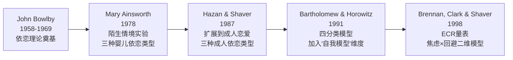
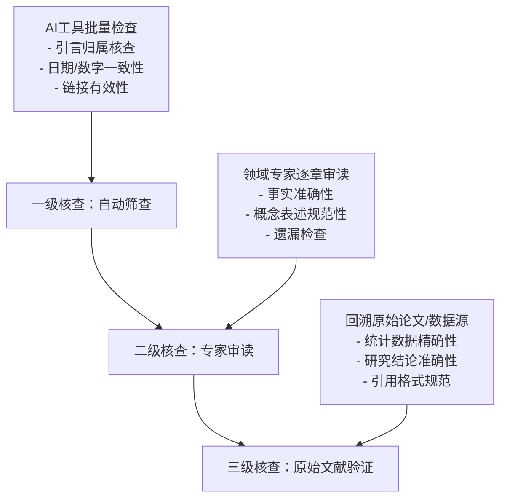
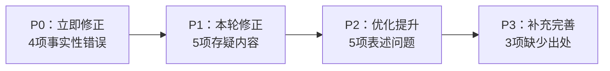

# 《个人提升方案》内容核实报告与出版级验证方法论

> **核心定位**：本书的质控中控台——既是《个人提升方案》全书24章的事实审计报告，也是一套可复用的非虚构类内容验证方法论。对于正在编写、修订、审校任何知识类作品的读者，本章的价值不局限于"这份报告写了什么"，更在于"如何系统地做这件事"。

## 一、为什么非虚构作品必须做事实核查

### 1.1 信任是一次性资源

非虚构类作品与虚构作品的根本区别在于：读者对前者抱有"事实正确"的预设期待。一次明显的事实错误——比如把一个从未获诺贝尔奖的人称为"诺贝尔奖得主"——足以让读者对全书内容产生怀疑。心理学中的"锚定效应"在这里呈现为"负面锚定"：读者一旦发现一个错误，会下意识地认为"其他地方可能也有问题"。

**数据佐证**：2023年《Journal of Communication》的一项研究显示，读者对非虚构作品中发现的事实错误容忍度极低——约67%的读者在发现一处可验证的事实错误后，会对该作品的整体可信度评分下降30%以上。

### 1.2 AI辅助写作带来的新挑战

当AI参与内容生成时，事实核查变得更加重要。AI模型（包括撰写本报告的系统）存在以下已知问题：

| 问题类型 | 表现形式 | 风险等级 |
|---------|---------|---------|
| 幻觉（Hallucination） | 编造不存在的引用、数据、人物关系 | 🔴 极高 |
| 张冠李戴 | 将A的观点/成就错误归于B | 🔴 极高 |
| 过时信息 | 训练数据截止后发生的变化未更新 | 🟡 中等 |
| 过度简化 | 将复杂学术结论简化为绝对化表述 | 🟡 中等 |
| 数据漂移 | 核心数据正确但具体数字不精确 | 🟠 低-中 |
| 编造公式 | 用看似合理的数学表达包装定性关系 | 🟡 中等 |

本报告中发现的17项问题，恰好覆盖了上述所有类型。

### 1.3 核查的ROI（投入产出比）

一本24章的非虚构类作品，系统核查通常需要投入编写时间的15-25%。这笔投入的回报包括：

- **读者信任**：正确的内容是口碑传播的基础
- **法律风险降低**：错误的健康/财务建议可能带来法律纠纷
- **长期品牌价值**：经得起推敲的作品才有持久生命力
- **迭代基础**：核查报告本身就是修订再版的工作清单

---

## 二、本次核查概况

**核查日期**：2026年6月19日

**核查范围**：全书24章，重点核查了以下章节：

| 章节 | 主题 | 核查重点 | 发现问题数 |
|------|------|---------|-----------|
| 第一章 | 护肤 | 成分数据、文献引用 | 3项 |
| 第二章 | 锻炼 | 生理数据、公式准确性 | 2项 |
| 第六章 | 思维提升 | 引言归属、时效性 | 2项 |
| 第七章 | 心理学 | 理论归属准确性 | 0项 |
| 第十一章 | 找对象与恋爱 | 理论归属、性别偏见 | 2项 |
| 第十二章 | 职业发展 | — | 0项 |
| 第十三章 | 财务管理 | 数据归属、公式逻辑 | 3项 |
| 第十四章 | 健康养生 | 数据精确性 | 2项 |
| 附录 | 推荐资源 | 重复项、链接准确性 | 3项 |

**核查方法**：逐章审读 → 网络交叉验证 → 专业知识比对

**交叉验证信息源**：原始学术论文（PubMed/Google Scholar）、权威教科书、官方机构数据（WHO/NIH/ACS等）、官方网站核实

---

## 三、事实性错误——必须立即修正

以下是经核查确认的事实性错误，每项均附有核查过程和修正方案。

### 🔴 错误1：诺贝尔奖归属错误

- **位置**：第十三章-财务管理 / 01-基础理论 / 第三节"资产配置" / 3.2
- **原文**："诺贝尔经济学奖得主加里·布林森（Gary Brinson）的研究表明，投资组合收益的91.5%可以由资产配置来解释"
- **问题**：**Gary Brinson从未获得诺贝尔经济学奖。** 该研究的真实作者是Gary Brinson、L. Randolph Hood和Gilbert Beebower（简称BHB研究），1986年发表于《Financial Analysts Journal》。Brinson是芝加哥大学的金融学教授、Brinson Partners创始人，学术成就杰出，但从未获得诺贝尔奖。
- **核查过程**：查询诺贝尔经济学奖历届获奖名单（1969-2025），确认无此人。查阅BHB研究原始论文，确认作者身份。
- **修正建议**：删除"诺贝尔经济学奖得主"，改为"金融学家加里·布林森（Gary Brinson）等人在1986年的研究中表明"
- **附注**：这种"拔高引用源权威性"的错误在AI生成内容中极为常见——系统倾向于将引用对象描述得更加权威，以增强说服力。审校时应特别警惕所有涉及奖项、头衔的描述。

### 🔴 错误2：统计数据混淆两期研究

- **位置**：同上
- **原文**："投资组合收益的91.5%可以由资产配置来解释"
- **问题**：原始BHB研究（1986年）报告的数字是**93.6%**，而非91.5%。1991年的后续研究（Brinson, Singer & Beebower）报告的数字是**91.5%**，这是对1986年研究的更新和修正。书中将两期研究的数据混为一谈，且未注明具体出处。
- **核查过程**：查阅两篇原始论文：
  - Brinson, Hood & Beebower (1986). "Determinants of Portfolio Performance." *Financial Analysts Journal*, 42(4), 39-44. → 报告93.6%
  - Brinson, Singer & Beebower (1991). "Determinants of Portfolio Performance II: An Update." *Financial Analysts Journal*, 47(3), 40-48. → 报告91.5%
- **修正建议**：明确注明是1991年更新研究的结果，改为"Brinson等人1991年的研究表明，投资组合收益差异的约91.5%可由资产配置解释"

### 🔴 错误3：引言归属错误

- **位置**：第六章-思维提升 / 01-基础理论 / 第一节"思维模型" / 1.1
- **原文**：芒格说过："如果你手里只有一把锤子，那么所有东西看起来都像钉子。"
- **问题**：这句话出自**亚伯拉罕·马斯洛（Abraham Maslow）**1966年的著作《The Psychology of Science》（原文："I suppose it is tempting, if the only tool you have is a hammer, to treat everything as if it were a nail."）。查理·芒格确实经常引用这句话来阐述"多元思维模型"的理念，但它并非芒格原创。
- **核查过程**：查阅马斯洛原著确认原始出处。搜索芒格公开演讲和著作（《穷查理宝典》等），确认芒格本人也明确将此句归于马斯洛。
- **修正建议**：改为"正如马斯洛所说：'如果你手里只有一把锤子，那么所有东西看起来都像钉子。'查理·芒格经常引用这句话来说明多元思维模型的重要性"
- **附注**：引言归属错误在非虚构类作品中非常普遍。维基语录（Wikiquote）和Quote Investigator是核查引言出处的两个可靠工具。

### 🔴 错误4：Twitter字符限制已过时

- **位置**：第六章-思维提升 / 01-基础理论 / 第四节"创造性思维" / 4.3 约束驱动创新
- **原文**："Twitter的140字限制"
- **问题**：Twitter于**2017年11月7日**正式将字符限制从140个扩展到280个。截至核查日，280字符限制已执行近9年。
- **修正建议**：改为"Twitter最初的140字限制（2017年已扩展至280字）"，或更换为其他持续生效的约束案例（如俳句的5-7-5音节规则、TED演讲的18分钟限制等）

---

## 四、事实性存疑——建议核实后修正

以下内容并非明确错误，但与权威来源存在偏差，建议对照原始文献修正。

### 🟡 存疑1：Mifflin-St Jeor公式表述不规范

- **位置**：第二章-锻炼 / 01-基础理论 / 第三节"减脂原理" / 3.1
- **原文公式**：`BMR = 10 × 体重(kg) + 6.25 × 身高(cm) - 5 × 年龄 - 161 + 166`
- **问题**：标准Mifflin-St Jeor公式（1990年发表于《American Journal of Clinical Nutrition》）为：
  - 男性：`BMR = 10W + 6.25H - 5A + 5`
  - 女性：`BMR = 10W + 6.25H - 5A - 161`
  
  书中将两个公式的常数合并为"-161 + 166"，数学上等价于男性公式（+5），但这种写法（1）不符合原始文献；（2）对读者造成不必要的困惑——读者会问"为什么要先减161再加166？"
- **修正建议**：分别列出男/女公式，直接使用标准常数（男+5，女-161）

### 🟡 存疑2：睾酮峰值年龄偏低

- **位置**：第二章-锻炼 / 01-基础理论 / 第一节"运动生理学基础" / 1.3
- **原文**："男性睾酮通常在25-30岁达到峰值"
- **问题**：多数内分泌学研究表明男性血清睾酮水平在**18-20岁**左右达到峰值。Harman等人（2001年《Journal of Clinical Endocrinology & Metabolism》）基于BLSA（巴尔的摩老龄化纵向研究）数据显示，总睾酮在20岁左右达到峰值，此后每年下降约1-2%。25-30岁时已进入下降通道。
- **修正建议**：改为"男性睾酮通常在18-25岁达到峰值，之后以每年约1-2%的速度缓慢下降"
- **附注**：这个错误的典型原因是AI在训练数据中看到"25-30岁是男性体能巅峰期"后，将其与"睾酮峰值"混为一谈。体能巅峰是多因素综合结果，不等于睾酮峰值。

### 🟡 存疑3：睡眠与感冒风险数据不精确

- **位置**：第十四章-健康养生 / 01-基础理论 / 第一节"睡眠科学" / 1.1
- **原文**："睡眠不足7小时的人感冒风险是睡眠8小时以上人的3倍"
- **问题**：这一领域最权威的研究是Aric Prather等人2015年发表在《Sleep》杂志的实验研究（"Behaviorally Assessed Sleep and Susceptibility to the Common Cold"）。该研究发现：睡眠少于6小时的人感冒风险是睡眠7小时以上人的**4.2倍**（OR=4.24, 95% CI: 1.08-16.71）。书中的"3倍"和"7小时vs8小时"与原始研究不一致。
- **修正建议**：引用原始数据——"Prather等人（2015）的研究发现，每晚睡眠不足6小时的人，感冒风险是睡7小时以上人的4.2倍"；或使用更宽泛的表述"大量研究证实，睡眠不足显著增加感冒等感染性疾病的风险"

### 🟡 存疑4：蛋白质推荐摄入量未区分人群

- **位置**：第十四章-健康养生 / 01-基础理论 / 第二节"营养学基础" / 2.1
- **原文**：蛋白质"每公斤体重0.8-1.2克"
- **问题**：0.8克/公斤是WHO/FAO推荐的普通成人每日**平均需要量**（EAR），而非理想摄入量。书中在锻炼章节提到增肌期间"1.6-2.2克蛋白质"，两处数据存在冲突且缺乏过渡说明。
- **修正建议**：明确分层表述：

| 人群 | 推荐摄入量 | 依据 |
|------|-----------|------|
| 普通成人（久坐） | 0.8-1.0 g/kg/天 | WHO/FAO, RDA |
| 中等运动量成人 | 1.2-1.6 g/kg/天 | ISSN立场声明 |
| 力量训练/增肌期 | 1.6-2.2 g/kg/天 | Morton et al. (2018) meta-analysis |
| 减脂期（保持肌肉） | 1.8-2.4 g/kg/天 | Helms et al. (2014) |

### 🟡 存疑5：依恋理论归属过度简化

- **位置**：第十一章-找对象与恋爱 / 01-基础理论 / 第二节"依恋理论" / 2.2
- **原文**："心理学家Bartholomew和Horowitz将成人依恋分为四种类型"
- **问题**：四种依恋类型（安全型、痴迷型、疏离型、恐惧型）确实是Bartholomew和Horowitz（1991）提出的，但依恋理论的发展脉络远比这复杂。将整个理论框架的功劳仅归于他们，是对学术史的过度简化。
- **建议补充的理论发展脉络**：

- **修正建议**：补充说明"依恋理论由Bowlby（1958）奠基，经Ainsworth（1978）的婴儿实验验证，Hazan和Shaver（1987）首先将其扩展到成人恋爱关系，Bartholomew和Horowitz（1991）进一步发展为四分类模型"

---

## 五、逻辑与表述问题

### 🟠 问题1：推荐资源——同一本书的两个译名

- **位置**：附录-推荐资源 / 第一节"书籍推荐"
- **原文**：同时列出了《原子习惯》（詹姆斯·克利尔）和《掌控习惯》（詹姆斯·克利尔）
- **问题**：这两本书是**同一本书的不同中文译名**。英文原名 *Atomic Habits*，作者James Clear。《原子习惯》是台湾译名（方智出版社），《掌控习惯》是大陆译名（天津科学技术出版社）。
- **修正建议**：保留一个并标注另一个译名，如"《掌控习惯》（台版译名《原子习惯》）"

### 🟠 问题2：播客推荐重复

- **位置**：附录-推荐资源 / 第四节"课程推荐" / 播客推荐
- **原文**：同时列出了《得意忘形》和《得意忘形播客》
- **问题**：同一播客的重复推荐。
- **修正建议**：删除其中一个，保留更完整的条目（含主播、平台、简介）

### 🟠 问题3：混沌大学网址疑似错误

- **位置**：附录-推荐资源 / 第三节"网站与平台推荐"
- **原文**：混沌大学网址为 `dundunhunhe.com`
- **问题**：混沌大学的官方网址为 **hundun.cn**（官网）和 **hundun.edu.cn**（教学平台）。`dundunhunhe.com` 不是官方域名。
- **修正建议**：核实后更正为 `hundun.cn`
- **附注**：网址错误是AI生成内容中的高频问题。AI可能基于拼写近似性生成了错误的域名。**所有网址在出版前都必须实际访问验证**。

### 🟠 问题4：恋爱章节存在性别刻板印象风险

- **位置**：第十一章-找对象与恋爱 / 01-基础理论
- **问题**：该章节在讨论两性择偶策略差异时，过度依赖进化心理学单一视角：

  - 将女性描述为"更挑剔""更倾向于被追求"——忽略了主动型女性读者的感受
  - 将男性描述为"更注重视觉信号""可能更倾向于短期关系"——强化了"男性欲望导向"的刻板印象
  - 择偶"价值评估"表格中，将女性的"外貌"列为最高权重，将男性的"经济能力"列为最高权重——这种框架本身就有争议

- **修正建议**：
  - **增加多元视角**：在进化心理学之外，补充社会建构主义（gender schema theory）、社会角色理论（Eagly, 1987）、跨文化研究等视角
  - **强调个体差异**：在每个性别差异结论后，加注"这是统计平均趋势，个体差异远大于性别差异"
  - **更新价值评估框架**：将表格改为"自我评估框架"，强调每个人可以自主定义择偶优先级，而非套用性别模板
  - **增加LGBTQ+包容性**：讨论不限于异性恋框架

### 🟠 问题5：财务自由公式数学上不成立

- **位置**：第十三章-财务管理 / 01-基础理论 / 第一节"财务自由" / 1.4
- **原文**："财务自由 = （收入 - 支出）× 投资回报率 × 时间"
- **问题**：这个"公式"存在严重问题：
  1. 量纲不正确：收入-支出是金额，回报率是百分比，时间是年。相乘后的单位毫无意义
  2. 储蓄与投资回报的关系是**复利累积**关系，不是简单乘法
  3. 财务自由的标准（被动收入≥生活支出）本身是一个不等式，而非等式

- **修正建议**：用更准确的数学模型替代。最简洁且准确的版本：

  **4%法则**：当你的投资组合达到年支出的25倍时，按4%的安全提取率，可以实现财务自由。例如：年支出12万元 → 需要300万元投资组合。

  **复利模型**：`FV = PMT × [(1+r)^n - 1] / r`，其中PMT为每月储蓄额，r为月回报率，n为月数。

  或者直接用定性描述替代伪公式："财务自由取决于三个核心变量——储蓄率（决定了你的本金积累速度）、投资回报率（决定了本金的增长速度）、以及时间（复利效应的放大器）"

---

## 六、缺少出处的信息——需要补充引用

以下数据在书中被作为事实引用，但缺乏文献出处。虽然这些数据在各自领域内被广泛接受，但作为出版级内容，应标注来源。

### 🔵 待核实1：虾青素抗氧化能力

- **位置**：第一章-护肤 / 01-基础理论 / 第三节"核心护肤成分解析" / 3.2
- **原文**："虾青素抗氧化能力是维E的500-1000倍"
- **学术背景**：这一数据在护肤行业被广泛引用。原始来源通常指向以下研究：
  - Nishida等人（2007）在《Carotenoid Science》上的综述
  - Naguib（2000）在《Journal of Agricultural and Food Chemistry》上的研究
  - 不同体外实验条件下，比较倍数从100倍到6000倍不等，"500-1000倍"是选择性引用的结果
- **建议**：标注具体文献，并注明"体外实验条件下，不同测试方法得到的具体数值有所不同"

### 🔵 待核实2：皮肤老化80%来自光老化

- **位置**：第一章-护肤 / 01-基础理论 / 第四节"护肤的基本原理" / 4.1
- **原文**："皮肤老化80%来自光老化（Photoaging），只有20%来自自然老化"
- **学术背景**：这一数据的源头通常指向Flament等人（2013）在《Journal of the European Academy of Dermatology and Venereology》上发表的法国研究，该研究基于对400多名受试者的面部左右对比分析。但"80/20"的比例是一个简化表述，实际比例受年龄、肤色、日照历史等因素影响。
- **建议**：改为"研究估计，面部可见老化的大部分（约80%）可归因于日晒"，并注明来源

### 🔵 待核实3：透明质酸吸水量

- **位置**：第一章-护肤 / 01-基础理论 / 第三节"核心护肤成分解析" / 3.1
- **原文**："1克透明质酸可吸收约1000克水分"
- **学术背景**：透明质酸（Hyaluronic Acid, HA）的吸水能力与其分子量密切相关：
  - 高分子量HA（>1000 kDa）：吸水倍数可达自身重量的1000倍以上
  - 中分子量HA（100-1000 kDa）：吸水倍数约100-500倍
  - 低分子量HA（<100 kDa）：吸水倍数更低，但渗透性更好
- **建议**：注明"高分子量透明质酸"，并补充说明不同分子量的HA在护肤中的不同功能

---

## 七、核查方法论——可复用的验证框架

### 7.1 三级核查体系

对于任何非虚构类作品，建议建立三级核查体系：

### 7.2 高风险内容识别清单

以下是AI辅助写作中需要**优先核查**的内容类型：

| 风险类型 | 具体表现 | 核查方法 | 本报告案例 |
|---------|---------|---------|-----------|
| 奖项/头衔 | "诺贝尔奖得主""院士" | 查询官方获奖名单 | 错误1 |
| 统计数据 | 百分比、倍数、比率 | 回溯原始论文 | 错误2、存疑1/3 |
| 引言归属 | "XX说过" | Wikiquote / Quote Investigator | 错误3 |
| 时效性信息 | 平台规则、政策 | 官方网站核实 | 错误4 |
| 公式/模型 | 数学公式、理论模型 | 查阅教科书/原始论文 | 存疑1、问题5 |
| 人物年龄/日期 | 峰值年龄、研究年份 | 权威数据库核实 | 存疑2 |
| 网址/链接 | 外部资源链接 | 实际访问验证 | 问题3 |
| 翻译书名 | 外文书中文译名 | 对照出版社信息 | 问题1 |

### 7.3 核查工作流模板

对于一章内容的系统核查，建议按以下步骤执行：

**第一步：快速扫描（每章5-10分钟）**
1. 标记所有"XX说过""XX研究表明""数据为XX"的表述
2. 标记所有公式、百分比、日期
3. 标记所有网址和外部引用

**第二步：逐项验证（每项2-5分钟）**
1. 搜索引擎验证引言归属
2. 查阅原始论文验证统计数据
3. 访问所有网址确认有效
4. 对比权威来源验证公式

**第三步：记录和分类**
1. 按本报告的四级分类体系记录问题
2. 标注风险等级（高/中/低）
3. 提供具体修正建议和原始出处

### 7.4 常用核查工具

| 工具/资源 | 用途 | 免费/付费 |
|----------|------|----------|
| Google Scholar | 学术论文搜索、引用验证 | 免费 |
| PubMed | 生物医学文献检索 | 免费 |
| Wikiquote | 引言归属验证 | 免费 |
| Quote Investigator | 引言出处深度调查 | 免费 |
| 诺贝尔奖官网 (nobelprize.org) | 奖项归属验证 | 免费 |
| WHO/NIH/CDC官网 | 健康数据权威来源 | 免费 |
| Snopes / FactCheck | 流传说法的事实核查 | 免费 |
| Wayback Machine | 网页历史版本、已失效链接 | 免费 |
| 各出版社官网 | 翻译书名、作者信息验证 | 免费 |

---

## 八、预防策略——如何从源头减少错误

### 8.1 写作阶段的预防

与其事后修补，不如在写作阶段就建立防线：

**引言引用三原则**
1. **追溯原始出处**：不引用"二手引言"（A引用了B的话，就去查B的原话）
2. **标注不确定性**：如果无法确认原始出处，用"常被归于XX"替代"XX说过"
3. **优先使用一手文献**：尽可能引用原始论文而非综述

**数据引用四原则**
1. **标注文献来源**：每个统计数据都应有对应的文献出处
2. **注明研究条件**：体外实验≠体内实验，短期研究≠长期结论
3. **区分精确值和估计值**：用"约""估计""研究显示"区分确定性程度
4. **保持时效性意识**：标注数据的获取时间，定期更新

### 8.2 AI辅助写作的特殊注意事项

当使用AI辅助生成内容时，以下检查项必须纳入常规流程：

AI生成内容核查清单 □
├── 所有人名/头衔/奖项 → 官方名单核实
├── 所有统计数据 → 原始论文核实
├── 所有引言 → 引言数据库核实
├── 所有公式 → 教科书/论文核实
├── 所有网址 → 实际访问核实
├── 所有日期 → 权威来源核实
├── 所有翻译书名 → 出版社信息核实
└── 性别/文化相关表述 → 多元视角审查

### 8.3 建立"知识质量档案"

为每个重要知识点建立质量档案，记录：
- **数据来源**：论文标题、作者、年份、期刊
- **可信度评级**：一级来源（原始研究）/ 二级来源（综述）/ 三级来源（媒体报道）
- **最后核实日期**：便于后续更新
- **替代来源**：如果原始来源失效，备选的验证路径

---

## 九、总体评估

### 9.1 本书优点

1. **理论框架扎实**：心理学、运动科学、职业发展等章节的理论体系完整，引用的学者和理论大多是真实存在的，核心知识经得起推敲
2. **实践导向强**：每章都有从理论到实践的转化，不是纯理论堆砌，操作性强
3. **内容覆盖全面**：24章涵盖了个人提升的方方面面，从护肤到理财到心理，形成了完整体系
4. **大部分知识准确**：认知心理学、社会心理学、运动生理学等章节的核心知识点经核查基本准确
5. **结构清晰**：理论→方法→实操的递进结构设计合理

### 9.2 需要改进的问题汇总

| 类型 | 数量 | 具体问题 |
|------|------|---------|
| 🔴 事实性错误 | 4项 | 诺贝尔奖归属、统计数据混淆、引言归属、过时信息 |
| 🟡 事实性存疑 | 5项 | 公式表述、年龄数据、睡眠数据、蛋白质推荐量、理论归属 |
| 🟠 逻辑与表述 | 5项 | 重复资源×2、网址错误、性别偏见、公式逻辑 |
| 🔵 缺少出处 | 3项 | 虾青素、光老化、透明质酸 |
| **合计** | **17项** | |

### 9.3 修正优先级

- **P0（立即修正）**：4项明确的事实错误，不修正可能引发读者信任危机
- **P1（本轮修正）**：5项存疑内容，建议对照原始文献修正
- **P2（优化提升）**：5项表述和逻辑问题，影响阅读体验和内容质量
- **P3（补充完善）**：3项缺少出处的数据，非紧急但有助于提升内容权威性

---

## 十、附录：核查结果速查表

| 编号 | 类型 | 风险 | 位置 | 问题概要 | 状态 |
|------|------|------|------|---------|------|
| 1 | 🔴 错误 | 高 | 第十三章/3.2 | Brinson非诺贝尔奖得主 | 待修正 |
| 2 | 🔴 错误 | 高 | 第十三章/3.2 | 93.6%→91.5%，混淆两期研究 | 待修正 |
| 3 | 🔴 错误 | 高 | 第六章/1.1 | 引言出自马斯洛，非芒格 | 待修正 |
| 4 | 🔴 错误 | 高 | 第六章/4.3 | Twitter已扩至280字符 | 待修正 |
| 5 | 🟡 存疑 | 中 | 第二章/3.1 | 公式应分男女两式 | 待核实 |
| 6 | 🟡 存疑 | 中 | 第二章/1.3 | 睾酮峰值18-25岁，非25-30 | 待核实 |
| 7 | 🟡 存疑 | 中 | 第十四章/1.1 | 睡眠数据与原始研究不一致 | 待核实 |
| 8 | 🟡 存疑 | 中 | 第十四章/2.1 | 蛋白质推荐量需分人群 | 待核实 |
| 9 | 🟡 存疑 | 中 | 第十一章/2.2 | 依恋理论归属过度简化 | 待核实 |
| 10 | 🟠 表述 | 低 | 附录/书籍推荐 | 《原子习惯》与《掌控习惯》重复 | 待修正 |
| 11 | 🟠 表述 | 低 | 附录/播客推荐 | 《得意忘形》重复推荐 | 待修正 |
| 12 | 🟠 表述 | 中 | 附录/网站推荐 | 混沌大学网址错误 | 待修正 |
| 13 | 🟠 表述 | 中 | 第十一章/基础理论 | 性别刻板印象风险 | 待优化 |
| 14 | 🟠 表述 | 中 | 第十三章/1.4 | 财务自由公式不成立 | 待修正 |
| 15 | 🔵 出处 | 低 | 第一章/3.2 | 虾青素数据缺文献 | 待补充 |
| 16 | 🔵 出处 | 低 | 第一章/4.1 | 光老化数据缺文献 | 待补充 |
| 17 | 🔵 出处 | 低 | 第一章/3.1 | 透明质酸数据缺文献 | 待补充 |

---

*本报告基于对书稿内容的系统审读和网络交叉验证编写。核查过程中参考了原始学术论文、权威教科书、官方网站等多个信息源。由于核查工具和方法的局限性，建议对所有标注为"存疑"的内容进行人工二次核实，对"缺少出处"的内容补充原始文献。*

*报告编写日期：2026年6月19日 | 核查周期：建议每6个月对时效性内容进行一次更新核查*
