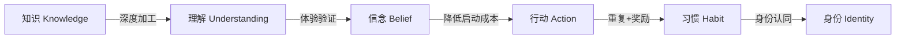
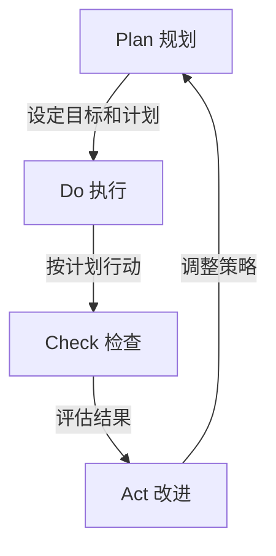

# 《个人提升方案》道法术深度解析

> **贯穿全书的方法论指南**
> 
> 本文档系统性地解析个人提升的底层逻辑，从"道"（原理）、「法」（方法）、「术」（实践）、「器」（工具）四个维度，为读者提供一套完整的认知框架和行动指南。

***
## 目录

- [总述：道法术框架](#总述道法术框架)
- [第一章 护肤](#第一章-护肤)
- [第二章 锻炼](#第二章-锻炼)
- [第三章 穿搭](#第三章-穿搭)
- [第四章 发型](#第四章-发型)
- [第五章 阅读](#第五章-阅读)
- [第六章 思维提升](#第六章-思维提升)
- [第七章 心理学](#第七章-心理学)
- [第八章 策略与规划](#第八章-策略与规划)
- [第九章 社交](#第九章-社交)
- [第十章 时间管理](#第十章-时间管理)

***
## 总述：道法术框架

### 什么是「道法术」？

「道法术器」源自中国古代哲学思想，最早见于《道德经》："人法地，地法天，天法道，道法自然。" 这三个层次构成了一个从抽象到具体、从原理到实践的完整认知体系。在本书中，我们增加了第四个层次——「器」，即工具层，使整个框架更加完整和可操作。

在个人提升领域，我们可以这样理解：

- **道（Dao）**：底层原理、科学基础、第一性原理。回答"为什么"的问题。
- **法（Fa）**：方法论、模型、框架、原则。回答"怎么做"的问题。
- **术（Shu）**：具体方案、产品推荐、操作步骤。回答"做什么"的问题。
- **器（Qi）**：工具、平台、资源、系统。回答"用什么做"的问题。器是术的载体，是提高执行效率的手段。

### 为什么要用「道法术」框架？

#### 1. 避免盲目行动

很多人在个人提升时，只关注"术"——别人推荐什么产品就买什么，别人说做什么运动就做什么。但如果不理解背后的"道"和"法"，就会出现以下问题：

- **知其然不知其所以然**：不知道为什么有效，一旦遇到问题就束手无策
- **无法举一反三**：只学会了这一招，换个场景就不会用了
- **容易被割韭菜**：不理解原理，就容易被营销话术忽悠
- **难以坚持**：不理解价值，就缺乏持续行动的动力

#### 2. 建立系统思维

「道法术」框架帮助你建立系统化的认知结构：

道（原理层）→ 理解本质，把握规律
    ↓
法（方法层）→ 掌握方法，形成框架
    ↓
术（实践层）→ 落地执行，产生结果

#### 3. 实现长期复利

当你真正理解了"道"，你就能：
- 自己创造"法"，而不是依赖别人的方法
- 灵活运用"术"，根据实际情况调整
- 持续迭代升级，实现指数级成长

### 「道」：底层原理、科学基础、第一性原理

#### 什么是「道」？

"道"是事物运行的底层规律，是经过科学验证的基本原理。它不随时代变化，不因个人偏好而改变。

#### 「道」的特点

1. **客观性**：不以人的意志为转移
2. **普适性**：适用于所有人、所有场景
3. **稳定性**：不会今天有效明天就失效
4. **可验证性**：可以通过科学方法验证

#### 「道」的来源

- **自然科学**：物理学、化学、生物学、神经科学
- **社会科学**：心理学、社会学、经济学
- **哲学**：逻辑学、认识论、伦理学
- **经典理论**：经过时间检验的理论体系

#### 举例说明

**护肤的「道」**：
- 皮肤是人体最大的器官，具有屏障功能
- 角质层是皮肤的第一道防线
- 皮脂腺分泌的油脂形成天然保护膜
- 紫外线是皮肤老化的主要外因

**锻炼的「道」**：
- 肌肉生长遵循"超量恢复"原理
- 人体有三大能量系统（磷酸原、糖酵解、有氧氧化）
- 训练刺激 + 营养补充 + 充分恢复 = 肌肉生长
- 渐进超负荷是力量增长的核心机制

**时间管理的「道」**：
- 人的时间和精力是有限的资源
- 注意力是最稀缺的资源
- 习惯可以减少决策消耗
- 精力有自然波动周期

### 「法」：方法论、模型、框架、原则

#### 什么是「法」？

"法"是基于"道"衍生出来的方法论、模型和框架。它是一套可复用的思维工具，帮助我们更有效地解决问题。

#### 「法」的特点

1. **系统性**：不是零散的技巧，而是完整的体系
2. **可迁移性**：可以应用到不同场景
3. **可优化性**：可以根据实际情况调整
4. **可教授性**：可以传授给他人

#### 「法」的类型

1. **思维模型**：第一性原理、二八法则、逆向思维
2. **方法论**：SMART目标、PDCA循环、GTD
3. **框架**：金字塔原理、MECE原则、SWOT分析
4. **原则**：最小可行产品、刻意练习、复利效应

#### 举例说明

**护肤的「法」**：
- 护肤金字塔：清洁→保湿→防晒→功效
- 成分搭配原则：不冲突成分叠加使用
- 产品选择逻辑：根据肤质、年龄、预算选择

**锻炼的「法」**：
- 渐进超负荷：逐步增加训练强度
- 训练周期化：不同阶段不同训练重点
- 营养时机：训练前后的营养补充策略

**时间管理的「法」**：
- 四象限法则：重要紧急矩阵
- 番茄工作法：25分钟专注+5分钟休息
- GTD：收集→处理→组织→回顾→执行

### 「术」：具体方案、产品推荐、操作步骤

#### 什么是「术」？

"术"是具体的执行方案，包括产品推荐、操作步骤、注意事项等。它是可以直接落地执行的行动指南。

#### 「术」的特点

1. **具体性**：明确到具体产品、具体步骤
2. **可操作性**：看了就能做，不需要再思考
3. **可量化性**：有明确的指标和标准
4. **时效性**：可能会随着市场变化而更新

#### 「术」的内容

1. **产品推荐**：具体品牌、型号、规格
2. **操作步骤**：详细的执行流程
3. **注意事项**：常见问题和解决方案
4. **评估标准**：如何判断效果好坏

#### 举例说明

**护肤的「术」**：
- 洁面产品推荐：芙丽芳丝洁面乳、珂润洁面泡沫
- 完整护肤流程：洁面→爽肤水→精华→乳液→防晒
- 常见问题解决方案：痘痘用什么、黑头怎么处理

**锻炼的「术」**：
- PPL训练计划：推/拉/腿的具体动作安排
- 动作详解：深蹲、卧推、硬拉的标准动作
- 饮食方案：增肌期和减脂期的具体食谱

**时间管理的「术」**：
- 每日时间表：6:00起床、7:00工作、22:00睡觉
- 习惯追踪表：每天记录习惯完成情况
- 工具推荐：Todoist、Notion、Forest等

### 道法术的关系

#### 1. 道是根基

没有"道"的支撑，"法"和"术"就是无根之木。很多人学了很多技巧，但效果不好，就是因为没有理解底层原理。

#### 2. 法是桥梁

"法"连接"道"和"术"，把抽象的原理转化为可操作的方法。它是知识转化为能力的关键环节。

#### 3. 术是落地

"术"是最终的执行层，是产生实际效果的关键。但"术"必须建立在"道"和"法"的基础上，否则就是盲目行动。

#### 4. 三者循环

道（理解原理）
    ↓
法（掌握方法）
    ↓
术（执行落地）
    ↓
反馈（效果评估）
    ↓
道（深化理解）→ 循环往复

### 如何使用本书

#### 第一步：理解「道」

每章开头都会讲解底层原理。这部分内容可能比较抽象，但非常重要。建议：
- 仔细阅读，不要跳过
- 结合自己的经验理解
- 有疑问可以查阅相关资料

#### 第二步：掌握「法」

中间部分会介绍方法论和框架。这部分内容是连接原理和实践的桥梁。建议：
- 理解每个方法的适用场景
- 思考如何应用到自己的情况
- 可以先选择1-2个方法重点学习

#### 第三步：执行「术」

最后部分会提供具体的执行方案。这部分内容可以直接落地。建议：
- 选择适合自己的方案
- 按照步骤执行
- 记录效果，及时调整

#### 第四步：迭代升级

执行一段时间后，回到"道"的层面，深化理解，然后优化"法"和"术"。这是一个持续迭代的过程。

### 学习建议

1. **不要贪多**：一次只学一个领域，深入掌握后再学下一个
2. **不要跳步**：一定要先理解"道"，再学"法"，最后执行"术"
3. **不要教条**：本书提供的方案是参考，要根据自己的情况调整
4. **不要急躁**：个人提升是一个长期过程，不要期望立竿见影
5. **要记录**：记录自己的学习过程和效果，便于复盘和优化

***
## 第一章 护肤

> **核心理念**：护肤的本质是维护皮肤健康，而不是追求完美无瑕。理解皮肤科学，才能做出正确的护肤决策。

***
### 一、道：皮肤科学

#### 1.1 皮肤的结构与功能

皮肤是人体最大的器官，总面积约1.5-2平方米，重量约占体重的16%。它由三层结构组成：

**表皮层（Epidermis）**
- 厚度：0.05-0.1mm
- 主要功能：屏障保护
- 关键结构：角质层、颗粒层、棘层、基底层
- 更新周期：约28天

**真皮层（Dermis）**
- 厚度：1-2mm
- 主要功能：提供支撑和弹性
- 关键成分：胶原蛋白、弹性蛋白、透明质酸
- 包含：血管、神经、毛囊、皮脂腺

**皮下组织（Hypodermis）**
- 主要功能：保温、缓冲、储能
- 主要成分：脂肪细胞

#### 1.2 皮肤屏障功能

皮肤屏障是护肤的核心概念，理解它才能理解为什么有些护肤方法有效，有些无效。

**皮肤屏障的组成**

皮肤屏障主要由以下部分组成：

1. **角质层**：由10-20层扁平的角质细胞组成，像"砖墙"结构
   - 角质细胞 = "砖"
   - 细胞间脂质 = "灰浆"
   
2. **皮脂膜**：由皮脂腺分泌的油脂、汗液和角质细胞碎片组成
   - pH值：4.5-6.5（弱酸性）
   - 功能：防止水分蒸发、抑制细菌生长

3. **天然保湿因子（NMF）**：存在于角质细胞内的水溶性物质
   - 成分：氨基酸、尿素、乳酸盐等
   - 功能：保持角质层水分

**皮肤屏障的功能**

- **物理屏障**：阻挡外界物质进入
- **化学屏障**：维持酸性环境，抑制病原体
- **免疫屏障**：识别和清除外来物质
- **保湿屏障**：防止水分过度蒸发

**屏障受损的表现**

- 皮肤干燥、脱屑
- 容易泛红、敏感
- 使用护肤品有刺痛感
- 容易长痘、发炎

#### 1.3 角质代谢

角质层是皮肤的最外层，它的健康状态直接影响皮肤外观。

**正常的角质代谢**

1. **基底层**：新细胞不断生成
2. **向上推移**：细胞逐渐角化
3. **到达角质层**：成为扁平的角质细胞
4. **自然脱落**：老化的角质细胞脱落

整个过程约28天，称为"表皮更新周期"。

**异常的角质代谢**

- **角质堆积**：代谢变慢，皮肤暗沉、粗糙
- **角质过薄**：屏障受损，皮肤敏感、泛红
- **角质代谢紊乱**：导致各种皮肤问题

**影响角质代谢的因素**

- 年龄：随年龄增长，代谢变慢
- 紫外线：加速角质细胞损伤
- 护肤品：不当使用会破坏代谢平衡
- 生活习惯：睡眠、饮食、压力都会影响

#### 1.4 皮脂腺

皮脂腺是皮肤的重要附属器官，它的分泌状态直接影响肤质。

**皮脂腺的功能**

- 分泌皮脂，形成皮脂膜
- 保护皮肤，防止水分蒸发
- 维持皮肤弱酸性环境
- 抑制某些细菌生长

**皮脂分泌的影响因素**

- **激素水平**：雄激素促进皮脂分泌
- **温度**：高温促进分泌
- **湿度**：低湿度促进分泌
- **饮食**：高糖、高脂饮食促进分泌
- **压力**：压力激素促进分泌

**不同肤质的特点**

| 肤质 | 皮脂分泌 | 特点 | 护肤重点 |
|------|----------|------|----------|
| 油性 | 旺盛 | 毛孔粗大、易长痘 | 控油、清洁 |
| 干性 | 不足 | 干燥、脱屑、细纹 | 保湿、滋润 |
| 中性 | 适中 | 皮肤健康、有光泽 | 维持平衡 |
| 混合性 | T区多、两颊少 | T区油、两颊干 | 分区护理 |
| 敏感性 | 不定 | 容易泛红、刺痛 | 修复屏障 |

#### 1.5 护肤成分的作用机制

理解成分的作用机制，才能正确选择和使用护肤品。

**保湿成分**

1. **封闭剂**：在皮肤表面形成保护膜，防止水分蒸发
   - 代表成分：凡士林、矿物油、角鲨烷
   - 作用原理：物理阻隔
   
2. **润肤剂**：填充角质细胞间隙，使皮肤光滑
   - 代表成分：荷荷巴油、乳木果油
   - 作用原理：软化角质

3. **吸湿剂**：从环境中吸收水分
   - 代表成分：透明质酸、甘油、尿素
   - 作用原理：氢键结合水分子

**抗氧化成分**

- **维生素C**：中和自由基、促进胶原蛋白合成
- **维生素E**：保护细胞膜、协同维生素C
- **烟酰胺**：抗氧化、抗炎、美白
- **白藜芦醇**：强效抗氧化、抗炎

**抗衰老成分**

- **视黄醇（A醇）**：促进细胞更新、刺激胶原蛋白
- **胜肽**：信号肽、神经递质抑制肽、载体肽
- **玻色因**：促进糖胺聚糖合成

**美白成分**

- **烟酰胺**：抑制黑色素转运
- **熊果苷**：抑制酪氨酸酶
- **传明酸**：抑制黑色素生成
- **维生素C**：还原黑色素

***
### 二、法：护肤方法论

#### 2.1 护肤金字塔

护肤金字塔是一个简单有效的护肤优先级框架：

        △ 功效护肤
       / \  （美白、抗衰老、祛痘）
      /   \  ← 第三层：锦上添花
     /-----\
    / 防晒   \  ← 第二层：核心保护
   /---------\
  / 保湿      \  ← 第二层：基础养护
 /-------------\
/    清洁       \  ← 第一层：基础中的基础
=================

**第一层：清洁**

清洁是护肤的基础，但过度清洁会破坏皮肤屏障。

清洁原则：
- 选择温和的洁面产品
- 水温不要太热（32-35℃为宜）
- 不要过度清洁（一天最多2次）
- 洗脸时间不要太长（30-60秒）

**第二层：保湿**

保湿是维持皮肤健康的关键。

保湿原则：
- 根据肤质选择保湿产品
- 油性皮肤选择清爽型
- 干性皮肤选择滋润型
- 保湿不只是补水，还要锁水

**第三层：防晒**

防晒是护肤中最重要的一步，没有之一。

防晒原则：
- 每天都要防晒，不只是晴天
- 选择SPF30以上的防晒霜
- 每2-3小时补涂一次
- 物理防晒+化学防晒结合

**第四层：功效护肤**

在前三层都做好的基础上，再考虑功效护肤。

功效护肤原则：
- 一次只解决一个问题
- 给皮肤适应时间
- 注意成分搭配
- 有耐心，效果需要时间

#### 2.2 成分搭配原则

正确的成分搭配可以让效果1+1>2，错误的搭配可能导致皮肤问题。

**经典搭配**

1. **维生素C + 维生素E + 阿魏酸**
   - 协同抗氧化，效果提升8倍
   - 适合：抗衰老、提亮肤色

2. **烟酰胺 + 透明质酸**
   - 烟酰胺美白，透明质酸保湿
   - 适合：美白保湿

3. **视黄醇 + 烟酰胺**
   - 视黄醇抗老，烟酰胺减少刺激
   - 适合：抗衰老（需建立耐受）

**禁忌搭配**

1. **视黄醇 + 酸类（AHA/BHA）**
   - 同时使用会过度刺激
   - 建议：早晚分开使用

2. **维生素C + 酸类**
   - pH值冲突，影响效果
   - 建议：分开使用

3. **多种高浓度活性成分叠加**
   - 增加刺激风险
   - 建议：一次只用一种高浓度产品

#### 2.3 产品选择逻辑

选择护肤品应该基于以下逻辑：

**第一步：确定肤质**

- 观察T区和两颊的出油情况
- 测试洗脸后的紧绷感
- 观察毛孔大小
- 了解是否容易敏感

**第二步：确定需求**

- 当前最想解决的问题是什么？
- 是痘痘、黑头、暗沉、细纹还是其他？
- 一次只解决一个问题

**第三步：确定预算**

- 护肤品不是越贵越好
- 基础护理可以选平价产品
- 功效产品可以适当投入
- 防晒是最值得投资的

**第四步：选择产品**

- 先看成分，再看品牌
- 选择有临床验证的产品
- 注意产品的保质期
- 小样试用后再购买正装

***
### 三、术：护肤实操指南

#### 3.1 完整护肤流程

**晨间护肤流程**

1. **洁面**
   - 如果前一晚用了厚重护肤品，早上需要用洁面产品
   - 如果皮肤偏干，早上可以只用清水
   
2. **爽肤水**
   - 用化妆棉或手轻拍
   - 目的：调节pH值、初步保湿

3. **精华**
   - 根据需求选择功效精华
   - 抗氧化：维生素C精华
   - 保湿：透明质酸精华
   - 美白：烟酰胺精华

4. **乳液/面霜**
   - 锁住前面的水分和营养
   - 油性皮肤选乳液
   - 干性皮肤选面霜

5. **防晒**
   - 出门前15-20分钟涂抹
   - 用量要足够（一元硬币大小）
   - 不要忘记脖子和耳朵

**晚间护肤流程**

1. **卸妆**
   - 如果化了妆或用了防水防晒霜
   - 卸妆油/膏 → 乳化 → 清水冲洗

2. **洁面**
   - 使用温和的洁面产品
   - 水温32-35℃
   - 轻柔按摩30-60秒

3. **爽肤水**
   - 同晨间

4. **功效精华**
   - 晚间可以用更强效的成分
   - 视黄醇、果酸等建议晚间使用

5. **眼霜**
   - 眼周皮肤薄，需要专门护理
   - 用无名指轻点涂抹

6. **乳液/面霜**
   - 晚间可以选择更滋润的产品
   - 帮助皮肤夜间修复

#### 3.2 产品推荐清单

**洁面产品**

| 产品 | 适合肤质 | 价格区间 | 特点 |
|------|----------|----------|------|
| 芙丽芳丝洁面乳 | 所有肤质 | ￥100-150 | 温和、氨基酸体系 |
| 珂润洁面泡沫 | 敏感肌 | ￥100-150 | 泡沫细腻、温和 |
| 旁氏米粹洁面乳 | 油性肌肤 | ￥30-50 | 平价、清洁力好 |
| Elta MD氨基酸洁面 | 所有肤质 | ￥100-150 | 温和、不紧绷 |

**保湿产品**

| 产品 | 适合肤质 | 价格区间 | 特点 |
|------|----------|----------|------|
| 珂润面霜 | 干性、敏感肌 | ￥100-150 | 修复屏障、滋润 |
| 薇诺娜特护霜 | 敏感肌 | ￥200-250 | 舒缓、修复 |
| 理肤泉B5面霜 | 所有肤质 | ￥200-250 | 修复、保湿 |
| CeraVe保湿乳 | 所有肤质 | ￥100-150 | 平价、神经酰胺 |

**防晒产品**

| 产品 | 适合肤质 | 价格区间 | 特点 |
|------|----------|----------|------|
| 安热沙小金瓶 | 所有肤质 | ￥200-250 | 防水、清爽 |
| 理肤泉大哥大 | 敏感肌 | ￥200-250 | 温和、不刺激 |
| 碧柔水感防晒 | 油性肌肤 | ￥50-80 | 清爽、平价 |
| Ultrasun面部防晒 | 所有肤质 | ￥200-300 | 全波段防护 |

**功效产品**

| 产品 | 功效 | 价格区间 | 注意事项 |
|------|------|----------|----------|
| 乐敦CC美容液 | 美白、抗氧化 | ￥50-80 | 维生素C、需防晒 |
| OLAY小白瓶 | 美白 | ￥200-300 | 烟酰胺、需建立耐受 |
| 露得清A醇晚霜 | 抗衰老 | ￥150-200 | 视黄醇、晚间使用 |
| The Ordinary 烟酰胺 | 控油、美白 | ￥50-80 | 浓度高、需稀释 |

#### 3.3 常见问题解决方案

**痘痘肌护理**

痘痘的成因：
1. 皮脂分泌过多
2. 毛囊口角化异常
3. 痤疮丙酸杆菌繁殖
4. 炎症反应

护理方案：
- **轻度痘痘**：水杨酸（BHA）产品，如宝拉珍选水杨酸精华
- **中度痘痘**：过氧化苯甲酰（班赛）+ 外用抗生素
- **重度痘痘**：就医，可能需要口服药物

注意事项：
- 不要挤痘痘
- 不要过度清洁
- 注意饮食（少糖少奶）
- 保持枕巾清洁

**黑头处理**

黑头的成因：
- 毛孔中的皮脂氧化变黑
- 与空气接触氧化

处理方案：
1. **日常清洁**：使用水杨酸产品，帮助溶解黑头
2. **定期深层清洁**：每周1-2次泥膜
3. **不要用撕拉面膜**：会损伤毛孔
4. **医美方案**：果酸换肤、小气泡

**敏感肌护理**

敏感肌的特点：
- 皮肤屏障受损
- 容易泛红、刺痛
- 对护肤品成分敏感

护理原则：
- 精简护肤步骤
- 选择温和无刺激产品
- 避免频繁更换产品
- 重点修复屏障

推荐产品：
- 珂润系列
- 薇诺娜系列
- 理肤泉特安系列
- 雅漾舒护活泉水

**暗沉提亮**

暗沉的原因：
- 角质堆积
- 紫外线损伤
- 血液循环不良
- 睡眠不足

改善方案：
1. **定期去角质**：每周1-2次，使用温和的去角质产品
2. **抗氧化**：使用维生素C精华
3. **防晒**：防止紫外线加重暗沉
4. **生活习惯**：充足睡眠、多喝水、适当运动


### 四、器：护肤工具与资源

#### 成分查询与产品选择

| 工具 | 平台 | 核心功能 | 适用场景 |
|------|------|----------|----------|
| 美丽修行 | iOS/Android | 40万+化妆品成分数据库，安全评分 | 购买前查成分、避开致敏成分 |
| CosDNA | 网页 | 国际化妆品成分分析，英文成分对照 | 查询海外产品成分 |
| 国家药监局App | iOS/Android | 官方化妆品备案信息查询 | 验证产品是否正规备案 |

#### 皮肤检测与记录

| 工具 | 功能 | 使用建议 |
|------|------|----------|
| 手机微距镜头 | 放大观察皮肤细节 | 每月拍照追踪毛孔、黑头变化 |
| 护肤日记（Notion/备忘录） | 记录每天使用的产品和皮肤状态 | 发现产品与皮肤变化的因果关系 |

#### 防晒与医美辅助

- **紫外线指数App**（如UVLens）：实时查看当地UV指数，UV≥3时必须防晒
- **新氧/更美**：查看医美项目信息、医生资质、真实案例和价格区间
- **好大夫在线**：查询皮肤科医生资质和患者评价

***
## 第二章 锻炼

> **核心理念**：锻炼的本质是对身体施加适度刺激，促使身体适应和变强。理解运动生理学，才能科学训练。

***
### 一、道：运动生理学

#### 1.1 肌肉生长的原理

肌肉生长（肌肥大）是一个复杂的生理过程，理解它才能有效增肌。

**肌肉的结构**

骨骼肌由肌纤维组成，肌纤维又由肌原纤维组成。肌原纤维包含两种主要蛋白丝：
- **肌动蛋白（细丝）**
- **肌球蛋白（粗丝）**

肌肉收缩就是这两种蛋白丝相互滑动的结果。

**肌肉生长的机制**

肌肉生长主要通过以下三种机制：

1. **机械张力（Mechanical Tension）**
   - 肌肉承受的拉力
   - 是肌肉生长的主要刺激
   - 通过大重量训练产生

2. **代谢压力（Metabolic Stress）**
   - 训练时代谢产物堆积
   - 产生"泵感"
   - 通过高次数训练产生

3. **肌肉损伤（Muscle Damage）**
   - 训练导致的微损伤
   - 修复过程中肌肉变大
   - 通过离心训练产生

**超量恢复原理**

超量恢复是肌肉生长的核心原理：

训练刺激 → 肌肉微损伤 → 休息恢复 → 超量恢复 → 肌肉变强

关键点：
- 训练只是刺激，生长发生在恢复期
- 恢复不足会导致过度训练
- 超量恢复有时间窗口，错过就回到原来水平

**肌肉生长的影响因素**

1. **训练因素**
   - 训练强度（重量）
   - 训练容量（组数×次数×重量）
   - 训练频率
   - 动作选择

2. **营养因素**
   - 蛋白质摄入量
   - 热量盈余
   - 营养时机

3. **恢复因素**
   - 睡眠质量
   - 压力水平
   - 休息时间

4. **遗传因素**
   - 肌纤维类型比例
   - 激素水平
   - 身体结构

#### 1.2 能量系统

人体有三大能量系统，理解它们有助于选择合适的训练方式。

**磷酸原系统（ATP-CP系统）**

- **供能时间**：0-10秒
- **特点**：供能速度最快，但储量有限
- **适用运动**：举重、短跑、跳跃
- **训练方法**：大重量、低次数、长休息

**糖酵解系统（乳酸系统）**

- **供能时间**：10秒-2分钟
- **特点**：供能速度较快，会产生乳酸
- **适用运动**：400米跑、高强度间歇
- **训练方法**：中等重量、中等次数、短休息

**有氧氧化系统**

- **供能时间**：2分钟以上
- **特点**：供能持续时间长，但速度慢
- **适用运动**：长跑、游泳、骑车
- **训练方法**：低强度、长时间

**训练中的能量系统应用**

| 训练目标 | 主要能量系统 | 训练参数 |
|----------|--------------|----------|
| 最大力量 | 磷酸原 | 1-5次，85-100%1RM，3-5分钟休息 |
| 肌肥大 | 糖酵解 | 6-12次，65-85%1RM，1-2分钟休息 |
| 耐力 | 有氧氧化 | 15+次，<65%1RM，30-60秒休息 |

#### 1.3 恢复机制

恢复是训练的重要组成部分，没有恢复就没有进步。

**恢复的类型**

1. **即时恢复**
   - 组间休息时的恢复
   - 主要恢复磷酸原和氧气

2. **短期恢复**
   - 训练后24-72小时
   - 修复肌肉微损伤
   - 补充能量储备

3. **长期恢复**
   - 训练周期间的恢复
   - 防止过度训练
   - 心理恢复

**影响恢复的因素**

1. **睡眠**
   - 生长激素在深度睡眠时分泌
   - 每晚需要7-9小时
   - 睡眠质量比时长更重要

2. **营养**
   - 蛋白质：修复肌肉原料
   - 碳水化合物：补充糖原
   - 水分：参与代谢过程

3. **压力**
   - 心理压力会延缓恢复
   - 皮质醇过高会分解肌肉
   - 需要学会放松

4. **主动恢复**
   - 轻度有氧运动
   - 拉伸和泡沫轴
   - 按摩

**过度训练的信号**

- 持续疲劳，休息后不缓解
- 训练表现下降
- 静息心率升高
- 睡眠质量下降
- 容易生病
- 情绪低落、易怒

***
### 二、法：训练方法论

#### 2.1 渐进超负荷

渐进超负荷是力量训练的核心原则，也是肌肉生长的必要条件。

**什么是渐进超负荷？**

渐进超负荷是指逐渐增加训练的难度，迫使身体不断适应。

**渐进超负荷的方式**

1. **增加重量**
   - 最直接的方式
   - 每次增加2.5-5kg
   - 适合复合动作

2. **增加次数**
   - 同重量做更多次
   - 适合辅助动作
   - 达到目标次数后增加重量

3. **增加组数**
   - 增加训练容量
   - 适合中级以上训练者
   - 注意不要过度训练

4. **减少休息时间**
   - 增加训练密度
   - 提高代谢压力
   - 适合肌肥大训练

5. **提高动作质量**
   - 更好的肌肉控制
   - 更大的动作幅度
   - 更慢的离心阶段

**渐进超负荷的实施**

- 记录每次训练的重量、次数、组数
- 每次训练尝试比上次多一点
- 不要每次都追求极限
- 有计划地安排进阶

#### 2.2 训练周期化

训练周期化是长期进步的关键，避免平台期和过度训练。

**什么是训练周期化？**

训练周期化是将训练划分为不同阶段，每个阶段有不同的训练目标和方法。

**常见的周期化模式**

1. **线性周期化**
   - 从低强度高容量逐渐过渡到高强度低容量
   - 适合初学者
   - 简单易执行

2. **波动周期化**
   - 每次训练强度和容量都不同
   - 适合中级训练者
   - 更符合实际需求

3. **板块周期化**
   - 每个阶段专注于一个训练目标
   - 适合高级训练者
   - 需要较长的训练周期

**周期化安排示例（12周）**

- 第1-4周：肌肥大阶段（8-12次，中等强度）
- 第5-8周：力量阶段（3-6次，高强度）
- 第9-12周：减载+测试（降低容量，测试极限）

#### 2.3 营养时机

营养时机是指在正确的时间摄入正确的营养，以最大化训练效果。

**训练前营养**

- **时间**：训练前1-2小时
- **内容**：碳水化合物+适量蛋白质
- **目的**：提供能量，防止肌肉分解
- **示例**：香蕉+酸奶、全麦面包+鸡蛋

**训练中营养**

- **时间**：训练超过1小时
- **内容**：快速吸收的碳水化合物
- **目的**：维持血糖，延缓疲劳
- **示例**：运动饮料、香蕉

**训练后营养**

- **时间**：训练后30分钟内
- **内容**：快速吸收的蛋白质+碳水化合物
- **目的**：启动恢复，补充糖原
- **比例**：蛋白质:碳水 = 1:2-3
- **示例**：乳清蛋白粉+香蕉、鸡胸肉+米饭

**每日蛋白质分配**

- 每公斤体重1.6-2.2克蛋白质
- 分3-5餐摄入
- 每餐20-40克蛋白质
- 睡前可以摄入酪蛋白

***
### 三、术：训练实操指南

#### 3.1 PPL训练计划

PPL（Push/Pull/Legs）是一种经典的训练分化方式，适合中级训练者。

**PPL训练安排**

- **推日（Push）**：胸、肩、三头肌
- **拉日（Pull）**：背、二头肌
- **腿日（Legs）**：股四头肌、腘绳肌、小腿

**训练频率**

- 每周训练6天，休息1天
- 或者每周训练3天，循环进行
- 每个部位每周训练2次

**推日训练计划**

| 动作 | 组数 | 次数 | 休息 |
|------|------|------|------|
| 平板杠铃卧推 | 4 | 6-8 | 3分钟 |
| 上斜哑铃卧推 | 3 | 8-10 | 2分钟 |
| 坐姿哑铃推肩 | 3 | 8-10 | 2分钟 |
| 哑铃侧平举 | 3 | 12-15 | 1分钟 |
| 绳索下压 | 3 | 10-12 | 1分钟 |
| 仰卧臂屈伸 | 3 | 10-12 | 1分钟 |

**拉日训练计划**

| 动作 | 组数 | 次数 | 休息 |
|------|------|------|------|
| 引体向上 | 4 | 6-8 | 3分钟 |
| 杠铃划船 | 3 | 8-10 | 2分钟 |
| 坐姿绳索划船 | 3 | 10-12 | 2分钟 |
| 高位下拉 | 3 | 10-12 | 2分钟 |
| 杠铃弯举 | 3 | 10-12 | 1分钟 |
| 锤式弯举 | 3 | 10-12 | 1分钟 |

**腿日训练计划**

| 动作 | 组数 | 次数 | 休息 |
|------|------|------|------|
| 深蹲 | 4 | 6-8 | 3分钟 |
| 罗马尼亚硬拉 | 3 | 8-10 | 2分钟 |
| 腿举 | 3 | 10-12 | 2分钟 |
| 腿弯举 | 3 | 10-12 | 2分钟 |
| 腿屈伸 | 3 | 12-15 | 1分钟 |
| 站姿提踵 | 4 | 15-20 | 1分钟 |

#### 3.2 动作详解

**深蹲**

深蹲是"动作之王"，锻炼下半身和核心。

动作步骤：
1. 杠铃放在斜方肌上，不要放在脖子上
2. 双脚与肩同宽或略宽，脚尖略微外展
3. 挺胸收腹，目视前方
4. 屈髋屈膝，臀部向后向下坐
5. 膝盖方向与脚尖方向一致
6. 下蹲到大腿与地面平行或更低
7. 脚跟发力站起

常见错误：
- 膝盖内扣
- 腰部弯曲
- 重心前移
- 脚跟离地

**卧推**

卧推是锻炼胸肌的经典动作。

动作步骤：
1. 躺在平板凳上，眼睛在杠铃正下方
2. 握距略宽于肩，握住杠铃
3. 肩胛骨后缩下沉，挺胸
4. 杠铃下放至胸部中下部
5. 肘部与身体呈45-75度角
6. 发力推起，锁定肘关节

常见错误：
- 臀部离凳
- 脚离地
- 杠铃弹胸
- 肘部过度外展

**硬拉**

硬拉是锻炼后链肌群的王牌动作。

动作步骤：
1. 双脚与肩同宽，杠铃在脚掌中上方
2. 屈髋屈膝，握住杠铃
3. 挺胸收腹，背部挺直
4. 脚跟发力，将杠铃贴近身体拉起
5. 站直锁定，臀部前推
6. 屈髋屈膝，将杠铃放下

常见错误：
- 腰部弯曲
- 杠铃远离身体
- 先抬臀再拉
- 过度后仰

#### 3.3 饮食方案

**增肌期饮食**

热量摄入：TDEE + 300-500大卡

宏量营养素比例：
- 蛋白质：每公斤体重1.6-2.2克
- 脂肪：总热量的20-30%
- 碳水化合物：剩余热量

一日饮食示例（70kg男性）：

**早餐（7:00）**
- 全蛋3个 + 蛋白2个
- 燕麦80克
- 香蕉1根
- 牛奶250ml

**加餐（10:00）**
- 希腊酸奶200克
- 坚果30克

**午餐（12:00）**
- 鸡胸肉200克
- 糙米200克
- 西兰花200克
- 橄榄油1勺

**训练前（15:00）**
- 香蕉1根
- 面包2片

**训练后（17:00）**
- 乳清蛋白粉1勺
- 香蕉1根

**晚餐（19:00）**
- 三文鱼200克
- 土豆200克
- 蔬菜沙拉

**睡前（21:00）**
- 酪蛋白粉1勺
- 或：低脂奶酪200克

**减脂期饮食**

热量摄入：TDEE - 300-500大卡

宏量营养素比例：
- 蛋白质：每公斤体重2.0-2.4克（减脂期需要更多蛋白质保护肌肉）
- 脂肪：总热量的20-30%
- 碳水化合物：剩余热量

减脂期饮食技巧：
- 优先保证蛋白质摄入
- 选择低GI碳水化合物
- 增加蔬菜摄入，增加饱腹感
- 适当安排欺骗餐，保持心理健康


### 四、器：训练工具与资源

#### 训练记录工具

| 工具 | 平台 | 核心功能 | 适合人群 |
|------|------|----------|----------|
| Keep | iOS/Android | 训练课程、动作示范、社区 | 健身初学者 |
| Strong | iOS/Android | 专业力量训练记录，自动计算1RM | 力量训练者 |
| 纸质训练日志 | 纸笔 | 零干扰、最可靠 | 所有人（推荐） |

#### 身体测量与营养追踪

- **体脂秤**：追踪体重、体脂率变化趋势。绝对值不一定准确，但趋势有参考价值
- **软尺**：测量胸围、腰围、臀围、臂围，每月测量一次
- **薄荷健康/MyFitnessPal**：食物热量数据库，初期用来校准自己对热量的直觉
- **厨房秤**：初学者必备，培养"目测"能力后可减少使用

#### 运动安全装备

- **举重腰带**：大重量深蹲/硬拉时保护腰椎（>80% 1RM时使用）
- **泡沫轴/筋膜枪**：训练后放松肌肉筋膜，加速恢复
- **心率表**：监控训练心率区间，确保有氧训练在目标心率范围

***
## 第三章 穿搭

> **核心理念**：穿搭的本质是视觉传达，通过服装表达个人风格和态度。理解色彩和比例，才能穿出好品味。

***
### 一、道：视觉美学原理

#### 1.1 色彩理论

色彩是穿搭的基础，理解色彩理论才能做出和谐的搭配。

**色彩三要素**

1. **色相（Hue）**
   - 色彩的名称，如红、黄、蓝
   - 色轮上的位置
   - 冷色调vs暖色调

2. **明度（Value）**
   - 色彩的明暗程度
   - 加白变亮，加黑变暗
   - 影响整体轻重感

3. **纯度（Saturation）**
   - 色彩的鲜艳程度
   - 高纯度鲜艳，低纯度灰暗
   - 影响视觉冲击力

**色彩的视觉效果**

1. **膨胀色与收缩色**
   - 暖色、浅色、亮色 → 膨胀感
   - 冷色、深色、暗色 → 收缩感
   - 应用：想要显瘦选深色，想要显胖选浅色

2. **前进色与后退色**
   - 暖色、高纯度 → 前进感
   - 冷色、低纯度 → 后退感
   - 应用：想要突出的部位用前进色

3. **轻色与重色**
   - 浅色 → 轻盈感
   - 深色 → 沉重感
   - 应用：上浅下轻，上深下重

**色彩的情感联想**

| 颜色 | 联想 | 适合场合 |
|------|------|----------|
| 黑色 | 权威、神秘、正式 | 商务、正式场合 |
| 白色 | 纯洁、干净、简约 | 休闲、正式场合 |
| 灰色 | 中性、专业、低调 | 商务、日常 |
| 蓝色 | 信任、冷静、专业 | 商务、日常 |
| 红色 | 热情、活力、自信 | 社交、约会 |
| 绿色 | 自然、和谐、成长 | 休闲、户外 |
| 黄色 | 乐观、活力、创意 | 休闲、创意场合 |

#### 1.2 体型美学

了解自己的体型，才能选择合适的服装版型。

**男性体型分类**

1. **倒三角型**
   - 特点：肩宽腰窄
   - 优势：理想的男性体型
   - 穿搭：突出肩线，收紧腰部

2. **矩形型**
   - 特点：肩宽腰宽相近
   - 需要：制造腰线，增加层次
   - 穿搭：V领、收腰款式

3. **椭圆型**
   - 特点：腰围大于肩宽
   - 需要：拉长视觉比例
   - 穿搭：V领、竖条纹、深色

4. **梯形型**
   - 特点：肩窄腰宽
   - 需要：增加肩部视觉宽度
   - 穿搭：垫肩、横条纹上衣

**体型修饰原则**

1. **比例优化**
   - 上短下长：显腿长
   - 上长下短：显上身长
   - 3:7或4:6的上下身比例最和谐

2. **视觉平衡**
   - 宽肩配窄裤
   - 窄肩配宽松上衣
   - 避免上下都宽松或都紧身

3. **线条引导**
   - 竖条纹：显高显瘦
   - 横条纹：显宽显胖
   - V领：拉长颈部线条

#### 1.3 视觉心理学

穿搭不仅是美学问题，更是心理学问题。

**第一印象效应**

- 人们在7秒内形成第一印象
- 55%来自外表和肢体语言
- 38%来自语调和语速
- 7%来自说话内容

**服装的心理暗示**

1. **正式服装**
   - 增加自信感
   - 提升专业形象
   - 获得更多尊重

2. **休闲服装**
   - 增加亲和力
   - 显得平易近人
   - 适合社交场合

3. **运动服装**
   - 显得活力充沛
   - 增加行动力
   - 适合运动场合

**色彩心理学应用**

- 想要显得专业：深蓝、灰色、黑色
- 想要显得亲和：浅蓝、米色、浅灰
- 想要显得自信：红色、深红、酒红
- 想要显得低调：灰色、深蓝、黑色

***
### 二、法：穿搭方法论

#### 2.1 色彩搭配原则

**基础配色法则**

1. **同色系搭配**
   - 同一颜色不同深浅
   - 最安全的搭配方式
   - 示例：深蓝+浅蓝+白色

2. **邻近色搭配**
   - 色轮上相邻的颜色
   - 和谐又有变化
   - 示例：蓝色+绿色、红色+橙色

3. **互补色搭配**
   - 色轮上对面的颜色
   - 对比强烈，视觉冲击
   - 示例：蓝色+橙色、红色+绿色

4. **三色搭配**
   - 色轮上等距的三种颜色
   - 丰富但不杂乱
   - 示例：红+黄+蓝

**中性色的作用**

中性色是穿搭的基础色，包括：
- 黑色、白色、灰色
- 卡其色、米色、棕色
- 深蓝（也可算中性色）

中性色的特点：
- 百搭，几乎可以和任何颜色搭配
- 适合大面积使用
- 可以平衡鲜艳色彩

**配色比例**

- **60-30-10法则**
  - 60%：主色（外套、裤子）
  - 30%：辅助色（上衣、鞋子）
  - 10%：点缀色（配饰）

#### 2.2 比例优化

**黄金比例**

黄金比例（1:1.618）被认为是最美的比例，在穿搭中可以应用：

- 上下身比例接近3:7或4:6
- 肩宽与腰宽的比例
- 衣长与裤长的比例

**上下身比例优化**

1. **显腿长技巧**
   - 高腰裤
   - 短款上衣
   - 同色系鞋裤
   - V领上衣拉长上身

2. **显上身长技巧**
   - 长款上衣
   - 低腰裤
   - 层叠搭配

**松紧搭配原则**

- 上松下紧：适合上身胖下身瘦
- 上紧下松：适合上身瘦下身胖
- 全身合身：最安全的选择
- 避免全身都宽松或都紧身

#### 2.3 风格定位

**常见男性风格**

1. **商务正装风格**
   - 特点：专业、正式、权威
   - 单品：西装、衬衫、领带、皮鞋
   - 适合：职场、正式场合

2. **商务休闲风格**
   - 特点：专业但不刻板
   - 单品：休闲西装、Polo衫、卡其裤
   - 适合：创意行业、日常办公

3. **都市休闲风格**
   - 特点：时尚、舒适、有品味
   - 单品：牛仔裤、T恤、夹克、运动鞋
   - 适合：日常、休闲场合

4. **运动休闲风格**
   - 特点：活力、舒适、年轻
   - 单品：卫衣、运动裤、运动鞋、棒球帽
   - 适合：运动、休闲场合

5. **工装风格**
   - 特点：硬朗、实用、有型
   - 单品：工装裤、工装夹克、靴子
   - 适合：户外、休闲场合

**如何找到自己的风格？**

1. **收集灵感**
   - Pinterest、Instagram
   - 时尚杂志
   - 街拍照片

2. **分析自己的生活场景**
   - 工作环境
   - 社交场合
   - 休闲活动

3. **考虑自己的体型**
   - 选择适合体型的版型
   - 突出优势，修饰不足

4. **从基础款开始**
   - 先建立基础衣橱
   - 再逐步添加特色单品

***
### 三、术：穿搭实操指南

#### 3.1 10件必备单品

建立一个高效的衣橱，从这10件基础单品开始：

**上装**

1. **白色圆领T恤**
   - 材质：纯棉或棉混纺
   - 版型：合身，不要太紧也不要太松
   - 搭配：几乎所有下装都能搭配

2. **白色衬衫**
   - 材质：纯棉或混纺
   - 版型：合身，领口合适
   - 搭配：正式场合必备，休闲也可穿

3. **深蓝色西装外套**
   - 材质：羊毛或混纺
   - 版型：合身，肩线合适
   - 搭配：正式场合、商务休闲

4. **灰色连帽卫衣**
   - 材质：纯棉或抓绒
   - 版型：合身或略宽松
   - 搭配：休闲场合、运动风格

**下装**

5. **深蓝色牛仔裤**
   - 版型：直筒或修身
   - 水洗：原色或轻微水洗
   - 搭配：几乎所有上装

6. **卡其色休闲裤**
   - 版型：直筒或锥形
   - 颜色：卡其色或深卡其
   - 搭配：休闲场合、商务休闲

7. **黑色西裤**
   - 版型：修身或直筒
   - 材质：羊毛或混纺
   - 搭配：正式场合、商务正装

**鞋履**

8. **白色运动鞋**
   - 款式：经典款，如Air Force 1、Stan Smith
   - 搭配：休闲场合、运动风格

9. **深棕色皮鞋**
   - 款式：牛津鞋或德比鞋
   - 搭配：正式场合、商务正装

10. **靴子**
    - 款式：切尔西靴或工装靴
    - 颜色：棕色或黑色
    - 搭配：秋冬季节、工装风格

#### 3.2 场合穿搭模板

**模板一：商务正装**

适用场合：正式会议、商务谈判、面试

搭配方案：
- 深蓝色/灰色西装套装
- 白色或浅蓝色衬衫
- 保守颜色领带（深蓝、酒红、灰色）
- 黑色或深棕色皮鞋
- 黑色皮带
- 简洁手表

注意事项：
- 西装要合身，肩线要正
- 衬衫袖口露出西装1-2cm
- 裤长刚好触及鞋面
- 配饰要简洁

**模板二：商务休闲**

适用场合：日常办公、创意行业、客户拜访

搭配方案：
- 休闲西装外套（深蓝、灰色、卡其色）
- Polo衫或休闲衬衫
- 卡其裤或深色牛仔裤
- 乐福鞋或休闲皮鞋
- 简洁手表

注意事项：
- 不需要领带
- 颜色可以稍微活泼
- 材质可以更休闲
- 鞋子可以选择休闲款

**模板三：都市休闲**

适用场合：周末出游、朋友聚会、约会

搭配方案：
- 合身T恤或衬衫
- 深色牛仔裤或休闲裤
- 白色运动鞋或靴子
- 夹克或外套（根据季节）
- 简单配饰

注意事项：
- 颜色可以更有个性
- 可以尝试叠穿
- 配饰可以增加亮点
- 舒适度优先

**模板四：运动休闲**

适用场合：健身房、运动场合、休闲出行

搭配方案：
- 运动T恤或速干衣
- 运动短裤或运动长裤
- 运动鞋
- 运动外套（可选）
- 运动帽（可选）

注意事项：
- 功能性优先
- 颜色可以鲜艳
- 材质要透气
- 合身但不限制运动

#### 3.3 购物清单

**第一次购物建议**

优先购买：
1. 白色T恤 ×2-3件
2. 深蓝色牛仔裤 ×1条
3. 白色运动鞋 ×1双
4. 深蓝色西装外套 ×1件
5. 白色衬衫 ×1件

预算分配建议：
- 基础款T恤：￥100-200/件
- 牛仔裤：￥300-500/条
- 运动鞋：￥500-800/双
- 西装外套：￥1000-2000/件
- 衬衫：￥200-500/件

**品牌推荐**

平价品牌：
- 优衣库（基础款）
- ZARA（时尚款）
- H&M（快时尚）
- MUJI（简约风格）

中端品牌：
- COS（简约设计）
- Massimo Dutti（商务休闲）
- Tommy Hilfiger（美式休闲）
- Ralph Lauren（美式经典）

高端品牌：
- Hugo Boss（商务正装）
- Brooks Brothers（美式正装）
- Theory（都市简约）
- APC（法式简约）


### 四、器：穿搭工具与资源

#### 色彩与搭配工具

| 工具 | 功能 | 使用建议 |
|------|------|----------|
| 色彩分析App | 拍照分析肤色冷暖和季节类型 | 作为参考起点，结合实际试穿 |
| Pinterest/小红书 | 搜索穿搭灵感 | 建立个人穿搭灵感板 |
| 胶囊衣橱App | 拍照录入已有单品，自动推荐搭配 | 每天穿搭决策更高效 |

#### 购物与保养

- **尺码对照表**：不同品牌尺码差异大，购买前务必对照
- **面料成分查询**：关注吊牌成分，优先选择天然面料含量高的单品
- **蒸汽挂烫机**：去皱、杀菌，比熨斗更安全（适用所有面料）
- **毛球修剪器**：去除毛衣/大衣起球
- **鞋撑**：保持皮鞋、靴子的鞋型

***
## 第四章 发型

> **核心理念**：发型是个人形象的重要组成部分，选对发型可以大幅提升颜值。理解脸型和发质，才能找到最适合的发型。

***
### 一、道：头发生理学与美学

#### 1.1 头发的结构与生长

**头发的结构**

头发由三层结构组成：

1. **毛小皮（角质层）**
   - 最外层，由扁平的角质细胞组成
   - 功能：保护内部结构
   - 健康状态：光滑、有光泽

2. **毛皮质（皮质层）**
   - 中间层，由梭形细胞组成
   - 含有黑色素，决定头发颜色
   - 决定头发的强度和弹性

3. **毛髓质（髓质层）**
   - 最内层，由透明细胞组成
   - 功能尚不完全清楚

**头发的生长周期**

头发的生长分为三个阶段：

1. **生长期（Anagen）**
   - 持续2-7年
   - 头发每月生长约1cm
   - 85-90%的头发处于这个阶段

2. **退行期（Catagen）**
   - 持续2-3周
   - 毛囊萎缩
   - 约1%的头发处于这个阶段

3. **休止期（Telogen）**
   - 持续2-3个月
   - 头发停止生长
   - 约10-15%的头发处于这个阶段

**影响头发生长的因素**

- **遗传**：决定发量、发质、生长速度
- **营养**：蛋白质、铁、锌、维生素B等
- **激素**：雄激素影响脱发
- **压力**：压力会导致脱发
- **年龄**：随年龄增长，生长速度变慢

#### 1.2 脸型美学

了解自己的脸型，才能选择合适的发型。

**脸型分类**

1. **椭圆形脸**
   - 特点：长度略大于宽度，下巴圆润
   - 优势：最均衡的脸型，几乎适合所有发型
   - 发型建议：可以大胆尝试各种发型

2. **圆形脸**
   - 特点：长度和宽度相近，下巴圆润
   - 需要：增加视觉长度，减少宽度
   - 发型建议：两侧剪短，顶部留长

3. **方形脸**
   - 特点：下颌线明显，棱角分明
   - 需要：柔化棱角，增加圆润感
   - 发型建议：避免过于方正的发型

4. **长形脸**
   - 特点：长度明显大于宽度
   - 需要：增加视觉宽度，减少长度
   - 发型建议：两侧可以稍长，顶部不要太长

5. **菱形脸**
   - 特点：颧骨宽，额头和下巴窄
   - 需要：平衡颧骨宽度
   - 发型建议：增加额头和下巴的视觉宽度

6. **心形脸**
   - 特点：额头宽，下巴尖
   - 需要：平衡额头和下巴
   - 发型建议：避免增加额头宽度

**脸型与发型的匹配原则**

- 圆形脸：增加高度，减少宽度
- 方形脸：柔化棱角，增加曲线
- 长形脸：增加宽度，减少高度
- 菱形脸：平衡颧骨，增加额头和下巴
- 心形脸：减少额头宽度，增加下巴

#### 1.3 造型原理

**头发的物理特性**

1. **发质类型**
   - 直发：亚洲人常见，容易打理
   - 卷发：欧美人常见，需要更多护理
   - 自然卷：介于两者之间

2. **发量**
   - 多发量：适合短发，容易造型
   - 少发量：需要增加蓬松感
   - 中等发量：选择最多

3. **发质软硬**
   - 硬发：容易定型，但可能不服帖
   - 软发：容易服帖，但不容易定型
   - 中等发质：最容易打理

**造型的基本原理**

1. **视觉平衡**
   - 头发可以调整脸部比例
   - 顶部高：显脸长
   - 两侧宽：显脸宽

2. **线条引导**
   - 垂直线条：显脸长
   - 水平线条：显脸宽
   - 斜线条：增加动感

3. **质感对比**
   - 光滑vs蓬松
   - 硬朗vs柔和
   - 对比可以增加层次感

***
### 二、法：发型选择方法论

#### 2.1 发型选择逻辑

选择发型需要考虑以下因素：

**第一步：确定脸型**

- 观察脸部轮廓
- 测量脸部比例
- 确定主要脸型特征

**第二步：考虑发质**

- 发量多少
- 发质软硬
- 自然卷程度

**第三步：考虑生活场景**

- 工作环境
- 打理时间
- 个人风格

**第四步：选择发型**

- 参考适合脸型的发型
- 考虑发质限制
- 选择可以打理的发型

#### 2.2 打理技巧

**洗发技巧**

1. **洗发频率**
   - 油性发质：每天或隔天洗
   - 干性发质：2-3天洗一次
   - 中性发质：根据情况调整

2. **洗发方法**
   - 先用温水打湿头发
   - 洗发水在手心起泡后再涂到头发上
   - 用指腹按摩头皮，不要用指甲
   - 冲洗干净，不要有残留

3. **护发素使用**
   - 只涂在发中和发尾
   - 不要涂在头皮上
   - 停留1-2分钟后冲洗

**吹发技巧**

1. **吹发前**
   - 用毛巾轻轻吸干水分
   - 不要用力揉搓
   - 涂抹热保护产品

2. **吹发方法**
   - 先吹发根，再吹发尾
   - 顺着头发方向吹
   - 使用中档温度
   - 保持15-20cm距离

3. **造型技巧**
   - 使用圆梳增加蓬松
   - 用手指抓出纹理
   - 最后用冷风定型

#### 2.3 产品搭配

**造型产品分类**

1. **发蜡（Wax）**
   - 特点：中等定型，有光泽
   - 适合：短发造型，增加纹理
   - 使用：取适量在手心搓热，涂在头发上

2. **发泥（Clay）**
   - 特点：强定型，哑光效果
   - 适合：蓬松造型，增加质感
   - 使用：取适量在手心搓热，从发根开始涂

3. **发油（Pomade）**
   - 特点：强定型，高光泽
   - 适合：复古油头，正式造型
   - 使用：取适量在手心搓热，涂在头发上

4. **发胶（Gel）**
   - 特点：强定型，湿发效果
   - 适合：需要强定型的场合
   - 使用：涂在湿发上，自然风干或吹干

5. **海盐喷雾**
   - 特点：增加纹理和蓬松感
   - 适合：自然随意的造型
   - 使用：喷在湿发或干发上，用手抓出纹理

**产品选择建议**

- 想要自然效果：发泥、海盐喷雾
- 想要光泽效果：发蜡、发油
- 想要强定型：发胶、发泥
- 想要蓬松感：发泥、海盐喷雾

***
### 三、术：发型实操指南

#### 3.1 5款推荐发型

**发型一：经典短发**

适合脸型：椭圆形、方形、圆形
适合发质：直发、自然卷
打理难度：低

特点：
- 两侧和后面剪短
- 顶部稍长
- 容易打理，适合大多数人

打理步骤：
1. 洗发后吹干
2. 取适量发蜡在手心搓热
3. 涂在头发上，从前向后梳理
4. 用手指调整纹理

**发型二：纹理短发**

适合脸型：椭圆形、长形、菱形
适合发质：直发、自然卷
打理难度：中

特点：
- 顶部有明显的纹理
- 增加蓬松感
- 时尚感强

打理步骤：
1. 洗发后吹干，用圆梳增加蓬松
2. 取适量发泥在手心搓热
3. 从发根开始，用手指抓出纹理
4. 最后用海盐喷雾定型

**发型三：侧分油头**

适合脸型：椭圆形、方形、心形
适合发质：直发
打理难度：中高

特点：
- 经典、正式
- 需要一定的发量
- 适合正式场合

打理步骤：
1. 洗发后吹干，吹出侧分方向
2. 取适量发油在手心搓热
3. 从前向后梳理，用梳子梳出分线
4. 用吹风机定型

**发型四：寸头**

适合脸型：椭圆形、方形
适合发质：所有发质
打理难度：低

特点：
- 几乎不需要打理
- 清爽、干净
- 适合夏天

打理步骤：
1. 定期理发（每2-3周）
2. 洗发后自然风干即可
3. 可以用少量发蜡增加光泽

**发型五：中分**

适合脸型：椭圆形、长形、菱形
适合发质：直发、自然卷
打理难度：中

特点：
- 时尚、有个性
- 需要一定的发长
- 适合年轻人

打理步骤：
1. 洗发后吹干，吹出中分方向
2. 用圆梳增加两侧的蓬松感
3. 取适量发泥，用手指调整纹理
4. 最后用定型喷雾固定

#### 3.2 打理步骤详解

**日常打理流程**

1. **洗发**（2-3分钟）
   - 温水打湿头发
   - 洗发水起泡后按摩头皮
   - 冲洗干净

2. **护发**（1-2分钟）
   - 护发素涂在发尾
   - 停留1-2分钟
   - 冲洗干净

3. **吹发**（3-5分钟）
   - 毛巾吸干水分
   - 涂热保护产品
   - 吹干并初步造型

4. **造型**（2-3分钟）
   - 取适量造型产品
   - 在手心搓热
   - 涂在头发上，调整造型

**快速打理流程（赶时间）**

1. 干洗喷雾喷在发根
2. 用手抓出蓬松感
3. 取少量发蜡，快速造型
4. 用定型喷雾固定

#### 3.3 产品推荐

**洗护产品**

| 产品 | 适合发质 | 价格区间 | 特点 |
|------|----------|----------|------|
| 清扬男士洗发水 | 油性发质 | ￥30-50 | 控油、清爽 |
| 海飞丝去屑洗发水 | 有头屑 | ￥30-50 | 去屑、止痒 |
| 吕洗发水 | 所有发质 | ￥50-80 | 中草药、滋养 |
| Aesop洗发水 | 所有发质 | ￥200-300 | 天然、高级香 |

**造型产品**

| 产品 | 类型 | 价格区间 | 特点 |
|------|------|----------|------|
| 杰士派发蜡 | 发蜡 | ￥30-50 | 平价、好用 |
| 施华蔻发泥 | 发泥 | ￥50-80 | 定型强、哑光 |
| 水性发油 | 发油 | ￥50-100 | 光泽、易清洗 |
| Bumble and bumble海盐喷雾 | 喷雾 | ￥200-300 | 纹理、自然 |


### 四、器：发型工具与资源

#### 脸型与发型模拟

| 工具 | 功能 | 使用建议 |
|------|------|----------|
| 脸型测量App | 拍照自动识别脸型 | 作为参考，结合镜子自测 |
| 发型模拟App | 上传照片虚拟试戴不同发型 | 理发前预览效果 |
| 镜子自测法 | 用口红在镜子上描出脸部轮廓 | 最直观的脸型判断方法 |

#### 理发沟通与产品选择

- **参考照片**：至少准备2-3张不同角度的参考图带去理发店
- **具体数据**：准备好数字（如「两侧推3mm，顶部留5cm」）
- **洗发水选择**：pH5.5弱酸性、氨基酸表活，避免皂基和SLS强清洁
- **热保护喷雾**：使用吹风机/卷发棒前必用

***
## 第五章 阅读

> **核心理念**：阅读是获取知识最有效的方式之一，但很多人只是"看过"而不是"学会"。理解学习科学，才能让阅读真正产生价值。

***
### 一、道：认知心理学与学习科学

#### 1.1 记忆的科学

理解记忆的工作原理，才能更有效地学习。

**记忆的三个阶段**

1. **感觉记忆**
   - 持续时间：几秒到几分钟
   - 容量：很大，但很快消失
   - 例子：看到一个电话号码，不写下来就忘了

2. **短期记忆（工作记忆）**
   - 持续时间：几分钟到几小时
   - 容量：7±2个信息块
   - 例子：记住今天的待办事项

3. **长期记忆**
   - 持续时间：几天到一辈子
   - 容量：几乎无限
   - 例子：童年记忆、骑自行车的技能

**从短期记忆到长期记忆**

信息从短期记忆转化为长期记忆，需要以下条件：

1. **重复**
   - 间隔重复比集中重复更有效
   - 遗忘曲线：20分钟后忘记42%，1小时后忘记56%

2. **理解**
   - 理解的信息比死记硬背更容易记住
   - 与已有知识建立联系

3. **情感**
   - 有情感联系的信息更容易记住
   - 积极情感比消极情感更有利于记忆

4. **睡眠**
   - 睡眠时大脑会整理和巩固记忆
   - 学习后睡眠可以提高记忆效果

**遗忘曲线**

德国心理学家艾宾浩斯发现的遗忘曲线表明：

- 20分钟后：忘记42%
- 1小时后：忘记56%
- 1天后：忘记66%
- 1周后：忘记75%
- 1个月后：忘记79%

应对策略：间隔重复

- 学习后1小时复习
- 1天后复习
- 1周后复习
- 1个月后复习

#### 1.2 学习理论

**认知负荷理论**

人的工作记忆容量有限，学习时需要注意认知负荷：

1. **内在认知负荷**
   - 学习材料本身的难度
   - 无法改变，但可以分步学习

2. **外在认知负荷**
   - 学习材料的呈现方式
   - 可以通过优化来减少

3. **相关认知负荷**
   - 用于理解和整合信息的认知资源
   - 应该最大化

**学习策略**

1. **精细化加工**
   - 将新信息与已有知识联系
   - 用自己的话解释
   - 举例说明

2. **组织化**
   - 将信息分类和组织
   - 建立知识框架
   - 使用思维导图

3. **元认知**
   - 监控自己的学习过程
   - 评估自己的理解程度
   - 调整学习策略

#### 1.3 阅读的认知过程

**阅读的心理过程**

1. **解码**
   - 识别文字和符号
   - 理解字面意思

2. **理解**
   - 理解句子和段落的意思
   - 建立文本的心理表征

3. **整合**
   - 将新信息与已有知识整合
   - 形成完整的理解

4. **批判**
   - 评估信息的可靠性
   - 形成自己的观点

**深度阅读vs浅度阅读**

| 维度 | 浅度阅读 | 深度阅读 |
|------|----------|----------|
| 目的 | 获取信息 | 理解和思考 |
| 方式 | 快速浏览 | 仔细研读 |
| 注意力 | 分散 | 集中 |
| 效果 | 短期记忆 | 长期理解 |
| 应用 | 新闻、社交媒体 | 书籍、论文 |

***
### 二、法：阅读方法论

#### 2.1 SQ3R阅读法

SQ3R是一种经典的主动阅读方法，由五个步骤组成：

**S - Survey（纵览）**

在开始阅读前，快速浏览全文：
- 看标题、副标题
- 看目录和章节结构
- 看图表和重点标记
- 看总结和结论

目的：建立整体框架，知道要学什么。

**Q - Question（提问）**

在阅读前提出问题：
- 这一章要讲什么？
- 我想从中学到什么？
- 这个主题我已知什么？

目的：带着问题阅读，提高注意力。

**R1 - Read（阅读）**

仔细阅读内容：
- 寻找问题的答案
- 标记重点内容
- 做笔记

目的：理解内容，找到答案。

**R2 - Recite（复述）**

阅读后尝试复述：
- 合上书，用自己的话复述
- 回答之前提出的问题
- 检查遗漏的地方

目的：检验理解，加深记忆。

**R3 - Review（复习）**

定期复习：
- 阅读后1小时复习
- 1天后复习
- 1周后复习

目的：防止遗忘，巩固记忆。

#### 2.2 费曼学习法

费曼学习法是最有效的学习方法之一，核心是"用简单的语言解释复杂概念"。

**四个步骤**

1. **选择概念**
   - 选择一个要学习的概念
   - 写在纸的最上方

2. **教授他人**
   - 假设要向一个完全不懂的人解释
   - 用最简单的语言
   - 不使用专业术语

3. **发现盲区**
   - 在解释过程中，找出自己不清楚的地方
   - 回到原始材料重新学习
   - 再次尝试解释

4. **简化和完善**
   - 用更简单的语言重新解释
   - 使用类比和例子
   - 直到能够流畅解释

**费曼学习法的应用**

- 读完一章后，尝试向朋友解释
- 写博客或笔记，用自己的话总结
- 参加学习小组，互相教授

#### 2.3 主题阅读

主题阅读是针对一个主题，同时阅读多本书的方法。

**主题阅读的步骤**

1. **确定主题**
   - 选择一个想要深入了解的主题
   - 列出相关的子主题

2. **收集书单**
   - 搜索相关书籍
   - 阅读书评和推荐
   - 选择5-10本书

3. **建立框架**
   - 确定要回答的问题
   - 建立分析框架
   - 准备笔记模板

4. **对比阅读**
   - 针对同一个问题，对比不同作者的观点
   - 找出共识和分歧
   - 形成自己的理解

5. **整合输出**
   - 将不同来源的信息整合
   - 形成系统的知识体系
   - 输出为文章或报告

**主题阅读的优势**

- 建立系统的知识体系
- 避免单一来源的偏见
- 发现不同观点的联系
- 形成深度理解

***
### 三、术：阅读实操指南

#### 3.1 12本书计划

制定一年的阅读计划，从这12本书开始：

**第一类：自我认知（3本）**

1. 《思考，快与慢》- 丹尼尔·卡尼曼
   - 主题：认知心理学、决策
   - 收获：理解思维的两种模式

2. 《高效能人士的七个习惯》- 史蒂芬·柯维
   - 主题：个人管理、习惯
   - 收获：建立个人管理体系

3. 《原则》- 瑞·达利欧
   - 主题：决策、原则
   - 收获：建立自己的原则体系

**第二类：思维方法（3本）**

4. 《穷查理宝典》- 查理·芒格
   - 主题：多元思维模型
   - 收获：建立多元思维框架

5. 《系统之美》- 德内拉·梅多斯
   - 主题：系统思维
   - 收获：理解复杂系统

6. 《学会提问》- 尼尔·布朗
   - 主题：批判性思维
   - 收获：提高思维质量

**第三类：沟通表达（3本）**

7. 《非暴力沟通》- 马歇尔·卢森堡
   - 主题：沟通技巧
   - 收获：改善人际关系

8. 《金字塔原理》- 芭芭拉·明托
   - 主题：逻辑表达
   - 收获：提高表达能力

9. 《影响力》- 罗伯特·西奥迪尼
   - 主题：说服心理学
   - 收获：理解影响力原理

**第四类：专业技能（3本）**

10. 《深度工作》- 卡尔·纽波特
    - 主题：专注力
    - 收获：提高工作效率

11. 《刻意练习》- 安德斯·艾利克森
    - 主题：技能提升
    - 收获：掌握学习方法

12. 《心流》- 米哈里·契克森米哈赖
    - 主题：最优体验
    - 收获：获得心流状态

#### 3.2 笔记模板

**读书笔记模板**

# 《书名》读书笔记

## 基本信息
- 作者：
- 阅读日期：
- 推荐指数：⭐⭐⭐⭐⭐

## 一句话总结
用一句话概括这本书的核心观点。

## 核心观点
1. 观点一：简要说明
2. 观点二：简要说明
3. 观点三：简要说明

## 关键概念
- 概念一：定义和解释
- 概念二：定义和解释
- 概念三：定义和解释

## 精彩摘录
> "摘录内容" —— 页码

## 个人思考
1. 这本书给我最大的启发是什么？
2. 我可以如何应用到生活中？
3. 我还有什么疑问？

## 行动计划
- [ ] 行动一
- [ ] 行动二
- [ ] 行动三

**章节笔记模板**

# 第X章：章节标题

## 核心问题
这一章要回答什么问题？

## 关键要点
1. 要点一：简要说明
2. 要点二：简要说明
3. 要点三：简要说明

## 概念解释
- 概念一：用自己的话解释
- 概念二：用自己的话解释

## 与其他知识的联系
- 与XX概念的联系
- 与XX书的联系

## 个人思考
我的理解和疑问。

## 行动应用
如何应用到实际中？

#### 3.3 阅读流程

**日常阅读流程**

1. **确定阅读时间**
   - 每天固定时间阅读
   - 建议：早起或睡前30分钟
   - 保持一致性

2. **准备工作**
   - 准备好书和笔记本
   - 关闭手机通知
   - 找一个安静的环境

3. **开始阅读**
   - 先浏览章节标题
   - 提出2-3个问题
   - 带着问题阅读

4. **阅读过程**
   - 标记重点内容
   - 在空白处写笔记
   - 遇到重要概念停下来思考

5. **阅读结束**
   - 合上书，回忆要点
   - 写读书笔记
   - 记录行动点

**周末深度阅读**

1. **选择一本书**
   - 选择一本值得深度阅读的书
   - 安排2-3小时的时间

2. **准备阶段**
   - 准备纸笔或电脑
   - 泡一杯茶或咖啡
   - 营造专注的环境

3. **阅读阶段**
   - 使用SQ3R方法
   - 仔细阅读，做好笔记
   - 每读完一章，写章节笔记

4. **总结阶段**
   - 写完整的读书笔记
   - 用费曼学习法复述核心观点
   - 制定行动计划


### 四、器：阅读工具与资源

#### 电子阅读与笔记平台

| 工具 | 核心功能 | 适合场景 |
|------|----------|----------|
| 微信读书 | 社交化阅读、免费额度多 | 中文书籍、碎片时间 |
| Kindle | 护眼墨水屏、专注阅读 | 长时间深度阅读 |
| Obsidian | 本地Markdown、双向链接、知识图谱 | 重度笔记用户 |
| Notion | 数据库+文档一体化 | 结构化知识管理 |
| MarginNote | PDF/EPUB标注+思维导图 | 学术阅读 |

#### 间隔重复与效率工具

- **Anki**：最强大的间隔重复软件，学习新知识后制作卡片，按算法自动安排复习
- **速读训练App**（如Spreeder）：逐步提高阅读速度，减少默读习惯
- **文字转语音**（如讯飞有声/Edge朗读）：利用碎片时间「听书」

***
## 第六章 思维提升

> **核心理念**：思维质量决定人生质量。提升思维能力，才能做出更好的决策，过上更好的生活。

***
### 一、道：认知科学与思维原理

#### 1.1 认知科学基础

**思维的两种模式**

诺贝尔奖得主丹尼尔·卡尼曼提出，人类思维有两种模式：

1. **系统1：快思维**
   - 自动、快速、不费力
   - 基于直觉和经验
   - 容易出错
   - 例子：看到2+2，立刻想到4

2. **系统2：慢思维**
   - 需要努力、缓慢
   - 基于逻辑和分析
   - 更准确
   - 例子：计算17×24

**认知偏差**

人类思维存在很多系统性偏差：

1. **确认偏差**
   - 倾向于寻找支持自己观点的信息
   - 忽略相反的证据
   - 影响：导致观点极化

2. **锚定效应**
   - 过度依赖第一个获得的信息
   - 影响：价格谈判、决策

3. **可得性偏差**
   - 根据容易想到的例子做判断
   - 影响：风险评估

4. **损失厌恶**
   - 损失的痛苦大于收益的快乐
   - 影响：投资决策

5. **从众效应**
   - 倾向于跟随大多数人的选择
   - 影响：消费决策、投资

#### 1.2 决策心理学

**决策的两种方式**

1. **理性决策**
   - 收集信息
   - 分析利弊
   - 选择最优方案

2. **直觉决策**
   - 基于经验和感觉
   - 快速但不一定准确
   - 适合熟悉领域

**决策的常见陷阱**

1. **过度自信**
   - 高估自己的判断准确性
   - 低估风险

2. **沉没成本**
   - 因为已经投入而继续投入
   - 不理性

3. **框架效应**
   - 同样的信息，不同的表述方式会影响决策

4. **选择过载**
   - 选择太多反而难以决策
   - 降低满意度

#### 1.3 系统理论

**什么是系统思维？**

系统思维是看待事物之间相互联系的方式，而不是孤立地看待问题。

**系统的基本要素**

1. **要素**：系统的组成部分
2. **连接**：要素之间的关系
3. **功能**：系统的目的或作用

**系统的特性**

1. **整体性**：整体大于部分之和
2. **涌现性**：系统产生新的特性
3. **反馈循环**：系统自我调节
4. **非线性**：小变化可能导致大结果

**系统思维的应用**

- 看问题要看整体，不只是局部
- 关注要素之间的关系，不只是要素本身
- 理解反馈循环，预测长期效果
- 识别杠杆点，找到关键干预点

***
### 二、法：思维方法论

#### 2.1 第一性原理

第一性原理是埃隆·马斯克常用的思维方式，核心是回到事物的本质，从头开始思考。

**什么是第一性原理？**

第一性原理是最基本的命题或假设，不能被省略或删除，也不能从任何其他命题推导出来。

**如何运用第一性原理？**

1. **识别假设**
   - 问自己：我对这个问题有哪些假设？
   - 这些假设是事实还是观点？

2. **质疑假设**
   - 问自己：这些假设一定正确吗？
   - 有没有反例？

3. **回归本质**
   - 问自己：这个问题的本质是什么？
   - 如果从零开始，我会怎么做？

4. **重新构建**
   - 基于本质，重新构建解决方案
   - 不受传统方法限制

**案例：特斯拉电池成本**

传统思维：电池就是这么贵，没办法。

第一性原理思维：
- 电池的本质是什么？→ 化学材料的组合
- 这些材料的市场价格是多少？→ 比成品电池便宜很多
- 为什么成品这么贵？→ 中间环节、品牌溢价
- 解决方案：自己生产电池，降低成本

#### 2.2 二八法则

二八法则（帕累托法则）指出：80%的结果来自20%的原因。

**二八法则的应用**

1. **时间管理**
   - 80%的成果来自20%的时间
   - 找到最有效的时间段

2. **客户管理**
   - 80%的收入来自20%的客户
   - 重点关注优质客户

3. **学习**
   - 80%的知识来自20%的内容
   - 找到核心知识点

4. **问题解决**
   - 80%的问题来自20%的原因
   - 找到根本原因

**如何运用二八法则？**

1. **识别关键少数**
   - 分析哪些因素最重要
   - 集中精力在这些因素上

2. **减少无效努力**
   - 识别哪些活动产出低
   - 减少或消除这些活动

3. **持续优化**
   - 定期回顾，重新识别关键因素
   - 动态调整

#### 2.3 逆向思维

逆向思维是查理·芒格常用的思维方式，核心是反过来思考问题。

**什么是逆向思维？**

逆向思维是反过来思考问题，思考如何避免失败，而不是如何成功。

**如何运用逆向思维？**

1. **识别目标**
   - 明确你想要什么

2. **反过来思考**
   - 问自己：如何才能失败？
   - 列出所有可能导致失败的因素

3. **避免失败因素**
   - 有意识地避免这些因素
   - 这样就更接近成功

**案例：如何过上幸福生活？**

正向思维：如何才能幸福？

逆向思维：如何才能不幸？
- 避免嫉妒
- 避免怨恨
- 避免过度消费
- 避免不诚信
- 避免不学习

结论：避免这些不幸因素，就更可能幸福。

***
### 三、术：思维实操指南

#### 3.1 10个思维模型

**模型一：5W1H分析法**

用于全面分析问题：
- What：是什么？
- Why：为什么？
- Who：谁？
- When：何时？
- Where：何地？
- How：如何？

**模型二：SWOT分析**

用于分析优势、劣势、机会、威胁：
- Strengths：优势
- Weaknesses：劣势
- Opportunities：机会
- Threats：威胁

**模型三：金字塔原理**

用于结构化表达：
- 结论先行
- 以上统下
- 归类分组
- 逻辑递进

**模型四：MECE原则**

用于全面、不重叠地分析问题：
- Mutually Exclusive：相互独立
- Collectively Exhaustive：完全穷尽

**模型五：PDCA循环**

用于持续改进：
- Plan：计划
- Do：执行
- Check：检查
- Act：改进

**模型六：黄金圈法则**

用于思考和表达：
- Why：为什么？
- How：如何做？
- What：做什么？

**模型七：10/10/10法则**

用于决策：
- 10分钟后，我会怎么看这个决定？
- 10个月后，我会怎么看？
- 10年后，我会怎么看？

**模型八：奥卡姆剃刀**

用于简化问题：
- 如无必要，勿增实体
- 选择最简单的解释

**模型九：二阶思维**

用于深度思考：
- 然后呢？
- 会有什么连锁反应？
- 长期影响是什么？

**模型十：能力圈**

用于决策：
- 知道自己知道什么
- 知道自己不知道什么
- 只在能力圈内做决策

#### 3.2 每日思维练习

**练习一：每日反思**

每天花10分钟，回答以下问题：
- 今天我做了什么？
- 什么做得好？为什么？
- 什么可以改进？如何改进？
- 明天我要做什么？

**练习二：思维日记**

每天记录一个思考：
- 今天我遇到了什么问题？
- 我是如何思考的？
- 我用了什么思维模型？
- 有什么可以改进的？

**练习三：观点碰撞**

每周找一个人讨论：
- 选择一个有争议的话题
- 了解对方的观点
- 尝试理解对方的逻辑
- 反思自己的观点

**练习四：逆向思考**

每天找一个问题，用逆向思维思考：
- 这个问题反过来想是什么？
- 如何才能失败？
- 避免什么才能成功？

#### 3.3 案例分析

**案例一：职业选择**

问题：我应该跳槽吗？

分析框架：
1. **5W1H分析**
   - What：跳槽到哪里？
   - Why：为什么要跳？
   - Who：影响谁？
   - When：什么时候跳？
   - Where：去哪里？
   - How：如何跳？

2. **SWOT分析**
   - 优势：我有什么能力？
   - 劣势：我缺什么？
   - 机会：市场有什么机会？
   - 威胁：有什么风险？

3. **10/10/10法则**
   - 10个月后，我会怎么看？
   - 10年后，我会怎么看？

4. **逆向思考**
   - 如何才能后悔？
   - 避免什么才能不后悔？

**案例二：投资决策**

问题：我应该投资这个项目吗？

分析框架：
1. **能力圈**
   - 我了解这个领域吗？
   - 如果不了解，应该先学习

2. **二阶思维**
   - 如果投资成功，然后呢？
   - 如果投资失败，然后呢？

3. **逆向思考**
   - 如何才能亏钱？
   - 避免什么才能不亏钱？

4. **奥卡姆剃刀**
   - 最简单的解释是什么？
   - 有没有更简单的选择？


### 四、器：思维工具与资源

#### 思维可视化与决策工具

| 工具 | 核心功能 | 适用场景 |
|------|----------|----------|
| XMind | 专业思维导图，多种结构 | 整理思路、项目规划 |
| Miro/FigJam | 在线白板，多人协作 | 头脑风暴、系统分析 |
| Excalidraw | 手绘风格图表 | 快速草图、演示 |

#### 认知偏差防护

- **决策矩阵模板**（Notion/Excel）：多维度加权打分，量化对比选项
- **事前验尸模板**：项目开始前填写「假设失败，原因是什么？」清单
- **思维日记本**：每天记录一个思考过程，训练元认知能力
- **偏差检查清单**：做重要决策前，逐条检查是否受到常见认知偏差影响

***
## 第七章 心理学

> **核心理念**：理解心理学，才能更好地理解自己和他人，建立健康的人际关系，过上幸福的生活。

***
### 一、道：心理学基础

#### 1.1 认知心理学

认知心理学研究人类如何获取、处理和存储信息。

**认知过程**

1. **感知**
   - 如何接收外界信息
   - 注意力的选择性
   - 感知偏差

2. **记忆**
   - 如何存储和提取信息
   - 记忆的三个阶段
   - 遗忘的原因

3. **思维**
   - 如何处理信息
   - 推理和判断
   - 问题解决

4. **语言**
   - 如何理解和产生语言
   - 语言与思维的关系

**认知偏差**

1. **自我服务偏差**
   - 成功归因于自己
   - 失败归因于外部

2. **后见之明偏差**
   - 事后觉得"我早就知道了"

3. **光环效应**
   - 一个优点让我们忽视缺点

4. **刻板印象**
   - 对群体的固定看法

#### 1.2 社会心理学

社会心理学研究人在社会环境中的行为和心理。

**社会影响**

1. **从众**
   - 跟随大多数人的行为
   - 原因：信息性影响、规范性影响

2. **服从**
   - 服从权威的命令
   - 米尔格拉姆实验

3. **社会促进**
   - 他人在场提高表现
   - 但只适用于简单任务

**人际关系**

1. **吸引力法则**
   - 相似性：喜欢和自己相似的人
   - 互补性：喜欢和自己互补的人
   - 接近性：喜欢距离近的人
   - 外表：外表吸引力很重要

2. **亲密关系**
   - 依恋理论
   - 爱情三角理论
   - 关系维护

3. **群体心理**
   - 群体极化
   - 群体思维
   - 社会懈怠

#### 1.3 情绪科学

**情绪的定义**

情绪是对特定刺激的生理和心理反应，包括：
- 生理反应：心跳加速、出汗等
- 主观感受：高兴、悲伤等
- 行为表达：微笑、哭泣等
- 认知评价：对事件的解释

**基本情绪**

心理学家保罗·艾克曼提出六种基本情绪：
1. 快乐
2. 悲伤
3. 愤怒
4. 恐惧
5. 惊讶
6. 厌恶

**情绪的功能**

1. **适应功能**
   - 帮助我们适应环境
   - 恐惧让我们避开危险

2. **动机功能**
   - 激发行为
   - 兴趣让我们探索

3. **社会功能**
   - 传达信息
   - 微笑表示友好

4. **认知功能**
   - 影响思维方式
   - 积极情绪拓宽思维

***
### 二、法：心理方法论

#### 2.1 情绪管理

**情绪ABC理论**

心理学家阿尔伯特·艾利斯提出：
- A（Activating Event）：触发事件
- B（Belief）：信念/想法
- C（Consequence）：情绪和行为后果

关键：不是事件导致情绪，而是我们对事件的想法导致情绪。

**情绪管理步骤**

1. **觉察情绪**
   - 识别自己正在经历什么情绪
   - 给情绪命名

2. **接受情绪**
   - 情绪没有好坏之分
   - 允许自己有情绪

3. **分析想法**
   - 问自己：我在想什么？
   - 这个想法合理吗？

4. **调整想法**
   - 用更合理的想法替代
   - 寻找证据支持新想法

5. **采取行动**
   - 根据调整后的情绪采取行动

**常见情绪的管理方法**

1. **愤怒**
   - 深呼吸，数到10
   - 暂时离开现场
   - 用"我"语句表达感受

2. **焦虑**
   - 专注于可控的事情
   - 练习正念冥想
   - 分解问题，逐步解决

3. **悲伤**
   - 允许自己悲伤
   - 与信任的人倾诉
   - 做让自己开心的事

#### 2.2 自信建立

**自信的定义**

自信是对自己能力的信任，相信自己能够应对挑战。

**自信的来源**

1. **成功经验**
   - 过去的成功建立自信
   - 小成功积累成大自信

2. **他人认可**
   - 他人的肯定增强自信
   - 选择支持你的人

3. **自我接纳**
   - 接受自己的不完美
   - 关注优点而非缺点

4. **能力提升**
   - 学习新技能
   - 不断进步

**建立自信的方法**

1. **设定小目标**
   - 从小目标开始
   - 逐步增加难度
   - 积累成功经验

2. **记录成就**
   - 每天记录3件做得好的事
   - 定期回顾
   - 强化积极记忆

3. **积极自我对话**
   - 用积极的语言和自己对话
   - 避免自我贬低
   - 用"我可以"替代"我不行"

4. **身体语言**
   - 保持良好姿态
   - 眼神接触
   - 微笑

5. **走出舒适区**
   - 尝试新事物
   - 接受挑战
   - 从失败中学习

#### 2.3 心理韧性

**心理韧性的定义**

心理韧性是面对逆境、创伤、悲剧、威胁或重大压力时，能够良好适应的能力。

**心理韧性的要素**

1. **乐观**
   - 相信事情会变好
   - 看到困难中的机会

2. **自我效能**
   - 相信自己有能力应对
   - 不轻易放弃

3. **社会支持**
   - 有可以依靠的人
   - 不独自承受

4. **问题解决**
   - 能够找到解决方案
   - 灵活应对变化

5. **情绪调节**
   - 能够管理自己的情绪
   - 不被情绪控制

**提升心理韧性的方法**

1. **建立支持网络**
   - 维护亲密关系
   - 参加社群活动
   - 寻求专业帮助

2. **培养乐观心态**
   - 关注积极面
   - 练习感恩
   - 重新定义失败

3. **提升问题解决能力**
   - 学习问题解决方法
   - 分解大问题
   - 寻求帮助

4. **照顾身心健康**
   - 规律运动
   - 充足睡眠
   - 健康饮食

5. **找到意义**
   - 明确人生目标
   - 做有意义的事
   - 帮助他人

***
### 三、术：心理实操指南

#### 3.1 10个心理技巧

**技巧一：积极自我对话**

将消极的自我对话转变为积极的：
- "我不行" → "我可以试试"
- "我总是失败" → "我可以从失败中学习"
- "我做不到" → "我需要更多时间"

**技巧二：感恩练习**

每天写下3件感恩的事：
- 可以是小事
- 专注于感受
- 坚持21天

**技巧三：正念冥想**

每天练习5-10分钟：
- 专注于呼吸
- 觉察思绪，不评判
- 回到呼吸

**技巧四：情绪命名**

当有情绪时，给它命名：
- "我感到焦虑"
- "我感到愤怒"
- 命名可以减少情绪强度

**技巧五：认知重评**

改变对事件的解释：
- "他故意针对我" → "他可能心情不好"
- "我彻底失败了" → "我学到了宝贵经验"

**技巧六：渐进式肌肉放松**

缓解身体紧张：
- 从脚开始，逐步向上
- 收紧肌肉5秒，然后放松
- 感受放松的感觉

**技巧七：社交支持**

遇到困难时寻求帮助：
- 找信任的人倾诉
- 不要独自承受
- 接受他人的帮助

**技巧八：问题分解**

将大问题分解为小问题：
- 识别问题的各个部分
- 一次解决一个小问题
- 逐步推进

**技巧九：自我关怀**

像对待朋友一样对待自己：
- 允许自己犯错
- 给自己鼓励
- 照顾自己的需求

**技巧十：意义寻找**

在困难中寻找意义：
- 这件事教会了我什么？
- 我如何因此成长？
- 我能帮助他人吗？

#### 3.2 每日心理练习

**晨间练习（5分钟）**

1. 深呼吸3次
2. 设定今天的意图
3. 感恩3件事
4. 积极自我肯定

**日间练习**

1. 情绪觉察：每2小时检查一次情绪
2. 积极自我对话：遇到困难时
3. 正念：专注于当下

**晚间练习（10分钟）**

1. 回顾今天的情绪
2. 记录3件做得好的事
3. 反思可以改进的地方
4. 感恩3件事

#### 3.3 场景应用

**场景一：面试焦虑**

应对方法：
1. 提前准备，增加自信
2. 积极自我对话："我准备好了"
3. 深呼吸，放松身体
4. 想象成功的场景
5. 接受紧张是正常的

**场景二：人际冲突**

应对方法：
1. 先冷静，不要冲动
2. 用"我"语句表达感受
3. 倾听对方的观点
4. 寻找共同点
5. 寻求双赢解决方案

**场景三：失败挫折**

应对方法：
1. 允许自己悲伤
2. 分析失败原因
3. 提取教训
4. 重新设定目标
5. 继续前进

**场景四：压力过大**

应对方法：
1. 识别压力源
2. 分解问题
3. 寻求支持
4. 照顾身体
5. 做放松活动


### 四、器：心理工具与资源

#### 情绪追踪与冥想工具

| 工具 | 功能 | 使用建议 |
|------|------|----------|
| Daylio | 每日心情打卡+活动关联 | 30秒完成，发现情绪模式 |
| 潮汐 | 白噪音+冥想引导 | 中文界面，自然音效优秀 |
| Headspace | 系统化冥想课程 | 英文，课程体系最完善 |
| Insight Timer | 全球最大免费冥想社区 | 海量免费内容 |

#### 心理自助与专业帮助

- **《伯恩斯新情绪疗法》**：CBT自助工作手册，配套练习表可在书中找到
- **正念减压课程（MBSR）**：麻省大学医学院开发的8周标准化课程
- **简单心理/壹心理**：专业平台，咨询师筛选严格，300-1500元/次
- **三甲医院心理科**：有处方权，医保可覆盖部分费用
- **24小时心理援助热线**：400-161-9995（紧急情况）

***
## 第八章 策略与规划

> **核心理念**：没有规划的人生是随波逐流的。学会策略思考和规划，才能掌控自己的人生方向。

***
### 一、道：战略思维基础

#### 1.1 战略思维

**什么是战略思维？**

战略思维是能够看到全局、预见未来、做出长远决策的能力。

**战略思维的特点**

1. **全局性**
   - 看到整体，不只是局部
   - 理解各部分之间的关系

2. **长远性**
   - 考虑长期影响
   - 不被短期利益迷惑

3. **系统性**
   - 理解系统的运作方式
   - 找到关键杠杆点

4. **灵活性**
   - 能够适应变化
   - 随时调整策略

**战略思维的培养**

1. **广泛阅读**
   - 了解不同领域
   - 建立知识框架

2. **深度思考**
   - 问"为什么"
   - 探究本质

3. **复盘总结**
   - 分析成功和失败
   - 提取经验教训

4. **向高手学习**
   - 观察他们的思维方式
   - 学习他们的决策过程

#### 1.2 目标理论

**目标设定的重要性**

- 目标提供方向
- 目标激发动力
- 目标帮助聚焦
- 目标便于评估

**目标的类型**

1. **结果目标**
   - 关注最终结果
   - 例子：赚100万

2. **过程目标**
   - 关注行动过程
   - 例子：每天学习2小时

3. **绩效目标**
   - 关注表现标准
   - 例子：考试得90分

**目标与动机**

- 内在动机：因为兴趣和热爱
- 外在动机：因为奖励和惩罚
- 内在动机更持久，更有效

#### 1.3 决策科学

**理性决策模型**

1. **识别问题**
   - 明确要解决的问题
   - 问题比答案更重要

2. **收集信息**
   - 获取相关信息
   - 注意信息质量

3. **分析选项**
   - 列出可能的方案
   - 分析每个方案的利弊

4. **做出决策**
   - 选择最优方案
   - 考虑风险

5. **执行和评估**
   - 执行决策
   - 评估结果
   - 调整优化

**决策的常见陷阱**

1. **信息过载**
   - 信息太多反而难以决策
   - 学会筛选关键信息

2. **情绪影响**
   - 情绪会影响判断
   - 重要决策要在冷静时做

3. **沉没成本**
   - 已经投入的成本不应影响决策
   - 关注未来收益

4. **确认偏差**
   - 只看到支持自己观点的信息
   - 主动寻找反面证据

***
### 二、法：规划方法论

#### 2.1 SMART目标

SMART是设定有效目标的框架：

**S - Specific（具体）**

目标要具体明确：
- 不好的例子：我要变得更健康
- 好的例子：我要每周运动3次，每次30分钟

**M - Measurable（可衡量）**

目标要可衡量：
- 不好的例子：我要多读书
- 好的例子：我要每月读2本书

**A - Achievable（可实现）**

目标要可实现：
- 不好的例子：我要一个月瘦20斤
- 好的例子：我要一个月瘦4斤

**R - Relevant（相关性）**

目标要与人生方向相关：
- 不好的例子：我要学做饭（如果不相关）
- 好的例子：我要学做饭（如果想要健康饮食）

**T - Time-bound（有时限）**

目标要有截止日期：
- 不好的例子：我要学英语
- 好的例子：我要在6个月内通过英语六级

#### 2.2 OKR

OKR（Objectives and Key Results）是谷歌使用的管理方法。

**OKR的结构**

- **Objective（目标）**：想要达到什么？
- **Key Results（关键结果）**：如何衡量是否达到？

**OKR示例**

Objective：提升专业能力

Key Results：
1. 完成3门在线课程
2. 获得1个专业认证
3. 发表2篇专业文章
4. 参加3次行业会议

**OKR的特点**

1. **挑战性**
   - 目标要有挑战性
   - 完成70%就算成功

2. **透明性**
   - OKR要公开透明
   - 便于团队协作

3. **周期性**
   - 通常按季度设定
   - 定期回顾和调整

#### 2.3 SWOT分析

SWOT分析是分析个人或组织优势、劣势、机会、威胁的工具。

**四个维度**

1. **Strengths（优势）**
   - 你有什么优势？
   - 你比别人强在哪里？

2. **Weaknesses（劣势）**
   - 你有什么劣势？
   - 你比别人弱在哪里？

3. **Opportunities（机会）**
   - 外部有什么机会？
   - 你可以利用什么？

4. **Threats（威胁）**
   - 外部有什么威胁？
   - 你需要防范什么？

**SWOT分析示例（个人职业发展）**

| 优势 | 劣势 |
|------|------|
| 技术能力强 | 沟通能力弱 |
| 学习能力强 | 缺乏管理经验 |
| 有专业认证 | 英语口语不好 |

| 机会 | 威胁 |
|------|------|
| 行业发展快 | 竞争激烈 |
| 公司扩张 | 技术更新快 |
| 远程工作机会 | 经济不确定性 |

**基于SWOT的策略**

1. **SO策略（优势+机会）**
   - 利用优势抓住机会
   - 例子：用技术能力抓住行业机会

2. **WO策略（劣势+机会）**
   - 克服劣势抓住机会
   - 例子：提升沟通能力抓住晋升机会

3. **ST策略（优势+威胁）**
   - 利用优势应对威胁
   - 例子：用学习能力应对技术更新

4. **WT策略（劣势+威胁）**
   - 减少劣势避免威胁
   - 例子：提升英语避免被替代

***
### 三、术：规划实操指南

#### 3.1 职业规划模板

**第一步：自我评估**

## 个人优势
1. 
2. 
3. 

## 个人劣势
1. 
2. 
3. 

## 兴趣爱好
1. 
2. 
3. 

## 核心价值观
1. 
2. 
3. 

**第二步：目标设定**

## 长期目标（5-10年）
- 

## 中期目标（1-3年）
- 

## 短期目标（3-6个月）
- 

## 本月目标
- 

**第三步：行动计划**

## 技能提升计划
- 技能一：如何提升？时间表？
- 技能二：如何提升？时间表？

## 人脉拓展计划
- 参加什么活动？
- 认识什么人？

## 经验积累计划
- 做什么项目？
- 承担什么责任？

**第四步：定期回顾**

## 月度回顾
- 本月完成了什么？
- 有什么收获？
- 有什么问题？
- 下月重点是什么？

## 季度回顾
- 本季度完成了什么？
- 目标需要调整吗？
- 有什么新的机会？

## 年度回顾
- 本年完成了什么？
- 有什么成长？
- 明年的重点是什么？

#### 3.2 财务规划表

**财务现状评估**

## 收入
- 工资收入：
- 副业收入：
- 投资收入：
- 其他收入：
- 总收入：

## 支出
- 固定支出（房租、贷款等）：
- 生活支出（吃饭、交通等）：
- 娱乐支出：
- 学习支出：
- 其他支出：
- 总支出：

## 结余
- 月结余：
- 结余率：

**财务目标设定**

## 短期目标（1年）
- 紧急备用金：
- 偿还债务：
- 具体储蓄目标：

## 中期目标（3-5年）
- 购房首付：
- 子女教育：
- 其他大额支出：

## 长期目标（10年以上）
- 退休储蓄：
- 财务自由目标：

**财务行动计划**

## 增加收入
- 提升技能，争取加薪
- 发展副业
- 学习投资

## 减少支出
- 记账，了解支出结构
- 减少不必要支出
- 寻找更优惠的方案

## 投资计划
- 学习投资知识
- 制定投资策略
- 定期投资

#### 3.3 年度计划

**年度计划模板**

# 2024年度计划

## 一、年度主题
用一个词概括今年的重点，例如：成长、突破、稳定

## 二、年度目标

### 健康
- 目标：
- 行动：

### 职业
- 目标：
- 行动：

### 财务
- 目标：
- 行动：

### 学习
- 目标：
- 行动：

### 人际关系
- 目标：
- 行动：

### 个人成长
- 目标：
- 行动：

## 三、季度重点

### Q1（1-3月）
- 重点：
- 关键行动：

### Q2（4-6月）
- 重点：
- 关键行动：

### Q3（7-9月）
- 重点：
- 关键行动：

### Q4（10-12月）
- 重点：
- 关键行动：

## 四、月度回顾

### 1月
- 完成情况：
- 收获：
- 问题：
- 调整：

（每个月都要回顾）

## 五、年度总结

### 完成情况
- 

### 最大收获
- 

### 最大教训
- 

### 明年展望
- 


### 四、器：规划工具与资源

#### 财务与目标管理

| 工具 | 核心功能 | 适合人群 |
|------|----------|----------|
| 随手记/挖财 | 记账、预算、报表 | 记账初学者 |
| Excel/Google Sheets | 完全自定义财务模型 | 有Excel基础的用户 |
| 飞书OKR | 团队/个人OKR管理 | 目标管理 |
| 年度手账本 | 手写年度规划+月度回顾 | 偏好纸笔的用户 |

#### 职业与风险管理

- **LinkedIn/脉脉**：职业社交平台，拓展行业人脉
- **行业报告**（艾瑞咨询/36氪）：了解行业趋势
- **保险比价平台**（蚂蚁保/水滴保）：对比不同保险产品
- **央行征信中心**：每年免费查询2次信用报告

***
## 第九章 社交

> **核心理念**：社交是人类的基本需求，良好的社交能力可以带来幸福和成功。理解社交心理学，才能建立健康的人际关系。

***
### 一、道：社交心理学基础

#### 1.1 社交心理学

**人际关系的本质**

人际关系是人与人之间的心理联系，包括：
- 认知成分：对他人的了解
- 情感成分：对他人的感受
- 行为成分：与他人的互动

**人际关系的建立**

1. **吸引因素**
   - 接近性：距离近的人更容易成为朋友
   - 相似性：相似的人更容易互相吸引
   - 互补性：互补的人也可能互相吸引
   - 外表：外表吸引力很重要
   - 能力：有能力的人更有吸引力

2. **自我表露**
   - 逐渐分享个人信息
   - 从浅层到深层
   - 相互性：你分享，我也分享

3. **信任建立**
   - 一致性：言行一致
   - 可靠性：说到做到
   - 善意：真心为对方好

#### 1.2 人际关系理论

**社会交换理论**

人际关系是一种交换关系：
- 我们付出：时间、精力、情感、资源
- 我们获得：支持、认可、快乐、资源
- 当收益大于成本时，关系会维持

**依恋理论**

早期依恋关系影响成年后的人际关系：
- 安全型：信任他人，容易建立亲密关系
- 焦虑型：担心被抛弃，需要不断确认
- 回避型：害怕亲密，保持距离

**六度分隔理论**

通过6个人，你可以认识世界上任何人。

应用：
- 不要害怕拓展人脉
- 每个人都可能成为你的贵人
- 维护现有人脉很重要

#### 1.3 神经科学

**镜像神经元**

镜像神经元让我们能够理解他人的行为和情感：
- 看到别人笑，我们也会想笑
- 看到别人哭，我们也会感到悲伤
- 这是共情的基础

**催产素**

催产素被称为"爱的激素"：
- 促进信任和亲密
- 在拥抱、亲吻时释放
- 增强社会联系

**社交奖励**

社交互动会激活大脑的奖励系统：
- 与人交流会让我们感到快乐
- 被认可会激活奖励回路
- 孤独会激活疼痛回路

***
### 二、法：社交方法论

#### 2.1 社交技巧

**倾听技巧**

1. **主动倾听**
   - 专注于对方
   - 不打断
   - 用身体语言表示关注

2. **同理心倾听**
   - 理解对方的感受
   - 站在对方角度思考
   - 不急于给建议

3. **反馈技巧**
   - 复述对方的话
   - 确认理解是否正确
   - 表达理解

**表达技巧**

1. **清晰表达**
   - 有条理
   - 简洁明了
   - 避免模糊

2. **非暴力沟通**
   - 观察：客观描述事实
   - 感受：表达自己的感受
   - 需要：说明自己的需要
   - 请求：提出具体请求

3. **故事讲述**
   - 用故事传递信息
   - 更容易被记住
   - 增加感染力

**提问技巧**

1. **开放式问题**
   - 不能用"是"或"否"回答
   - 鼓励对方分享
   - 例子："你觉得怎么样？"

2. **封闭式问题**
   - 可以用"是"或"否"回答
   - 获取具体信息
   - 例子："你喜欢吗？"

3. **追问技巧**
   - 深入了解
   - 表示兴趣
   - 例子："能详细说说吗？"

#### 2.2 关系维护

**关系维护的原则**

1. **定期联系**
   - 不要只在需要时才联系
   - 定期问候
   - 分享有价值的信息

2. **互惠互利**
   - 帮助他人
   - 不要只索取
   - 建立双赢关系

3. **真诚待人**
   - 不虚伪
   - 言行一致
   - 真心关心他人

4. **尊重边界**
   - 尊重他人的隐私
   - 不过度干涉
   - 保持适当距离

**不同关系的维护**

1. **亲密关系**
   - 每天交流
   - 定期约会
   - 共同活动

2. **家庭关系**
   - 定期回家
   - 电话问候
   - 节日团聚

3. **朋友关系**
   - 定期聚会
   - 互相支持
   - 分享生活

4. **职场关系**
   - 专业合作
   - 互相帮助
   - 保持适当距离

#### 2.3 冲突处理

**冲突的本质**

冲突是双方需求或利益不一致时产生的。

**冲突处理的五种方式**

1. **竞争**
   - 只顾自己，不顾他人
   - 适合紧急情况
   - 不适合长期关系

2. **妥协**
   - 双方各退一步
   - 适合时间紧迫时
   - 可能双方都不满意

3. **回避**
   - 暂时搁置冲突
   - 适合情绪激动时
   - 不解决根本问题

4. **迁就**
   - 牺牲自己，满足他人
   - 适合维护关系时
   - 可能积累不满

5. **合作**
   - 寻找双赢方案
   - 最理想的方式
   - 需要时间和精力

**冲突处理的步骤**

1. **冷静下来**
   - 不要在情绪激动时处理冲突
   - 深呼吸，暂时离开

2. **了解对方**
   - 倾听对方的观点
   - 理解对方的需求

3. **表达自己**
   - 用"我"语句表达
   - 说感受，不说评判

4. **寻找方案**
   - 共同寻找解决方案
   - 寻找双赢的可能

5. **达成共识**
   - 确认双方都接受
   - 明确行动计划

***
### 三、术：社交实操指南

#### 3.1 10个社交话术

**话术一：自我介绍**

模板：
"你好，我是[名字]，在[公司/行业]做[工作]。很高兴认识你！"

技巧：
- 微笑
- 眼神接触
- 握手有力

**话术二：开启对话**

模板：
"你也是来参加[活动]的吗？"
"你对[话题]怎么看？"
"你之前来过这里吗？"

技巧：
- 从环境入手
- 问开放式问题
- 表示兴趣

**话术三：维持对话**

模板：
"真的吗？能详细说说吗？"
"这很有意思，然后呢？"
"我也有类似的经历..."

技巧：
- 积极倾听
- 适当追问
- 分享自己的经历

**话术四：表达赞美**

模板：
"你今天的[衣服/发型]很好看！"
"你在[领域]真的很专业！"
"你的[品质]让我印象深刻！"

技巧：
- 真诚具体
- 不要过度
- 关注细节

**话术五：请求帮助**

模板：
"我最近在研究[话题]，你在这方面很有经验，能给些建议吗？"
"我遇到一个问题，想听听你的看法。"

技巧：
- 先赞美
- 说明具体需求
- 表示感谢

**话术六：拒绝请求**

模板：
"谢谢你的邀请，但我已经有安排了。"
"我很想帮忙，但我现在确实没有时间。"
"这个超出了我的能力范围，可能帮不上忙。"

技巧：
- 表示感谢
- 说明原因
- 提供替代方案

**话术七：化解尴尬**

模板：
"哈哈，这个有点尴尬，不过没关系。"
"我们换个话题吧。"
"这让我想起..."

技巧：
- 自嘲
- 转移话题
- 保持轻松

**话术八：结束对话**

模板：
"很高兴和你聊天，我们加个微信吧！"
"我得去[做某事]了，下次再聊！"
"和你聊天很愉快，保持联系！"

技巧：
- 表示感谢
- 留下联系方式
- 约定下次

**话术九：道歉**

模板：
"对不起，我[做错了什么]。"
"我理解你的感受，我真的很抱歉。"
"我会[改进措施]，希望你能原谅。"

技巧：
- 承认错误
- 表达理解
- 提出改进

**话术十：表达感谢**

模板：
"谢谢你[做了什么]，真的帮了我大忙！"
"我很感激你的[品质/帮助]。"
"没有你，我不可能[成就]。"

技巧：
- 具体说明感谢什么
- 表达真诚
- 适当回报

#### 3.2 场景模板

**场景一：职场社交**

目标：建立专业形象，拓展职业人脉

策略：
1. 主动介绍自己
2. 聊行业话题
3. 交换名片/微信
4. 后续跟进

**场景二：朋友聚会**

目标：维护友谊，享受社交

策略：
1. 关心近况
2. 分享有趣的事
3. 避免敏感话题
4. 创造共同回忆

**场景三：相亲约会**

目标：了解对方，建立好感

策略：
1. 提前了解对方
2. 选择合适的场所
3. 展现真实的自己
4. 注意倾听

**场景四：商务谈判**

目标：达成合作，建立长期关系

策略：
1. 充分准备
2. 了解对方需求
3. 寻找双赢方案
4. 建立信任

#### 3.3 练习方法

**练习一：每日社交挑战**

每天完成一个小挑战：
- 第1天：和陌生人微笑
- 第2天：和收银员聊天
- 第3天：主动帮助他人
- 第4天：和同事共进午餐
- 第5天：参加社交活动
- 第6天：主动联系老朋友
- 第7天：练习自我介绍

**练习二：观察学习**

观察社交达人：
- 他们如何开启对话？
- 他们如何维持对话？
- 他们如何处理尴尬？
- 学习他们的技巧

**练习三：角色扮演**

和朋友练习：
- 模拟不同场景
- 练习不同话术
- 获得反馈
- 改进提升

**练习四：复盘总结**

每次社交后复盘：
- 什么做得好？
- 什么可以改进？
- 学到了什么？
- 下次如何应用？


### 四、器：社交工具与资源

#### 联系人管理

| 方法 | 适合人群 | 使用建议 |
|------|----------|----------|
| 微信标签分组 | 社交圈较小的人 | 按关系层级：核心/亲密/活跃/外围 |
| Notion人脉数据库 | 喜欢系统化管理的人 | 记录姓名、职业、爱好、上次联系日期 |
| Dex | 需要管理大量关系的人 | 专业CRM，自动提醒联系频率 |

#### 社交提升资源

- **《非暴力沟通》**：改善沟通方式的经典著作
- **《关键对话》**：处理高风险对话的方法论
- **线下活动平台**（活动行/Meetup）：参加行业活动，拓展弱关系
- **消息管理规则**：设定固定时间处理社交消息，避免被消息打断专注力

***
## 第十章 时间管理

> **核心理念**：时间是最稀缺的资源，时间管理的本质是精力管理和优先级管理。理解时间心理学，才能高效利用时间。

***
### 一、道：时间心理学与精力科学

#### 1.1 时间心理学

**时间感知**

人对时间的感知是主观的：
- 快乐时，时间过得快
- 无聊时，时间过得慢
- 专注时，感觉时间飞逝
- 焦虑时，感觉时间漫长

**时间偏好**

人们对时间的偏好不同：
- 现在偏好：倾向于现在获得满足
- 未来偏好：倾向于为未来做准备
- 平衡现在和未来是时间管理的关键

**拖延心理**

拖延的常见原因：
1. **任务厌恶**
   - 任务太难、太无聊
   - 不知道从何开始

2. **完美主义**
   - 害怕做不好
   - 等待"完美时机"

3. **即时满足**
   - 更喜欢短期快乐
   - 回避短期痛苦

4. **决策疲劳**
   - 选择太多
   - 无法决定

#### 1.2 精力科学

**精力的四个维度**

1. **体能精力**
   - 身体的能量
   - 受睡眠、饮食、运动影响

2. **情绪精力**
   - 情感状态
   - 受人际关系、自我认知影响

3. **心智能力**
   - 注意力和专注力
   - 受任务性质、环境影响

4. **精神精力**
   - 意义感和目的感
   - 受价值观、使命影响

**精力波动**

人的精力有自然波动：
- 早上：精力最充沛
- 下午：精力下降
- 晚上：精力回升（因人而异）

**精力管理原则**

1. **全情投入**
   - 工作时全力工作
   - 休息时彻底休息

2. **周期性恢复**
   - 定期休息
   - 不要等到筋疲力尽

3. **突破舒适区**
   - 适度压力促进成长
   - 但不要过度

#### 1.3 习惯理论

**习惯的形成**

习惯是自动化的行为模式，由三个要素组成：
- 提示（Cue）：触发行为的信号
- 惯常行为（Routine）：实际的行为
- 奖赏（Reward）：行为带来的好处

**习惯的神经科学**

习惯形成时，大脑会建立神经通路：
- 重复行为会强化神经通路
- 强化的通路会变成自动化
- 这就是为什么习惯难以改变

**习惯的力量**

- 习惯减少决策消耗
- 习惯提高效率
- 习惯是复利效应的基础

***
### 二、法：时间管理方法论

#### 2.1 四象限法则

四象限法则（艾森豪威尔矩阵）是优先级管理的经典工具。

**四个象限**

          紧急            不紧急
重要     第一象限          第二象限
        （立即做）        （计划做）

不重要   第三象限          第四象限
        （委托他人）      （删除）

**第一象限：重要且紧急**
- 特点：需要立即处理
- 例子：危机、截止日期、紧急问题
- 策略：立即做，但尽量减少这类事情

**第二象限：重要不紧急**
- 特点：对长远发展重要
- 例子：学习、健康、关系、规划
- 策略：计划做，这是最值得关注的象限

**第三象限：紧急不重要**
- 特点：看起来紧急，但不重要
- 例子：某些会议、某些电话、某些邮件
- 策略：委托他人，或快速处理

**第四象限：不重要不紧急**
- 特点：既不重要也不紧急
- 例子：刷手机、看视频、无意义的活动
- 策略：删除或减少

**应用建议**

- 把大部分时间花在第二象限
- 减少第一象限的事情（提前规划）
- 委托第三象限的事情
- 删除第四象限的事情

#### 2.2 番茄工作法

番茄工作法是一种简单有效的时间管理方法。

**基本原理**

- 25分钟专注工作
- 5分钟短休息
- 每4个番茄后，长休息15-30分钟

**实施步骤**

1. **选择任务**
   - 选择一个要完成的任务
   - 明确要做什么

2. **设定番茄钟**
   - 设定25分钟
   - 开始专注工作

3. **专注工作**
   - 不被干扰
   - 如果有想法，记下来稍后处理

4. **短暂休息**
   - 5分钟休息
   - 离开工作区域

5. **重复**
   - 继续下一个番茄
   - 每4个番茄后长休息

**番茄工作法的好处**

- 提高专注力
- 减少拖延
- 提供结构化的工作节奏
- 便于追踪工作量

**番茄工作法的变体**

- 52-17法则：52分钟工作，17分钟休息
- 90分钟工作法：90分钟专注，20分钟休息
- 根据个人情况调整

#### 2.3 GTD

GTD（Getting Things Done）是大卫·艾伦提出的全面时间管理系统。

**GTD的五个步骤**

1. **收集（Capture）**
   - 把所有事情记录下来
   - 清空大脑
   - 使用工具：笔记本、App、便签

2. **处理（Process）**
   - 逐一处理收集的事项
   - 问自己：这个需要行动吗？
   - 如果不需要：删除、归档、放入参考资料

3. **组织（Organize）**
   - 将需要行动的事项分类
   - 下一步行动：具体可执行的行动
   - 项目：需要多个行动才能完成
   - 等待：等待他人完成
   - 日历：有特定时间的事情
   - 将来/也许：以后可能做的事

4. **回顾（Review）**
   - 每日回顾：检查今天的任务
   - 每周回顾：检查本周的进展
   - 调整和更新

5. **执行（Engage）**
   - 根据情境、时间、精力、优先级选择行动
   - 执行任务

**GTD的核心原则**

- 清空大脑：把所有事情记录下来
- 明确下一步：每个任务都要有明确的下一步行动
- 定期回顾：保持系统的更新
- 信任系统：相信系统能帮你管理一切

***
### 三、术：时间管理实操指南

#### 3.1 每日时间表

**高效的一天安排**

## 晨间（6:00-9:00）
- 6:00-6:30：起床、洗漱
- 6:30-7:00：晨间仪式（冥想、运动、阅读）
- 7:00-7:30：早餐
- 7:30-8:00：规划今天
- 8:00-9:00：最重要的工作

## 上午（9:00-12:00）
- 9:00-10:30：深度工作（最难的任务）
- 10:30-10:45：休息
- 10:45-12:00：继续深度工作

## 午间（12:00-14:00）
- 12:00-13:00：午餐、休息
- 13:00-14:00：轻度工作或学习

## 下午（14:00-18:00）
- 14:00-15:30：会议、协作
- 15:30-15:45：休息
- 15:45-17:00：常规工作
- 17:00-18:00：整理、规划明天

## 晚间（18:00-22:00）
- 18:00-19:00：运动
- 19:00-20:00：晚餐
- 20:00-21:00：学习或爱好
- 21:00-22:00：放松、准备睡觉
- 22:00：睡觉

**时间表的灵活性**

- 这只是一个模板
- 根据自己的作息调整
- 保持核心时间块不变
- 允许灵活调整

#### 3.2 习惯追踪表

**习惯追踪表模板**

# 2024年X月习惯追踪

## 每日习惯
| 习惯 | 1 | 2 | 3 | 4 | 5 | 6 | 7 | ... |
|------|---|---|---|---|---|---|---|-----|
| 早起 | ✓ | ✓ | ✗ | ✓ | ✓ | ✓ | ✓ |     |
| 运动 | ✓ | ✗ | ✓ | ✓ | ✗ | ✓ | ✓ |     |
| 阅读 | ✓ | ✓ | ✓ | ✓ | ✓ | ✓ | ✓ |     |
| 冥想 | ✗ | ✓ | ✓ | ✗ | ✓ | ✓ | ✓ |     |
| 写作 | ✗ | ✗ | ✓ | ✓ | ✓ | ✗ | ✓ |     |

## 每周习惯
| 习惯 | W1 | W2 | W3 | W4 |
|------|----|----|----|----|
| 复盘 | ✓ | ✓ | ✓ |    |
| 社交 | ✓ | ✗ | ✓ |    |
| 学习新技能 | ✓ | ✓ | ✓ |    |

## 本月统计
- 早起完成率：85%
- 运动完成率：71%
- 阅读完成率：100%
- 冥想完成率：71%
- 写作完成率：57%

**习惯追踪的技巧**

1. **从小习惯开始**
   - 不要一次设定太多习惯
   - 从1-3个习惯开始

2. **可视化**
   - 用表格或App追踪
   - 看到进度会增加动力

3. **不要追求完美**
   - 允许偶尔的失败
   - 重要的是坚持

4. **定期回顾**
   - 每周回顾完成情况
   - 调整难度和数量

#### 3.3 工具推荐

**任务管理工具**

| 工具 | 特点 | 价格 | 适合人群 |
|------|------|------|----------|
| Todoist | 简洁、跨平台 | 免费/付费 | 个人用户 |
| Things 3 | 设计精美、易用 | 付费 | Apple用户 |
| TickTick | 功能全面 | 免费/付费 | 国内用户 |
| Microsoft To Do | 免费、与Office集成 | 免费 | Office用户 |

**笔记工具**

| 工具 | 特点 | 价格 | 适合人群 |
|------|------|------|----------|
| Notion | 功能强大、灵活 | 免费/付费 | 知识工作者 |
| Obsidian | 本地存储、双向链接 | 免费 | 笔记爱好者 |
| Evernote | 老牌、搜索强大 | 免费/付费 | 资料收集者 |
| Roam Research | 网状笔记 | 付费 | 研究者 |

**专注工具**

| 工具 | 特点 | 价格 | 适合人群 |
|------|------|------|----------|
| Forest | 种树游戏化 | 付费 | 需要激励的人 |
| Focus To-Do | 番茄钟+任务管理 | 免费/付费 | 番茄钟爱好者 |
| Toggl Track | 时间追踪 | 免费/付费 | 需要分析时间的人 |
| Rescue Time | 自动追踪 | 免费/付费 | 想了解时间去向的人 |

**日历工具**

| 工具 | 特点 | 价格 | 适合人群 |
|------|------|------|----------|
| Google Calendar | 免费、跨平台 | 免费 | 所有人 |
| Fantastical | 设计精美 | 付费 | Apple用户 |
| Calendly | 约会安排 | 免费/付费 | 需要安排会议的人 |


### 四、器：时间管理工具与资源

#### 任务管理工具

| 工具 | 核心优势 | 价格 | 适合人群 |
|------|----------|------|----------|
| Todoist | 简洁高效、自然语言输入 | 免费/$4月 | 追求简洁的用户 |
| TickTick（滴答清单） | 功能全面、日历视图 | 免费/$3月 | 国内用户 |
| Things 3 | 设计极简、Apple生态 | 一次性$50 | Apple深度用户 |
| Microsoft To Do | 完全免费、Office集成 | 免费 | Office重度用户 |

#### 时间追踪与专注工具

- **Toggl Track**：一键计时，追踪每项任务的实际耗时
- **RescueTime**：自动追踪电脑/手机使用，发现时间黑洞
- **Forest专注森林**：种树计时，中途退出树会枯萎——利用「损失厌恶」心理保持专注
- **白噪音App**（如Noisli/潮汐）：屏蔽环境噪音，创造专注氛围
- **物理定时器**：手机放另一个房间，用实体计时器减少手机诱惑

#### 自动化工具

- **iOS快捷指令/Android Tasker**：自动化重复操作（如到公司自动连WiFi）
- **IFTTT**：跨平台自动化（如收到特定邮件自动保存到笔记）

***
## 结语

### 从「知道」到「做到」：道法术器的深层统一

走过了护肤、锻炼、穿搭、发型、阅读、思维提升、心理学、策略与规划、社交、时间管理这十个领域，你已经掌握了一套完整的个人提升框架。但请允许我说一句可能让你不舒服的话：如果你只是「知道」了这些知识而没有「做到」，那么你和读这篇文章之前没有任何区别。

因为从「知道」到「做到」，中间隔着一个巨大的鸿沟。这个鸿沟不是知识的缺乏，而是转化机制的缺失。



**第一层：从知识到理解**

知识是信息，理解是洞察。你可以记住「复利效应公式」，但只有当你真正理解了「每天进步1%，一年后你会进步37倍」的含义，你才会每天认真对待那1%的进步。

检验标准：你能否用自己的话，向一个完全不懂的人解释这个概念？

**第二层：从理解到信念**

理解是头脑层面的，信念是心灵层面的。建立信念的方法：阅读科学研究寻找证据 → 小规模验证21天 → 用自身体验建立信心。

**第三层：从信念到行动**

行动的障碍通常不是不知道怎么做，而是情绪阻碍。突破方法：
- 降低启动成本（把运动鞋放在床边）
- 使用执行意图（「如果现在是早上6:30，那么我就穿上运动鞋」）
- 从最小行动开始（不是「每天运动1小时」，而是「每天穿上运动鞋」）

**第四层：从行动到习惯**

习惯的四步模型（查尔斯·杜希格，《习惯的力量》）：提示（Cue）→ 渴望（Craving）→ 反应（Routine）→ 奖赏（Reward）。

詹姆斯·克利尔在《原子习惯》中的四法则：
1. 让提示显而易见（如把书放在枕头旁边）
2. 让渴望有吸引力（如只在运动时听你喜欢的播客）
3. 让反应简单易行（如从每天2个俯卧撑开始）
4. 让奖赏令人满足（如在习惯追踪表上打勾）

**第五层：从习惯到身份**

最高层次的改变是身份的改变。当你从「我要读书」转变为「我是一个读书的人」，你不再需要说服自己读书——因为读书是你的身份，就像呼吸一样自然。

| 层次 | 示例 | 内在对话 |
|------|------|----------|
| 结果层 | 我要减重10斤 | 「我要努力减肥」 |
| 过程层 | 我要每天运动 | 「我需要每天运动」 |
| 身份层 | 我是一个运动的人 | 「运动是我生活的一部分」 |

### 道法术器的统一

通过本书，我们系统地学习了个人提升的道法术器：

- **道**：理解底层原理，建立正确认知——这是根基
- **法**：掌握方法论，形成系统框架——这是桥梁
- **术**：落地执行，产生实际效果——这是落地
- **器**：善用工具，提高执行效率——这是加速

### 持续迭代：PDCA循环

个人提升不是一次性的项目，而是一个持续迭代的系统：



| 阶段 | 具体操作 | 频率 |
|------|----------|------|
| Plan | 设定目标、制定计划、准备资源 | 每季度 |
| Do | 按计划行动、记录过程 | 每天 |
| Check | 回顾进展、分析偏差、提取教训 | 每周 |
| Act | 调整计划、改进方法、更新目标 | 每月 |

**每周回顾模板**

```markdown
# 第X周回顾

## 本周成就
1. 
2. 
3. 

## 本周挑战
1. 
2. 

## 本周教训
1. 

## 各领域进展
- 健康：[运动X次，睡眠X小时]
- 学习：[读完/在读什么，学到了什么]
- 工作：[完成了什么，有什么进展]
- 关系：[和谁交流了，有什么收获]

## 下周最重要的3件事
1. 
2. 
3. 
```

### 最后的六条建议

1. **不要贪多**：一次只专注一个领域。同时学十个领域，等于一个都没学。
2. **不要跳步**：先理解道，再学法，最后执行术。没有根基的技巧是空中楼阁。
3. **不要教条**：本书提供的方案是参考框架，不是圣旨。根据自己的情况调整。
4. **不要急躁**：个人提升是复利游戏——前期看不到明显效果，但坚持半年后会迎来爆发。
5. **要记录**：没有数据就没有进步。记录你的练习、效果、感受。
6. **要行动**：知识不行动等于零。读完这一段，就去做一件事——哪怕是最小的一件事。

### 现在就行动

1. 选择一个你最想提升的领域
2. 在那个领域中，找到一个你可以今天就开始做的小行动
3. 做它
4. 明天再做一次
5. 后天再做一次
6. 一周后回顾：你感觉有什么不同？
7. 根据回顾调整方法
8. 继续

你不需要一步登天。你只需要每天比昨天好一点点。复利效应会替你完成剩下的工作。

三年后，当你回头看今天的自己，你会感谢你迈出的第一步。不是因为你变得完美了，而是因为你选择了成长。

***

**祝你在个人提升的道路上，不断前行，活出最好的自己。**

***

> 本文档共十章，涵盖护肤、锻炼、穿搭、发型、阅读、思维提升、心理学、策略与规划、社交、时间管理等领域，从道法术器四个维度系统解析个人提升的底层逻辑和实操方法。
>
> 总字数：约55000字