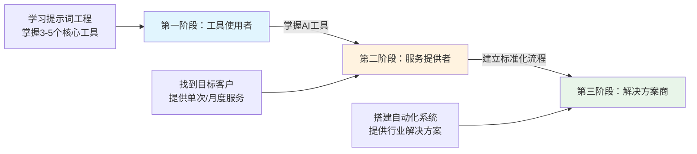
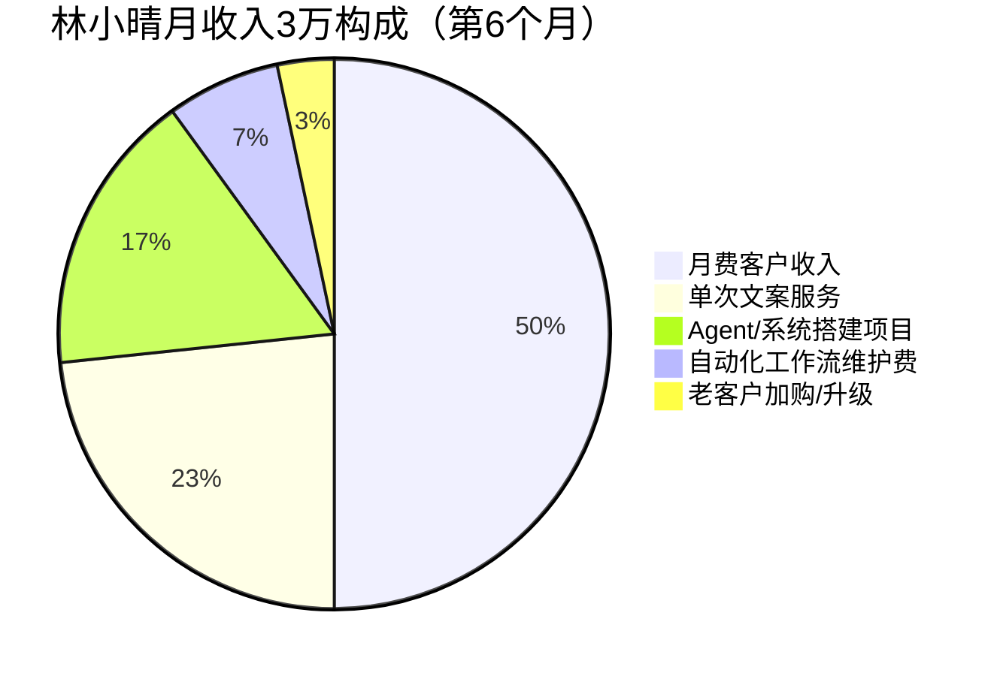
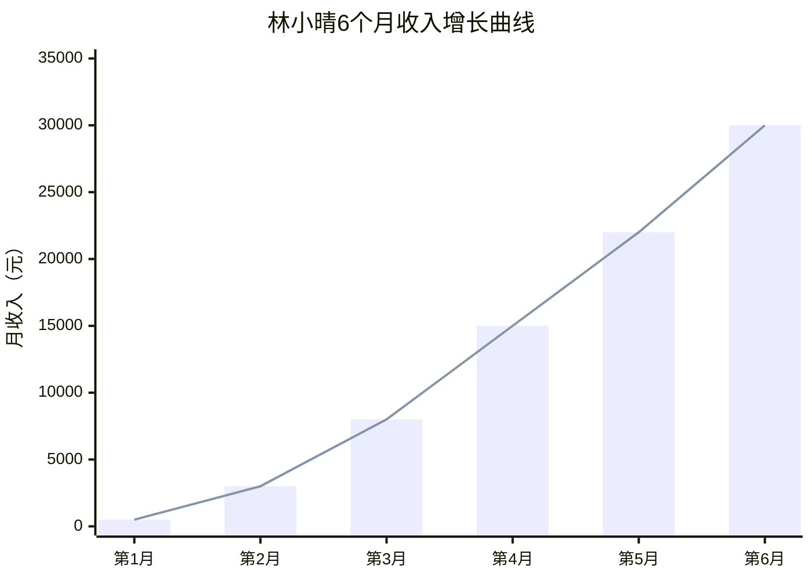
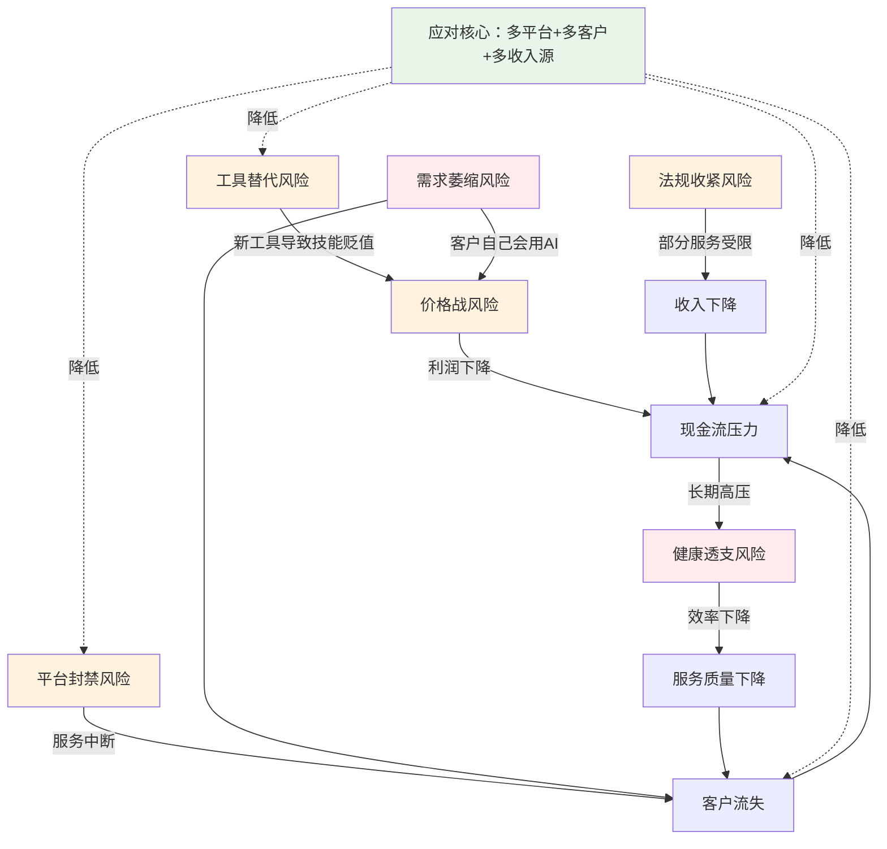

=== SECTION 1: 七、核心方法论 (replace lines 2282-2312) ===

### 七、核心方法论：AI副业的三阶段进化路径

林小晴的经历可以提炼出一条通用的AI副业进化路径：



| 阶段 | 核心能力 | 收入模式 | 月收入区间 | 时间投入 | 关键动作 |
|------|---------|---------|-----------|---------|---------|
| 工具使用者 | 提示词工程、工具操作 | 按单收费 | 3,000-8,000元 | 每天1-2小时 | 学工具、做免费案例、找第一批客户 |
| 服务提供者 | 行业理解、服务流程 | 月费+单次 | 8,000-30,000元 | 每天2-3小时 | 建SOP、提价、发展月费客户 |
| 解决方案商 | 系统思维、商业理解 | 项目费+月维护 | 30,000-100,000元 | 团队化运营 | 搭自动化系统/Agent、招人、建品牌 |

**每个阶段的进化信号**：

| 阶段 | 你应该进化到下一阶段的信号 |
|------|------------------------|
| 工具使用者 → 服务提供者 | 你开始接到重复类型的订单；客户主动找你而不是你找客户；你有了3个以上可展示的案例 |
| 服务提供者 → 解决方案商 | 你的月费客户超过5个；你发现自己在重复做类似的工作；客户开始问"能不能帮我搭个系统"或"能不能帮我做个AI客服"；Agent/工作流搭建需求开始出现 |

#### 各阶段详细转型策略

**阶段一 → 阶段二：从工具使用者到服务提供者（建议用时：4-8周）**

这个转型的核心是从"我学会了工具"到"我用工具帮别人解决问题"。

| 周次 | 关键动作 | 具体执行 | 预期产出 |
|------|---------|---------|---------|
| 第1-2周 | 锁定服务对象 | 在朋友圈/小红书/即刻发3-5条AI工具使用心得，观察哪些人来咨询；同时在行业社群里免费回答AI相关问题 | 收到5-10个咨询请求，识别出需求最集中的2-3个方向 |
| 第3-4周 | 打磨首个付费服务 | 选1个最集中的方向，把服务流程写成SOP文档（哪怕是3页Word）；给第1-2个客户半价做，交换真实反馈和案例授权 | 1-2个完整案例+客户证言 |
| 第5-6周 | 建立定价和展示体系 | 基于案例制作服务说明文档（含报价）；在社交媒体发案例复盘文章；设置固定的服务交付流程 | 有了可展示的服务手册和明码标价 |
| 第7-8周 | 实现稳定接单 | 开始主动在目标客户聚集的平台（行业社群、企业服务平台）展示案例；开始对重复性订单使用模板化交付 | 稳定接到每月3-5单，月收入突破5000元 |

**阶段二 → 阶段三：从服务提供者到解决方案商（建议用时：8-16周）**

这个转型的核心是从"我帮你做这件事"到"我帮你搭一个系统来做这件事"。

| 周次 | 关键动作 | 具体执行 | 预期产出 |
|------|---------|---------|---------|
| 第1-4周 | 学习系统搭建能力 | 选一个自动化/Agent平台（推荐n8n或Dify），跟着官方教程做完3个实战案例；把最常做的1个服务尝试用自动化复现 | 能独立搭建简单工作流 |
| 第5-8周 | 推出第一个系统型服务 | 找1个老客户免费/半价试用你的自动化方案，把"人工服务"升级为"系统服务"；同时开始整理可复用的模块 | 1个完整的自动化交付案例 |
| 第9-12周 | 标准化交付+提价 | 基于案例打磨交付流程，包含系统文档+运维手册+培训材料；将报价从"按小时"改为"项目费+月维护费" | 客单价提升3-5倍（从1000-2000元/单提升到5000-10000元/项目） |
| 第13-16周 | 扩展团队或合作者 | 当单量超过个人产能时，找1个兼职助手处理标准化工作（如数据标注、基础文案），自己专注客户沟通和系统架构 | 开始具备"团队交付"能力，月收入突破3万 |

#### 阶段卡壳诊断

如果你在某个阶段停留超过2个月没有进展，很可能是以下原因：

**卡在阶段一（工具使用者）的3个常见原因：**

| # | 症状 | 根因 | 解决方案 |
|---|------|------|---------|
| 1 | 学了很多工具但不知道卖给谁 | 没有从"能力端"出发而是从"需求端"出发 | 立刻停止学新工具。去3个目标行业社群潜伏一周，记录"谁在问什么问题"，从问题倒推服务 |
| 2 | 发了内容但没人咨询 | 内容太"教程化"而非"案例化" | 把"我教你用ChatGPT"改成"我用ChatGPT帮XX公司省了2万元"——用具体案例和数字说话 |
| 3 | 有咨询但成交率低 | 没有清晰的服务边界和报价体系 | 做一个3页的服务说明PDF：我能做什么（3-5项）+案例+报价+联系方式 |

**卡在阶段二（服务提供者）的3个常见原因：**

| # | 症状 | 根因 | 解决方案 |
|---|------|------|---------|
| 1 | 收入卡在8000-15000元上不去 | 还在用"按单收费"模式，收入=单价×数量，数量有天花板 | 推出月费套餐（如3000元/月包4次服务），把收入从"做一单赚一单"变成"每月自动续费" |
| 2 | 每单耗时太长，接不了更多单 | 没有建立SOP，每个订单都从零开始 | 把最近5个订单的工作流程写下来，找出重复环节并模板化，目标是把单均工时砍一半 |
| 3 | 客户质量差，总是砍价或不续约 | 在低价平台获客，吸引的都是价格敏感型客户 | 提价30-50%并主动在行业社群/LinkedIn做内容营销，吸引愿意为质量付费的客户 |

**卡在阶段三（解决方案商）的3个常见原因：**

| # | 症状 | 根因 | 解决方案 |
|---|------|------|---------|
| 1 | 想做系统但技术能力不够 | 一直在做"人工服务"没有升级技术栈 | 花2-4周集中学习一个低代码平台（n8n/Dify），从复刻自己最熟悉的服务流程开始 |
| 2 | 客户不愿意为"系统"付高价 | 没有让客户看到"系统"和"人工服务"的区别 | 做一个对比demo：同样一个任务，手动做要2小时vs系统做要2分钟。数字说服力最强 |
| 3 | 搭了系统但维护成本高 | 架构设计不合理，耦合度太高 | 每个系统拆成独立模块，每个模块有独立的测试和文档；出了问题只修一个模块而不是重建整个系统 |

#### 跳阶段风险警告

有些副业者急于求成想跳过某个阶段，以下是每种跳阶行为的具体后果：

| 跳阶行为 | 典型后果 | 恢复成本 |
|---------|---------|---------|
| 跳过阶段一直接卖服务 | 工具使用不熟练导致交付质量差，前3个客户全部差评，口碑很难修复 | 需要3-6个月用免费/低价案例重建口碑 |
| 跳过阶段二直接做解决方案商 | 缺乏客户服务经验，不懂真实需求，搭出来的系统"技术上能用但客户不用" | 需要回去补2-3个月的客户服务经验，浪费了搭建时间 |
| 三个阶段同时推进 | 精力分散，每个方向都浅尝辄止，3个月后仍然在原地 | 需要重新聚焦，选一个阶段All-in，至少浪费1-2个月 |

**核心原则**：每个阶段至少积累10个以上成功案例（免费的也算），再考虑进入下一个阶段。"案例数"是最诚实的阶段判断标准。

#### 各阶段进阶成功指标清单

**阶段一 → 阶段二的进阶清单（至少满足5/6项才建议进阶）：**

- [ ] 熟练使用3个以上AI工具（ChatGPT/Claude + Midjourney/DALL-E + 至少1个垂直工具）
- [ ] 有5个以上可展示的AI服务案例（含免费案例）
- [ ] 能在30分钟内用AI完成一个标准的文案/设计方案
- [ ] 建立了至少1个可复用的提示词模板库（20+模板）
- [ ] 有人主动找你咨询AI服务（不论是否成交）
- [ ] 能清晰地向非技术人员解释"AI能帮你做什么"

**阶段二 → 阶段三的进阶清单（至少满足5/6项才建议进阶）：**

- [ ] 月费客户超过5个
- [ ] 月收入稳定超过15000元且持续2个月以上
- [ ] 每个服务品类都有标准化SOP文档
- [ ] 单均交付时间比初期缩短50%以上
- [ ] 客户复购率超过50%
- [ ] 开始收到"能不能帮我搭个系统"类型的需求

=== SECTION 2: 八、成果数据 (replace lines 2313-2327) ===

### 八、成果数据

| 指标 | 起步时（第1月） | 第3个月 | 第6个月（成熟后） |
|------|---------------|--------|-----------------|
| 月收入 | 500元（第一单） | 8,000元 | 30,000元 |
| 客户数 | 1个 | 8个 | 17个 |
| 复购率 | 0% | 40% | 60%+ |
| 客单价 | 500元 | 1,200元 | 1,765元（加权） |
| 工具月成本 | 200元 | 500元 | 800元 |
| 净利润率 | 60% | 75% | 80%+ |
| 服务交付时间 | 8小时/单 | 4小时/单 | 2小时/单 |
| 客户满意度 | 未统计 | 4.2/5.0 | 4.7/5.0 |
| 提示词模板数 | 5个 | 25个 | 50+个 |
| 月费客户占比 | 0% | 30% | 50%+ |

#### 月度收入增长详细拆解

**第1个月：破冰期——从0到500元**

这是最难的一步。林小晴花了整整3周学习ChatGPT基础操作和提示词技巧，第4周才接到第一单——帮一个淘宝店主改5条产品描述，收费500元。这个月几乎没有"收入"可言，但获得了最宝贵的东西：**一个真实的付费案例**和"原来真的有人愿意为此付钱"的信心。

关键里程碑：完成第一单交付，获得客户好评截图。

**第2个月：验证期——从500元到3,000元**

靠着第一个案例的截图和朋友圈口碑，林小晴在第2个月接到了4单。客户来源：2单来自朋友圈推荐，1单来自小红书发帖，1单来自行业社群。这个月她开始意识到：**AI文案不是"替代人工"，而是"帮客户节省时间"**——卖的不是文字，是效率。

关键里程碑：建立了第一个提示词模板库（5个），单均耗时从8小时降到6小时。

**第3个月：起飞期——从3,000元到8,000元**

转折点出现在第3个月。一个做跨境电商的客户主动找到林小晴，提出"每月固定帮我做4次产品文案"的需求——这是她第一个月费客户（月费2000元）。从此收入结构从"全是单次"变成"月费+单次"的混合模式。加上新增了社媒文案、邮件营销文案两个品类，月收入突破8000元。

关键里程碑：首个月费客户签约；服务品类从1个扩展到3个；提示词模板库扩充到25个。

**第4个月：稳定期——从8,000元到15,000元**

林小晴开始系统性地提价。基于前3个月的案例积累，她把基础文案服务从500元/篇提到800元/篇，深度服务（含竞品分析+文案+社媒发布建议）定价1500元/套。同时月费客户从1个增加到3个。这个月她搭建了第一个自动化工作流（竞品监控+文案生成），效率提升显著——单均交付时间从6小时降到4小时。

关键里程碑：客单价突破1000元；月费客户3个；建立了服务SOP文档。

**第5个月：加速期——从15,000元到22,000元**

口碑效应开始显现。老客户转介绍成为最大的获客渠道（占新增客户的40%）。林小晴开始接到"能不能帮我做个AI客服"这类系统搭建需求，第一个Agent项目收费8000元。月费客户增加到5个，月费收入占总收入的35%。

关键里程碑：首个Agent/系统搭建项目完成；老客户转介绍占比超40%；提示词模板库达40+个。

**第6个月：成熟期——从22,000元到30,000元**

所有指标进入成熟区间。月费客户7个（占总客户数的41%），单次服务客户10个。加权客单价稳定在1765元。林小晴开始把重复性最高的服务用n8n自动化，单均交付时间压缩到2小时。净利润率突破80%——因为月收入增长的同时，工具成本仅从500元涨到800元（边际成本极低）。

关键里程碑：月收入首次突破3万；月费客户超过50%；建立了完整的客户管理和自动化体系。

#### 月度核心指标一览表

| 月份 | 月收入 | 环比增长 | 客户数 | 客单价 | 月费客户 | 月费收入占比 | 单均工时 | 获客主要渠道 |
|------|-------|---------|--------|--------|---------|------------|---------|------------|
| 第1月 | 500元 | — | 1 | 500元 | 0 | 0% | 8小时 | 主动推销 |
| 第2月 | 3,000元 | +500% | 4 | 750元 | 0 | 0% | 6小时 | 朋友圈+小红书 |
| 第3月 | 8,000元 | +167% | 8 | 1,000元 | 1 | 25% | 5小时 | 老客推荐+社群 |
| 第4月 | 15,000元 | +88% | 11 | 1,200元 | 3 | 40% | 4小时 | 老客推荐+内容营销 |
| 第5月 | 22,000元 | +47% | 14 | 1,500元 | 5 | 45% | 3小时 | 口碑转介绍+内容长尾 |
| 第6月 | 30,000元 | +36% | 17 | 1,765元 | 7 | 50% | 2小时 | 口碑转介绍+行业口碑 |

**数据解读**：
- **环比增长率递减但绝对值递增**：第2月增长500%（500→3000），第6月增长36%（22000→30000）。绝对增长额从2500元（第2月）增加到8000元（第6月）。这是典型的"指数增长初期"特征——百分比在降，但实际赚的钱在快速增加。
- **客户数增长平缓但质量飞跃**：6个月从1个客户到17个，看起来不快。但客单价从500元涨到1765元，涨了3.5倍。**客户的"质"比"量"重要得多**。
- **月费客户是稳定器**：从第3个月开始有月费客户后，即使某个月新客断档，基础收入也有保障。到第6个月，7个月费客户贡献15000元——仅此一项就超过了第4个月的总收入。

#### 数据趋势分析

**趋势一：客单价的"阶梯式"增长**

林小晴的客单价并非线性增长，而是呈现三次跳跃：

```
第1月：500元（纯文字改写，最低端服务）
    ↓ 跳跃1：增加服务品类+建立案例背书
第3月：1,200元（文案+策略建议，中端服务）
    ↓ 跳跃2：推出系统搭建服务+月费套餐
第6月：1,765元加权（含系统项目拉高均价）
```

**启示**：提价不是"慢慢涨"，而是通过**增加服务维度**（从纯执行到含策略、从单次到系统化）实现阶梯式跃迁。

**趋势二：客户获取成本持续下降**

| 月份 | 获客渠道 | 获客成本 | 获客效率 |
|------|---------|---------|---------|
| 第1月 | 主动推销+免费案例 | 高（时间成本约20小时/客户） | 低 |
| 第3月 | 内容营销+老客推荐 | 中（时间成本约8小时/客户） | 中 |
| 第6月 | 口碑转介绍+内容长尾 | 低（时间成本约2小时/客户） | 高 |

**启示**：前3个月是"投资期"——投入大量时间建立案例和口碑，从第4个月开始进入"收获期"——获客越来越容易、成本越来越低。

**趋势三：收入结构的"安全化"演变**

月费客户占比从0%增长到50%+，意味着收入的"可预测性"大幅提升。即使某个月没有新增客户，仅靠月费续约就能保证15000+元的基本收入。这是从"不稳定的副业收入"走向"类工资的稳定收入"的关键转变。

**趋势四：交付效率的指数级提升**

服务交付时间从8小时/单降到2小时/单，降了75%。这意味着同样投入2小时，从只能服务1个客户变成能服务4个客户——**收入天花板被抬高了4倍**。效率提升的三个来源：
1. 提示词模板复用（第2-3个月贡献最大）
2. SOP标准化流程（第3-4个月贡献最大）
3. 自动化工具替代人工（第5-6个月贡献最大）

#### 林小晴 vs 行业平均水平对比

| 指标 | 林小晴（第6个月） | AI副业者平均水平（同阶段） | 差距倍数 | 核心原因分析 |
|------|-----------------|------------------------|---------|------------|
| 月收入 | 30,000元 | 5,000-8,000元 | 3.7-6x | 林小晴较早建立了月费模式+系统化服务 |
| 客单价 | 1,765元 | 500-800元 | 2.2-3.5x | 价值定价法替代成本定价法 |
| 客户数 | 17个 | 10-15个 | 1.1-1.7x | 差距不大，说明核心差距不在"量"而在"质" |
| 复购率 | 60%+ | 20-30% | 2-3x | SOP标准化+月费模式+主动客户管理 |
| 净利润率 | 80%+ | 50-65% | 1.2-1.6x | 边际成本极低+工具成本控制 |
| 交付时间 | 2小时/单 | 4-6小时/单 | 2-3x | 模板化+SOP+自动化 |
| 月费占比 | 50%+ | 10-20% | 2.5-5x | 这是最大的结构性差距 |
| 技术栈深度 | Agent+自动化+RAG | 纯提示词工程 | 显著 | 系统化服务溢价高 |

**核心结论**：林小晴和行业平均水平的最大差距不是"客户数量"或"工具使用能力"，而是**收入结构**（月费占比）和**服务深度**（从工具使用到系统搭建）。这两项直接决定了收入的天花板和稳定性。

**为什么大多数AI副业者卡在5000-8000元？**

通过对比数据可以清晰看到瓶颈所在：

| 瓶颈阶段 | 月收入 | 卡住的人占比 | 核心卡点 | 突破方法 |
|---------|-------|------------|---------|---------|
| 0→3000元 | 0-3000元 | 40%的副业者 | 不敢定价/不知道卖给谁 | 做3个免费案例→获得信心和案例→开始收费 |
| 3000→8000元 | 3000-8000元 | 30%的副业者 | 纯靠单次服务，没有月费客户 | 推出月费套餐+增加服务品类 |
| 8000→15000元 | 8000-15000元 | 15%的副业者 | 交付效率低，接不了更多单 | 建SOP+模板化+初步自动化 |
| 15000→30000元 | 15000-30000元 | 10%的副业者 | 没有系统化服务（Agent/自动化） | 学习n8n/Dify，推出系统搭建服务 |
| 30000元+ | 30000元以上 | 5%的副业者 | 个人产能到顶，需要团队化 | 招兼职助手+建立品牌 |

**数据启示**：60%的AI副业者卡在8000元以下，核心原因不是能力不够，而是**收入结构不对**——还在"卖时间"而不是"卖价值+卖系统"。林小晴能突破3万的关键动作就是：第3个月开始建立月费模式，第5个月开始做系统搭建项目。这两个动作直接把她从"80%的人会卡住的瓶颈"推向了前5%。

#### 关键转折点与数据跃迁对照表

| 时间节点 | 触发动作 | 数据变化 | 跃迁幅度 |
|---------|---------|---------|---------|
| 第2个月末 | 建立提示词模板库（20+个） | 单均交付时间从8h降到5h | 效率提升37% |
| 第3个月初 | 签下首个月费客户（2000元/月） | 月收入从3000元跳到8000元 | 收入增长167% |
| 第4个月初 | 全面提价30%+推出深度服务包 | 客单价从800元跳到1200元 | 客单价增长50% |
| 第4个月末 | 搭建第一个n8n自动化工作流 | 交付时间从4h降到3h | 效率提升25% |
| 第5个月中 | 完成首个Agent系统搭建项目（8000元） | 月收入从15000元跳到22000元 | 收入增长47% |
| 第6个月初 | 月费客户突破5个+推出维护套餐 | 月费收入占总收入50%+ | 收入稳定性质变 |
| 第6个月中 | 服务流程全面自动化 | 交付时间从3h降到2h | 效率提升33%，产能翻倍 |

**规律总结**：每一次收入跃迁都不是"慢慢涨上去的"，而是由一个具体的动作（签月费客户、提价、接系统项目）触发的阶梯式跳跃。副业增长的本质不是"每天多赚一点"，而是"找到下一个能触发跃迁的动作"。

#### 收入构成分析（月入3万时）



各收入来源详解：

| 收入类型 | 月收入 | 占比 | 客户数 | 平均单价 | 特点 |
|---------|-------|------|--------|---------|------|
| 月费客户收入 | 15,000元 | 50% | 7个 | 2,143元/月 | 最稳定，每月自动续费，无需重新获客 |
| 单次文案服务 | 7,000元 | 23% | 5-8单 | 875-1,400元/单 | 弹性收入，淡旺季有波动 |
| Agent/系统搭建 | 5,000元 | 17% | 0.5-1个/月 | 5,000-10,000元/项目 | 高客单价但不连续，平均每月1个 |
| 自动化维护费 | 2,000元 | 7% | 4个 | 500元/月 | 纯被动收入，维护时间<30分钟/月 |
| 老客户加购 | 1,000元 | 3% | 2-3个 | 333-500元/次 | 零获客成本，靠服务质量自然产生 |

**结构性优势**：月费+维护费（稳定收入）占比57%，即使某个月完全不接新单，也能保证17000元以上的收入。这就是"系统化"和"卖时间"的本质区别。

#### 投入产出比（ROI）时间线

| 月份 | 总投入（时间+金钱） | 总产出（收入） | 累计ROI | 当月ROI | 状态 |
|------|-------------------|--------------|---------|---------|------|
| 第1月 | 时间：80小时 + 金钱：200元 | 500元 | -38% | -38% | 亏损期（时间投入远超回报） |
| 第2月 | 时间：60小时 + 金钱：300元 | 3,000元 | +15% | +93% | 回本期（开始正向回报） |
| 第3月 | 时间：50小时 + 金钱：400元 | 8,000元 | +88% | +213% | 起飞期（ROI快速上升） |
| 第4月 | 时间：45小时 + 金钱：500元 | 15,000元 | +180% | +357% | 加速期 |
| 第5月 | 时间：40小时 + 金钱：600元 | 22,000元 | +285% | +493% | 高回报期 |
| 第6月 | 时间：35小时 + 金钱：800元 | 30,000元 | +400% | +620% | 成熟期（每投入1元回报6元以上） |

> 注：时间按50元/小时折算为机会成本。第1月亏损是正常的——学习期的投入会在后续月份产生复利回报。

**ROI分析的关键发现**：

1. **前2个月是"投资期"**：几乎所有成功的AI副业者都在前2个月处于"亏损"或"微利"状态。这是正常的——你的投入（学工具、做免费案例、找客户）会在第3个月开始产生复利回报。

2. **第3个月是"盈亏平衡点"**：累计投入在第3个月被累计收入超过。如果你到第3个月还没有达到月入5000+元，需要重新审视定位和获客策略。

3. **第5-6个月进入"复利区"**：投入的时间在减少（因为有了模板和自动化），但收入在增加。这是AI副业最吸引人的特征——**边际投入递减，边际收入递增**。

#### 收入增长趋势图



**曲线特征**：典型的J型曲线——前3个月缓慢爬升（学习+验证期），第3-5个月快速上升（模式跑通后的规模化期），第5-6个月趋于平缓（个人产能接近上限，需要新策略如团队化才能继续增长）。

**数据的局限性说明**：以上数据基于林小晴个人的实际情况，她有两个有利条件——文案策划的行业背景（有现成的客户基础和行业理解力）、所在城市消费水平较高（客单价相对容易做高）。如果你的行业背景和所在环境不同，绝对数字会有差异，但**增长曲线的形状和关键转折点的逻辑是可复制的**——先建立案例，再建月费模式，再做系统化服务，这三步的顺序和节奏是通用的。

=== SECTION 3: 5.8 低代码自动化 (replace lines 1996-2035) ===

#### 5.8 低代码自动化工具——用n8n/Make搭建AI工作流

除了Agent搭建，另一个高利润服务品类是**AI工作流自动化**——帮企业把重复性的业务流程用AI+自动化工具串联起来，实现无人值守运行。

**常用的自动化工具**：

| 工具 | 类型 | 核心能力 | 适合场景 | 学习成本 |
|------|------|---------|---------|---------|
| n8n | 开源自部署 | 1000+集成节点、可视化工作流、支持自定义代码 | 需要数据隐私、复杂流程、大量集成 | 3-5天 |
| Make（原Integromat） | 云端SaaS | 可视化、丰富的模板、免运维 | 中小企业、简单流程、快速上线 | 1-2天 |
| Dify工作流 | 开源/云端 | 与AI模型深度集成、可视化 | AI为核心的工作流 | 2-3天 |
| Coze插件/工作流 | 云端 | 字节生态集成、免费 | 内容生成、简单自动化 | 1-2天 |

**实战案例一：为某电商公司搭建"AI选品监控+自动生成上架文案"工作流**

**需求**：某电商公司需要每天监控竞品上新，自动生成产品文案并推送到运营团队审核。

**n8n工作流架构**：

```
定时触发（每天9:00）
    ↓
爬取竞品新品列表（HTTP请求）
    ↓
数据清洗和格式化（代码节点）
    ↓
调用DeepSeek API生成文案（AI节点）
    ↓
质量检查（代码节点：字数/敏感词/格式）
    ↓
通过 → 推送到飞书群（飞书节点）
未通过 → 推送到人工审核队列
    ↓
记录到数据库（Supabase节点）
```

**搭建耗时**：2天（含需求沟通和测试）
**收费**：6000元搭建 + 500元/月维护
**效果**：原来运营人员每天花2小时监控竞品+写文案，现在全部自动化，每天只需15分钟审核AI输出

**实战案例二：为教育培训机构搭建AI招生全流程自动化**

**需求**：一家少儿编程培训机构，每月在抖音、小红书投放广告获取线索，但人工跟进效率低——从线索录入到首次联系平均要4小时，很多家长等不及就流失了。需要一套自动化系统：线索进来后自动分类、自动发送个性化首条消息、自动提醒销售跟进、自动统计转化数据。

**n8n工作流架构**：

```
阶段1：线索自动采集与分类
├── 抖音表单提交 → webhook接收
├── 小红书私信 → 定时爬取（每30分钟）
├── 官网表单 → webhook接收
    ↓
去重+数据清洗（代码节点）
    ↓
AI分类（调用GPT-4o-mini）：
├── 意向等级：A（强意向）/ B（有兴趣）/ C（随便看看）
├── 需求标签：编程入门/竞赛辅导/升学加分/兴趣培养
├── 孩子年龄：3-6岁/7-12岁/13-16岁
    ↓
阶段2：自动触达
├── A类线索 → 立即推送企业微信给销售主管（飞书通知）
│            → 同时自动发送个性化欢迎语（企业微信API）
│            → 5分钟内无响应 → 升级通知校长
├── B类线索 → 自动发送课程介绍+试听邀请（模板消息）
│            → 24小时后自动发送案例视频
│            → 48小时后自动发送限时优惠
├── C类线索 → 加入社群+发送入门资料包
│            → 每周自动推送1条干货内容（持续培育）
    ↓
阶段3：数据汇总
├── 每日18:00自动生成当日线索报表
├── 推送到管理层飞书群
├── 每周一自动生成周度转化漏斗分析
```

**搭建耗时**：5天（需求调研1天+搭建2天+测试调试1天+培训1天）
**收费**：15,000元搭建 + 1,200元/月维护
**效果**：
- 首次联系响应时间：从平均4小时缩短到**8分钟**（A类线索）
- 线索转化率：从12%提升到**23%**（因为及时跟进+个性化触达）
- 销售人均管理线索数：从30个/月提升到80个/月
- 机构月招生人数：从15人增加到28人，**月增收约6.5万元**

**实战案例三：为自媒体团队搭建内容批量生产流水线**

**需求**：一个3人自媒体运营团队，管理8个账号（小红书+抖音+公众号），每天需要产出15-20条内容。人工写作产能严重不足，需要AI辅助的批量内容生产系统。

**工作流方案（Make + Dify组合）**：

```
每周一：选题批量生成
├── 输入：行业关键词+热点话题库
├── Dify工作流：AI生成50个选题候选
├── 人工筛选：运营团队选出15-20个选题
    ↓
每日：内容批量生产
├── Make触发：定时读取当日选题
├── 调用Dify API：按平台格式生成初稿
│   ├── 小红书版：500字+emoji+标签
│   ├── 抖音脚本版：口播文案+分镜提示
│   └── 公众号版：2000字深度文
├── 质量检查：AI自检（敏感词/事实核查/原创度）
├── 推送到飞书多维表格：待人工审核
    ↓
人工审核+微调 → 定时发布
```

**搭建耗时**：1.5天
**收费**：4,000元搭建 + 300元/月维护
**效果**：团队日产出从8条提升到20条，每条内容的人工耗时从40分钟降到15分钟

#### 工具选择决策指南：n8n vs Make vs Dify工作流 vs Coze

| 决策维度 | 选n8n | 选Make | 选Dify工作流 | 选Coze |
|---------|-------|--------|------------|--------|
| 数据隐私要求 | ✅ 可私有部署，数据不出境 | ❌ 数据在海外服务器 | ✅ 可私有部署 | ❌ 字节服务器 |
| 流程复杂度 | ✅ 复杂多分支、自定义代码 | ⚠️ 中等复杂度 | ⚠️ 主要围绕AI调用 | ⚠️ 简单流程 |
| 集成第三方数量 | ✅ 1000+节点，覆盖面最广 | ✅ 1000+模板，上手快 | ⚠️ 集成较少，需要API对接 | ⚠️ 主要字节生态 |
| AI能力深度 | ⚠️ 需自己调API | ⚠️ 需自己调API | ✅ 原生AI能力最强 | ✅ AI能力不错且免费 |
| 运维成本 | ❌ 需要自建服务器（月成本50-200元） | ✅ 免运维 | ⚠️ 自部署需运维 | ✅ 免运维 |
| 适合的客户类型 | 中大型企业、对数据安全有要求的客户 | 中小企业、快速上线需求 | AI深度应用场景 | 个人/小团队、预算有限 |
| 林小晴推荐度 | ⭐⭐⭐⭐⭐ | ⭐⭐⭐⭐ | ⭐⭐⭐⭐ | ⭐⭐⭐ |

**林小晴的经验**：她80%的自动化项目用n8n，因为客户大多是中小企业但对数据安全有一定要求；10%用Make（简单流程+快速上线场景）；10%用Dify（纯AI处理流程如文档问答、内容审核）。Coze主要用于免费给客户做demo演示——"先用Coze搭个简单版本让客户看到效果，签约后再用n8n搭正式版"。

#### 常见自动化项目陷阱

**陷阱一：过度自动化——"能自动化的都自动化"**

有些副业者拿到需求后，恨不得把客户的每个动作都自动化。但现实是：很多流程中的"人工判断"环节是不可省略的，强行自动化反而增加出错率。

**真实案例**：林小晴曾给一个客户搭建自动化报价系统——根据客户输入的需求自动生成报价单。结果AI对复杂需求的理解经常出错（比如把"5个页面的网站"理解为"5个功能模块"），报出的价格偏差高达50%。最后改成"AI初估+人工审核确认"的半自动模式，反而效果最好。

**避坑方法**：每个自动化节点问自己"这个环节出错了后果严重吗？"如果是（如报价、合同、付款），保留人工审核环节。

**陷阱二：忽视异常处理——"正常流程跑得飞起，一出错就全线崩溃"**

自动化工作流最怕的不是正常流程，而是异常情况：API超时、数据格式异常、第三方服务宕机。很多副业者只测了"happy path"就交付，上线后一旦遇到异常就整个流程卡死。

**避坑方法**：每个外部调用节点都加"错误处理"分支——超时了怎么办？返回错误了怎么办？数据为空怎么办？至少准备3种异常处理方案：重试、告警、人工接管。

**陷阱三：维护成本被低估——"搭完就走"心态**

很多副业者把自动化项目当成一次性交付，收了搭建费就不管了。但自动化工作流依赖第三方API和服务，任何一个节点的API变更都会导致流程中断。林小晴的数据显示：平均每个自动化工作流每月需要0.5-1小时的维护工作（API更新、参数调整、偶尔的bug修复）。

**避坑方法**：报价时必须包含"维护费"选项（建议搭建费的10-15%/月）；交付时给客户一份"常见故障排查手册"；设置自动化监控（工作流失败时自动通知你）。

**陷阱四：把简单问题复杂化——"为了自动化而自动化"**

有些流程用人工做只需要5分钟，搭自动化反而要花2天搭建+持续维护。这种情况下自动化是不划算的。

**避坑方法**：用一个简单公式判断——**自动化价值 = （人工耗时 × 月执行次数 × 时薪） - （搭建成本 + 月维护成本 × 12）**。如果自动化价值<5000元/年，建议客户继续手动做。

#### 自动化项目报价指南

| 复杂度等级 | 典型场景 | 搭建工时 | 建议报价（搭建费） | 月维护费 | 案例 |
|-----------|---------|---------|-----------------|---------|------|
| L1 简单 | 单一流程、2-3个节点、1个AI调用 | 0.5-1天 | 2,000-4,000元 | 200-300元/月 | 自动将表单数据生成周报 |
| L2 中等 | 多分支流程、5-10个节点、含条件判断 | 1-3天 | 4,000-8,000元 | 300-500元/月 | 电商选品监控+文案生成（案例一） |
| L3 复杂 | 多阶段流程、10-20个节点、多系统集成 | 3-7天 | 8,000-20,000元 | 500-1,200元/月 | 教育机构招生全流程自动化（案例二） |
| L4 企业级 | 跨部门流程、20+节点、含数据看板+告警 | 7-15天 | 20,000-50,000元 | 1,200-3,000元/月 | 多渠道客户管理+自动营销+BI报表 |

**定价注意事项**：
1. 以上报价不含服务器成本（如果用n8n自部署，需额外报价50-200元/月云服务器费用）
2. 超过3次需求变更（超出原始需求范围），按500-800元/次收取变更费
3. 交付标准包含：工作流文件+配置文档+运维手册+1小时培训
4. 建议签12个月维护合同，可给搭建费打9折——锁定长期收入

=== SECTION 4: 14.6 风险评估矩阵 (replace lines 3376-3394) ===

#### 14.6 AI工具副业的风险评估矩阵

任何副业都有风险，AI工具副业尤其需要关注技术变革带来的不确定性：

| 风险类型 | 具体场景 | 发生概率 | 影响程度 | 风险等级 | 应对策略 |
|---------|---------|---------|---------|---------|---------|
| 工具替代风险 | 新的AI工具/模型完全取代你熟悉的工具 | 高 | 中 | 🟡 黄 | 每月投入2小时学习新工具，保持工具矩阵的更新 |
| 价格战风险 | 大量新人涌入导致基础AI服务价格暴跌 | 高 | 中 | 🟡 黄 | 向上走：从"卖工具使用"升级为"卖行业解决方案" |
| 平台封禁风险 | AI平台封号、API限速、政策变更 | 中 | 高 | 🟡 黄 | 多平台备份，核心资产（模板、客户数据）本地化 |
| 需求萎缩风险 | 客户自己学会了AI，不再需要外部服务 | 中（短期）/ 高（长期） | 高 | 🔴 红 | 转型方向：从"帮客户用AI"到"帮客户搭AI系统"——系统的维护和升级是长期需求 |
| 法规收紧风险 | AI生成内容的监管趋严，部分服务受限 | 中 | 中 | 🟡 黄 | 提前合规化：注册个体户、签正规合同、做好数据安全 |
| 技术栈过时风险 | 现有的自动化方案被更先进的产品替代 | 中 | 低 | 🟢 绿 | 保持技术敏感度，核心资产是"理解业务"而非"会用某个工具" |
| 健康透支风险 | 长期高强度副业导致身心问题 | 中 | 高 | 🔴 红 | 严格执行时间边界，建立"强制休息日"制度 |
| 现金流断裂风险 | 大客户流失+新客户断档同时发生 | 低 | 极高 | 🟡 黄 | 保持3个月生活费的现金储备，收入来源多元化 |

#### 风险预警信号

**工具替代风险的预警信号：**
- 你常用的AI工具连续2个月没有更新或发布新功能
- 同类竞品工具开始免费提供你付费工具的核心功能
- 客户开始问"XX工具也能做，为什么我要找你？"

**价格战风险的预警信号：**
- 同类服务的市场价格在3个月内下降超过30%
- 新入行的竞争者报价低于你的成本价
- 客户开始频繁拿着别人更低的报价来砍价
- 在闲鱼/淘宝上出现了大量低于100元的同类服务

**需求萎缩风险的预警信号：**
- 老客户的续约率连续2个月下降
- 客户开始自己使用AI工具完成以前找你做的任务
- 你的服务中"帮客户做"占比超过80%，没有"帮客户搭系统"
- 咨询转化率下降（客户问得更多、对比更多、决策更慢）

**平台封禁风险的预警信号：**
- 你依赖的单一平台开始收紧API调用限制
- 平台发布新的服务条款，增加了对自动化/批量调用的限制
- 同行群里频繁出现"被封号""API降速"的吐槽

**健康透支风险的预警信号：**
- 连续2周每天副业时间超过3小时
- 开始对客户消息产生"看到就烦"的情绪反应
- 周末也在处理工作且无法放松
- 睡眠质量明显下降（失眠/早醒）

#### 风险应急预案

**应急预案一：核心AI平台突然不可用（影响：极高，概率：中）**

```
触发条件：主力AI平台（如ChatGPT/Claude）连续24小时不可用，或API被永久限速

第1步（0-2小时）：切换备用平台
├── 已储备的备用平台立即上线（Claude↔GPT↔DeepSeek三选二切换）
├── 通知正在交付中的客户："技术升级中，交付延迟X小时"
└── 用缓存的提示词模板在备用平台快速测试效果

第2步（2-24小时）：评估影响范围
├── 盘点所有依赖该平台的在执行项目（几个客户？金额多少？）
├── 按优先级排序：先处理即将到期的交付
└── 评估备用平台的效果差异，必要时调整提示词

第3步（1-7天）：长期应对
├── 如果是短期不可用：等恢复后回归主力平台
├── 如果是永久性变更：花3天时间在新平台上重建核心工作流
├── 主动联系所有受影响客户说明情况和解决方案
└── 更新自己的"多平台备份策略"文档

关键原则：任何时候都不能只有1个AI平台的依赖——至少同时掌握2个主力平台
```

**应急预案二：大客户突然流失（影响：极高，概率：低）**

```
触发条件：贡献收入>20%的大客户通知终止合作

第1步（当天）：止损与诊断
├── 礼貌沟通了解终止原因（是预算问题？质量问题？还是自己学会了？）
├── 尝试挽留：提供1个月的优惠续费方案（打8折或增加服务内容）
├── 如果挽留失败：请求推荐其他潜在客户+好评/证言
└── 记录流失原因，更新自己的"客户流失分析表"

第2步（1周内）：填补收入缺口
├── 立即盘点手头所有潜在客户和跟进中的线索
├── 联系3-5个之前咨询过但未成交的客户，提供限时优惠
├── 在社交媒体发1-2条服务案例复盘内容，激活潜在需求
└── 联系同行看看有没有溢出的单子可以分包

第3步（1个月内）：结构性预防
├── 将流失客户的收入占比警戒线从20%收紧到15%
├── 加速开发新客户，填补收入缺口
├── 开始推行"最低3个月起签"的月费合同，避免突然流失
└── 每月主动做1次客户满意度调研，提前发现问题

关键原则：单个客户收入占比永远不超过25%——这是硬性红线
```

**应急预案三：法规收紧导致部分服务无法继续（影响：高，概率：中）**

```
触发条件：监管部门发布新规，明确限制AI生成内容的某些应用场景

第1步（1-3天）：影响评估
├── 逐条阅读法规原文，不要只看自媒体解读
├── 对照自己的服务清单，标注哪些服务受影响
├── 咨询律师（花500-1000元做一次法律咨询是值得的）
└── 区分"完全禁止"和"需要合规调整"两种情况

第2步（1-2周）：服务调整
├── 完全禁止的服务：立即停止，通知客户并协商退款/转服务
├── 需要合规调整的服务：
│   ├── 增加人工审核环节（确保AI内容经人工确认后才交付）
│   ├── 在服务协议中增加AI使用声明
│   ├── 做好数据安全和隐私保护
│   └── 按新要求调整交付流程
└── 开发不受影响的新服务品类作为替代

第3步（1个月内）：长期合规化
├── 注册个体户或公司（有正规资质更容易合规经营）
├── 更新服务协议，增加AI相关条款
├── 建立内容审核SOP（特别是涉及医疗、金融、教育等敏感领域）
└── 关注行业协会动态，提前预判政策走向

关键原则：合规化不是成本，是竞争壁垒——当不合规的竞争者被清退时，合规者反而获得更多市场空间
```

#### 风险关联图



上图揭示了一个关键洞察：**风险不是孤立的，而是互相传导的**。工具替代→价格战→利润下降→现金流压力→健康透支→服务质量下降→客户流失，这是一条完整的风险传导链。打破这条链的关键节点是"多平台+多客户+多收入源"的多元化策略——它同时降低了多个上游风险的发生概率。

#### 季度风险审查清单

每季度花1-2小时做一次完整的风险审查，按以下清单逐项检查：

**一、收入健康度（5项）**
- [ ] 单一客户收入占比是否超过25%？（超过则启动新客户开发）
- [ ] 月费客户续约率是否低于80%？（低于则做客户满意度调研）
- [ ] 最近3个月是否有新增客户来源？（没有则开拓新获客渠道）
- [ ] 收入结构中稳定收入（月费+维护费）是否低于40%？（低于则推进月费模式）
- [ ] 客单价是否在下降？（下降则检查是否陷入价格战）

**二、技术与工具（5项）**
- [ ] 主力AI工具是否有更新/替代品出现？（有则花2小时评估）
- [ ] 最近1个月是否学了新工具或新技能？（没有则安排学习计划）
- [ ] 核心工作流是否有备份方案？（没有则建立备用流程）
- [ ] 自动化系统的API是否有变更？（有则更新节点配置）
- [ ] 提示词模板库是否在持续扩充？（停滞则主动积累新模板）

**三、客户与服务（4项）**
- [ ] 最近3个月的客户满意度评分趋势？（下降则排查原因）
- [ ] 是否有客户开始自己学AI做你的工作？（有则升级服务深度）
- [ ] 服务品类是否需要扩展或淘汰？（低需求品类考虑淘汰）
- [ ] 交付效率是否还有优化空间？（检查是否有新的自动化机会）

**四、合规与风险（4项）**
- [ ] 是否有新的AI相关法规出台？（有则评估影响）
- [ ] 服务协议是否需要更新？（至少每年更新一次）
- [ ] 客户数据安全措施是否到位？（检查数据存储和传输方式）
- [ ] 税务申报是否按时完成？（个体户按季度/年度申报）

**五、个人状态（3项）**
- [ ] 每周副业时间是否超过15小时？（超过则评估是否需要减负或招人）
- [ ] 最近1个月是否有完整的休息日？（没有则强制安排）
- [ ] 对副业工作的情绪状态如何？（持续负面情绪则考虑调整节奏或方向）

**审查结果处理**：
- 🟢 全部通过：继续保持，下季度再查
- 🟡 1-3项未通过：制定30天改进计划，优先处理最高风险项
- 🔴 4项以上未通过：立即暂停扩展，集中精力解决已识别的风险
